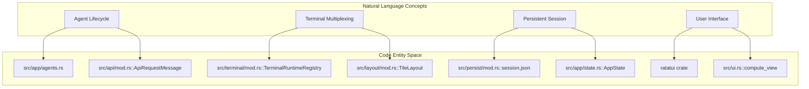
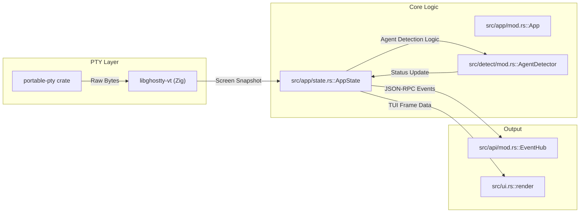

# Overview

Relevant source files

The following files were used as context for generating this wiki page:

- [CHANGELOG.md](https://github.com/herdrdev/herdr/blob/HEAD/CHANGELOG.md)
- [Cargo.lock](https://github.com/herdrdev/herdr/blob/HEAD/Cargo.lock)
- [Cargo.toml](https://github.com/herdrdev/herdr/blob/HEAD/Cargo.toml)
- [README.md](https://github.com/herdrdev/herdr/blob/HEAD/README.md)
- [docs/next/CHANGELOG.md](https://github.com/herdrdev/herdr/blob/HEAD/docs/next/CHANGELOG.md)
- [docs/next/README.md](https://github.com/herdrdev/herdr/blob/HEAD/docs/next/README.md)
- [docs/next/website/src/content/docs/agents.mdx](https://github.com/herdrdev/herdr/blob/HEAD/docs/next/website/src/content/docs/agents.mdx)
- [docs/next/website/src/content/docs/cli-reference.mdx](https://github.com/herdrdev/herdr/blob/HEAD/docs/next/website/src/content/docs/cli-reference.mdx)
- [src/app/mod.rs](https://github.com/herdrdev/herdr/blob/HEAD/src/app/mod.rs)
- [src/app/state.rs](https://github.com/herdrdev/herdr/blob/HEAD/src/app/state.rs)
- [src/cli/integration.rs](https://github.com/herdrdev/herdr/blob/HEAD/src/cli/integration.rs)
- [src/config.rs](https://github.com/herdrdev/herdr/blob/HEAD/src/config.rs)
- [src/config/model.rs](https://github.com/herdrdev/herdr/blob/HEAD/src/config/model.rs)
- [src/main.rs](https://github.com/herdrdev/herdr/blob/HEAD/src/main.rs)
- [src/ui.rs](https://github.com/herdrdev/herdr/blob/HEAD/src/ui.rs)

`herdr` is a terminal-based agent multiplexer and runtime designed specifically for AI coding agents. It provides a persistent environment where multiple agents can operate in parallel, allowing users to monitor their status at a glance and interact with them using both keyboard and mouse-driven interfaces.

Unlike traditional terminal multiplexers, `herdr` is built with a first-class awareness of agent lifecycles, offering a dedicated socket API that allows agents to spawn panes, read output, and coordinate with other agents.

## Key Features

*   **Agent Observability**: Real-time status indicators (blocked, working, done) for agents running in terminal panes [README.md:31-31](https://github.com/herdrdev/herdr/blob/HEAD/README.md#L31).
*   **Persistent Sessions**: Agents continue running after the client detaches. Sessions survive server restarts and can be accessed over SSH [README.md:32-32](https://github.com/herdrdev/herdr/blob/HEAD/README.md#L32).
*   **Agent-Aware API**: A JSON-RPC socket API that enables agents to programmatically control the workspace [README.md:33-33](https://github.com/herdrdev/herdr/blob/HEAD/README.md#L33).
*   **Hybrid Interaction**: Combines `tmux`-style prefix keybindings with modern mouse support (drag, split, click) [README.md:34-34](https://github.com/herdrdev/herdr/blob/HEAD/README.md#L34).
*   **Extensibility**: A plugin system to extend pane behavior and automate workflows [README.md:35-35](https://github.com/herdrdev/herdr/blob/HEAD/README.md#L35).
*   **Native Performance**: Written in Rust, compiled to a single binary without Electron or heavy dependencies [README.md:36-36](https://github.com/herdrdev/herdr/blob/HEAD/README.md#L36).

## System Architecture

`herdr` operates on a client/server model. The server manages the PTY (Pseudo-Terminal) lifecycles, agent detection, and session state, while the TUI (Terminal User Interface) acts as a specialized client.

### Natural Language to Code Entity Mapping

The following diagram illustrates how high-level system components map to specific modules and structs within the Rust codebase.

**Component Mapping Diagram**

Sources: [src/app/mod.rs:97-156](https://github.com/herdrdev/herdr/blob/HEAD/src/app/mod.rs#L97-L156), [src/app/state.rs:1-104](https://github.com/herdrdev/herdr/blob/HEAD/src/app/state.rs#L1-L104), [src/ui.rs:111-114](https://github.com/herdrdev/herdr/blob/HEAD/src/ui.rs#L111-L114), [src/terminal/mod.rs](https://github.com/herdrdev/herdr/blob/HEAD/src/terminal/mod.rs), [src/layout/mod.rs](https://github.com/herdrdev/herdr/blob/HEAD/src/layout/mod.rs), [src/persist/mod.rs](https://github.com/herdrdev/herdr/blob/HEAD/src/persist/mod.rs), [src/api/mod.rs](https://github.com/herdrdev/herdr/blob/HEAD/src/api/mod.rs)

### Major Subsystems Interaction

This diagram shows how data flows from the PTY through the detection engine to the final UI render.

**Subsystem Data Flow**

Sources: [Cargo.toml:32-34](https://github.com/herdrdev/herdr/blob/HEAD/Cargo.toml#L32-L34), [src/app/mod.rs:97-156](https://github.com/herdrdev/herdr/blob/HEAD/src/app/mod.rs#L97-L156), [src/app/state.rs:1-104](https://github.com/herdrdev/herdr/blob/HEAD/src/app/state.rs#L1-L104), [src/ui.rs:111-114](https://github.com/herdrdev/herdr/blob/HEAD/src/ui.rs#L111-L114), [src/detect/mod.rs](https://github.com/herdrdev/herdr/blob/HEAD/src/detect/mod.rs), [src/api/mod.rs](https://github.com/herdrdev/herdr/blob/HEAD/src/api/mod.rs)

## Detailed Guides

For deeper technical information, refer to the following child pages:

### [Getting Started](02_1.1-getting-started.md)
Covers installation via `curl`, Homebrew, `mise`, or Nix, and the initial workflow for starting the server and attaching to sessions.
For details, see [Getting Started](02_1.1-getting-started.md).

### [Core Concepts](03_1.2-core-concepts.md)
Defines the primary abstractions used in the codebase, including **Workspaces**, **Tabs**, **Panes**, and **Sessions**. It explains the lifecycle of a persistent session and how the client/server protocol maintains state.
For details, see [Core Concepts](03_1.2-core-concepts.md).

### [Contributing and Development Workflow](04_1.3-contributing-and-development-workflow.md)
Outlines the requirements for contributors, including the use of the `just` task runner, mandatory PR gate checks, and the Apache-2.0 licensing rules.
For details, see [Contributing and Development Workflow](04_1.3-contributing-and-development-workflow.md).

---
Sources: [README.md:1-58](https://github.com/herdrdev/herdr/blob/HEAD/README.md#L1-L58), [Cargo.toml:1-45](https://github.com/herdrdev/herdr/blob/HEAD/Cargo.toml#L1-L45), [docs/next/README.md:1-58](https://github.com/herdrdev/herdr/blob/HEAD/docs/next/README.md#L1-L58)