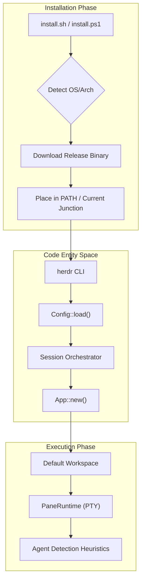
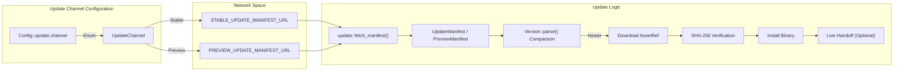

# Getting Started

<details>
<summary>Relevant source files</summary>

The following files were used as context for generating this wiki page:

- [docs/next/product-announcement.json](https://github.com/herdrdev/herdr/blob/HEAD/docs/next/product-announcement.json)
- [docs/next/website/src/content/docs/index.mdx](https://github.com/herdrdev/herdr/blob/HEAD/docs/next/website/src/content/docs/index.mdx)
- [docs/next/website/src/content/docs/install.mdx](https://github.com/herdrdev/herdr/blob/HEAD/docs/next/website/src/content/docs/install.mdx)
- [docs/next/website/src/content/docs/ja/windows-beta.mdx](https://github.com/herdrdev/herdr/blob/HEAD/docs/next/website/src/content/docs/ja/windows-beta.mdx)
- [docs/next/website/src/content/docs/quick-start.mdx](https://github.com/herdrdev/herdr/blob/HEAD/docs/next/website/src/content/docs/quick-start.mdx)
- [docs/next/website/src/content/docs/windows-beta.mdx](https://github.com/herdrdev/herdr/blob/HEAD/docs/next/website/src/content/docs/windows-beta.mdx)
- [docs/next/website/src/content/docs/zh-cn/windows-beta.mdx](https://github.com/herdrdev/herdr/blob/HEAD/docs/next/website/src/content/docs/zh-cn/windows-beta.mdx)
- [scripts/changelog.py](https://github.com/herdrdev/herdr/blob/HEAD/scripts/changelog.py)
- [scripts/test_changelog.py](https://github.com/herdrdev/herdr/blob/HEAD/scripts/test_changelog.py)
- [scripts/test_unix_installer.py](https://github.com/herdrdev/herdr/blob/HEAD/scripts/test_unix_installer.py)
- [scripts/windows_install_conpty_package_test.ps1](https://github.com/herdrdev/herdr/blob/HEAD/scripts/windows_install_conpty_package_test.ps1)
- [src/remote/attach.rs](https://github.com/herdrdev/herdr/blob/HEAD/src/remote/attach.rs)
- [src/update.rs](https://github.com/herdrdev/herdr/blob/HEAD/src/update.rs)
- [website/install.ps1](https://github.com/herdrdev/herdr/blob/HEAD/website/install.ps1)
- [website/install.sh](https://github.com/herdrdev/herdr/blob/HEAD/website/install.sh)
- [website/latest.json](https://github.com/herdrdev/herdr/blob/HEAD/website/latest.json)

</details>


Herdr is an agent multiplexer that runs as a single Rust binary in your terminal. It allows you to manage multiple AI coding agents within persistent terminal sessions that survive detach/reattach cycles and server restarts.

## Installation Methods

Herdr provides several installation paths depending on your operating system and preferred package manager.

### Unix (Linux & macOS)
The primary installation method for Unix-like systems is the shell script, which detects the platform and architecture to download the appropriate binary. [docs/next/website/src/content/docs/install.mdx:10-14](https://github.com/herdrdev/herdr/blob/HEAD/docs/next/website/src/content/docs/install.mdx#L10-L14)

```bash
curl -fsSL https://herdr.dev/install.sh | sh
```

### Windows (Beta)
Windows support is currently in preview beta. The PowerShell installer uses versioned install folders and updates a `current` junction to allow updates without overwriting a running `herdr.exe`. [docs/next/website/src/content/docs/install.mdx:16-22](https://github.com/herdrdev/herdr/blob/HEAD/docs/next/website/src/content/docs/install.mdx#L16-L22)

```powershell
powershell -ExecutionPolicy Bypass -c "irm https://herdr.dev/install.ps1 | iex"
```

### Package Managers
Herdr is available via several popular package managers:

| Manager | Command | Notes |
| :--- | :--- | :--- |
| **Homebrew** | `brew install herdr` | Updates managed via `brew upgrade`. [docs/next/website/src/content/docs/install.mdx:24-30](https://github.com/herdrdev/herdr/blob/HEAD/docs/next/website/src/content/docs/install.mdx#L24-L30) |
| **mise** | `mise use -g herdr` | Uses the mise tool registry. [docs/next/website/src/content/docs/install.mdx:32-40](https://github.com/herdrdev/herdr/blob/HEAD/docs/next/website/src/content/docs/install.mdx#L32-L40) |
| **Nix** | `nix profile install github:herdrdev/herdr/v0.x.y` | Provides a flake for source builds. Replace `v0.x.y` with the latest release tag. [docs/next/website/src/content/docs/install.mdx:42-52](https://github.com/herdrdev/herdr/blob/HEAD/docs/next/website/src/content/docs/install.mdx#L42-L52) |

**Sources:** [docs/next/website/src/content/docs/install.mdx:1-52](https://github.com/herdrdev/herdr/blob/HEAD/docs/next/website/src/content/docs/install.mdx#L1-L52), [website/install.ps1:1-22](https://github.com/herdrdev/herdr/blob/HEAD/website/install.ps1#L1-L22), [website/install.sh:1-147](https://github.com/herdrdev/herdr/blob/HEAD/website/install.sh#L1-L147)

---

## First-Run Experience

When you first execute `herdr`, the system initializes a default background session. [docs/next/website/src/content/docs/quick-start.mdx:6-12](https://github.com/herdrdev/herdr/blob/HEAD/docs/next/website/src/content/docs/quick-start.mdx#L6-L12)

### Quick-Start Workflow
1.  **Launch**: Run `herdr` in your project directory. [docs/next/website/src/content/docs/quick-start.mdx:9-9](https://github.com/herdrdev/herdr/blob/HEAD/docs/next/website/src/content/docs/quick-start.mdx#L9)
2.  **Workspace Creation**: If no workspace exists, Herdr automatically creates one to contain your tabs and panes. [docs/next/website/src/content/docs/quick-start.mdx:14-16](https://github.com/herdrdev/herdr/blob/HEAD/docs/next/website/src/content/docs/quick-start.mdx#L14-L16)
3.  **Run an Agent**: Start a supported agent (e.g., `claude`, `codex`) in a pane. Herdr's heuristics will detect the agent and display its status in the sidebar. [docs/next/website/src/content/docs/quick-start.mdx:26-34](https://github.com/herdrdev/herdr/blob/HEAD/docs/next/website/src/content/docs/quick-start.mdx#L26-L34)
4.  **Detach**: Press `prefix+q` (default `Ctrl+b q`) or close the terminal. The server and agents continue running in the background. [docs/next/website/src/content/docs/quick-start.mdx:54-56](https://github.com/herdrdev/herdr/blob/HEAD/docs/next/website/src/content/docs/quick-start.mdx#L54-L56)

### Data Flow: Installation to Execution
This diagram illustrates how the installer interacts with the OS and how the binary initiates the first session.

**Installer and Initialization Flow**

**Sources:** [src/update.rs:109-114](https://github.com/herdrdev/herdr/blob/HEAD/src/update.rs#L109-L114), [docs/next/website/src/content/docs/install.mdx:22-22](https://github.com/herdrdev/herdr/blob/HEAD/docs/next/website/src/content/docs/install.mdx#L22), [docs/next/website/src/content/docs/quick-start.mdx:6-16](https://github.com/herdrdev/herdr/blob/HEAD/docs/next/website/src/content/docs/quick-start.mdx#L6-L16), [website/install.ps1:146-194](https://github.com/herdrdev/herdr/blob/HEAD/website/install.ps1#L146-L194)

---

## Update Channels

Herdr supports two primary update channels: `stable` and `preview`. The update mechanism uses `curl` as a subprocess to fetch manifests and binaries, avoiding extra Rust dependencies. [src/update.rs:1-7](https://github.com/herdrdev/herdr/blob/HEAD/src/update.rs#L1-L7)

### Stable vs. Preview
*   **Stable**: The default for Linux and macOS. Points to `https://herdr.dev/latest.json`. [src/update.rs:26-26](https://github.com/herdrdev/herdr/blob/HEAD/src/update.rs#L26)
*   **Preview**: Default for Windows. Tracks the `master` branch and points to `https://herdr.dev/preview.json`. [src/update.rs:27-27](https://github.com/herdrdev/herdr/blob/HEAD/src/update.rs#L27)

### Update Logic
When `herdr update` is called, the following logic is executed:
1.  **Manifest Check**: Fetches the `UpdateManifest` or `PreviewManifest` for the configured channel. [src/update.rs:165-175](https://github.com/herdrdev/herdr/blob/HEAD/src/update.rs#L165-L175), [src/update.rs:199-208](https://github.com/herdrdev/herdr/blob/HEAD/src/update.rs#L199-L208)
2.  **Version Comparison**: Compares the `Version::current()` with the manifest version. [src/update.rs:87-90](https://github.com/herdrdev/herdr/blob/HEAD/src/update.rs#L87-L90)
3.  **Download & Verify**: Downloads the asset and verifies its SHA-256 checksum. [src/update.rs:125-128](https://github.com/herdrdev/herdr/blob/HEAD/src/update.rs#L125-L128)
4.  **Handoff (Optional)**: If `--handoff` is used, the system attempts a live server handoff to preserve running sessions without restarting panes. [docs/next/website/src/content/docs/install.mdx:143-147](https://github.com/herdrdev/herdr/blob/HEAD/docs/next/website/src/content/docs/install.mdx#L143-L147)

**Update Logic and Entities**

**Sources:** [src/update.rs:26-27](https://github.com/herdrdev/herdr/blob/HEAD/src/update.rs#L26-L27), [src/update.rs:67-90](https://github.com/herdrdev/herdr/blob/HEAD/src/update.rs#L67-L90), [src/update.rs:103-122](https://github.com/herdrdev/herdr/blob/HEAD/src/update.rs#L103-L122), [src/update.rs:165-175](https://github.com/herdrdev/herdr/blob/HEAD/src/update.rs#L165-L175), [src/update.rs:199-208](https://github.com/herdrdev/herdr/blob/HEAD/src/update.rs#L199-L208), [docs/next/website/src/content/docs/install.mdx:143-147](https://github.com/herdrdev/herdr/blob/HEAD/docs/next/website/src/content/docs/install.mdx#L143-L147)

---

## Platform-Specific Details

### Nix Integration
Herdr provides a native Nix package defined in `nix/package.nix`. It utilizes `rustPlatform.buildRustPackage` and incorporates `libghostty-vt` as a Zig dependency.

The Nix build environment sets specific variables for the Zig compiler to ensure the terminal emulator component is built correctly:
*   `LIBGHOSTTY_VT_OPTIMIZE = "ReleaseFast"`
*   `ZIG = lib.getExe zig_0_15`

### Windows ConPTY
The Windows installer specifically handles the ConPTY runtime, which must remain app-local to `herdr.exe`. [docs/next/website/src/content/docs/install.mdx:99-101](https://github.com/herdrdev/herdr/blob/HEAD/docs/next/website/src/content/docs/install.mdx#L99-L101) This is because the system ConPTY on older Windows 10 builds might drop Kitty keyboard protocol sequences. [docs/next/website/src/content/docs/windows-beta.mdx:82-84](https://github.com/herdrdev/herdr/blob/HEAD/docs/next/website/src/content/docs/windows-beta.mdx#L82-L84)

**Sources:** [docs/next/website/src/content/docs/install.mdx:93-101](https://github.com/herdrdev/herdr/blob/HEAD/docs/next/website/src/content/docs/install.mdx#L93-L101), [docs/next/website/src/content/docs/windows-beta.mdx:82-84](https://github.com/herdrdev/herdr/blob/HEAD/docs/next/website/src/content/docs/windows-beta.mdx#L82-L84)