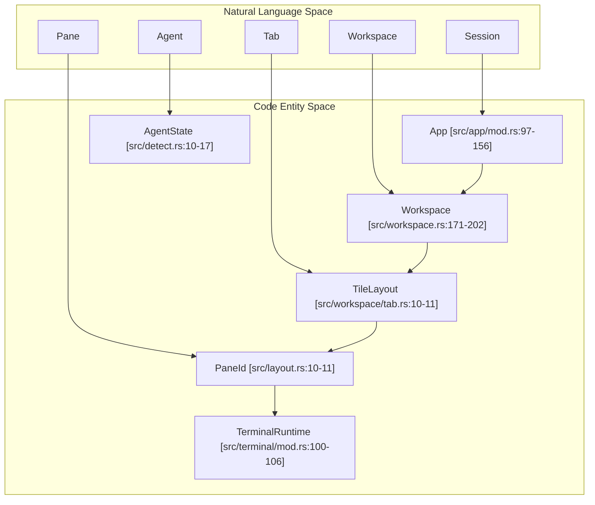
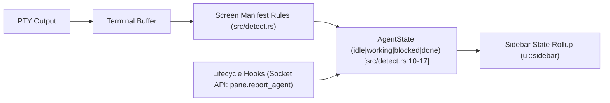

# Core Concepts

Relevant source files

The following files were used as context for generating this wiki page:

- [CHANGELOG.md](https://github.com/herdrdev/herdr/blob/HEAD/CHANGELOG.md)
- [Cargo.lock](https://github.com/herdrdev/herdr/blob/HEAD/Cargo.lock)
- [Cargo.toml](https://github.com/herdrdev/herdr/blob/HEAD/Cargo.toml)
- [docs/next/CHANGELOG.md](https://github.com/herdrdev/herdr/blob/HEAD/docs/next/CHANGELOG.md)
- [src/app/api/panes.rs](https://github.com/herdrdev/herdr/blob/HEAD/src/app/api/panes.rs)
- [src/app/creation.rs](https://github.com/herdrdev/herdr/blob/HEAD/src/app/creation.rs)
- [src/app/mod.rs](https://github.com/herdrdev/herdr/blob/HEAD/src/app/mod.rs)
- [src/app/state.rs](https://github.com/herdrdev/herdr/blob/HEAD/src/app/state.rs)
- [src/config.rs](https://github.com/herdrdev/herdr/blob/HEAD/src/config.rs)
- [src/config/model.rs](https://github.com/herdrdev/herdr/blob/HEAD/src/config/model.rs)
- [src/main.rs](https://github.com/herdrdev/herdr/blob/HEAD/src/main.rs)
- [src/persist.rs](https://github.com/herdrdev/herdr/blob/HEAD/src/persist.rs)
- [src/ui.rs](https://github.com/herdrdev/herdr/blob/HEAD/src/ui.rs)
- [src/workspace.rs](https://github.com/herdrdev/herdr/blob/HEAD/src/workspace.rs)
- [src/workspace/tab.rs](https://github.com/herdrdev/herdr/blob/HEAD/src/workspace/tab.rs)

This section defines the fundamental abstractions used by Herdr to organize terminal environments and coding agents. It explains the relationship between the client/server architecture and the persistent session lifecycle.

## The Herdr Hierarchy

Herdr organizes terminal processes into a hierarchical structure that allows for high-level management of multiple concurrent coding agents.

| Entity | Description | Code Identifier |
| :--- | :--- | :--- |
| **Session** | The top-level persistence boundary. Contains all workspaces and settings. | `Session` |
| **Workspace** | A project-level container. Groups related tabs and panes. | `Workspace` |
| **Tab** | A single viewport layout within a workspace. | `Tab` |
| **Pane** | A terminal emulator instance running a PTY process. | `PaneId` |
| **Agent** | A logical state overlay detected within a pane. | `Agent` |

### Logical Composition Diagram
This diagram illustrates how these entities compose from the user's perspective down to the underlying PTY.

**Sources:** [src/layout.rs:10-11](https://github.com/herdrdev/herdr/blob/HEAD/src/layout.rs#L10-L11), [src/workspace/tab.rs:10-11](https://github.com/herdrdev/herdr/blob/HEAD/src/workspace/tab.rs#L10-L11), [src/app/mod.rs:97-156](https://github.com/herdrdev/herdr/blob/HEAD/src/app/mod.rs#L97-L156), [src/workspace.rs:171-202](https://github.com/herdrdev/herdr/blob/HEAD/src/workspace.rs#L171-L202), [src/terminal/mod.rs:100-106](https://github.com/herdrdev/herdr/blob/HEAD/src/terminal/mod.rs#L100-L106), [src/detect.rs:10-17](https://github.com/herdrdev/herdr/blob/HEAD/src/detect.rs#L10-L17)

---

## Workspace, Tab, and Pane

### Workspace
A **Workspace** is the primary unit of project isolation. It typically maps to a single Git repository or a specific work context. The `Workspace` struct [src/workspace.rs:171-202](https://github.com/herdrdev/herdr/blob/HEAD/src/workspace.rs#L171-L202) holds its unique `id`, an optional `custom_name`, and various cached Git-related metadata like `cached_git_branch` and `cached_git_ahead_behind`. Workspaces are identified by a public ID, generated by `generate_workspace_id()` [src/workspace.rs:102-105](https://github.com/herdrdev/herdr/blob/HEAD/src/workspace.rs#L102-L105), which uses a base-32 encoding scheme [src/workspace.rs:107-119](https://github.com/herdrdev/herdr/blob/HEAD/src/workspace.rs#L107-L119).

### Tab
Each workspace contains one or more **Tabs**. A tab represents a specific arrangement of panes. The `Tab` struct [src/workspace/tab.rs:10-11](https://github.com/herdrdev/herdr/blob/HEAD/src/workspace/tab.rs#L10-L11) manages the `TileLayout` which defines the visual arrangement of panes within that tab. Switching tabs changes the visible layout without affecting the processes running in other tabs of the same workspace.

### Pane and Layout
A **Pane** is the leaf node of the UI. It hosts a `TerminalRuntime` [src/terminal/mod.rs:100-106](https://github.com/herdrdev/herdr/blob/HEAD/src/terminal/mod.rs#L100-L106) which manages the PTY and terminal emulation.
*   **Layout Engine**: Herdr uses a Binary Space Partitioning (BSP) tree to manage pane tiling. The `TileLayout` [src/workspace/tab.rs:10-11](https://github.com/herdrdev/herdr/blob/HEAD/src/workspace/tab.rs#L10-L11) is a core component of this, representing the tree structure of panes.
*   **PaneId**: Every pane is assigned a globally unique `PaneId` [src/layout.rs:10-11](https://github.com/herdrdev/herdr/blob/HEAD/src/layout.rs#L10-L11), which is a `u32` identifier used for targeting commands.
*   **Splitting**: The `TileLayout` allows splitting the focused pane horizontally or vertically. This operation, handled by `split_pane_with_ratio` or `split_pane` [src/app/api/panes.rs:70-98](https://github.com/herdrdev/herdr/blob/HEAD/src/app/api/panes.rs#L70-L98), allocates a new `PaneId` and updates the `Node` tree. The new pane's `cwd` can be inherited or explicitly set [src/app/api/panes.rs:54-57](https://github.com/herdrdev/herdr/blob/HEAD/src/app/api/panes.rs#L54-L57).

**Sources:** [src/layout.rs:10-11](https://github.com/herdrdev/herdr/blob/HEAD/src/layout.rs#L10-L11), [src/workspace.rs:102-119](https://github.com/herdrdev/herdr/blob/HEAD/src/workspace.rs#L102-L119), [src/workspace.rs:171-202](https://github.com/herdrdev/herdr/blob/HEAD/src/workspace.rs#L171-L202), [src/workspace/tab.rs:10-11](https://github.com/herdrdev/herdr/blob/HEAD/src/workspace/tab.rs#L10-L11), [src/terminal/mod.rs:100-106](https://github.com/herdrdev/herdr/blob/HEAD/src/terminal/mod.rs#L100-L106), [src/app/api/panes.rs:54-98](https://github.com/herdrdev/herdr/blob/HEAD/src/app/api/panes.rs#L54-L98)

---

## Agent Detection and State

An **Agent** is not a separate process, but a state machine that tracks the foreground process group within a Pane. Herdr uses "Status Authority" to determine an agent's current state (`idle`, `working`, `blocked`, or `done`). The `AgentState` enum [src/detect.rs:10-17](https://github.com/herdrdev/herdr/blob/HEAD/src/detect.rs#L10-L17) defines these possible states.

### Status Authority Models
1.  **Lifecycle Authority**: Agents like Pi or OMP use official hooks to report state directly to the Herdr socket. This is often managed through `pane.report_agent` or `pane.report_agent_session` API calls [src/app/api/panes.rs:15-16](https://github.com/herdrdev/herdr/blob/HEAD/src/app/api/panes.rs#L15-L16).
2.  **Screen Heuristics**: For agents without hooks (e.g., Claude Code, Codex), Herdr inspects the terminal buffer against TOML-based manifests to classify state. These manifests define `invariant_gates` and `spinner_patterns` [src/detect.rs:20-21](https://github.com/herdrdev/herdr/blob/HEAD/src/detect.rs#L20-L21) to detect agent activity.

### Agent State Flow

**Sources:** [src/detect.rs:10-21](https://github.com/herdrdev/herdr/blob/HEAD/src/detect.rs#L10-L21), [src/app/api/panes.rs:15-16](https://github.com/herdrdev/herdr/blob/HEAD/src/app/api/panes.rs#L15-L16)

---

## Client/Server Model and Persistence

Herdr operates as a **Headless Server** that persists even when no UI is attached. The `App` struct [src/app/mod.rs:97-156](https://github.com/herdrdev/herdr/blob/HEAD/src/app/mod.rs#L97-L156) encapsulates the entire application state and runtime concerns, including event channels and async I/O.

### The Lifecycle
*   **Startup**: Running `herdr` launches the background server if it is not already running. The `HERDR_ENV_VAR` [src/main.rs:11](https://github.com/herdrdev/herdr/blob/HEAD/src/main.rs#L11) is set to `HERDR_ENV_VALUE` [src/main.rs:11](https://github.com/herdrdev/herdr/blob/HEAD/src/main.rs#L11) to indicate a Herdr environment, preventing nested Herdr instances [src/main.rs:13-20](https://github.com/herdrdev/herdr/blob/HEAD/src/main.rs#L13-L20).
*   **Persistence**: PTY processes are owned by the server. Closing the terminal window or detaching (`prefix+q`) does not kill the running agents. The `session_save_deadline` [src/app/mod.rs:139](https://github.com/herdrdev/herdr/blob/HEAD/src/app/mod.rs#L139) and `session_save_thread` [src/app/mod.rs:140](https://github.com/herdrdev/herdr/blob/HEAD/src/app/mod.rs#L140) manage the periodic saving of the session state.
*   **Handoff**: Herdr supports "Live Handoff," allowing a new server binary to take over PTY file descriptors from a running server with zero downtime. This feature was added in version 0.8.0 [CHANGELOG.md:5](https://github.com/herdrdev/herdr/blob/HEAD/CHANGELOG.md#L5).
*   **Remote Access**: `herdr --remote` establishes an SSH tunnel to the server, allowing the local client to interact with the remote session while using local keybindings.

### Session Restoration
Herdr saves the session state to `session.json` [src/persist.rs:10-11](https://github.com/herdrdev/herdr/blob/HEAD/src/persist.rs#L10-L11). Upon restart, it can rehydrate the workspace/tab/pane topology. For supported agents, it uses native session IDs (e.g., `--resume=<id>`) to restore the agent's conversation context. The `agent_resume` module [src/app/agent_resume.rs:1-2](https://github.com/herdrdev/herdr/blob/HEAD/src/app/agent_resume.rs#L1-L2) handles the logic for resuming agent sessions. The `pending_agent_resume_deadline` [src/app/mod.rs:136](https://github.com/herdrdev/herdr/blob/HEAD/src/app/mod.rs#L136) tracks when agent resume operations should be processed.

**Sources:** [src/main.rs:11-20](https://github.com/herdrdev/herdr/blob/HEAD/src/main.rs#L11-L20), [src/app/mod.rs:97-156](https://github.com/herdrdev/herdr/blob/HEAD/src/app/mod.rs#L97-L156), [src/app/mod.rs:136-140](https://github.com/herdrdev/herdr/blob/HEAD/src/app/mod.rs#L136-L140), [src/app/agent_resume.rs:1-2](https://github.com/herdrdev/herdr/blob/HEAD/src/app/agent_resume.rs#L1-L2), [src/persist.rs:10-11](https://github.com/herdrdev/herdr/blob/HEAD/src/persist.rs#L10-L11), [CHANGELOG.md:5](https://github.com/herdrdev/herdr/blob/HEAD/CHANGELOG.md#L5)