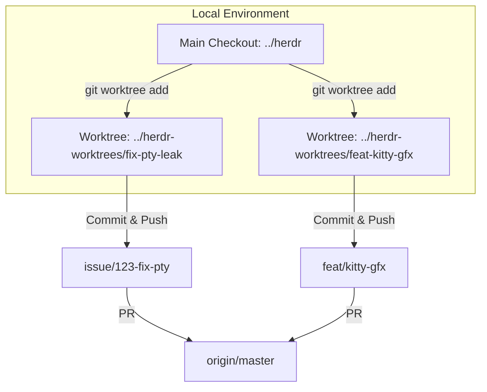
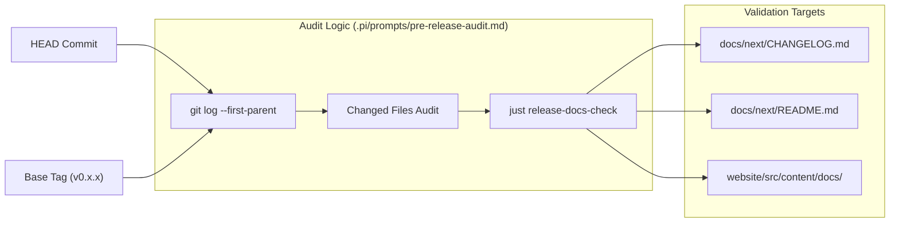

# Contributing and Development Workflow

Relevant source files

The following files were used as context for generating this wiki page:

- [.agents/skills/herdr-pre-release-audit/SKILL.md](https://github.com/herdrdev/herdr/blob/HEAD/.agents/skills/herdr-pre-release-audit/SKILL.md)
- [.agents/skills/herdr-throwaway-repro/SKILL.md](https://github.com/herdrdev/herdr/blob/HEAD/.agents/skills/herdr-throwaway-repro/SKILL.md)
- [.agents/skills/triage/SKILL.md](https://github.com/herdrdev/herdr/blob/HEAD/.agents/skills/triage/SKILL.md)
- [.githooks/commit-msg](https://github.com/herdrdev/herdr/blob/HEAD/.githooks/commit-msg)
- [.github/APPROVED_CONTRIBUTORS](https://github.com/herdrdev/herdr/blob/HEAD/.github/APPROVED_CONTRIBUTORS)
- [.github/ISSUE_TEMPLATE/bug.yml](https://github.com/herdrdev/herdr/blob/HEAD/.github/ISSUE_TEMPLATE/bug.yml)
- [.github/ISSUE_TEMPLATE/config.yml](https://github.com/herdrdev/herdr/blob/HEAD/.github/ISSUE_TEMPLATE/config.yml)
- [.github/MAINTAINERS](https://github.com/herdrdev/herdr/blob/HEAD/.github/MAINTAINERS)
- [.github/workflows/ci.yml](https://github.com/herdrdev/herdr/blob/HEAD/.github/workflows/ci.yml)
- [.github/workflows/issue-gate.yml](https://github.com/herdrdev/herdr/blob/HEAD/.github/workflows/issue-gate.yml)
- [.github/workflows/nix.yml](https://github.com/herdrdev/herdr/blob/HEAD/.github/workflows/nix.yml)
- [.github/workflows/pr-gate.yml](https://github.com/herdrdev/herdr/blob/HEAD/.github/workflows/pr-gate.yml)
- [.pi/prompts/pre-release-audit.md](https://github.com/herdrdev/herdr/blob/HEAD/.pi/prompts/pre-release-audit.md)
- [AGENTS.md](https://github.com/herdrdev/herdr/blob/HEAD/AGENTS.md)
- [CONTRIBUTING.md](https://github.com/herdrdev/herdr/blob/HEAD/CONTRIBUTING.md)
- [build.rs](https://github.com/herdrdev/herdr/blob/HEAD/build.rs)
- [docs/versions/0.5.11/website/src/content/docs/install.mdx](https://github.com/herdrdev/herdr/blob/HEAD/docs/versions/0.5.11/website/src/content/docs/install.mdx)
- [docs/versions/0.5.12/website/src/content/docs/agent-skill.mdx](https://github.com/herdrdev/herdr/blob/HEAD/docs/versions/0.5.12/website/src/content/docs/agent-skill.mdx)
- [docs/versions/0.5.12/website/src/content/docs/install.mdx](https://github.com/herdrdev/herdr/blob/HEAD/docs/versions/0.5.12/website/src/content/docs/install.mdx)
- [docs/versions/0.6.0/website/src/content/docs/agent-skill.mdx](https://github.com/herdrdev/herdr/blob/HEAD/docs/versions/0.6.0/website/src/content/docs/agent-skill.mdx)
- [docs/versions/0.6.0/website/src/content/docs/install.mdx](https://github.com/herdrdev/herdr/blob/HEAD/docs/versions/0.6.0/website/src/content/docs/install.mdx)
- [docs/versions/0.6.1/website/src/content/docs/agent-skill.mdx](https://github.com/herdrdev/herdr/blob/HEAD/docs/versions/0.6.1/website/src/content/docs/agent-skill.mdx)
- [docs/versions/0.6.1/website/src/content/docs/install.mdx](https://github.com/herdrdev/herdr/blob/HEAD/docs/versions/0.6.1/website/src/content/docs/install.mdx)
- [justfile](https://github.com/herdrdev/herdr/blob/HEAD/justfile)
- [nix/package.nix](https://github.com/herdrdev/herdr/blob/HEAD/nix/package.nix)
- [skills/herdr/SKILL.md](https://github.com/herdrdev/herdr/blob/HEAD/skills/herdr/SKILL.md)

This page outlines the standards and technical processes for contributing to the `herdr` codebase. As a high-performance terminal runtime and agent environment, the project maintains strict quality gates, automated verification, and specific isolation workflows for development.

## Core Development Principles

The codebase follows a set of architectural invariants to ensure maintainability and testability:

*   **State Separation**: `AppState` is pure data, decoupled from the PTY runtime. `PaneState` remains separate from `PaneRuntime` [AGENTS.md:30-30](https://github.com/herdrdev/herdr/blob/HEAD/AGENTS.md#L30).
*   **Pure Rendering**: The `compute_view()` function handles geometry and mutations, while `render()` is a pure function that takes `&AppState` and performs no mutations [AGENTS.md:31-31](https://github.com/herdrdev/herdr/blob/HEAD/AGENTS.md#L31).
*   **Platform Isolation**: OS-specific logic is confined to `src/platform/<os>.rs`. Core modules are forbidden from using `#[cfg(target_os)]` directly [AGENTS.md:33-33](https://github.com/herdrdev/herdr/blob/HEAD/AGENTS.md#L33).
*   **Evidence-Based Detection**: Agent detection manifests in `src/detect/manifests/` must be based on captured ANSI/text snapshots from `herdr agent read` [AGENTS.md:35-35](https://github.com/herdrdev/herdr/blob/HEAD/AGENTS.md#L35).

Sources: [AGENTS.md:30-37](https://github.com/herdrdev/herdr/blob/HEAD/AGENTS.md#L30-L37)

## Task Runner: Justfile

Herdr uses `just` as its primary task runner to wrap complex Cargo and script invocations.

| Command | Description |
| :--- | :--- |
| `just check` | Comprehensive local check: `fmt`, `clippy`, `nextest`, and maintenance scripts [justfile:39-42](https://github.com/herdrdev/herdr/blob/HEAD/justfile#L39-L42). |
| `just test` | Runs all Rust integration/unit tests and Python maintenance tests [justfile:4-8](https://github.com/herdrdev/herdr/blob/HEAD/justfile#L4-L8). |
| `just lint` | Runs `cargo fmt` and `cargo clippy` with `-D warnings` [justfile:16-18](https://github.com/herdrdev/herdr/blob/HEAD/justfile#L16-L18). |
| `just windows-lint` | Cross-compiles for Windows from Unix to catch `cfg(windows)` errors [justfile:34-36](https://github.com/herdrdev/herdr/blob/HEAD/justfile#L34-L36). |
| `just install-hooks` | Configures local git hooks from `.githooks/` [justfile:50-54](https://github.com/herdrdev/herdr/blob/HEAD/justfile#L50-L54).

Sources: [justfile:1-138](https://github.com/herdrdev/herdr/blob/HEAD/justfile#L1-L138)

## PR Gate and Commit Conventions

The project employs an automated "PR Gate" to manage external contributions and ensure high standards.

### Commit Messages
Commits must follow the **Conventional Commits** specification. The `PR Gate` validates titles for external contributors, requiring `fix:` or `fix(scope):` prefixes for unapproved PRs [.github/workflows/ci.yml:39-42](https://github.com/herdrdev/herdr/blob/HEAD/.github/workflows/ci.yml#L39-L42).
*   **Issue References**: Use `refs #<id>` in the commit body to link issues without closing them prematurely [CONTRIBUTING.md:97-105](https://github.com/herdrdev/herdr/blob/HEAD/CONTRIBUTING.md#L97-L105).
*   **Closing Keywords**: Avoid `fixes #<id>` in commit bodies; the release process handles issue closure after the binary is published [.pi/prompts/pre-release-audit.md:54-54](https://github.com/herdrdev/herdr/blob/HEAD/.pi/prompts/pre-release-audit.md#L54).

### Automated Gates
*   **External PR Limits**: Unsolicited implementation pull requests from contributors not listed in `.github/APPROVED_CONTRIBUTORS` are automatically closed [CONTRIBUTING.md:25-27](https://github.com/herdrdev/herdr/blob/HEAD/CONTRIBUTING.md#L25-L27).
*   **Maintainer Overrides**: A verified maintainer may reopen a closed pull request as a one-off exception [CONTRIBUTING.md:28-30](https://github.com/herdrdev/herdr/blob/HEAD/CONTRIBUTING.md#L28-L30).

Sources: [CONTRIBUTING.md:39-47](https://github.com/herdrdev/herdr/blob/HEAD/CONTRIBUTING.md#L39-L47), [.github/workflows/pr-gate.yml:19-52](https://github.com/herdrdev/herdr/blob/HEAD/.github/workflows/pr-gate.yml#L19-L52), [.github/workflows/ci.yml:22-42](https://github.com/herdrdev/herdr/blob/HEAD/.github/workflows/ci.yml#L22-L42)

## Worktree-Based Development

Maintainers use `git worktree` to isolate concurrent features and prevent "god-worktree" pollution.

### Workflow Geometry

Maintainers are instructed to perform all edits, tests, and validation within these dedicated task worktrees [AGENTS.md:65-75](https://github.com/herdrdev/herdr/blob/HEAD/AGENTS.md#L65-L75).

Sources: [AGENTS.md:61-90](https://github.com/herdrdev/herdr/blob/HEAD/AGENTS.md#L61-L90)

## Pre-release Audit Process

Before a release is published, a multi-step audit ensures documentation, changelogs, and binaries are synchronized.

### Audit Data Flow

### Release Checklist
1.  **Docs Parity**: `just release-docs-check` verifies that `docs/next/` contents match the root docs and that translations (JA, ZH-CN) are present [justfile:78-112](https://github.com/herdrdev/herdr/blob/HEAD/justfile#L78-L112).
2.  **Changelog Extraction**: `scripts/changelog.py` extracts entries for the specific version to populate the GitHub Release body [justfile:131-132](https://github.com/herdrdev/herdr/blob/HEAD/justfile#L131-L132).
3.  **Nix Refresh**: The `cargoHash` in `flake.nix` must be updated if `Cargo.lock` changed to pass `flake-check` [.pi/prompts/pre-release-audit.md:72-73](https://github.com/herdrdev/herdr/blob/HEAD/.pi/prompts/pre-release-audit.md#L72-L73).
4.  **Release Preparation**: `just release-prepare <version>` automates the version bump and commit [justfile:116-139](https://github.com/herdrdev/herdr/blob/HEAD/justfile#L116-L139).

Sources: [justfile:78-166](https://github.com/herdrdev/herdr/blob/HEAD/justfile#L78-L166), [.pi/prompts/pre-release-audit.md:9-85](https://github.com/herdrdev/herdr/blob/HEAD/.pi/prompts/pre-release-audit.md#L9-L85)