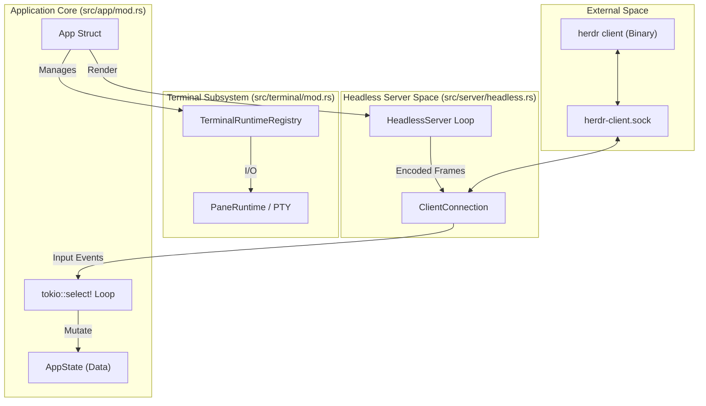
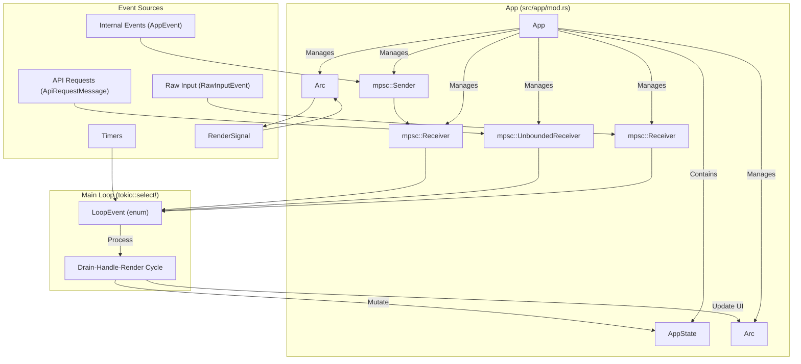
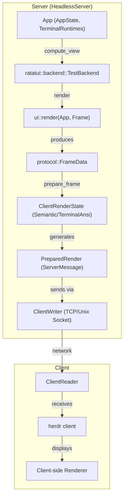

# Architecture

Relevant source files

The following files were used as context for generating this wiki page:

- [src/app/actions.rs](https://github.com/herdrdev/herdr/blob/HEAD/src/app/actions.rs)
- [src/app/api.rs](https://github.com/herdrdev/herdr/blob/HEAD/src/app/api.rs)
- [src/app/mod.rs](https://github.com/herdrdev/herdr/blob/HEAD/src/app/mod.rs)
- [src/app/state.rs](https://github.com/herdrdev/herdr/blob/HEAD/src/app/state.rs)
- [src/config.rs](https://github.com/herdrdev/herdr/blob/HEAD/src/config.rs)
- [src/config/model.rs](https://github.com/herdrdev/herdr/blob/HEAD/src/config/model.rs)
- [src/events.rs](https://github.com/herdrdev/herdr/blob/HEAD/src/events.rs)
- [src/main.rs](https://github.com/herdrdev/herdr/blob/HEAD/src/main.rs)
- [src/server/headless.rs](https://github.com/herdrdev/herdr/blob/HEAD/src/server/headless.rs)
- [src/server/render_stream.rs](https://github.com/herdrdev/herdr/blob/HEAD/src/server/render_stream.rs)
- [src/ui.rs](https://github.com/herdrdev/herdr/blob/HEAD/src/ui.rs)

Herdr utilizes a client/server architecture designed to provide persistent terminal sessions that survive client disconnects, remote SSH sessions, and even live handoffs between server processes. The system is built around a central event loop that orchestrates state mutations, PTY I/O, and a virtual rendering pipeline.

## System Overview

The following diagram illustrates the high-level relationship between the `HeadlessServer`, the `App` orchestration layer, and the external `Client` connections.

### Core Component Interaction

**Sources:** [src/app/mod.rs:97-156](https://github.com/herdrdev/herdr/blob/HEAD/src/app/mod.rs#L97-L156), [src/server/headless.rs:1-15](https://github.com/herdrdev/herdr/blob/HEAD/src/server/headless.rs#L1-L15), [src/server/headless.rs:124-130](https://github.com/herdrdev/herdr/blob/HEAD/src/server/headless.rs#L124-L130).

---

## App Orchestration and State Management

The `App` struct [src/app/mod.rs:97-156](https://github.com/herdrdev/herdr/blob/HEAD/src/app/mod.rs#L97-L156) is the central orchestrator. It holds the `AppState` [src/app/state.rs:270-345](https://github.com/herdrdev/herdr/blob/HEAD/src/app/state.rs#L270-L345), which contains the pure data representation of workspaces, tabs, and panes. The `App` manages the main event loop using `tokio::select!`, which handles:
*   **Internal Events:** Delivered via `mpsc` channel (e.g., PTY exits, agent detection) [src/events.rs:56-162](https://github.com/herdrdev/herdr/blob/HEAD/src/events.rs#L56-L162).
*   **API Requests:** JSON-RPC calls from the CLI or plugins [src/app/mod.rs:105](https://github.com/herdrdev/herdr/blob/HEAD/src/app/mod.rs#L105).
*   **Raw Input:** Keyboard and mouse data from the connected client [src/app/mod.rs:108](https://github.com/herdrdev/herdr/blob/HEAD/src/app/mod.rs#L108).
*   **Timers:** Debounced session saving and git status refreshes [src/app/mod.rs:36-47](https://github.com/herdrdev/herdr/blob/HEAD/src/app/mod.rs#L36-L47).

### App Event Loop

**Sources:** [src/app/mod.rs:97-156](https://github.com/herdrdev/herdr/blob/HEAD/src/app/mod.rs#L97-L156), [src/app/mod.rs:161-168](https://github.com/herdrdev/herdr/blob/HEAD/src/app/mod.rs#L161-L168), [src/app/state.rs:270-345](https://github.com/herdrdev/herdr/blob/HEAD/src/app/state.rs#L270-L345), [src/events.rs:56-162](https://github.com/herdrdev/herdr/blob/HEAD/src/events.rs#L56-L162).

For details, see [App Orchestration and State Management](06_2.1-app-orchestration-and-state-management.md).

---

## Headless Server and Client Protocol

Herdr runs a `HeadlessServer` [src/server/headless.rs:1-15](https://github.com/herdrdev/herdr/blob/HEAD/src/server/headless.rs#L1-L15) that maintains the session even when no UI is visible. It performs "virtual rendering" into a memory buffer using Ratatui. When a client attaches via the Unix domain socket (`herdr-client.sock`), the server begins streaming frames.

The system supports two rendering modes:
1.  **SemanticFrame:** Sends the full logical grid state, allowing the client to handle rendering [src/server/render_stream.rs:14-15](https://github.com/herdrdev/herdr/blob/HEAD/src/server/render_stream.rs#L14-L15).
2.  **TerminalAnsi:** Uses a `BlitEncoder` [src/server/render_stream.rs:17-21](https://github.com/herdrdev/herdr/blob/HEAD/src/server/render_stream.rs#L17-L21) to calculate a diff between the current and previous frame, sending only the minimal ANSI escape sequences required to update the host terminal.

### Client-Server Rendering Pipeline

**Sources:** [src/server/headless.rs:1-15](https://github.com/herdrdev/herdr/blob/HEAD/src/server/headless.rs#L1-L15), [src/server/render_stream.rs:13-34](https://github.com/herdrdev/herdr/blob/HEAD/src/server/render_stream.rs#L13-L34), [src/server/render_stream.rs:65-110](https://github.com/herdrdev/herdr/blob/HEAD/src/server/render_stream.rs#L65-L110), [src/ui.rs:111-120](https://github.com/herdrdev/herdr/blob/HEAD/src/ui.rs#L111-L120).

For details, see [Headless Server and Client Protocol](07_2.2-headless-server-and-client-protocol.md).

---

## PTY and Terminal Runtime

Each terminal pane in Herdr is backed by a `PaneRuntime`. This runtime manages the lifecycle of the PTY (Pseudo-Terminal) and the underlying shell process. The `TerminalRuntimeRegistry` [src/app/mod.rs:103](https://github.com/herdrdev/herdr/blob/HEAD/src/app/mod.rs#L103) tracks these runtimes, ensuring that I/O actors continue to process shell output and update the internal Ghostty-based VT engine even when the pane is not actively being viewed.

For details, see [PTY and Terminal Runtime](08_2.3-pty-and-terminal-runtime.md).

**Sources:** [src/app/mod.rs:103](https://github.com/herdrdev/herdr/blob/HEAD/src/app/mod.rs#L103), [src/terminal/mod.rs:1-20](https://github.com/herdrdev/herdr/blob/HEAD/src/terminal/mod.rs#L1-L20).

---

## Layout Engine

Herdr uses a Binary Space Partitioning (BSP) tree to manage pane layouts within a tab. The layout is defined by `Node` structures that can be either a `Leaf` (containing a `PaneId`) or an `Internal` split (Horizontal or Vertical). The engine handles complex operations like:
*   **Splitting/Resizing:** Dynamically adjusting `Rect` geometries [src/ui.rs:111-120](https://github.com/herdrdev/herdr/blob/HEAD/src/ui.rs#L111-L120).
*   **Zooming:** Temporarily expanding a single pane to fill the tab surface.
*   **Geometry Reconciliation:** Ensuring the PTY size matches the calculated UI `Rect` [src/ui.rs:158-172](https://github.com/herdrdev/herdr/blob/HEAD/src/ui.rs#L158-L172).

For details, see [Layout Engine](09_2.4-layout-engine.md).

**Sources:** [src/ui.rs:111-120](https://github.com/herdrdev/herdr/blob/HEAD/src/ui.rs#L111-L120), [src/ui.rs:158-172](https://github.com/herdrdev/herdr/blob/HEAD/src/ui.rs#L158-L172), [src/app/state.rs:8-9](https://github.com/herdrdev/herdr/blob/HEAD/src/app/state.rs#L8-L9).

---

## Session Persistence and Handoff

Persistence is handled through two primary mechanisms:
1.  **Snapshots:** The `AppState` is serialized to `session.json` [src/app/mod.rs:139](https://github.com/herdrdev/herdr/blob/HEAD/src/app/mod.rs#L139). On restart, Herdr "rehydrates" the session, recreating the workspace/tab/pane hierarchy.
2.  **Live Handoff:** During a server upgrade or restart, Herdr can perform a zero-downtime handoff. This involves passing open PTY file descriptors from the old process to the new one using `SCM_RIGHTS` [src/server/headless.rs:78-96](https://github.com/herdrdev/herdr/blob/HEAD/src/server/headless.rs#L78-L96), allowing shell processes to remain alive and connected during the transition.

For details, see [Session Persistence and Handoff](10_2.5-session-persistence-and-handoff.md).

**Sources:** [src/app/mod.rs:139](https://github.com/herdrdev/herdr/blob/HEAD/src/app/mod.rs#L139), [src/server/headless.rs:78-96](https://github.com/herdrdev/herdr/blob/HEAD/src/server/headless.rs#L78-L96).