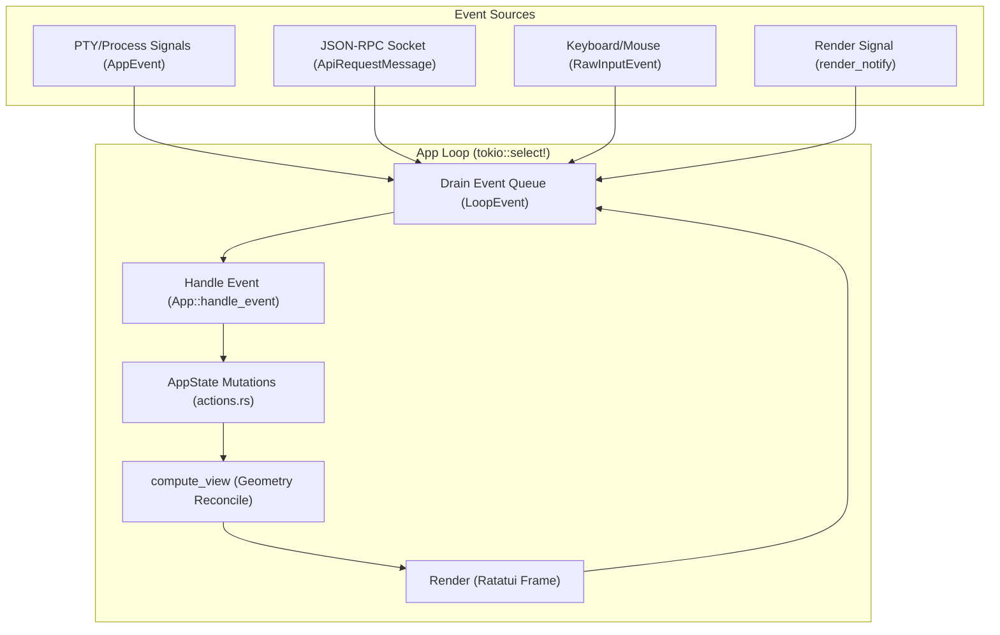
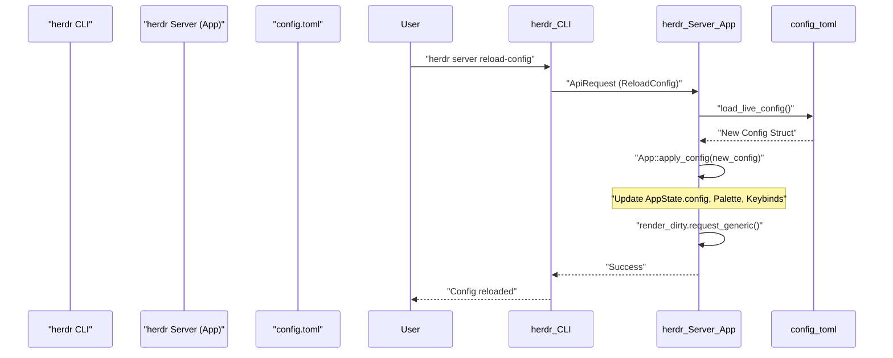

# App Orchestration and State Management

Relevant source files

The following files were used as context for generating this wiki page:

- [src/app/agents.rs](https://github.com/herdrdev/herdr/blob/HEAD/src/app/agents.rs)
- [src/app/mod.rs](https://github.com/herdrdev/herdr/blob/HEAD/src/app/mod.rs)
- [src/app/state.rs](https://github.com/herdrdev/herdr/blob/HEAD/src/app/state.rs)
- [src/config.rs](https://github.com/herdrdev/herdr/blob/HEAD/src/config.rs)
- [src/config/model.rs](https://github.com/herdrdev/herdr/blob/HEAD/src/config/model.rs)
- [src/events.rs](https://github.com/herdrdev/herdr/blob/HEAD/src/events.rs)
- [src/main.rs](https://github.com/herdrdev/herdr/blob/HEAD/src/main.rs)
- [src/ui.rs](https://github.com/herdrdev/herdr/blob/HEAD/src/ui.rs)

This page details the central orchestration logic of `herdr`, focusing on the `App` struct, the asynchronous event loop, and the management of global application state via `AppState`.

## The App Struct and Event Loop

The `App` struct is the primary owner of the application lifecycle, bridging pure state data with runtime concerns such as async I/O, PTY management, and API communication [src/app/mod.rs:97-156](https://github.com/herdrdev/herdr/blob/HEAD/src/app/mod.rs#L97-L156).

The core of `herdr` is an asynchronous event loop driven by `tokio::select!`. This loop multiplexes several event sources into a unified stream of `LoopEvent` variants [src/app/mod.rs:161-168](https://github.com/herdrdev/herdr/blob/HEAD/src/app/mod.rs#L161-L168).

### Event Sources
| Event Source | Code Entity | Description |
| :--- | :--- | :--- |
| **Internal Events** | `AppEvent` | Signals from PTYs (exit, output), Git status updates, and internal timers [src/events.rs](https://github.com/herdrdev/herdr/blob/HEAD/src/events.rs) |
| **API Requests** | `ApiRequestMessage` | JSON-RPC requests arriving via the Unix domain socket [src/app/mod.rs:106](https://github.com/herdrdev/herdr/blob/HEAD/src/app/mod.rs#L106) |
| **Raw Input** | `RawInputEvent` | Keyboard and mouse events captured from the host terminal [src/app/mod.rs:109](https://github.com/herdrdev/herdr/blob/HEAD/src/app/mod.rs#L109) |
| **Render Signal** | `RenderRequested` | Triggered when state changes necessitate a UI redraw [src/app/mod.rs:167](https://github.com/herdrdev/herdr/blob/HEAD/src/app/mod.rs#L167) |

### The Drain-Handle-Render Cycle

`herdr` follows a "Drain-Handle-Render" pattern to ensure state consistency and minimize redundant draws.

1.  **Drain**: The loop consumes a batch of events (up to `APP_EVENT_DRAIN_LIMIT`) before proceeding to render [src/app/mod.rs:159](https://github.com/herdrdev/herdr/blob/HEAD/src/app/mod.rs#L159).
2.  **Handle**: Events are dispatched to `handle_internal_event` or `handle_api_request`, which mutate the `AppState` [src/app/api.rs:99-200](https://github.com/herdrdev/herdr/blob/HEAD/src/app/api.rs#L99-L200).
3.  **Render**: If any event marked the state as dirty (`render_dirty`), the `compute_view` and `render` functions are called [src/ui.rs:111-128](https://github.com/herdrdev/herdr/blob/HEAD/src/ui.rs#L111-L128).

**Sources:** [src/app/mod.rs:97-168](https://github.com/herdrdev/herdr/blob/HEAD/src/app/mod.rs#L97-L168), [src/app/api.rs:99-200](https://github.com/herdrdev/herdr/blob/HEAD/src/app/api.rs#L99-L200), [src/ui.rs:111-128](https://github.com/herdrdev/herdr/blob/HEAD/src/ui.rs#L111-L128)

## State Management (`AppState`)

`AppState` is a tree of pure data structures representing the entire world-view of the application. It is designed to be serializable for session persistence [src/app/state.rs:227-380](https://github.com/herdrdev/herdr/blob/HEAD/src/app/state.rs#L227-L380).

### Data Hierarchy
*   **Workspaces**: The top-level containers (`Vec<Workspace>`) [src/app/state.rs:247](https://github.com/herdrdev/herdr/blob/HEAD/src/app/state.rs#L247).
*   **Tabs**: Each workspace contains one or more tabs [src/workspace.rs:198](https://github.com/herdrdev/herdr/blob/HEAD/src/workspace.rs#L198).
*   **Panes**: Tabs contain a `TileLayout` tree of `PaneId`s [src/workspace/tab.rs](https://github.com/herdrdev/herdr/blob/HEAD/src/workspace/tab.rs).
*   **Terminals**: A global registry mapping `TerminalId` to `TerminalState` (screen buffers, history) [src/app/state.rs:248](https://github.com/herdrdev/herdr/blob/HEAD/src/app/state.rs#L248).

### State Transitions
Mutations are handled in `src/app/actions.rs`. These functions are "pure" in that they only modify `AppState` and return information about what changed (e.g., `EffectiveStateChange`), without performing I/O directly [src/app/actions.rs:1-23](https://github.com/herdrdev/herdr/blob/HEAD/src/app/actions.rs#L1-L23).

**Sources:** [src/app/state.rs:227-380](https://github.com/herdrdev/herdr/blob/HEAD/src/app/state.rs#L227-L380), [src/workspace.rs:198](https://github.com/herdrdev/herdr/blob/HEAD/src/workspace.rs#L198), [src/workspace/tab.rs](https://github.com/herdrdev/herdr/blob/HEAD/src/workspace/tab.rs), [src/app/actions.rs:1-23](https://github.com/herdrdev/herdr/blob/HEAD/src/app/actions.rs#L1-L23)

## Configuration and Hot-Reloading

`herdr` supports live configuration reloading without restarting the server process.

### Configuration Model
The `Config` struct (defined in `src/config/model.rs`) represents the `config.toml` structure. It includes sections for `keys`, `theme`, `terminal`, and `update` [src/config/model.rs:258-260](https://github.com/herdrdev/herdr/blob/HEAD/src/config/model.rs#L258-L260).

### Reload Mechanism
1.  **Trigger**: A user runs `herdr server reload-config` or selects "reload config" from the global menu. This action is mapped to `Action::ReloadConfig` [src/main.rs:179](https://github.com/herdrdev/herdr/blob/HEAD/src/main.rs#L179).
2.  **IO**: `load_live_config` reads the file from `~/.config/herdr/config.toml` [src/config/io.rs:12](https://github.com/herdrdev/herdr/blob/HEAD/src/config/io.rs#L12).
3.  **Application**: The `App` struct receives the new `Config`, updates its internal `state.config`, and re-validates keybindings [src/app/mod.rs:154](https://github.com/herdrdev/herdr/blob/HEAD/src/app/mod.rs#L154).
4.  **UI Sync**: Theme changes are immediately applied to the `Palette` in `AppState`, and a full redraw is triggered [src/app/state.rs:105-161](https://github.com/herdrdev/herdr/blob/HEAD/src/app/state.rs#L105-L161).

**Sources:** [src/config/model.rs:258-260](https://github.com/herdrdev/herdr/blob/HEAD/src/config/model.rs#L258-L260), [src/config/io.rs:12](https://github.com/herdrdev/herdr/blob/HEAD/src/config/io.rs#L12), [src/main.rs:179](https://github.com/herdrdev/herdr/blob/HEAD/src/main.rs#L179), [src/app/mod.rs:154](https://github.com/herdrdev/herdr/blob/HEAD/src/app/mod.rs#L154), [src/app/state.rs:105-161](https://github.com/herdrdev/herdr/blob/HEAD/src/app/state.rs#L105-L161)

## Lifecycle Coordination

### Terminal Runtime Management
While `AppState` holds the *data* (buffers), the `TerminalRuntimeRegistry` holds the *active handles* to PTY actors and Ghostty VT instances [src/app/mod.rs:103](https://github.com/herdrdev/herdr/blob/HEAD/src/app/mod.rs#L103). When a pane is closed, the `App` ensures the corresponding runtime is terminated and the PTY file descriptors are closed [src/app/api.rs:175-200](https://github.com/herdrdev/herdr/blob/HEAD/src/app/api.rs#L175-L200).

### Git Status Refresh
The `App` manages a periodic refresh of Git metadata (branch names, ahead/behind counts) for all workspaces. This is throttled by `GIT_REMOTE_STATUS_REFRESH_INTERVAL` (1500ms) to prevent excessive disk I/O [src/app/mod.rs:39](https://github.com/herdrdev/herdr/blob/HEAD/src/app/mod.rs#L39).

### Agent Management
The `App` also orchestrates agent lifecycle, including starting agents, reconciling their state, and handling renaming. The `valid_agent_name` function enforces naming conventions [src/app/agents.rs:13-17](https://github.com/herdrdev/herdr/blob/HEAD/src/app/agents.rs#L13-L17). Agent information is collected across all workspaces and panes [src/app/agents.rs:21-34](https://github.com/herdrdev/herdr/blob/HEAD/src/app/agents.rs#L21-L34).

**Sources:** [src/app/mod.rs:39](https://github.com/herdrdev/herdr/blob/HEAD/src/app/mod.rs#L39), [src/app/mod.rs:103](https://github.com/herdrdev/herdr/blob/HEAD/src/app/mod.rs#L103), [src/app/api.rs:175-200](https://github.com/herdrdev/herdr/blob/HEAD/src/app/api.rs#L175-L200), [src/app/agents.rs:13-17](https://github.com/herdrdev/herdr/blob/HEAD/src/app/agents.rs#L13-L17), [src/app/agents.rs:21-34](https://github.com/herdrdev/herdr/blob/HEAD/src/app/agents.rs#L21-L34)