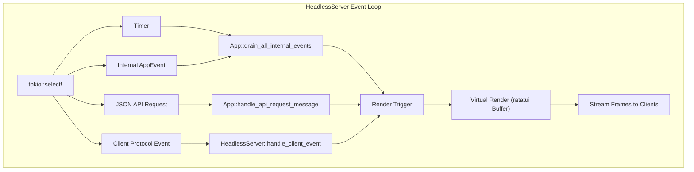
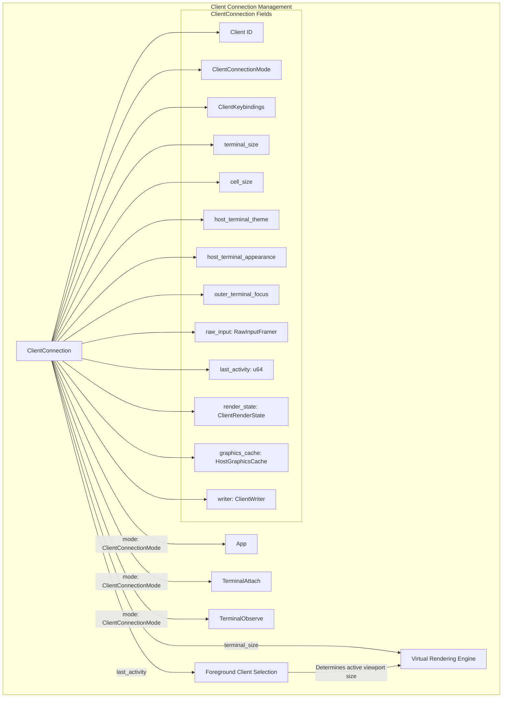
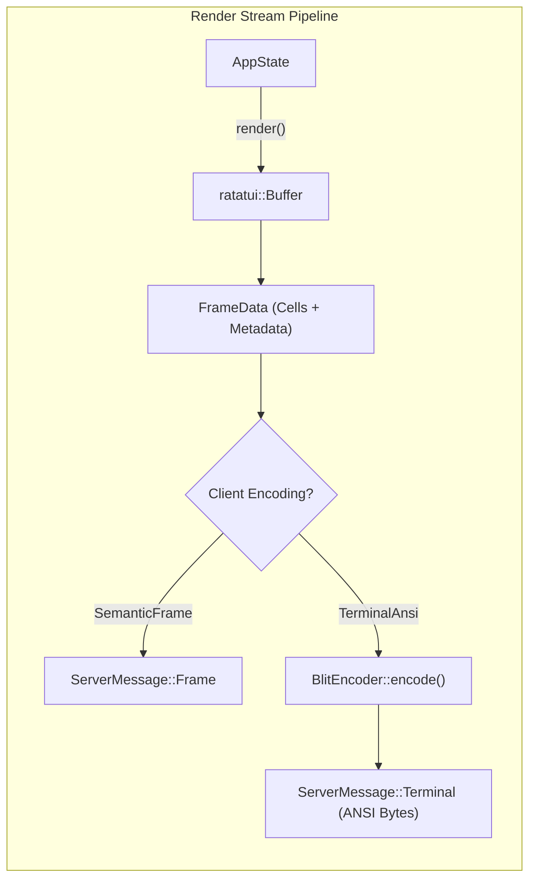
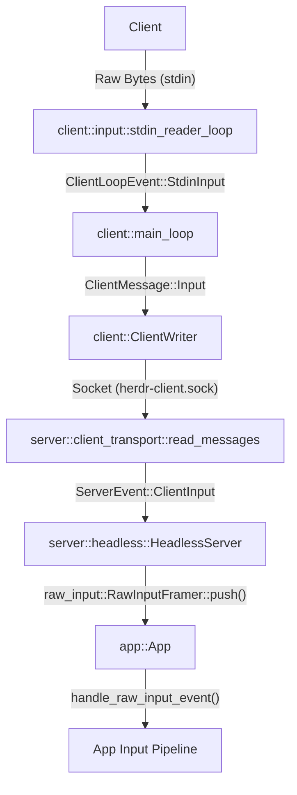

# Headless Server and Client Protocol

Relevant source files

The following files were used as context for generating this wiki page:

- [src/app/actions.rs](https://github.com/herdrdev/herdr/blob/HEAD/src/app/actions.rs)
- [src/app/api.rs](https://github.com/herdrdev/herdr/blob/HEAD/src/app/api.rs)
- [src/app/runtime.rs](https://github.com/herdrdev/herdr/blob/HEAD/src/app/runtime.rs)
- [src/app/theme_sync.rs](https://github.com/herdrdev/herdr/blob/HEAD/src/app/theme_sync.rs)
- [src/client/input.rs](https://github.com/herdrdev/herdr/blob/HEAD/src/client/input.rs)
- [src/client/mod.rs](https://github.com/herdrdev/herdr/blob/HEAD/src/client/mod.rs)
- [src/protocol/render_ansi.rs](https://github.com/herdrdev/herdr/blob/HEAD/src/protocol/render_ansi.rs)
- [src/raw_input.rs](https://github.com/herdrdev/herdr/blob/HEAD/src/raw_input.rs)
- [src/server/clients.rs](https://github.com/herdrdev/herdr/blob/HEAD/src/server/clients.rs)
- [src/server/headless.rs](https://github.com/herdrdev/herdr/blob/HEAD/src/server/headless.rs)
- [src/server/headless/tests/pane_graphics.rs](https://github.com/herdrdev/herdr/blob/HEAD/src/server/headless/tests/pane_graphics.rs)
- [src/server/mod.rs](https://github.com/herdrdev/herdr/blob/HEAD/src/server/mod.rs)
- [src/server/render_stream.rs](https://github.com/herdrdev/herdr/blob/HEAD/src/server/render_stream.rs)
- [src/terminal_theme.rs](https://github.com/herdrdev/herdr/blob/HEAD/src/terminal_theme.rs)

The `HeadlessServer` enables `herdr` to run as a persistent background process without a direct terminal attachment. It manages virtual rendering, client connection lifecycles, and a specialized binary protocol for streaming terminal frames to thin clients.

## Headless Server Architecture

The headless server runs a specialized version of the `App` event loop [src/server/headless.rs:1-15](https://github.com/herdrdev/herdr/blob/HEAD/src/server/headless.rs#L1-L15). Unlike the interactive TUI mode, the headless server does not enter raw mode or read from `stdin`. Instead, it listens on two distinct sockets:
1. `herdr.sock`: The JSON-RPC API for management and automation [src/server/headless.rs:5-6](https://github.com/herdrdev/herdr/blob/HEAD/src/server/headless.rs#L5-L6).
2. `herdr-client.sock`: A binary protocol socket for thin-client attachments [src/server/headless.rs:6-6](https://github.com/herdrdev/herdr/blob/HEAD/src/server/headless.rs#L6).

### Core Event Loop
The `HeadlessServer` loop processes `LoopEvent` variants, including timers, internal `AppEvent` updates, JSON API requests, and binary protocol `ServerEvent` inputs [src/server/headless.rs:125-132](https://github.com/herdrdev/herdr/blob/HEAD/src/server/headless.rs#L125-L132).

**Sources:** [src/server/headless.rs:125-132](https://github.com/herdrdev/herdr/blob/HEAD/src/server/headless.rs#L125-L132), [src/app/runtime.rs:50-56](https://github.com/herdrdev/herdr/blob/HEAD/src/app/runtime.rs#L50-L56)

## Client Connection Management

The server manages multiple concurrent clients using `ClientConnection` objects [src/server/clients.rs:54-57](https://github.com/herdrdev/herdr/blob/HEAD/src/server/clients.rs#L54-L57). Clients are categorized by their `ClientConnectionMode` [src/server/clients.rs:9-12](https://github.com/herdrdev/herdr/blob/HEAD/src/server/clients.rs#L9-L12):
- **App**: A full TUI client capable of navigating workspaces and tabs [src/server/clients.rs:10](https://github.com/herdrdev/herdr/blob/HEAD/src/server/clients.rs#L10).
- **TerminalAttach**: A direct attachment to a specific PTY, bypassing the standard TUI chrome [src/server/clients.rs:11](https://github.com/herdrdev/herdr/blob/HEAD/src/server/clients.rs#L11).
- **TerminalObserve**: A read-only attachment to a specific PTY [src/server/clients.rs:12](https://github.com/herdrdev/herdr/blob/HEAD/src/server/clients.rs#L12).

### The Foreground Client
While multiple clients can attach, the server tracks a "latest interaction" client to determine which client's terminal size should drive the virtual rendering engine [src/server/clients.rs:54-57](https://github.com/herdrdev/herdr/blob/HEAD/src/server/clients.rs#L54-L57). This is determined by the `last_activity` timestamp on each `ClientConnection` [src/server/clients.rs:60](https://github.com/herdrdev/herdr/blob/HEAD/src/server/clients.rs#L60). If the latest client disconnects, the server may fallback to a default or previously active client size to maintain the layout [src/server/headless.rs:13-15](https://github.com/herdrdev/herdr/blob/HEAD/src/server/headless.rs#L13-L15).

**Sources:** [src/server/headless.rs:1-15](https://github.com/herdrdev/herdr/blob/HEAD/src/server/headless.rs#L1-L15), [src/server/clients.rs:9-12](https://github.com/herdrdev/herdr/blob/HEAD/src/server/clients.rs#L9-L12), [src/server/clients.rs:54-76](https://github.com/herdrdev/herdr/blob/HEAD/src/server/clients.rs#L54-L76)

## Binary Protocol and Framing

Communication over `herdr-client.sock` uses a binary format (via `bincode`) framed with a 4-byte little-endian length prefix [src/protocol/wire.rs:1-31](https://github.com/herdrdev/herdr/blob/HEAD/src/protocol/wire.rs#L1-L31).

| Feature | Limit | File Reference |
| :--- | :--- | :--- |
| **Max Frame Size** | 2 MB | [src/protocol/wire.rs:20-20](https://github.com/herdrdev/herdr/blob/HEAD/src/protocol/wire.rs#L20) |
| **Max Graphics Frame** | 32 MB | [src/protocol/wire.rs:25-25](https://github.com/herdrdev/herdr/blob/HEAD/src/protocol/wire.rs#L25) |
| **Handshake Timeout** | 4 Seconds | [src/server/client_transport.rs:38-38](https://github.com/herdrdev/herdr/blob/HEAD/src/server/client_transport.rs#L38) |
| **Protocol Version** | 18 | [src/protocol/wire.rs:16-16](https://github.com/herdrdev/herdr/blob/HEAD/src/protocol/wire.rs#L16)

### Render Encodings
During the handshake, clients negotiate a `RenderEncoding` [src/protocol/wire.rs:38-44](https://github.com/herdrdev/herdr/blob/HEAD/src/protocol/wire.rs#L38-L44):
1. **`SemanticFrame`**: The server sends full `FrameData` structures containing raw cell symbols and attributes. The client is responsible for rendering these to its local terminal [src/protocol/wire.rs:40-41](https://github.com/herdrdev/herdr/blob/HEAD/src/protocol/wire.rs#L40-L41).
2. **`TerminalAnsi`**: The server computes a diff and sends raw ANSI escape sequences. The client simply blits these bytes to its `stdout` [src/protocol/wire.rs:42-43](https://github.com/herdrdev/herdr/blob/HEAD/src/protocol/wire.rs#L42-L43).

**Sources:** [src/protocol/wire.rs:1-44](https://github.com/herdrdev/herdr/blob/HEAD/src/protocol/wire.rs#L1-L44), [src/server/client_transport.rs:38-38](https://github.com/herdrdev/herdr/blob/HEAD/src/server/client_transport.rs#L38)

## Virtual Rendering Pipeline

The server renders to a virtual `ratatui` buffer in memory [src/server/headless.rs:9-9](https://github.com/herdrdev/herdr/blob/HEAD/src/server/headless.rs#L9). This buffer is then converted into the negotiated protocol format.

### BlitEncoder and Diffing
For `TerminalAnsi` clients, the `BlitEncoder` maintains a baseline of the last sent frame [src/server/render_stream.rs:17-21](https://github.com/herdrdev/herdr/blob/HEAD/src/server/render_stream.rs#L17-L21). When a new frame is generated, `BlitEncoder::encode` performs a cell-by-cell comparison to generate a minimal patch of ANSI sequences [src/server/render_stream.rs:86-88](https://github.com/herdrdev/herdr/blob/HEAD/src/server/render_stream.rs#L86-L88).

**Sources:** [src/server/render_stream.rs:13-34](https://github.com/herdrdev/herdr/blob/HEAD/src/server/render_stream.rs#L13-L34), [src/server/render_stream.rs:86-109](https://github.com/herdrdev/herdr/blob/HEAD/src/server/render_stream.rs#L86-L109), [src/server/render_stream.rs:158-168](https://github.com/herdrdev/herdr/blob/HEAD/src/server/render_stream.rs#L158-L168)

### Graphics Handling
Kitty graphics commands are handled specially. The server caches graphics placements and includes them in the `FrameData` [src/server/render_stream.rs:94-98](https://github.com/herdrdev/herdr/blob/HEAD/src/server/render_stream.rs#L94-L98). For ANSI clients, graphics sequences are spliced into the byte stream before the final synchronization sequence [src/server/render_stream.rs:158-168](https://github.com/herdrdev/herdr/blob/HEAD/src/server/render_stream.rs#L158-L168).

**Sources:** [src/server/render_stream.rs:13-34](https://github.com/herdrdev/herdr/blob/HEAD/src/server/render_stream.rs#L13-L34), [src/server/render_stream.rs:86-109](https://github.com/herdrdev/herdr/blob/HEAD/src/server/render_stream.rs#L86-L109), [src/server/render_stream.rs:158-168](https://github.com/herdrdev/herdr/blob/HEAD/src/server/render_stream.rs#L158-L168)

## Implementation Details

### Handshake Sequence
1. **Client Connects**: Opens `herdr-client.sock`.
2. **`ClientMessage::Hello`**: Client sends version, terminal size, and requested encoding [src/client/mod.rs:4-5](https://github.com/herdrdev/herdr/blob/HEAD/src/client/mod.rs#L4-L5).
3. **`ServerMessage::Welcome`**: Server validates version and accepts/rejects [src/server/client_transport.rs:2-5](https://github.com/herdrdev/herdr/blob/HEAD/src/server/client_transport.rs#L2-L5).
4. **Stream**: Server begins sending `Frame` or `Terminal` messages.

### Input Routing
Client input (keystrokes, mouse, paste) is encapsulated in `ClientMessage::Input` [src/client/mod.rs:7-7](https://github.com/herdrdev/herdr/blob/HEAD/src/client/mod.rs#L7). The server receives these, translates them back into `crossterm` events, and injects them into the `App` input pipeline as if they were local [src/server/headless.rs:12-12](https://github.com/herdrdev/herdr/blob/HEAD/src/server/headless.rs#L12). The `RawInputFramer` [src/raw_input.rs:151-152](https://github.com/herdrdev/herdr/blob/HEAD/src/raw_input.rs#L151-L152) is used by both the client [src/client/input.rs:86](https://github.com/herdrdev/herdr/blob/HEAD/src/client/input.rs#L86) and server [src/server/clients.rs:59](https://github.com/herdrdev/herdr/blob/HEAD/src/server/clients.rs#L59) to parse raw input bytes into `RawInputEvent`s [src/raw_input.rs:127-149](https://github.com/herdrdev/herdr/blob/HEAD/src/raw_input.rs#L127-L149). This ensures consistent input parsing logic.

**Sources:** [src/client/mod.rs:1-13](https://github.com/herdrdev/herdr/blob/HEAD/src/client/mod.rs#L1-L13), [src/server/client_transport.rs:45-52](https://github.com/herdrdev/herdr/blob/HEAD/src/server/client_transport.rs#L45-L52), [src/protocol/wire.rs:113-133](https://github.com/herdrdev/herdr/blob/HEAD/src/protocol/wire.rs#L113-L133), [src/client/input.rs:38-47](https://github.com/herdrdev/herdr/blob/HEAD/src/client/input.rs#L38-L47), [src/raw_input.rs:151-152](https://github.com/herdrdev/herdr/blob/HEAD/src/raw_input.rs#L151-L152), [src/client/input.rs:86](https://github.com/herdrdev/herdr/blob/HEAD/src/client/input.rs#L86), [src/server/clients.rs:59](https://github.com/herdrdev/herdr/blob/HEAD/src/server/clients.rs#L59), [src/raw_input.rs:127-149](https://github.com/herdrdev/herdr/blob/HEAD/src/raw_input.rs#L127-L149), [src/app/runtime.rs:102-120](https://github.com/herdrdev/herdr/blob/HEAD/src/app/runtime.rs#L102-L120)

### Transport Reliability
Reliable control messages (notifications, clipboard) use a `ClientControlWriter` queue, while render frames use a `ClientRenderWriter` with a capacity of one to prevent lag on slow connections [src/server/client_transport.rs:45-52](https://github.com/herdrdev/herdr/blob/HEAD/src/server/client_transport.rs#L45-L52).

**Sources:** [src/client/mod.rs:1-13](https://github.com/herdrdev/herdr/blob/HEAD/src/client/mod.rs#L1-L13), [src/server/client_transport.rs:45-52](https://github.com/herdrdev/herdr/blob/HEAD/src/server/client_transport.rs#L45-L52), [src/protocol/wire.rs:113-133](https://github.com/herdrdev/herdr/blob/HEAD/src/protocol/wire.rs#L113-L133)