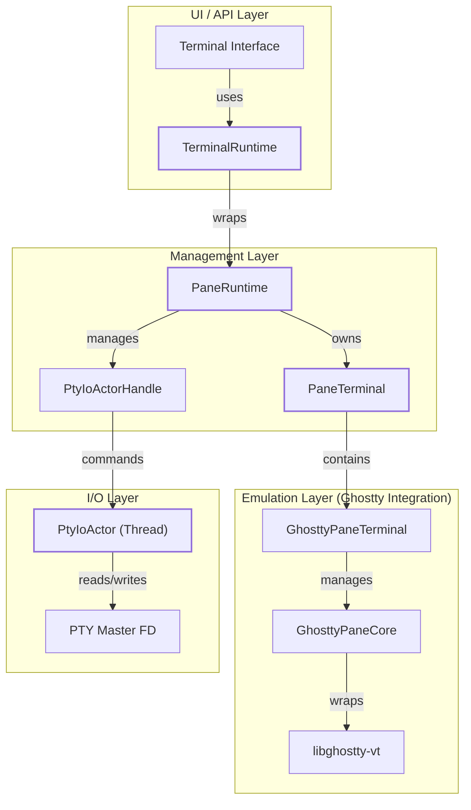
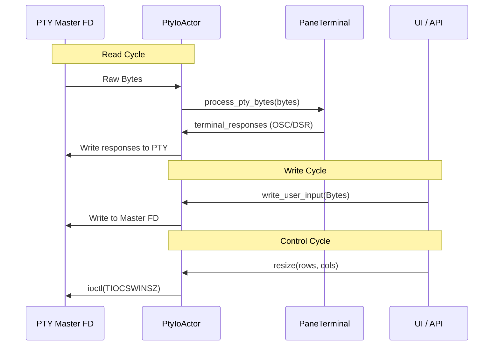

# PTY and Terminal Runtime

Relevant source files

The following files were used as context for generating this wiki page:

- [src/ghostty/mod.rs](https://github.com/herdrdev/herdr/blob/HEAD/src/ghostty/mod.rs)
- [src/kitty_graphics.rs](https://github.com/herdrdev/herdr/blob/HEAD/src/kitty_graphics.rs)
- [src/pane.rs](https://github.com/herdrdev/herdr/blob/HEAD/src/pane.rs)
- [src/pane/input.rs](https://github.com/herdrdev/herdr/blob/HEAD/src/pane/input.rs)
- [src/pane/osc.rs](https://github.com/herdrdev/herdr/blob/HEAD/src/pane/osc.rs)
- [src/pane/state.rs](https://github.com/herdrdev/herdr/blob/HEAD/src/pane/state.rs)
- [src/pane/terminal.rs](https://github.com/herdrdev/herdr/blob/HEAD/src/pane/terminal.rs)
- [src/persist/restore.rs](https://github.com/herdrdev/herdr/blob/HEAD/src/persist/restore.rs)
- [src/pty/actor.rs](https://github.com/herdrdev/herdr/blob/HEAD/src/pty/actor.rs)
- [src/pty/actor/unix.rs](https://github.com/herdrdev/herdr/blob/HEAD/src/pty/actor/unix.rs)
- [src/pty/backend.rs](https://github.com/herdrdev/herdr/blob/HEAD/src/pty/backend.rs)
- [src/pty/fd.rs](https://github.com/herdrdev/herdr/blob/HEAD/src/pty/fd.rs)
- [src/pty/mod.rs](https://github.com/herdrdev/herdr/blob/HEAD/src/pty/mod.rs)
- [src/server/client_transport.rs](https://github.com/herdrdev/herdr/blob/HEAD/src/server/client_transport.rs)
- [src/terminal/runtime.rs](https://github.com/herdrdev/herdr/blob/HEAD/src/terminal/runtime.rs)

The PTY and Terminal Runtime subsystem manages the lifecycle of pseudo-terminal (PTY) devices, the execution of child processes (shells and agents), and the bridge between raw I/O and the terminal emulation layer. It ensures that asynchronous data from the PTY is correctly routed to the virtual terminal core while providing a clean interface for the UI and API layers to interact with running sessions.

## Runtime Architecture

Herdr utilizes a multi-layered approach to manage terminal sessions. The `TerminalRuntime` serves as the primary public interface, while the internal logic is managed by `PaneRuntime` and the low-level I/O is handled by a dedicated `PtyIoActor`.

### Entity Relationship Mapping

The following diagram maps high-level system concepts to their specific code implementations and ownership structure.

**Sources:** [src/terminal/runtime.rs:17-18](https://github.com/herdrdev/herdr/blob/HEAD/src/terminal/runtime.rs#L17-L18), [src/pane/terminal.rs:161-191](https://github.com/herdrdev/herdr/blob/HEAD/src/pane/terminal.rs#L161-L191), [src/pty/actor/unix.rs:89-95](https://github.com/herdrdev/herdr/blob/HEAD/src/pty/actor/unix.rs#L89-L95)

## TerminalRuntime and PaneRuntime

`TerminalRuntime` is a thin wrapper around `PaneRuntime` [src/terminal/runtime.rs:17-18](https://github.com/herdrdev/herdr/blob/HEAD/src/terminal/runtime.rs#L17-L18). It provides the methods necessary for the `App` state to spawn new processes, resize terminals, and handle session handoffs.

### Key Lifecycle Functions
*   **Spawn:** The `spawn` family of functions (`spawn_shell_command`, `spawn_argv_command`) initializes the PTY, sets up environment variables, and starts the `PtyIoActor` [src/terminal/runtime.rs:85-220](https://github.com/herdrdev/herdr/blob/HEAD/src/terminal/runtime.rs#L85-L220).
*   **Environment Setup:** `apply_pane_terminal_env` ensures that `TERM` is set to `xterm-256color` and `COLORTERM` to `truecolor` to ensure consistent rendering across different host terminals [src/pane.rs:57-64](https://github.com/herdrdev/herdr/blob/HEAD/src/pane.rs#L57-L64).
*   **Identity Injection:** `apply_pane_launch_env` injects `HERDR_WORKSPACE_ID`, `HERDR_TAB_ID`, and `HERDR_PANE_ID` into the child process environment, allowing tools and agents to be "herdr-aware" [src/pane.rs:112-134](https://github.com/herdrdev/herdr/blob/HEAD/src/pane.rs#L112-L134).

**Sources:** [src/terminal/runtime.rs:85-220](https://github.com/herdrdev/herdr/blob/HEAD/src/terminal/runtime.rs#L85-L220), [src/pane.rs:57-64](https://github.com/herdrdev/herdr/blob/HEAD/src/pane.rs#L57-L64), [src/pane.rs:112-134](https://github.com/herdrdev/herdr/blob/HEAD/src/pane.rs#L112-L134)

## PTY I/O Actor

The `PtyIoActor` is a dedicated background task (or thread) that handles the blocking nature of PTY I/O. This prevents terminal I/O from stalling the main application event loop.

### I/O Data Flow

**Sources:** [src/pty/actor/unix.rs:101-184](https://github.com/herdrdev/herdr/blob/HEAD/src/pty/actor/unix.rs#L101-L184), [src/pane/terminal.rs:204-213](https://github.com/herdrdev/herdr/blob/HEAD/src/pane/terminal.rs#L204-L213)

### Implementation Details
*   **Unix Implementation:** Uses `poll` to monitor the PTY file descriptor and a `WakePipe` for command notifications [src/pty/fd.rs:137-217](https://github.com/herdrdev/herdr/blob/HEAD/src/pty/fd.rs#L137-L217).
*   **Windows Implementation:** Uses `portable_pty` and separate threads for reading and writing to handle ConPTY specifics [src/pty/actor.rs:139-177](https://github.com/herdrdev/herdr/blob/HEAD/src/pty/actor.rs#L139-L177).
*   **Quiescence:** The actor supports a "quiesced" state used during session handoffs, where it stops reading from the PTY to ensure no data is lost while transferring the file descriptor [src/pty/actor/unix.rs:208-240](https://github.com/herdrdev/herdr/blob/HEAD/src/pty/actor/unix.rs#L208-L240).

**Sources:** [src/pty/fd.rs:137-217](https://github.com/herdrdev/herdr/blob/HEAD/src/pty/fd.rs#L137-L217), [src/pty/actor.rs:139-177](https://github.com/herdrdev/herdr/blob/HEAD/src/pty/actor.rs#L139-L177), [src/pty/actor/unix.rs:208-240](https://github.com/herdrdev/herdr/blob/HEAD/src/pty/actor/unix.rs#L208-L240)

## PaneTerminal Interface

The `PaneTerminal` struct acts as the bridge to the Ghostty VT engine. It processes incoming PTY bytes, handles terminal state (like cursor position and mouse modes), and provides methods for the UI to render the terminal grid.

### Key Components

| Component | Responsibility |
| :--- | :--- |
| `GhosttyPaneTerminal` | Manages the FFI lifecycle of the Ghostty C core [src/pane/terminal.rs:161-165](https://github.com/herdrdev/herdr/blob/HEAD/src/pane/terminal.rs#L161-L165). |
| `GhosttyPaneCore` | Holds the mutable state including `render_state`, `kitty_keyboard` trackers, and OSC trackers [src/pane/terminal.rs:167-187](https://github.com/herdrdev/herdr/blob/HEAD/src/pane/terminal.rs#L167-L187). |
| `process_pty_bytes` | The primary entry point for PTY data. It feeds bytes into Ghostty and handles side effects like CWD updates or clipboard writes [src/pane/terminal.rs:204-213](https://github.com/herdrdev/herdr/blob/HEAD/src/pane/terminal.rs#L204-L213). |
| `InputState` | Tracks active terminal modes such as `alternate_screen`, `bracketed_paste`, and `mouse_protocol_mode` [src/pane/terminal.rs:117-127](https://github.com/herdrdev/herdr/blob/HEAD/src/pane/terminal.rs#L117-L127). |

**Sources:** [src/pane/terminal.rs:117-213](https://github.com/herdrdev/herdr/blob/HEAD/src/pane/terminal.rs#L117-L213)

### OSC and Metadata Tracking
The runtime actively parses Operating System Command (OSC) sequences to update pane metadata:
*   **OSC 7 / 9;9:** Tracked via `parse_reported_cwd` to keep the pane's Current Working Directory accurate [src/pane/terminal.rs:32-34](https://github.com/herdrdev/herdr/blob/HEAD/src/pane/terminal.rs#L32-L34).
*   **OSC 10/11/12:** Tracked by `DefaultColorOscTracker` to synchronize terminal background/foreground colors with the child process [src/pane/osc.rs:42-64](https://github.com/herdrdev/herdr/blob/HEAD/src/pane/osc.rs#L42-L64).
*   **Agent Reporting:** Custom OSC sequences or `pane.report_agent` API calls are tracked to update `AgentState` (Idle, Working, Blocked) [src/pane.rs:170-201](https://github.com/herdrdev/herdr/blob/HEAD/src/pane.rs#L170-L201).

**Sources:** [src/pane/terminal.rs:32-34](https://github.com/herdrdev/herdr/blob/HEAD/src/pane/terminal.rs#L32-L34), [src/pane/osc.rs:42-64](https://github.com/herdrdev/herdr/blob/HEAD/src/pane/osc.rs#L42-L64), [src/pane.rs:170-201](https://github.com/herdrdev/herdr/blob/HEAD/src/pane.rs#L170-L201)

## Kitty Graphics Support

The runtime integrates with `src/kitty_graphics.rs` to handle image rendering. When the child process sends Kitty graphics protocol commands, the `GhosttyPaneTerminal` identifies these placements [src/ghostty/mod.rs:201-214](https://github.com/herdrdev/herdr/blob/HEAD/src/ghostty/mod.rs#L201-L214).

The `HostGraphicsCache` manages the translation of these internal PTY placements to the host terminal's coordinate system, performing necessary clipping against the pane's visible boundaries [src/kitty_graphics.rs:133-139](https://github.com/herdrdev/herdr/blob/HEAD/src/kitty_graphics.rs#L133-L139).

**Sources:** [src/ghostty/mod.rs:201-214](https://github.com/herdrdev/herdr/blob/HEAD/src/ghostty/mod.rs#L201-L214), [src/kitty_graphics.rs:133-139](https://github.com/herdrdev/herdr/blob/HEAD/src/kitty_graphics.rs#L133-L139)