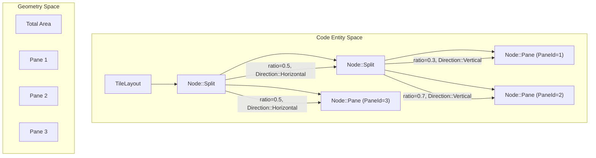
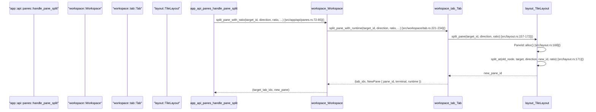

# Layout Engine

Relevant source files

The following files were used as context for generating this wiki page:

- [src/app/api/layouts.rs](https://github.com/herdrdev/herdr/blob/HEAD/src/app/api/layouts.rs)
- [src/app/api/panes.rs](https://github.com/herdrdev/herdr/blob/HEAD/src/app/api/panes.rs)
- [src/app/api/tabs.rs](https://github.com/herdrdev/herdr/blob/HEAD/src/app/api/tabs.rs)
- [src/app/api/workspaces.rs](https://github.com/herdrdev/herdr/blob/HEAD/src/app/api/workspaces.rs)
- [src/app/creation.rs](https://github.com/herdrdev/herdr/blob/HEAD/src/app/creation.rs)
- [src/layout.rs](https://github.com/herdrdev/herdr/blob/HEAD/src/layout.rs)
- [src/persist.rs](https://github.com/herdrdev/herdr/blob/HEAD/src/persist.rs)
- [src/workspace.rs](https://github.com/herdrdev/herdr/blob/HEAD/src/workspace.rs)
- [src/workspace/tab.rs](https://github.com/herdrdev/herdr/blob/HEAD/src/workspace/tab.rs)

The Layout Engine manages the spatial organization of panes within a tab using a **Binary Space Partitioning (BSP)** tree. It provides the mathematical and structural foundation for tiling, resizing, and navigating between terminal panes.

## Core Data Structures

The layout is represented as a recursive tree where internal nodes define split boundaries and leaf nodes contain specific panes.

### Node and TileLayout
The `Node` enum is the fundamental building block of the tree [src/layout.rs:73-81](https://github.com/herdrdev/herdr/blob/HEAD/src/layout.rs#L73-L81). It can either be a `Pane` (leaf) containing a `PaneId` or a `Split` (internal node) containing a direction, a ratio, and two child nodes.

The `TileLayout` struct [src/layout.rs:84-87](https://github.com/herdrdev/herdr/blob/HEAD/src/layout.rs#L84-L87) tracks the root of this tree and the currently focused `PaneId`.

| Struct/Enum | Role |
| :--- | :--- |
| `PaneId` | A globally unique atomic `u32` identifier for a pane [src/layout.rs:10-14](https://github.com/herdrdev/herdr/blob/HEAD/src/layout.rs#L10-L14). |
| `Node` | A recursive enum representing either a `Pane(PaneId)` or a `Split` with `Direction` and `ratio` [src/layout.rs:73-81](https://github.com/herdrdev/herdr/blob/HEAD/src/layout.rs#L73-L81). |
| `TileLayout` | The container for the BSP tree and focus state [src/layout.rs:84-87](https://github.com/herdrdev/herdr/blob/HEAD/src/layout.rs#L84-L87). |
| `PaneInfo` | A calculated snapshot of a pane's geometry (Rects) and focus status for the renderer [src/layout.rs:34-46](https://github.com/herdrdev/herdr/blob/HEAD/src/layout.rs#L34-L46). |

### Layout Tree Representation

**Sources:** [src/layout.rs:73-87](https://github.com/herdrdev/herdr/blob/HEAD/src/layout.rs#L73-L87), [src/layout.rs:98-107](https://github.com/herdrdev/herdr/blob/HEAD/src/layout.rs#L98-L107)

---

## Geometry Computation

The rendering pipeline converts the abstract BSP tree into concrete pixel/cell coordinates using `TileLayout::panes(area: Rect)` [src/layout.rs:126-130](https://github.com/herdrdev/herdr/blob/HEAD/src/layout.rs#L126-L130).

### Rect Calculation
The function `collect_panes` recursively traverses the tree [src/layout.rs:388-425](https://github.com/herdrdev/herdr/blob/HEAD/src/layout.rs#L388-L425):
1.  **Leaf Node**: Assigns the current `Rect` to the `PaneId`.
2.  **Split Node**:
    *   Calculates the split point based on the `ratio` and the available `area` (width for Horizontal, height for Vertical) [src/layout.rs:400-410](https://github.com/herdrdev/herdr/blob/HEAD/src/layout.rs#L400-L410).
    *   Divides the `Rect` into two smaller `Rect`s.
    *   Recursively calls itself for the `first` and `second` child nodes.

### Border and Inner Rects
For each pane, the engine computes:
*   **Outer Rect**: The total allocated area.
*   **Inner Rect**: The content area, excluding borders [src/layout.rs:39-40](https://github.com/herdrdev/herdr/blob/HEAD/src/layout.rs#L39-L40).
*   **Scrollbar Rect**: The area reserved for the scrollbar gutter [src/layout.rs:42](https://github.com/herdrdev/herdr/blob/HEAD/src/layout.rs#L42).

**Sources:** [src/layout.rs:34-46](https://github.com/herdrdev/herdr/blob/HEAD/src/layout.rs#L34-L46), [src/layout.rs:388-425](https://github.com/herdrdev/herdr/blob/HEAD/src/layout.rs#L388-L425)

---

## Layout Operations

The engine supports dynamic modification of the tree through several key operations.

### Splitting
When a pane is split via `split_focused`, the engine replaces the leaf node of the focused pane with a new `Split` node [src/layout.rs:148-155](https://github.com/herdrdev/herdr/blob/HEAD/src/layout.rs#L148-L155). The original pane becomes the `first` child, and a newly allocated `PaneId` becomes the `second` child. The `split_pane` function is used internally by `split_focused` [src/layout.rs:157-172](https://github.com/herdrdev/herdr/blob/HEAD/src/layout.rs#L157-L172).

### Resizing
Resizing is performed by adjusting the `ratio` of a `Split` node.
*   **Manual Resize**: `resize_focused` finds the nearest split boundary in a `NavDirection` and applies a `delta` to the ratio [src/layout.rs:215-263](https://github.com/herdrdev/herdr/blob/HEAD/src/layout.rs#L215-L263).
*   **Mouse Resize**: `splits(area)` returns `SplitBorder` objects [src/layout.rs:133-137](https://github.com/herdrdev/herdr/blob/HEAD/src/layout.rs#L133-L137). When a user drags a border, the engine identifies the split's `path` in the tree and updates its ratio via `set_ratio_at` [src/layout.rs:209-211](https://github.com/herdrdev/herdr/blob/HEAD/src/layout.rs#L209-L211).

### Swapping and Moving
*   **Swap**: `swap_panes` traverses the tree to find two `PaneId`s and exchanges their positions while keeping the split structure intact [src/layout.rs:196-206](https://github.com/herdrdev/herdr/blob/HEAD/src/layout.rs#L196-L206).
*   **Insert**: `insert_pane_near` allows moving a pane from one location (or even another tab) to a specific position relative to a target pane [src/layout.rs:178-201](https://github.com/herdrdev/herdr/blob/HEAD/src/layout.rs#L178-L201).

**Sources:** [src/layout.rs:148-155](https://github.com/herdrdev/herdr/blob/HEAD/src/layout.rs#L148-L155), [src/layout.rs:157-172](https://github.com/herdrdev/herdr/blob/HEAD/src/layout.rs#L157-L172), [src/layout.rs:178-201](https://github.com/herdrdev/herdr/blob/HEAD/src/layout.rs#L178-L201), [src/layout.rs:196-211](https://github.com/herdrdev/herdr/blob/HEAD/src/layout.rs#L196-L211), [src/layout.rs:215-263](https://github.com/herdrdev/herdr/blob/HEAD/src/layout.rs#L215-L263), [src/app/api/panes.rs:31-95](https://github.com/herdrdev/herdr/blob/HEAD/src/app/api/panes.rs#L31-L95)

---

## Zoom Mode

Zoom mode allows a single pane to temporarily occupy the entire tab area without destroying the underlying BSP tree.

*   **Activation**: When `Tab.zoomed` is true [src/workspace/tab.rs:48](https://github.com/herdrdev/herdr/blob/HEAD/src/workspace/tab.rs#L48), the layout engine ignores the BSP tree during rendering and returns a single `PaneInfo` covering the full area for the focused pane.
*   **State Persistence**: The BSP tree structure is preserved while zoomed, allowing the layout to be restored exactly as it was when zooming is toggled off.

**Sources:** [src/workspace/tab.rs:48](https://github.com/herdrdev/herdr/blob/HEAD/src/workspace/tab.rs#L48), [src/app/api/panes.rs:13-16](https://github.com/herdrdev/herdr/blob/HEAD/src/app/api/panes.rs#L13-L16)

---

## Implementation Data Flow

The following diagram illustrates how a split request flows from the API through the Workspace and Tab layers into the Layout Engine.

**Sources:** [src/app/api/panes.rs:31-95](https://github.com/herdrdev/herdr/blob/HEAD/src/app/api/panes.rs#L31-L95), [src/workspace/tab.rs:221-234](https://github.com/herdrdev/herdr/blob/HEAD/src/workspace/tab.rs#L221-L234), [src/layout.rs:157-172](https://github.com/herdrdev/herdr/blob/HEAD/src/layout.rs#L157-L172), [src/layout.rs:168](https://github.com/herdrdev/herdr/blob/HEAD/src/layout.rs#L168), [src/layout.rs:171](https://github.com/herdrdev/herdr/blob/HEAD/src/layout.rs#L171)

## Layout Serialization and Templates

Layouts can be exported and applied as templates using the `LayoutDescription` schema [src/app/api/layouts.rs:27-29](https://github.com/herdrdev/herdr/blob/HEAD/src/app/api/layouts.rs#L27-L29).

*   **Export**: `handle_layout_export` converts the current `TileLayout` tree into a `LayoutDescription` containing `LayoutNode`s (splits) and `LayoutPane`s (leaves) [src/app/api/layouts.rs:19-32](https://github.com/herdrdev/herdr/blob/HEAD/src/app/api/layouts.rs#L19-L32).
*   **Apply**: `handle_layout_apply` validates a tree [src/app/api/layouts.rs:68-70](https://github.com/herdrdev/herdr/blob/HEAD/src/app/api/layouts.rs#L68-L70), creates a new tab, and recursively reconstructs the BSP tree by performing splits and setting ratios to match the provided template [src/app/api/layouts.rs:145-149](https://github.com/herdrdev/herdr/blob/HEAD/src/app/api/layouts.rs#L145-L149).

**Sources:** [src/app/api/layouts.rs:19-32](https://github.com/herdrdev/herdr/blob/HEAD/src/app/api/layouts.rs#L19-L32), [src/app/api/layouts.rs:68-70](https://github.com/herdrdev/herdr/blob/HEAD/src/app/api/layouts.rs#L68-L70), [src/app/api/layouts.rs:145-149](https://github.com/herdrdev/herdr/blob/HEAD/src/app/api/layouts.rs#L145-L149), [src/api/schema.rs:1-16](https://github.com/herdrdev/herdr/blob/HEAD/src/api/schema.rs#L1-L16)