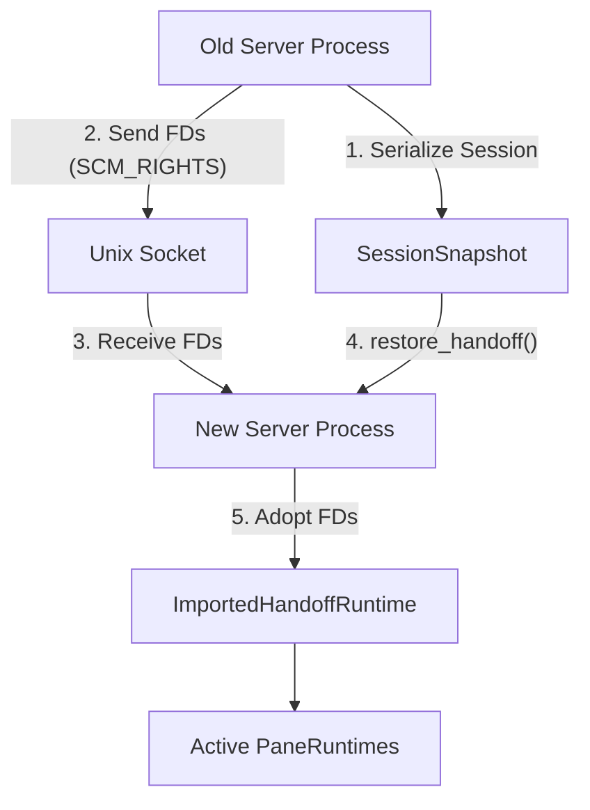
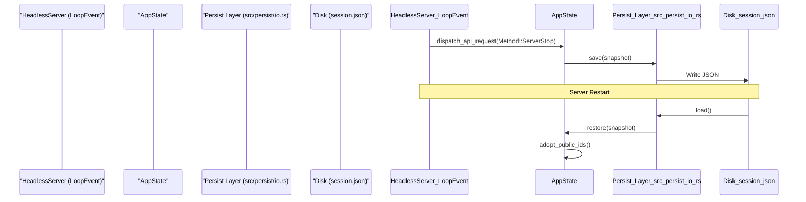

# Session Persistence and Handoff

Relevant source files

The following files were used as context for generating this wiki page:

- [docs/next/website/src/content/docs/persistence-remote.mdx](https://github.com/herdrdev/herdr/blob/HEAD/docs/next/website/src/content/docs/persistence-remote.mdx)
- [src/app/api/agents.rs](https://github.com/herdrdev/herdr/blob/HEAD/src/app/api/agents.rs)
- [src/app/api_helpers.rs](https://github.com/herdrdev/herdr/blob/HEAD/src/app/api_helpers.rs)
- [src/cli/agent.rs](https://github.com/herdrdev/herdr/blob/HEAD/src/cli/agent.rs)
- [src/cli/protocol_guard.rs](https://github.com/herdrdev/herdr/blob/HEAD/src/cli/protocol_guard.rs)
- [src/cli/server.rs](https://github.com/herdrdev/herdr/blob/HEAD/src/cli/server.rs)
- [src/cli/server_not_running.rs](https://github.com/herdrdev/herdr/blob/HEAD/src/cli/server_not_running.rs)
- [src/cli/status.rs](https://github.com/herdrdev/herdr/blob/HEAD/src/cli/status.rs)
- [src/ghostty/mod.rs](https://github.com/herdrdev/herdr/blob/HEAD/src/ghostty/mod.rs)
- [src/kitty_graphics.rs](https://github.com/herdrdev/herdr/blob/HEAD/src/kitty_graphics.rs)
- [src/pane.rs](https://github.com/herdrdev/herdr/blob/HEAD/src/pane.rs)
- [src/pane/osc.rs](https://github.com/herdrdev/herdr/blob/HEAD/src/pane/osc.rs)
- [src/pane/terminal.rs](https://github.com/herdrdev/herdr/blob/HEAD/src/pane/terminal.rs)
- [src/pane/terminal/windows_recent_fallback.rs](https://github.com/herdrdev/herdr/blob/HEAD/src/pane/terminal/windows_recent_fallback.rs)
- [src/persist/restore.rs](https://github.com/herdrdev/herdr/blob/HEAD/src/persist/restore.rs)
- [src/persist/snapshot.rs](https://github.com/herdrdev/herdr/blob/HEAD/src/persist/snapshot.rs)
- [src/remote.rs](https://github.com/herdrdev/herdr/blob/HEAD/src/remote.rs)
- [src/server/autodetect.rs](https://github.com/herdrdev/herdr/blob/HEAD/src/server/autodetect.rs)
- [src/server/client_transport.rs](https://github.com/herdrdev/herdr/blob/HEAD/src/server/client_transport.rs)
- [src/server/handoff.rs](https://github.com/herdrdev/herdr/blob/HEAD/src/server/handoff.rs)
- [src/session.rs](https://github.com/herdrdev/herdr/blob/HEAD/src/session.rs)
- [src/terminal/runtime.rs](https://github.com/herdrdev/herdr/blob/HEAD/src/terminal/runtime.rs)
- [tests/cli/agents.rs](https://github.com/herdrdev/herdr/blob/HEAD/tests/cli/agents.rs)
- [tests/fixtures/session/current-herdr-dev-session.json](https://github.com/herdrdev/herdr/blob/HEAD/tests/fixtures/session/current-herdr-dev-session.json)
- [tests/fixtures/session/current-herdr-session.json](https://github.com/herdrdev/herdr/blob/HEAD/tests/fixtures/session/current-herdr-session.json)
- [tests/fixtures/session/legacy-pre-tabs-v2.json](https://github.com/herdrdev/herdr/blob/HEAD/tests/fixtures/session/legacy-pre-tabs-v2.json)
- [tests/live_handoff.rs](https://github.com/herdrdev/herdr/blob/HEAD/tests/live_handoff.rs)

Herdr provides three distinct mechanisms for maintaining session continuity: **Live Persistence** (PTYs survive client detachment), **Snapshot Restore** (reconstructing session state from disk after a server restart), and **Live Handoff** (zero-downtime PTY file descriptor transfer between server processes).

## Session Snapshots

Herdr periodically captures the state of all workspaces, tabs, and panes to enable recovery after a reboot or crash. This state is distributed across three primary files:
- `session.json`: Stores the structural hierarchy (Workspaces -> Tabs -> Layout Trees) and metadata (CWD, environment variables).
- `session-history.json`: Stores the terminal screen history for each pane to allow visual rehydration.
- `plugins.json`: Tracks installed plugins and their configurations.

### Data Capture and Storage
The `capture` function in `src/persist/snapshot.rs` traverses the `AppState` to create a `SessionSnapshot` [src/persist/snapshot.rs:16-19](https://github.com/herdrdev/herdr/blob/HEAD/src/persist/snapshot.rs#L16-L19). This snapshot includes:
1. **Layouts**: The BSP tree structure is serialized into `LayoutSnapshot` nodes [src/persist/snapshot.rs:17-18](https://github.com/herdrdev/herdr/blob/HEAD/src/persist/snapshot.rs#L17-L18).
2. **Metadata**: CWD, process information, and agent session IDs.
3. **Public IDs**: Stable identifiers for workspaces and panes to ensure consistency across restores [src/workspace.rs:171-199](https://github.com/herdrdev/herdr/blob/HEAD/src/workspace.rs#L171-L199).

### Restoration and Rehydration
When the server starts, it attempts to `load` the snapshot and call `restore` [src/persist/restore.rs:65-77](https://github.com/herdrdev/herdr/blob/HEAD/src/persist/restore.rs#L65-L77).

**Restoration Logic Flow:**
1. **ID Remapping**: Because raw `PaneId`s are internal memory addresses, the restorer maps old snapshot IDs to new runtime IDs [src/persist/restore.rs:121-138](https://github.com/herdrdev/herdr/blob/HEAD/src/persist/restore.rs#L121-L138).
2. **Public ID Reservation**: The system ensures that the `NEXT_WORKSPACE_ID` counter is advanced past the highest ID found in the snapshot to prevent collisions [src/persist/restore.rs:158-175](https://github.com/herdrdev/herdr/blob/HEAD/src/persist/restore.rs#L158-L175).
3. **PTY Respawning**: For each pane in the snapshot, a new shell is spawned in the recorded `cwd` [src/persist/restore.rs:64-65](https://github.com/herdrdev/herdr/blob/HEAD/src/persist/restore.rs#L64-L65).
4. **History Replay**: If `session-history.json` is present, the ANSI escape sequences are fed into the new PTY's virtual terminal to restore the visual state [src/persist/restore.rs:32-35](https://github.com/herdrdev/herdr/blob/HEAD/src/persist/restore.rs#L32-L35).

**Sources:** [src/persist/snapshot.rs:1-23](https://github.com/herdrdev/herdr/blob/HEAD/src/persist/snapshot.rs#L1-L23), [src/persist/restore.rs:65-118](https://github.com/herdrdev/herdr/blob/HEAD/src/persist/restore.rs#L65-L118), [src/workspace.rs:146-199](https://github.com/herdrdev/herdr/blob/HEAD/src/workspace.rs#L146-L199), [src/persist.rs:1-20](https://github.com/herdrdev/herdr/blob/HEAD/src/persist.rs#L1-L20).

---

## Live Handoff

Live Handoff allows a running Herdr server to transfer its entire state—including active PTY file descriptors—to a new Herdr server process. This is primarily used for self-updating without killing active terminal sessions.

### The Handoff Protocol (Unix)
The handoff relies on `SCM_RIGHTS` to pass file descriptors over a Unix domain socket.

| Phase | Action | Code Entity |
| :--- | :--- | :--- |
| **Initiation** | Client sends `ServerLiveHandoff` API request. | `Method::ServerLiveHandoff` |
| **Preparation** | Old server stops accepting new clients and serializes state. | `HeadlessServer::handle_api_request` |
| **FD Passing** | Old server sends PTY master FDs to the new process via Unix socket. | `src/server/handoff.rs` |
| **Re-attachment** | New server adopts FDs and maps them to new `PaneRuntime` instances. | `restore_handoff` |

### Implementation Detail: `restore_handoff`
The `restore_handoff` function in `src/persist/restore.rs` differs from a standard restore because it does not spawn new shells. Instead, it uses an `imports` map of file descriptors provided by the old process [src/persist/restore.rs:95-118](https://github.com/herdrdev/herdr/blob/HEAD/src/persist/restore.rs#L95-L118).

**Title: Live Handoff Process**
Sources: [src/persist/restore.rs:95-138](https://github.com/herdrdev/herdr/blob/HEAD/src/persist/restore.rs#L95-L138), [src/server/headless.rs:80-98](https://github.com/herdrdev/herdr/blob/HEAD/src/server/headless.rs#L80-L98), [src/server/handoff.rs:1-50](https://github.com/herdrdev/herdr/blob/HEAD/src/server/handoff.rs#L1-L50), [tests/live_handoff.rs:50-96](https://github.com/herdrdev/herdr/blob/HEAD/tests/live_handoff.rs#L50-L96)

---

## Data Flow: Persistence & Recovery

The following diagram illustrates how the `HeadlessServer` interacts with the persistence layer during the `LoopEvent` cycle.

**Title: Session Persistence and Recovery Flow**
Sources: [src/server/headless.rs:126-132](https://github.com/herdrdev/herdr/blob/HEAD/src/server/headless.rs#L126-L132), [src/app/runtime.rs:42-49](https://github.com/herdrdev/herdr/blob/HEAD/src/app/runtime.rs#L42-L49), [src/persist/io.rs:1-12](https://github.com/herdrdev/herdr/blob/HEAD/src/persist/io.rs#L1-L12), [src/workspace.rs:102-136](https://github.com/herdrdev/herdr/blob/HEAD/src/workspace.rs#L102-L136)

---

## Key Persistence Entities

### `SessionSnapshot`
The root container for all persistent data. It contains a list of `WorkspaceSnapshot` objects.
[src/persist/snapshot.rs:16-23](https://github.com/herdrdev/herdr/blob/HEAD/src/persist/snapshot.rs#L16-L23)

### `ImportedHandoffRuntime`
A specialized runtime used during live handoff that wraps an existing PTY file descriptor instead of spawning a new process. This is represented by `crate::handoff_runtime::ImportedHandoffRuntime` [src/persist/restore.rs:100-113](https://github.com/herdrdev/herdr/blob/HEAD/src/persist/restore.rs#L100-L113). The `TerminalRuntime::from_handoff_fd` function is responsible for creating a new `TerminalRuntime` from an `ImportedHandoffRuntime` [src/terminal/runtime.rs:63-81](https://github.com/herdrdev/herdr/blob/HEAD/src/terminal/runtime.rs#L63-L81).

### `Public ID` System
To ensure that CLI commands like `herdr pane.send-keys w1:p2` work consistently after a server restart, Herdr uses "Public IDs".
- **Workspace ID**: e.g., `w1` [src/workspace.rs:102-105](https://github.com/herdrdev/herdr/blob/HEAD/src/workspace.rs#L102-L105)
- **Tab ID**: e.g., `w1:t1` [src/workspace.rs:144-144](https://github.com/herdrdev/herdr/blob/HEAD/src/workspace.rs#L144)
- **Pane ID**: e.g., `w1:p1` [src/workspace.rs:138-140](https://github.com/herdrdev/herdr/blob/HEAD/src/workspace.rs#L138-L140)

These IDs are decoded using a base-32 alphabet (`123456789ABCDEFGHJKMNPQRSTVWXYZ0`) to remain URL-safe and human-readable [src/workspace.rs:100-100](https://github.com/herdrdev/herdr/blob/HEAD/src/workspace.rs#L100).

**Sources:** [src/workspace.rs:100-145](https://github.com/herdrdev/herdr/blob/HEAD/src/workspace.rs#L100-L145), [src/persist/restore.rs:158-175](https://github.com/herdrdev/herdr/blob/HEAD/src/persist/restore.rs#L158-L175), [src/persist/snapshot.rs:1-23](https://github.com/herdrdev/herdr/blob/HEAD/src/persist/snapshot.rs#L1-L23), [src/terminal/runtime.rs:63-81](https://github.com/herdrdev/herdr/blob/HEAD/src/terminal/runtime.rs#L63-L81).21:T