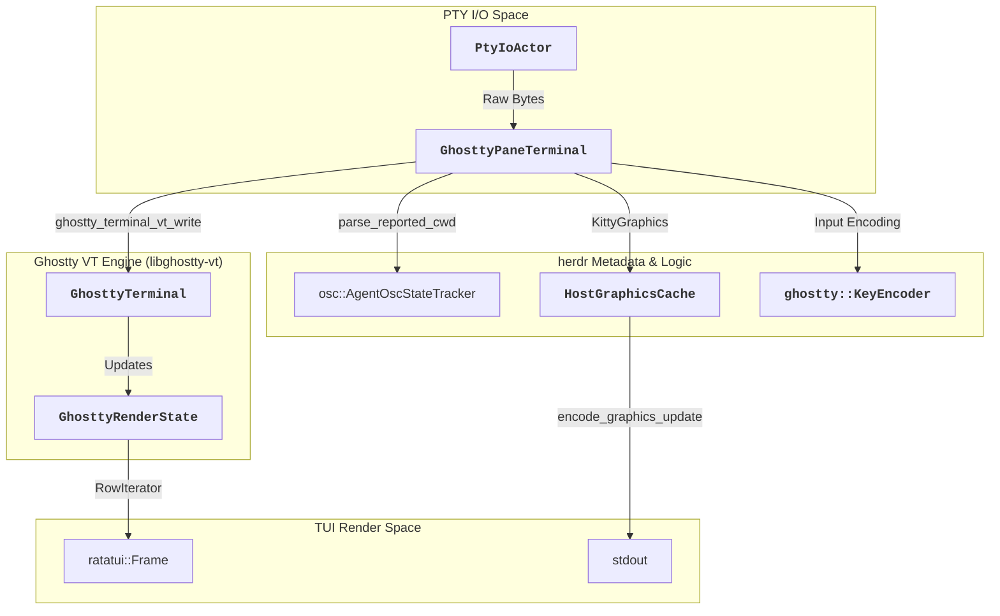

# Terminal Emulation

Relevant source files

The following files were used as context for generating this wiki page:

- [scripts/test_vendor_libghostty_vt.py](https://github.com/herdrdev/herdr/blob/HEAD/scripts/test_vendor_libghostty_vt.py)
- [src/ghostty/mod.rs](https://github.com/herdrdev/herdr/blob/HEAD/src/ghostty/mod.rs)
- [src/kitty_graphics.rs](https://github.com/herdrdev/herdr/blob/HEAD/src/kitty_graphics.rs)
- [src/pane.rs](https://github.com/herdrdev/herdr/blob/HEAD/src/pane.rs)
- [src/pane/osc.rs](https://github.com/herdrdev/herdr/blob/HEAD/src/pane/osc.rs)
- [src/pane/terminal.rs](https://github.com/herdrdev/herdr/blob/HEAD/src/pane/terminal.rs)
- [src/persist/restore.rs](https://github.com/herdrdev/herdr/blob/HEAD/src/persist/restore.rs)
- [src/server/client_transport.rs](https://github.com/herdrdev/herdr/blob/HEAD/src/server/client_transport.rs)
- [src/terminal/runtime.rs](https://github.com/herdrdev/herdr/blob/HEAD/src/terminal/runtime.rs)
- [vendor/libghostty-vt/include/ghostty/vt/terminal.h](https://github.com/herdrdev/herdr/blob/HEAD/vendor/libghostty-vt/include/ghostty/vt/terminal.h)
- [vendor/libghostty-vt/src/lib_vt.zig](https://github.com/herdrdev/herdr/blob/HEAD/vendor/libghostty-vt/src/lib_vt.zig)
- [vendor/libghostty-vt/src/terminal/PageList.zig](https://github.com/herdrdev/herdr/blob/HEAD/vendor/libghostty-vt/src/terminal/PageList.zig)
- [vendor/libghostty-vt/src/terminal/c/main.zig](https://github.com/herdrdev/herdr/blob/HEAD/vendor/libghostty-vt/src/terminal/c/main.zig)
- [vendor/libghostty-vt/src/terminal/c/terminal.zig](https://github.com/herdrdev/herdr/blob/HEAD/vendor/libghostty-vt/src/terminal/c/terminal.zig)
- [vendor/libghostty-vt/src/terminal/c/types.zig](https://github.com/herdrdev/herdr/blob/HEAD/vendor/libghostty-vt/src/terminal/c/types.zig)

`herdr` implements a sophisticated terminal emulation stack designed to provide high-fidelity rendering, modern protocol support, and seamless session persistence. Rather than re-implementing a VT engine from scratch, `herdr` embeds the **Ghostty VT engine** (libghostty-vt) to handle core terminal state and ANSI/VT sequence parsing.

The emulation stack is composed of several layers that bridge raw PTY data to the TUI rendering pipeline:

1.  **VT Engine Integration**: Embedding `libghostty-vt` as the core state machine.
2.  **Metadata Handling**: Extracting semantic information (CWD, Title, Hyperlinks) via OSC sequences.
3.  **Graphics Protocol**: Native support for the Kitty graphics protocol, including virtual placement and host-terminal translation.
4.  **Input Pipeline**: A multi-stage encoding system that supports advanced keyboard protocols and mouse reporting.

### System Architecture Overview

The following diagram illustrates how the terminal emulation entities interact within the `Pane` lifecycle.

**Terminal Emulation Data Flow**

Sources: [src/pane.rs:24-43](https://github.com/herdrdev/herdr/blob/HEAD/src/pane.rs#L24-L43), [src/pane/terminal.rs:161-191](https://github.com/herdrdev/herdr/blob/HEAD/src/pane/terminal.rs#L161-L191), [src/ghostty/mod.rs:27-105](https://github.com/herdrdev/herdr/blob/HEAD/src/ghostty/mod.rs#L27-L105)

---

### Ghostty VT Engine Integration
`herdr` leverages `libghostty-vt`, a Zig-based library, via FFI bindings. This engine maintains the terminal grid, scrollback buffer, and cursor state. The `GhosttyPaneTerminal` struct wraps the FFI calls, providing a thread-safe interface for processing PTY bytes and performing grid queries.

Key responsibilities of this layer include:
*   Managing `GhosttyTerminal` and `GhosttyRenderState` handles.
*   Synchronizing terminal themes between the guest PTY and the host `herdr` instance.
*   Providing `RowIterator` access for the `ratatui` rendering pipeline.

For details, see [Ghostty VT Engine Integration](12_3.1-ghostty-vt-engine-integration.md).

Sources: [src/pane/terminal.rs:161-191](https://github.com/herdrdev/herdr/blob/HEAD/src/pane/terminal.rs#L161-L191), [src/ghostty/mod.rs:1-105](https://github.com/herdrdev/herdr/blob/HEAD/src/ghostty/mod.rs#L1-L105)

---

### OSC Sequences and Terminal Metadata
Beyond simple character rendering, `herdr` monitors the PTY stream for **Operating System Command (OSC)** sequences. These sequences allow the shell or applications running inside a pane to communicate metadata to `herdr`.

Supported sequences include:
*   **OSC 0 / 2**: Window/Pane Title updates.
*   **OSC 7 / 9;9**: Current Working Directory (CWD) reporting for both Unix and Windows (ConPTY).
*   **OSC 8**: Hyperlink embedding.
*   **OSC 10 / 11 / 12**: Dynamic foreground, background, and cursor color queries/updates.

For details, see [OSC Sequences and Terminal Metadata](13_3.2-osc-sequences-and-terminal-metadata.md).

Sources: [src/pane/osc.rs:10-40](https://github.com/herdrdev/herdr/blob/HEAD/src/pane/osc.rs#L10-L40), [src/pane/terminal.rs:29-37](https://github.com/herdrdev/herdr/blob/HEAD/src/pane/terminal.rs#L29-L37)

---

### Kitty Graphics Protocol
`herdr` provides native support for the Kitty graphics protocol, allowing terminal-based applications to render high-resolution images. Because `herdr` is a multiplexer, it must virtualize image IDs and placements to prevent collisions between different panes and translate these commands for the outer host terminal.

The `HostGraphicsCache` tracks:
*   **Image Signatures**: Fingerprints of image data to avoid redundant transmissions.
*   **Placement Virtualization**: Mapping inner-PTY image IDs to unique host-terminal IDs.
*   **Clipping**: Ensuring images are only rendered within the bounds of their respective `Pane` rects in the TUI.

For details, see [Kitty Graphics Protocol](14_3.3-kitty-graphics-protocol.md).

Sources: [src/kitty_graphics.rs:133-143](https://github.com/herdrdev/herdr/blob/HEAD/src/kitty_graphics.rs#L133-L143), [src/ghostty/mod.rs:193-206](https://github.com/herdrdev/herdr/blob/HEAD/src/ghostty/mod.rs#L193-L206)

---

### Input Encoding and Keyboard Protocol
Handling input in a multiplexer requires a bidirectional pipeline. `herdr` captures host terminal events (via `crossterm`), translates them into a format understood by the guest application, and forwards them to the PTY.

The input stack supports:
*   **Kitty Keyboard Protocol**: Advanced key reporting (press/release, modifiers) via `KittyKeyboardTracker`.
*   **Mouse Reporting**: SGR-encoded mouse events (modes 1000, 1002, 1003, 1006).
*   **Bracketed Paste**: Safe handling of clipboard data.
*   **Windows VTI**: Specific input encoding adjustments for Windows environments.

For details, see [Input Encoding and Keyboard Protocol](15_3.4-input-encoding-and-keyboard-protocol.md).

Sources: [src/pane/input.rs:23-27](https://github.com/herdrdev/herdr/blob/HEAD/src/pane/input.rs#L23-L27), [src/pane/terminal.rs:113-133](https://github.com/herdrdev/herdr/blob/HEAD/src/pane/terminal.rs#L113-L133), [src/pane/kitty_keyboard.rs:1-10](https://github.com/herdrdev/herdr/blob/HEAD/src/pane/kitty_keyboard.rs#L1-L10)

---

### Code Entity Mapping

The following table bridges the high-level emulation concepts to the primary implementing structs in the codebase.

| Concept | Code Entity | Role |
| :--- | :--- | :--- |
| **VT Engine** | `ghostty::Terminal` | The opaque FFI handle to the Zig VT engine. |
| **Emulation Wrapper** | `pane::terminal::GhosttyPaneTerminal` | Rust wrapper managing PTY byte processing and FFI safety. |
| **Grid Snapshot** | `ghostty::RenderState` | Captures a point-in-time state of the terminal for rendering. |
| **OSC Tracking** | `pane::osc::DefaultColorOscTracker` | State machine for parsing color and metadata sequences. |
| **Graphics Logic** | `kitty_graphics::HostGraphicsCache` | Manages image ID virtualization and host-terminal blitting. |
| **Input Logic** | `ghostty::KeyEncoder` | Encodes `crossterm` events into VT-compatible escape sequences. |

Sources: [src/ghostty/mod.rs:101-136](https://github.com/herdrdev/herdr/blob/HEAD/src/ghostty/mod.rs#L101-L136), [src/pane/terminal.rs:161-191](https://github.com/herdrdev/herdr/blob/HEAD/src/pane/terminal.rs#L161-L191), [src/pane/osc.rs:41-58](https://github.com/herdrdev/herdr/blob/HEAD/src/pane/osc.rs#L41-L58), [src/kitty_graphics.rs:133-143](https://github.com/herdrdev/herdr/blob/HEAD/src/kitty_graphics.rs#L133-L143)