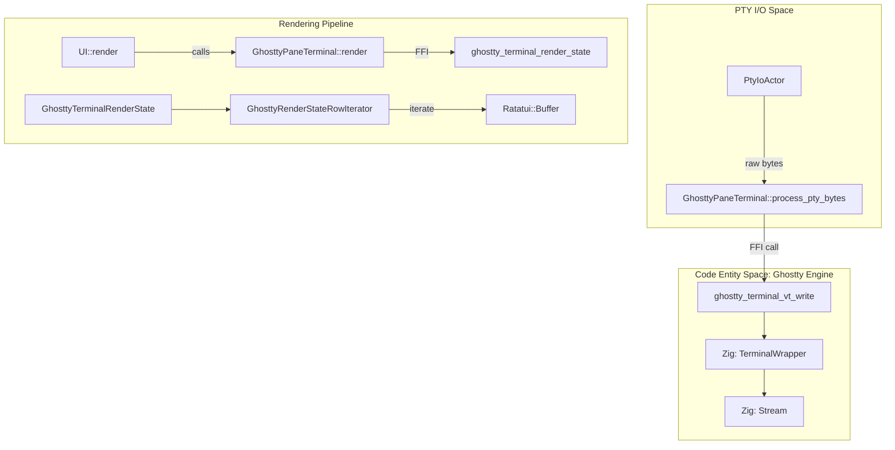
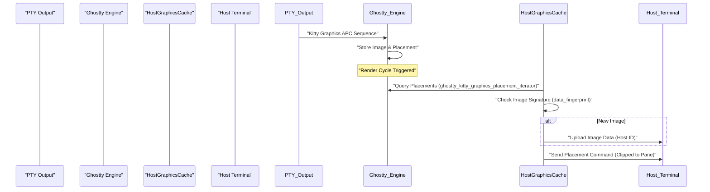

# Ghostty VT Engine Integration

Relevant source files

The following files were used as context for generating this wiki page:

- [.agents/skills/herdr-throwaway-repro/SKILL.md](https://github.com/herdrdev/herdr/blob/HEAD/.agents/skills/herdr-throwaway-repro/SKILL.md)
- [.github/APPROVED_CONTRIBUTORS](https://github.com/herdrdev/herdr/blob/HEAD/.github/APPROVED_CONTRIBUTORS)
- [.github/ISSUE_TEMPLATE/bug.yml](https://github.com/herdrdev/herdr/blob/HEAD/.github/ISSUE_TEMPLATE/bug.yml)
- [.github/ISSUE_TEMPLATE/config.yml](https://github.com/herdrdev/herdr/blob/HEAD/.github/ISSUE_TEMPLATE/config.yml)
- [.github/MAINTAINERS](https://github.com/herdrdev/herdr/blob/HEAD/.github/MAINTAINERS)
- [.github/workflows/issue-gate.yml](https://github.com/herdrdev/herdr/blob/HEAD/.github/workflows/issue-gate.yml)
- [.github/workflows/pr-gate.yml](https://github.com/herdrdev/herdr/blob/HEAD/.github/workflows/pr-gate.yml)
- [AGENTS.md](https://github.com/herdrdev/herdr/blob/HEAD/AGENTS.md)
- [CONTRIBUTING.md](https://github.com/herdrdev/herdr/blob/HEAD/CONTRIBUTING.md)
- [build.rs](https://github.com/herdrdev/herdr/blob/HEAD/build.rs)
- [scripts/test_vendor_libghostty_vt.py](https://github.com/herdrdev/herdr/blob/HEAD/scripts/test_vendor_libghostty_vt.py)
- [src/ghostty/bindings.rs](https://github.com/herdrdev/herdr/blob/HEAD/src/ghostty/bindings.rs)
- [src/ghostty/mod.rs](https://github.com/herdrdev/herdr/blob/HEAD/src/ghostty/mod.rs)
- [src/kitty_graphics.rs](https://github.com/herdrdev/herdr/blob/HEAD/src/kitty_graphics.rs)
- [src/pane.rs](https://github.com/herdrdev/herdr/blob/HEAD/src/pane.rs)
- [src/pane/osc.rs](https://github.com/herdrdev/herdr/blob/HEAD/src/pane/osc.rs)
- [src/pane/terminal.rs](https://github.com/herdrdev/herdr/blob/HEAD/src/pane/terminal.rs)
- [src/persist/restore.rs](https://github.com/herdrdev/herdr/blob/HEAD/src/persist/restore.rs)
- [src/server/client_transport.rs](https://github.com/herdrdev/herdr/blob/HEAD/src/server/client_transport.rs)
- [src/terminal/runtime.rs](https://github.com/herdrdev/herdr/blob/HEAD/src/terminal/runtime.rs)
- [vendor/libghostty-vt.patches.md](https://github.com/herdrdev/herdr/blob/HEAD/vendor/libghostty-vt.patches.md)
- [vendor/libghostty-vt/include/ghostty/vt/kitty_graphics.h](https://github.com/herdrdev/herdr/blob/HEAD/vendor/libghostty-vt/include/ghostty/vt/kitty_graphics.h)
- [vendor/libghostty-vt/include/ghostty/vt/terminal.h](https://github.com/herdrdev/herdr/blob/HEAD/vendor/libghostty-vt/include/ghostty/vt/terminal.h)
- [vendor/libghostty-vt/src/lib_vt.zig](https://github.com/herdrdev/herdr/blob/HEAD/vendor/libghostty-vt/src/lib_vt.zig)
- [vendor/libghostty-vt/src/terminal/PageList.zig](https://github.com/herdrdev/herdr/blob/HEAD/vendor/libghostty-vt/src/terminal/PageList.zig)
- [vendor/libghostty-vt/src/terminal/c/kitty_graphics.zig](https://github.com/herdrdev/herdr/blob/HEAD/vendor/libghostty-vt/src/terminal/c/kitty_graphics.zig)
- [vendor/libghostty-vt/src/terminal/c/main.zig](https://github.com/herdrdev/herdr/blob/HEAD/vendor/libghostty-vt/src/terminal/c/main.zig)
- [vendor/libghostty-vt/src/terminal/c/terminal.zig](https://github.com/herdrdev/herdr/blob/HEAD/vendor/libghostty-vt/src/terminal/c/terminal.zig)
- [vendor/libghostty-vt/src/terminal/c/types.zig](https://github.com/herdrdev/herdr/blob/HEAD/vendor/libghostty-vt/src/terminal/c/types.zig)

Herdr utilizes `libghostty-vt`, a high-performance terminal emulation engine extracted from the Ghostty terminal emulator, to provide robust VT emulation for every pane. This integration is handled via a vendored Zig library linked through FFI, wrapped in a thread-safe Rust interface.

## Build System and Zig Integration

The integration begins at the build level. Herdr vendors `libghostty-vt` in the `vendor/libghostty-vt` directory [build.rs:50](https://github.com/herdrdev/herdr/blob/HEAD/build.rs#L50). The build process uses a custom `build.rs` script to invoke the Zig compiler, ensuring the C-compatible static library is generated with optimal settings for the target platform.

### Build Orchestration
The `build.rs` script performs the following key actions:
1.  **Target Mapping**: Translates Rust target triples into Zig-compatible target strings (e.g., `x86_64-pc-windows-msvc` to `x86_64-windows-msvc`) [build.rs:6-18](https://github.com/herdrdev/herdr/blob/HEAD/build.rs#L6-L18).
2.  **Zig Invocation**: Executes `zig build` within the vendored directory, passing flags for optimization levels (`ReleaseFast` by default) and SIMD support [build.rs:60-81](https://github.com/herdrdev/herdr/blob/HEAD/build.rs#L60-L81).
3.  **Static Linking**: Configures Cargo to link against the resulting `ghostty-vt` static library based on the operating system [build.rs:83-92](https://github.com/herdrdev/herdr/blob/HEAD/build.rs#L83-L92).

In development environments using Nix, `zig_0_15` is provided as a dependency to facilitate this process [flake.nix:96](https://github.com/herdrdev/herdr/blob/HEAD/flake.nix#L96).

**Sources:** [build.rs:6-93](https://github.com/herdrdev/herdr/blob/HEAD/build.rs#L6-L93), [flake.nix:87-103](https://github.com/herdrdev/herdr/blob/HEAD/flake.nix#L87-L103)

## FFI Bindings and Ghostty Module

The Rust interface to the Zig engine is defined in the `src/ghostty` module. This module uses `rust-bindgen` generated headers to interact with the C API exposed by Ghostty [src/ghostty/mod.rs:11](https://github.com/herdrdev/herdr/blob/HEAD/src/ghostty/mod.rs#L11).

### Data Structure Mapping
The engine uses several opaque handles and FFI-safe structs to manage state:
*   `GhosttyTerminal`: The primary handle to a terminal instance [src/ghostty/bindings.rs:101](https://github.com/herdrdev/herdr/blob/HEAD/src/ghostty/bindings.rs#L101).
*   `GhosttyRenderState`: A snapshot of the terminal's visual state, including the grid and cursor [src/ghostty/bindings.rs:136](https://github.com/herdrdev/herdr/blob/HEAD/src/ghostty/bindings.rs#L136).
*   `GhosttyRenderStateRowIterator`: A handle for efficient row-by-row grid access [src/ghostty/bindings.rs:143](https://github.com/herdrdev/herdr/blob/HEAD/src/ghostty/bindings.rs#L143).

### The `GhosttyPaneTerminal` Interface
The `GhosttyPaneTerminal` struct serves as the primary Rust wrapper, managing a `Mutex` protected `GhosttyPaneCore` which holds the actual `ffi::GhosttyTerminal` pointer [src/pane/terminal.rs:161-187](https://github.com/herdrdev/herdr/blob/HEAD/src/pane/terminal.rs#L161-L187).

**Sources:** [src/ghostty/mod.rs:1-27](https://github.com/herdrdev/herdr/blob/HEAD/src/ghostty/mod.rs#L1-L27), [src/ghostty/bindings.rs:94-143](https://github.com/herdrdev/herdr/blob/HEAD/src/ghostty/bindings.rs#L94-L143), [src/pane/terminal.rs:161-187](https://github.com/herdrdev/herdr/blob/HEAD/src/pane/terminal.rs#L161-L187)

## Terminal Data Flow

Herdr implements a "Push-Pull" model for terminal data. Bytes from the PTY are pushed into the engine, and the UI pulls renderable frames during the draw cycle.

### Data Flow Diagram
This diagram illustrates how raw PTY data flows into the Ghostty engine and is eventually transformed into Ratatui cells for display.

**Sources:** [src/pane/terminal.rs:198-207](https://github.com/herdrdev/herdr/blob/HEAD/src/pane/terminal.rs#L198-L207), [src/ghostty/bindings.rs:143](https://github.com/herdrdev/herdr/blob/HEAD/src/ghostty/bindings.rs#L143), [vendor/libghostty-vt/src/terminal/c/terminal.zig:37-42](https://github.com/herdrdev/herdr/blob/HEAD/vendor/libghostty-vt/src/terminal/c/terminal.zig#L37-L42)

## Grid Access and Row Iteration

To render the terminal efficiently, Herdr accesses the internal grid via a `RowIterator`. This avoids copying the entire grid every frame.

1.  **State Snapshot**: `ghostty_terminal_render_state` is called to get a consistent view of the terminal [src/ghostty/bindings.rs:136](https://github.com/herdrdev/herdr/blob/HEAD/src/ghostty/bindings.rs#L136).
2.  **Row Iteration**: The `GhosttyRenderStateRowIterator` is used to traverse rows. Each row provides access to `GhosttyCell` data, which includes the grapheme (UTF-8), foreground/background colors, and text attributes (bold, italic, etc.) [src/ghostty/bindings.rs:143](https://github.com/herdrdev/herdr/blob/HEAD/src/ghostty/bindings.rs#L143).
3.  **Ratatui Conversion**: The attributes are mapped to `ratatui::style::Style` and the text is placed into the `ratatui::Buffer` [src/pane/terminal.rs:8-9](https://github.com/herdrdev/herdr/blob/HEAD/src/pane/terminal.rs#L8-L9).

**Sources:** [src/ghostty/bindings.rs:136-146](https://github.com/herdrdev/herdr/blob/HEAD/src/ghostty/bindings.rs#L136-L146), [src/pane/terminal.rs:8-16](https://github.com/herdrdev/herdr/blob/HEAD/src/pane/terminal.rs#L8-L16)

## Theme Synchronization and OSC Handling

Herdr ensures that the terminal engine's internal palette stays synchronized with the host terminal and the active Herdr theme.

### OSC Tracking
Herdr implements `DefaultColorOscTracker` and `DefaultColorEventTracker` to intercept Operating System Command (OSC) sequences that modify terminal colors [src/pane/osc.rs:41-157](https://github.com/herdrdev/herdr/blob/HEAD/src/pane/osc.rs#L41-L157).
*   **OSC 10/11/12**: Used for setting/querying foreground, background, and cursor colors [src/pane/osc.rs:11-25](https://github.com/herdrdev/herdr/blob/HEAD/src/pane/osc.rs#L11-L25).
*   **Theme Injection**: When a pane is initialized or a theme changes, Herdr writes the host terminal's theme into the Ghostty engine to ensure visual consistency [src/pane/terminal.rs:175](https://github.com/herdrdev/herdr/blob/HEAD/src/pane/terminal.rs#L175). The `write_host_terminal_theme_selective` function is responsible for this [src/pane/terminal.rs:33](https://github.com/herdrdev/herdr/blob/HEAD/src/pane/terminal.rs#L33).

### Color Event Handling
When the Ghostty engine processes a color change sequence (e.g., a shell script changing the background), the `DefaultColorEventTracker` records this. This allows Herdr to detect if a child process has overridden the default theme [src/pane/osc.rs:153-157](https://github.com/herdrdev/herdr/blob/HEAD/src/pane/osc.rs#L153-L157).

**Sources:** [src/pane/osc.rs:11-157](https://github.com/herdrdev/herdr/blob/HEAD/src/pane/osc.rs#L11-L157), [src/pane/terminal.rs:33](https://github.com/herdrdev/herdr/blob/HEAD/src/pane/terminal.rs#L33), [src/pane/terminal.rs:175](https://github.com/herdrdev/herdr/blob/HEAD/src/pane/terminal.rs#L175)

## Kitty Graphics Integration

The Ghostty engine provides native support for the Kitty Graphics Protocol. Herdr intercepts these placements to render images in the TUI.

### Placement Lifecycle
1.  **Detection**: The Ghostty engine parses Kitty APC (Application Program Command) sequences and stores image data [src/ghostty/mod.rs:188-190](https://github.com/herdrdev/herdr/blob/HEAD/src/ghostty/mod.rs#L188-L190).
2.  **Virtual Placements**: Images are identified as "virtual placements" if they are tied to specific grid coordinates [src/ghostty/mod.rs:194](https://github.com/herdrdev/herdr/blob/HEAD/src/ghostty/mod.rs#L194).
3.  **Host Caching**: Herdr maintains a `HostGraphicsCache` to track which images have been uploaded to the outer host terminal [src/kitty_graphics.rs:129-135](https://github.com/herdrdev/herdr/blob/HEAD/src/kitty_graphics.rs#L129-L135).
4.  **Clipping**: The `ClippedPlacement` logic ensures that if a pane is partially obscured or resized, the Kitty image is correctly clipped against the pane's `Rect` [src/kitty_graphics.rs:115-126](https://github.com/herdrdev/herdr/blob/HEAD/src/kitty_graphics.rs#L115-L126).

**Sources:** [src/ghostty/mod.rs:188-194](https://github.com/herdrdev/herdr/blob/HEAD/src/ghostty/mod.rs#L188-L194), [src/kitty_graphics.rs:115-135](https://github.com/herdrdev/herdr/blob/HEAD/src/kitty_graphics.rs#L115-L135), [src/kitty_graphics.rs:209-234](https://github.com/herdrdev/herdr/blob/HEAD/src/kitty_graphics.rs#L209-L234)