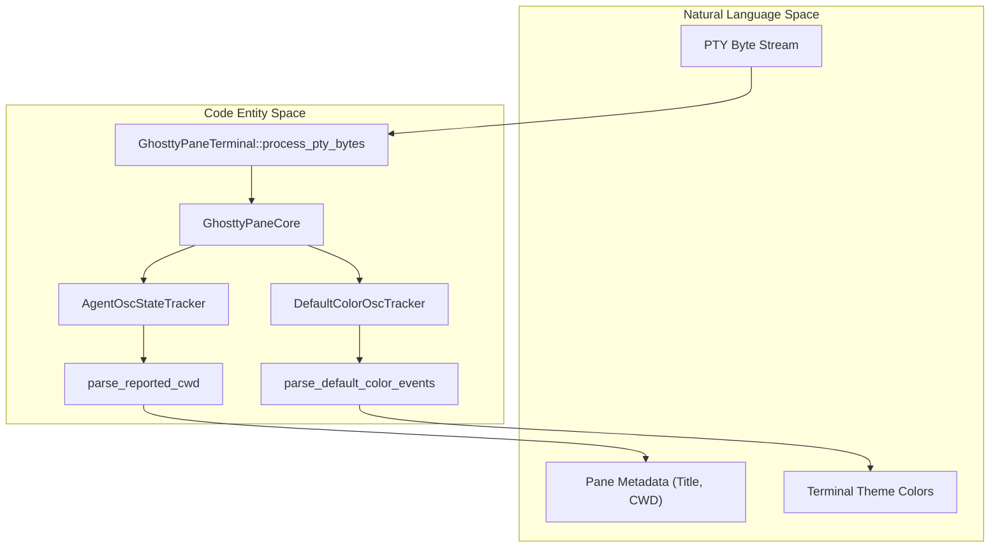
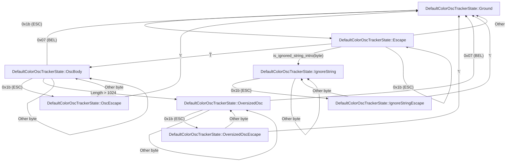

# OSC Sequences and Terminal Metadata

Relevant source files

The following files were used as context for generating this wiki page:

- [src/ghostty/mod.rs](https://github.com/herdrdev/herdr/blob/HEAD/src/ghostty/mod.rs)
- [src/kitty_graphics.rs](https://github.com/herdrdev/herdr/blob/HEAD/src/kitty_graphics.rs)
- [src/pane.rs](https://github.com/herdrdev/herdr/blob/HEAD/src/pane.rs)
- [src/pane/osc.rs](https://github.com/herdrdev/herdr/blob/HEAD/src/pane/osc.rs)
- [src/pane/terminal.rs](https://github.com/herdrdev/herdr/blob/HEAD/src/pane/terminal.rs)
- [src/persist/restore.rs](https://github.com/herdrdev/herdr/blob/HEAD/src/persist/restore.rs)
- [src/server/client_transport.rs](https://github.com/herdrdev/herdr/blob/HEAD/src/server/client_transport.rs)
- [src/terminal/runtime.rs](https://github.com/herdrdev/herdr/blob/HEAD/src/terminal/runtime.rs)
- [src/terminal_modes.rs](https://github.com/herdrdev/herdr/blob/HEAD/src/terminal_modes.rs)

This page details how `herdr` parses and utilizes Operating System Command (OSC) sequences to manage terminal metadata. These sequences allow the internal PTY processes to communicate state—such as window titles, current working directories (CWD), hyperlinks, and color preferences—to the `herdr` server and, subsequently, to the host terminal.

## Overview of OSC Handling

In `herdr`, OSC sequences are intercepted during the PTY byte-processing phase. While the core terminal emulation is handled by the Ghostty VT engine, `herdr` implements specialized trackers to extract metadata that drives UI features (like tab titles) and integration features (like agent CWD tracking).

### Key Metadata Types
*   **OSC 0 / 2**: Window and Icon Title updates.
*   **OSC 7**: Current Working Directory (CWD) reporting (Unix-style).
*   **OSC 9;9**: CWD reporting (Windows-style).
*   **OSC 8**: Terminal Hyperlinks.
*   **OSC 10/11/12**: Foreground, Background, and Cursor color queries/sets.

## Implementation Details

### Data Flow: PTY to Metadata
When bytes arrive from the PTY, they are passed through `GhosttyPaneTerminal::process_pty_bytes` [src/pane/terminal.rs:194-196](https://github.com/herdrdev/herdr/blob/HEAD/src/pane/terminal.rs#L194-L196). This function invokes the Ghostty core, but also triggers `herdr`-specific logic to scan for sequences that Ghostty might consume silently or that `herdr` needs for its own state management.

#### Entity Mapping: OSC Processing
The following diagram illustrates how raw PTY data flows into specific code entities for metadata extraction.

**Diagram: PTY Metadata Extraction Flow**

**Sources:** [src/pane/terminal.rs:150-176](https://github.com/herdrdev/herdr/blob/HEAD/src/pane/terminal.rs#L150-L176), [src/pane/osc.rs:64-144](https://github.com/herdrdev/herdr/blob/HEAD/src/pane/osc.rs#L64-L144), [src/pane/terminal.rs:187-196](https://github.com/herdrdev/herdr/blob/HEAD/src/pane/terminal.rs#L187-L196)

### CWD and Title Tracking
CWD tracking is critical for both the UI (showing the path in the sidebar) and for AI Agents to understand their context. 

1.  **OSC 7 / 9;9**: Handled via `parse_reported_cwd` [src/pane/osc.rs:330-340](https://github.com/herdrdev/herdr/blob/HEAD/src/pane/osc.rs#L330-L340). On Windows, `herdr` specifically supports the `OSC 9;9` sequence common in PowerShell and Windows Terminal [src/pane/terminal.rs:187](https://github.com/herdrdev/herdr/blob/HEAD/src/pane/terminal.rs#L187). The `windows_powershell_prompt_cwd_reporting` flag in `GhosttyPaneCore` enables this behavior [src/pane/terminal.rs:187](https://github.com/herdrdev/herdr/blob/HEAD/src/pane/terminal.rs#L187).
2.  **Window Titles**: Extracted via the Ghostty engine's title change callbacks and stored in `PaneState`.

### Color and Theme Synchronization (OSC 10/11/12)
`herdr` maintains a complex relationship between the host terminal's theme and the pane's requested theme.

*   **`DefaultColorOscTracker`**: This struct tracks the state machine for OSC 10 (Foreground), 11 (Background), and 12 (Cursor) [src/pane/osc.rs:41-45](https://github.com/herdrdev/herdr/blob/HEAD/src/pane/osc.rs#L41-L45). It identifies if a process is querying or setting these colors.
*   **`DefaultColorEventTracker`**: Specifically looks for `Query`, `Set`, and `Reset` events [src/pane/osc.rs:152-157](https://github.com/herdrdev/herdr/blob/HEAD/src/pane/osc.rs#L152-L157).
*   **Theme Restoration**: If a pane changes the background color via OSC 11, `herdr` uses `restore_host_terminal_theme_if_needed` to ensure the host terminal returns to the user's preferred theme when switching panes [src/pane/terminal.rs:33-34](https://github.com/herdrdev/herdr/blob/HEAD/src/pane/terminal.rs#L33-L34). This is managed by `write_host_terminal_theme_selective` [src/pane/terminal.rs:34-34](https://github.com/herdrdev/herdr/blob/HEAD/src/pane/terminal.rs#L34) which writes the appropriate OSC sequences to the host terminal.

**Sources:** [src/pane/osc.rs:11-35](https://github.com/herdrdev/herdr/blob/HEAD/src/pane/osc.rs#L11-L35), [src/pane/osc.rs:64-144](https://github.com/herdrdev/herdr/blob/HEAD/src/pane/osc.rs#L64-L144), [src/pane/terminal.rs:162-172](https://github.com/herdrdev/herdr/blob/HEAD/src/pane/terminal.rs#L162-L172), [src/pane/terminal.rs:31-34](https://github.com/herdrdev/herdr/blob/HEAD/src/pane/terminal.rs#L31-L34)

### Hyperlink Handling (OSC 8)
Hyperlinks are parsed by the Ghostty engine. `herdr` accesses these via the grid rows. When a user interacts with the terminal, `herdr` can query the cell metadata to see if a `URI` is associated with the specific grid coordinate.

## State Machine for OSC Tracking

Because OSC sequences can be fragmented across multiple PTY read buffers, `herdr` uses a state machine to ensure complete sequences are captured. The `DefaultColorOscTracker` and `DefaultColorEventTracker` both implement this state machine logic [src/pane/osc.rs:47-58](https://github.com/herdrdev/herdr/blob/HEAD/src/pane/osc.rs#L47-L58).

**Diagram: OSC Tracker State Transitions**

**Sources:** [src/pane/osc.rs:47-58](https://github.com/herdrdev/herdr/blob/HEAD/src/pane/osc.rs#L47-L58), [src/pane/osc.rs:65-143](https://github.com/herdrdev/herdr/blob/HEAD/src/pane/osc.rs#L65-L143), [src/pane/osc.rs:160-188](https://github.com/herdrdev/herdr/blob/HEAD/src/pane/osc.rs#L160-L188)

## Summary of OSC Metadata Mapping

| Sequence | Functionality | Primary Code Handler | Impact |
| :--- | :--- | :--- | :--- |
| **OSC 0 / 2** | Title Updates | `GhosttyPaneCore` | Updates Tab/Sidebar UI |
| **OSC 7** | Unix CWD | `parse_reported_cwd` | Agent context & Breadcrumbs |
| **OSC 8** | Hyperlinks | `Ghostty` Grid | Clickable links in TUI |
| **OSC 9;9** | Windows CWD | `parse_reported_cwd` | Windows-specific CWD support |
| **OSC 10/11** | FG/BG Colors | `DefaultColorOscTracker` | Pane-specific theme overrides |
| **OSC 12** | Cursor Color | `DefaultColorOscTracker` | Cursor styling |

**Sources:** [src/pane/osc.rs:11-35](https://github.com/herdrdev/herdr/blob/HEAD/src/pane/osc.rs#L11-L35), [src/pane/terminal.rs:156-176](https://github.com/herdrdev/herdr/blob/HEAD/src/pane/terminal.rs#L156-L176), [src/pane/terminal.rs:28-37](https://github.com/herdrdev/herdr/blob/HEAD/src/pane/terminal.rs#L28-L37)24:T