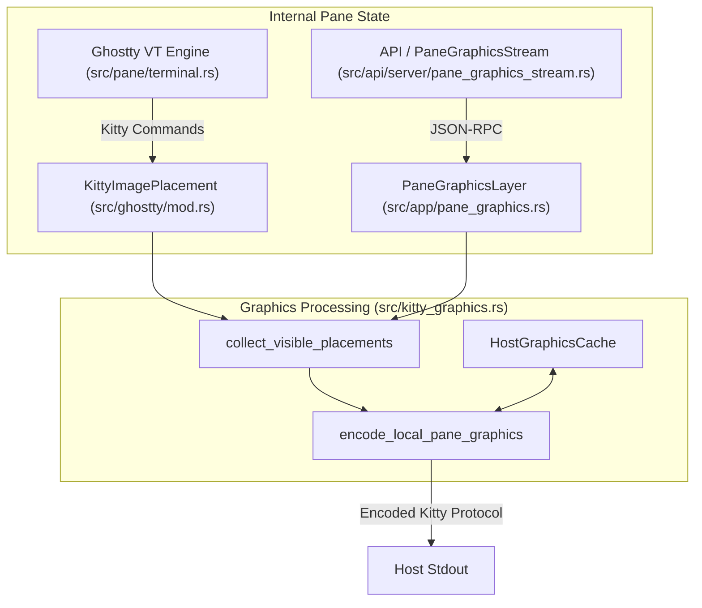
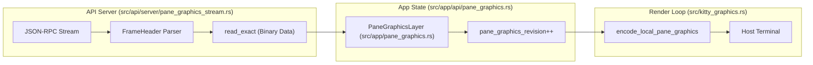

# Kitty Graphics Protocol

Relevant source files

The following files were used as context for generating this wiki page:

- [src/api/server/pane_graphics_stream.rs](https://github.com/herdrdev/herdr/blob/HEAD/src/api/server/pane_graphics_stream.rs)
- [src/app/api/pane_graphics.rs](https://github.com/herdrdev/herdr/blob/HEAD/src/app/api/pane_graphics.rs)
- [src/ghostty/mod.rs](https://github.com/herdrdev/herdr/blob/HEAD/src/ghostty/mod.rs)
- [src/kitty_graphics.rs](https://github.com/herdrdev/herdr/blob/HEAD/src/kitty_graphics.rs)
- [src/pane.rs](https://github.com/herdrdev/herdr/blob/HEAD/src/pane.rs)
- [src/pane/osc.rs](https://github.com/herdrdev/herdr/blob/HEAD/src/pane/osc.rs)
- [src/pane/terminal.rs](https://github.com/herdrdev/herdr/blob/HEAD/src/pane/terminal.rs)
- [src/persist/restore.rs](https://github.com/herdrdev/herdr/blob/HEAD/src/persist/restore.rs)
- [src/server/client_transport.rs](https://github.com/herdrdev/herdr/blob/HEAD/src/server/client_transport.rs)
- [src/terminal/runtime.rs](https://github.com/herdrdev/herdr/blob/HEAD/src/terminal/runtime.rs)

herdr implements the Kitty Graphics Protocol to enable high-performance image rendering within terminal panes. The system manages the lifecycle of images, handles virtual placements, clips images against pane boundaries, and translates internal PTY graphics commands to the host terminal.

## Overview

The graphics pipeline in herdr serves two primary purposes:
1.  **PTY Passthrough**: Intercepting Kitty graphics commands from processes running inside a pane (e.g., `icat`, `viu`) and re-encoding them for the host terminal.
2.  **Virtual Layers**: Allowing external API clients or plugins to "draw" images over specific panes via the `PaneGraphicsStream` API.

### Core Data Structures

| Entity | Description | Code Reference |
| :--- | :--- | :--- |
| `HostGraphicsCache` | Maintains the state of images and placements currently known to the host terminal to avoid redundant transmissions. | [src/kitty_graphics.rs:133-143](https://github.com/herdrdev/herdr/blob/HEAD/src/kitty_graphics.rs#L133-L143) |
| `PlacementSignature` | A unique identifier for a specific image placement, including its geometry and scrollback offset. | [src/kitty_graphics.rs:103-116](https://github.com/herdrdev/herdr/blob/HEAD/src/kitty_graphics.rs#L103-L116) |
| `KittyImagePlacement` | The internal representation of a graphic placement, including raw pixel data and rendering metadata. | [src/ghostty/mod.rs:209-212](https://github.com/herdrdev/herdr/blob/HEAD/src/ghostty/mod.rs#L209-L212) |
| `HostCellSize` | The pixel dimensions of a single character cell in the host terminal, used for coordinate translation. | [src/kitty_graphics.rs:28-31](https://github.com/herdrdev/herdr/blob/HEAD/src/kitty_graphics.rs#L28-L31) |

**Sources:** [src/kitty_graphics.rs:1-143](https://github.com/herdrdev/herdr/blob/HEAD/src/kitty_graphics.rs#L1-L143), [src/ghostty/mod.rs:209-212](https://github.com/herdrdev/herdr/blob/HEAD/src/ghostty/mod.rs#L209-L212)

## Architecture and Data Flow

The graphics system operates as a diffing engine. It compares the desired visual state (what the PTYs and API layers want to show) against the `HostGraphicsCache` (what the host terminal currently displays).

### Rendering Pipeline Diagram

This diagram shows how internal PTY data and API commands flow into the host terminal.

**Sources:** [src/kitty_graphics.rs:215-245](https://github.com/herdrdev/herdr/blob/HEAD/src/kitty_graphics.rs#L215-L245), [src/app/api/pane_graphics.rs:109-120](https://github.com/herdrdev/herdr/blob/HEAD/src/app/api/pane_graphics.rs#L109-L120)

## Implementation Details

### Host Graphics Cache
The `HostGraphicsCache` prevents herdr from re-sending large image data if the image is already stored in the host terminal's memory. It tracks:
*   **Images**: Identified by a signature of dimensions, format, and data fingerprint [src/kitty_graphics.rs:94-100](https://github.com/herdrdev/herdr/blob/HEAD/src/kitty_graphics.rs#L94-L100).
*   **Placements**: Identified by `PlacementSignature`, which includes the `z-index`, `scrollback_offset`, and clipping rects [src/kitty_graphics.rs:103-116](https://github.com/herdrdev/herdr/blob/HEAD/src/kitty_graphics.rs#L103-L116).

### Clipping and Geometry
Because panes in herdr are virtual windows into a larger tab surface, images must be clipped. The `ClippedPlacement` struct represents the portion of an image that is actually visible within the `PaneRect` [src/kitty_graphics.rs:119-130](https://github.com/herdrdev/herdr/blob/HEAD/src/kitty_graphics.rs#L119-L130).

The system uses `HostCellSize` to translate between terminal cell coordinates and pixel offsets required by the Kitty protocol. If the host terminal does not report its pixel size, herdr falls back to a standard 8x16 estimate [src/kitty_graphics.rs:55-61](https://github.com/herdrdev/herdr/blob/HEAD/src/kitty_graphics.rs#L55-L61).

### Image Identification
herdr uses a bitmask to distinguish between different image sources:
*   **Host Image IDs**: Start at `10,000` [src/kitty_graphics.rs:20](https://github.com/herdrdev/herdr/blob/HEAD/src/kitty_graphics.rs#L20).
*   **Pane Layer Bit**: The `PANE_GRAPHICS_IMAGE_ID_BIT` (bit 31) is set for images originating from the virtual API layers rather than the PTY [src/kitty_graphics.rs:21](https://github.com/herdrdev/herdr/blob/HEAD/src/kitty_graphics.rs#L21).

**Sources:** [src/kitty_graphics.rs:20-130](https://github.com/herdrdev/herdr/blob/HEAD/src/kitty_graphics.rs#L20-L130)

## Pane Graphics API

External tools can stream raw pixel data directly to a pane using the `PaneGraphicsStream` API.

### Stream Lifecycle
1.  **Open**: A client calls `PaneGraphicsStreamOpen`. herdr registers a new `owner` for the pane [src/api/server/pane_graphics_stream.rs:113-127](https://github.com/herdrdev/herdr/blob/HEAD/src/api/server/pane_graphics_stream.rs#L113-L127).
2.  **Frame Transmission**: The client sends JSON headers followed by raw binary data [src/api/server/pane_graphics_stream.rs:180-230](https://github.com/herdrdev/herdr/blob/HEAD/src/api/server/pane_graphics_stream.rs#L180-L230).
3.  **Layer Management**: Each frame updates a `PaneGraphicsLayer` in the `AppState` [src/app/api/pane_graphics.rs:109-117](https://github.com/herdrdev/herdr/blob/HEAD/src/app/api/pane_graphics.rs#L109-L117).
4.  **Cleanup**: When the socket closes, herdr clears the layer and unregisters the owner [src/api/server/pane_graphics_stream.rs:163-165](https://github.com/herdrdev/herdr/blob/HEAD/src/api/server/pane_graphics_stream.rs#L163-L165).

### Data Flow: API to Host

**Sources:** [src/api/server/pane_graphics_stream.rs:153-230](https://github.com/herdrdev/herdr/blob/HEAD/src/api/server/pane_graphics_stream.rs#L153-L230), [src/app/api/pane_graphics.rs:147-170](https://github.com/herdrdev/herdr/blob/HEAD/src/app/api/pane_graphics.rs#L147-L170)

## Protocol Translation

When a process inside a pane issues a Kitty command, the `GhosttyPaneTerminal` processes the bytes. If the command involves graphics, it is stored in the `Ghostty` core state.

Key implementation points:
*   **Virtual Placements**: herdr detects if a placement is "virtual" (meaning it shouldn't be managed by the host's standard scrollback) via `KITTY_PLACEMENT_DATA_IS_VIRTUAL` [src/ghostty/mod.rs:194](https://github.com/herdrdev/herdr/blob/HEAD/src/ghostty/mod.rs#L194).
*   **Unicode Placeholders**: herdr supports the Unicode placeholder method (U+EEEE) for positioning images within text grids [src/ghostty/mod.rs:191](https://github.com/herdrdev/herdr/blob/HEAD/src/ghostty/mod.rs#L191).
*   **Redraw Settle**: To avoid flickering during rapid PTY output, a settle duration of 20ms is applied before re-rendering graphics [src/pane/terminal.rs:41](https://github.com/herdrdev/herdr/blob/HEAD/src/pane/terminal.rs#L41).

**Sources:** [src/ghostty/mod.rs:191-197](https://github.com/herdrdev/herdr/blob/HEAD/src/ghostty/mod.rs#L191-L197), [src/pane/terminal.rs:41](https://github.com/herdrdev/herdr/blob/HEAD/src/pane/terminal.rs#L41), [src/kitty_graphics.rs:156-187](https://github.com/herdrdev/herdr/blob/HEAD/src/kitty_graphics.rs#L156-L187)