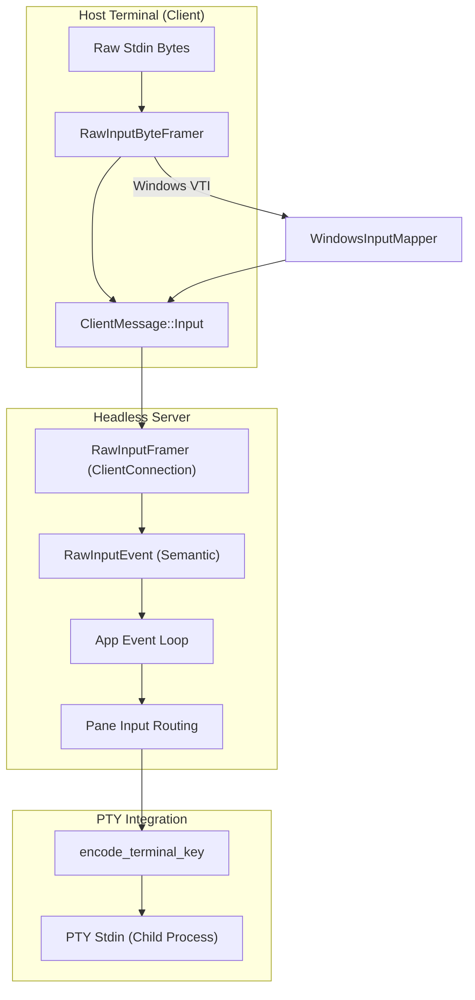
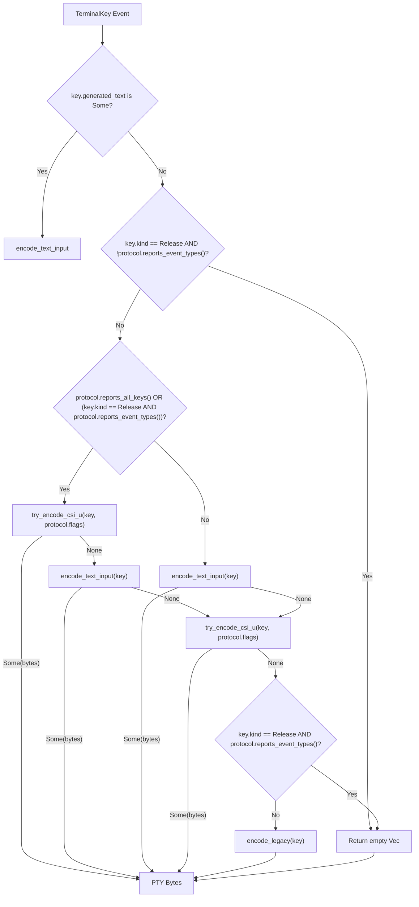

# Input Encoding and Keyboard Protocol

Relevant source files

The following files were used as context for generating this wiki page:

- [src/app/runtime.rs](https://github.com/herdrdev/herdr/blob/HEAD/src/app/runtime.rs)
- [src/app/theme_sync.rs](https://github.com/herdrdev/herdr/blob/HEAD/src/app/theme_sync.rs)
- [src/client/input.rs](https://github.com/herdrdev/herdr/blob/HEAD/src/client/input.rs)
- [src/client/input/windows_vti.rs](https://github.com/herdrdev/herdr/blob/HEAD/src/client/input/windows_vti.rs)
- [src/client/mod.rs](https://github.com/herdrdev/herdr/blob/HEAD/src/client/mod.rs)
- [src/input/encode.rs](https://github.com/herdrdev/herdr/blob/HEAD/src/input/encode.rs)
- [src/input/mod.rs](https://github.com/herdrdev/herdr/blob/HEAD/src/input/mod.rs)
- [src/input/model.rs](https://github.com/herdrdev/herdr/blob/HEAD/src/input/model.rs)
- [src/input/parse.rs](https://github.com/herdrdev/herdr/blob/HEAD/src/input/parse.rs)
- [src/raw_input.rs](https://github.com/herdrdev/herdr/blob/HEAD/src/raw_input.rs)
- [src/server/clients.rs](https://github.com/herdrdev/herdr/blob/HEAD/src/server/clients.rs)
- [src/server/headless/tests/pane_graphics.rs](https://github.com/herdrdev/herdr/blob/HEAD/src/server/headless/tests/pane_graphics.rs)
- [src/terminal_theme.rs](https://github.com/herdrdev/herdr/blob/HEAD/src/terminal_theme.rs)
- [tests/fixtures/keyboard_protocol_corpus.tsv](https://github.com/herdrdev/herdr/blob/HEAD/tests/fixtures/keyboard_protocol_corpus.tsv)
- [tests/fixtures/macos_terminal_variants.tsv](https://github.com/herdrdev/herdr/blob/HEAD/tests/fixtures/macos_terminal_variants.tsv)

Herdr implements a sophisticated input pipeline designed to handle the complexities of modern terminal input, including high-fidelity keyboard protocols, mouse tracking, and cross-platform differences between Unix-like systems and Windows. The system is designed to parse raw terminal bytes into semantic events at the client or server level and then re-encode them for delivery to PTY-hosted child processes.

## Input Pipeline Overview

The input pipeline follows a path from the host terminal's raw byte stream to the semantic event handling in the server, and finally to the re-encoded byte stream sent to the PTY.

### Data Flow Diagram
"Input Event Lifecycle"

**Sources:** [src/client/input.rs:38-57](https://github.com/herdrdev/herdr/blob/HEAD/src/client/input.rs#L38-L57), [src/server/clients.rs:32-52](https://github.com/herdrdev/herdr/blob/HEAD/src/server/clients.rs#L32-L52), [src/input/encode.rs:18-58](https://github.com/herdrdev/herdr/blob/HEAD/src/input/encode.rs#L18-L58)

## Raw Input Parsing

Herdr uses `RawInputFramer` to handle the fragmentation of escape sequences that occurs during network transport or high-load scenarios.

### Framing and Extraction
The `RawInputByteFramer` [src/raw_input.rs:205](https://github.com/herdrdev/herdr/blob/HEAD/src/raw_input.rs#L205) buffers incoming bytes and attempts to identify complete escape sequences or UTF-8 characters.
- **Timeouts:** If a lone `ESC` (0x1b) is received, the framer waits for `RAW_INPUT_IDLE_FLUSH_TIMEOUT_MS` (10ms) before treating it as a literal Escape keypress [src/raw_input.rs:104](https://github.com/herdrdev/herdr/blob/HEAD/src/raw_input.rs#L104).
- **Mouse Sequences:** SGR mouse sequences (`CSI < ...`) use a longer timeout of 150ms when mouse capture is active to ensure multi-byte sequences aren't truncated [src/raw_input.rs:105](https://github.com/herdrdev/herdr/blob/HEAD/src/raw_input.rs#L105).
- **Event Mapping:** Once a chunk is framed, `extract_one_event` converts it into a `RawInputEvent` [src/raw_input.rs:185-201](https://github.com/herdrdev/herdr/blob/HEAD/src/raw_input.rs#L185-L201).

### Supported Event Types
| Event Type | Description |
| :--- | :--- |
| `Key(TerminalKey)` | Semantic key press/release with modifiers [src/raw_input.rs:128](https://github.com/herdrdev/herdr/blob/HEAD/src/raw_input.rs#L128). |
| `Text(TextCommit)` | Text input, potentially from bracketed paste [src/raw_input.rs:129](https://github.com/herdrdev/herdr/blob/HEAD/src/raw_input.rs#L129). |
| `Paste(String)` | Bracketed paste content [src/raw_input.rs:130](https://github.com/herdrdev/herdr/blob/HEAD/src/raw_input.rs#L130). |
| `Mouse(MouseEvent)` | SGR or legacy mouse coordinates and buttons [src/raw_input.rs:131](https://github.com/herdrdev/herdr/blob/HEAD/src/raw_input.rs#L131). |
| `OuterFocusGained`/`OuterFocusLost` | Focus events from the host terminal [src/raw_input.rs:132-133](https://github.com/herdrdev/herdr/blob/HEAD/src/raw_input.rs#L132-L133). |
| `HostDefaultColor` | Report of default foreground/background colors [src/raw_input.rs:134-137](https://github.com/herdrdev/herdr/blob/HEAD/src/raw_input.rs#L134-L137). |
| `HostPaletteColors` | Report of specific palette colors [src/raw_input.rs:138-139](https://github.com/herdrdev/herdr/blob/HEAD/src/raw_input.rs#L138-L139). |
| `HostColorSchemeChanged` | Detection of host light/dark mode via Ghostty/OSC sequences [src/raw_input.rs:140](https://github.com/herdrdev/herdr/blob/HEAD/src/raw_input.rs#L140). |
| `HostCellSizeReport` | Report of host terminal cell dimensions in pixels [src/raw_input.rs:143-147](https://github.com/herdrdev/herdr/blob/HEAD/src/raw_input.rs#L143-L147). |

**Sources:** [src/raw_input.rs:12-80](https://github.com/herdrdev/herdr/blob/HEAD/src/raw_input.rs#L12-L80), [src/raw_input.rs:127-149](https://github.com/herdrdev/herdr/blob/HEAD/src/raw_input.rs#L127-L149)

## Keyboard Protocols

Herdr supports multiple keyboard encoding standards to ensure that child processes receive the highest fidelity input possible based on their requested capabilities.

### 1. Kitty Keyboard Protocol
If a child process (like a text editor) enables the Kitty protocol via `CSI > u`, Herdr uses `try_encode_csi_u` to send extended key information [src/input/encode.rs:179](https://github.com/herdrdev/herdr/blob/HEAD/src/input/encode.rs#L179).
- **Event Types:** Supports Press, Repeat, and Release events [src/input/encode.rs:28-33](https://github.com/herdrdev/herdr/blob/HEAD/src/input/encode.rs#L28-L33).
- **Modifiers:** Encodes Shift, Alt, Control, Super, Hyper, and Meta [src/input/encode.rs:130-139](https://github.com/herdrdev/herdr/blob/HEAD/src/input/encode.rs#L130-L139).
- **Disambiguation:** Differentiates between `Tab` and `Ctrl+I`, or `Enter` and `Ctrl+M` [src/input/encode.rs:184-189](https://github.com/herdrdev/herdr/blob/HEAD/src/input/encode.rs#L184-L189).
- **`KITTY_FLAG_REPORT_ALL_KEYS`**: When this flag is set, all key events, including simple character keys, are encoded using the Kitty protocol [src/input/model.rs:216](https://github.com/herdrdev/herdr/blob/HEAD/src/input/model.rs#L216). This provides more detailed information to the application.

### 2. Legacy and Xterm Sequences
For standard shell environments, Herdr falls back to legacy encodings:
- **Control Characters:** Maps `Ctrl+A` to `0x01`, etc. [src/input/parse.rs:113-127](https://github.com/herdrdev/herdr/blob/HEAD/src/input/parse.rs#L113-L127).
- **Alt-Prefixing:** Prepends `ESC` for Alt-modified keys [src/input/parse.rs:80-92](https://github.com/herdrdev/herdr/blob/HEAD/src/input/parse.rs#L80-L92).
- **Special Keys:** Handles `CSI A` (Up), `CSI H` (Home), and others using a comprehensive lookup table [src/input/parse.rs:130-160](https://github.com/herdrdev/herdr/blob/HEAD/src/input/parse.rs#L130-L160).

### 3. Windows Virtual Terminal Input (VTI)
On Windows, Herdr can bypass `crossterm`'s standard input handling in favor of a raw console reader loop that processes `INPUT_RECORD` structures directly [src/client/input/windows_vti.rs:14-40](https://github.com/herdrdev/herdr/blob/HEAD/src/client/input/windows_vti.rs#L14-L40). This allows for:
- Accurate detection of `KeyEvent` vs `MouseEvent` at the OS level [src/client/input/windows_vti.rs:129-158](https://github.com/herdrdev/herdr/blob/HEAD/src/client/input/windows_vti.rs#L129-L158).
- Handling of Windows-specific surrogate pairs for Unicode input [src/client/input/windows_vti.rs:187-192](https://github.com/herdrdev/herdr/blob/HEAD/src/client/input/windows_vti.rs#L187-L192).
- The `WindowsInputMapper` [src/client/input/windows_vti.rs:178](https://github.com/herdrdev/herdr/blob/HEAD/src/client/input/windows_vti.rs#L178) translates raw Windows input records into `PlatformInputItem`s, which can be raw bytes, semantic events, or paste-aware bytes/keys.
- The `WindowsInputPump` [src/client/input/windows_vti.rs:185](https://github.com/herdrdev/herdr/blob/HEAD/src/client/input/windows_vti.rs#L185) then processes these items, using a `RawInputFramer` to further parse bytes into `RawInputEvent`s.

**Sources:** [src/input/encode.rs:12-58](https://github.com/herdrdev/herdr/blob/HEAD/src/input/encode.rs#L12-L58), [src/input/parse.rs:6-50](https://github.com/herdrdev/herdr/blob/HEAD/src/input/parse.rs#L6-L50), [src/client/input/windows_vti.rs:70-77](https://github.com/herdrdev/herdr/blob/HEAD/src/client/input/windows_vti.rs#L70-L77), [src/input/model.rs:216](https://github.com/herdrdev/herdr/blob/HEAD/src/input/model.rs#L216)

## PTY Encoding Logic

When the server receives a `TerminalKey`, it must decide how to write those bytes to the PTY file descriptor based on the `KeyboardProtocol` negotiated by the pane.

### Encoding Decision Tree
"PTY Input Encoding Logic"

**Sources:** [src/input/encode.rs:18-58](https://github.com/herdrdev/herdr/blob/HEAD/src/input/encode.rs#L18-L58), [src/input/model.rs:120-141](https://github.com/herdrdev/herdr/blob/HEAD/src/input/model.rs#L120-L141)

### Mouse Encoding
Herdr supports three mouse encodings for PTY forwarding:
1.  **SGR (`CSI < ...`)**: The modern standard, supporting coordinates beyond 223 columns [src/input/encode.rs:144-150](https://github.com/herdrdev/herdr/blob/HEAD/src/input/encode.rs#L144-L150).
2.  **Default (X10)**: Legacy 3-byte encoding [src/input/encode.rs:151-156](https://github.com/herdrdev/herdr/blob/HEAD/src/input/encode.rs#L151-L156).
3.  **UTF-8**: An intermediate standard using multi-byte codepoints for coordinates [src/input/encode.rs:157-165](https://github.com/herdrdev/herdr/blob/HEAD/src/input/encode.rs#L157-L165).

**Sources:** [src/input/encode.rs:76-114](https://github.com/herdrdev/herdr/blob/HEAD/src/input/encode.rs#L76-L114), [src/input/model.rs:161-165](https://github.com/herdrdev/herdr/blob/HEAD/src/input/model.rs#L161-L165)