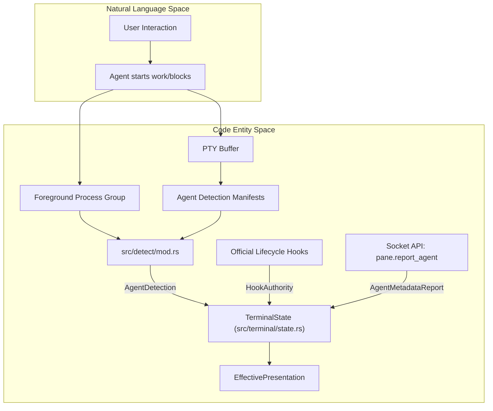
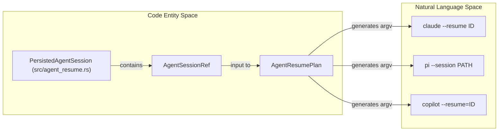

# Agent Detection and Integration

Relevant source files

The following files were used as context for generating this wiki page:

- [README.md](https://github.com/herdrdev/herdr/blob/HEAD/README.md)
- [docs/next/README.md](https://github.com/herdrdev/herdr/blob/HEAD/docs/next/README.md)
- [docs/next/website/src/content/docs/agents.mdx](https://github.com/herdrdev/herdr/blob/HEAD/docs/next/website/src/content/docs/agents.mdx)
- [docs/next/website/src/content/docs/cli-reference.mdx](https://github.com/herdrdev/herdr/blob/HEAD/docs/next/website/src/content/docs/cli-reference.mdx)
- [docs/next/website/src/content/docs/integrations.mdx](https://github.com/herdrdev/herdr/blob/HEAD/docs/next/website/src/content/docs/integrations.mdx)
- [docs/next/website/src/content/docs/session-state.mdx](https://github.com/herdrdev/herdr/blob/HEAD/docs/next/website/src/content/docs/session-state.mdx)
- [src/agent_resume.rs](https://github.com/herdrdev/herdr/blob/HEAD/src/agent_resume.rs)
- [src/api/schema/integrations.rs](https://github.com/herdrdev/herdr/blob/HEAD/src/api/schema/integrations.rs)
- [src/cli/integration.rs](https://github.com/herdrdev/herdr/blob/HEAD/src/cli/integration.rs)
- [src/detect/mod.rs](https://github.com/herdrdev/herdr/blob/HEAD/src/detect/mod.rs)
- [src/integration/actions.rs](https://github.com/herdrdev/herdr/blob/HEAD/src/integration/actions.rs)
- [src/integration/env.rs](https://github.com/herdrdev/herdr/blob/HEAD/src/integration/env.rs)
- [src/integration/mod.rs](https://github.com/herdrdev/herdr/blob/HEAD/src/integration/mod.rs)
- [src/integration/registry.rs](https://github.com/herdrdev/herdr/blob/HEAD/src/integration/registry.rs)
- [src/integration/targets.rs](https://github.com/herdrdev/herdr/blob/HEAD/src/integration/targets.rs)
- [src/integration/tests.rs](https://github.com/herdrdev/herdr/blob/HEAD/src/integration/tests.rs)
- [src/integration/types.rs](https://github.com/herdrdev/herdr/blob/HEAD/src/integration/types.rs)
- [src/terminal/state.rs](https://github.com/herdrdev/herdr/blob/HEAD/src/terminal/state.rs)

Herdr is designed to orchestrate multiple AI coding agents simultaneously by tracking their lifecycle and operational state directly within terminal panes. The system identifies which panes contain agents, monitors their status (idle, working, or blocked), and rolls this information up to the workspace level to facilitate efficient multi-agent workflows [docs/next/website/src/content/docs/agents.mdx:6-8](https://github.com/herdrdev/herdr/blob/HEAD/docs/next/website/src/content/docs/agents.mdx#L6-L8).

Detection and tracking are handled through two primary mechanisms: **Screen Heuristics** (pattern matching against the terminal buffer) and **Official Integrations** (lifecycle hooks and socket API reports) [docs/next/website/src/content/docs/agents.mdx:40-44](https://github.com/herdrdev/herdr/blob/HEAD/docs/next/website/src/content/docs/agents.mdx#L40-L44).

### Agent State Model
The core of agent tracking is the `AgentState` enum, which classifies the current activity of a process [src/detect/mod.rs:10-20](https://github.com/herdrdev/herdr/blob/HEAD/src/detect/mod.rs#L10-L20).

| State | Description |
| :--- | :--- |
| `Idle` | Agent is finished, prompt is visible, and no processing is occurring. |
| `Working` | Agent is actively processing or executing a task. |
| `Blocked` | Agent is waiting for human input (e.g., permission approvals). |
| `Unknown` | The pane contains a plain shell or an unrecognized program. |

**Sources:** [src/detect/mod.rs:10-20](https://github.com/herdrdev/herdr/blob/HEAD/src/detect/mod.rs#L10-L20), [docs/next/website/src/content/docs/agents.mdx:12-13](https://github.com/herdrdev/herdr/blob/HEAD/docs/next/website/src/content/docs/agents.mdx#L12-L13)

### Architecture of State Arbitration
Herdr centralizes state arbitration in `TerminalState`. While screen heuristics provide a robust fallback, official integrations are considered "Hook Authoritative" when active [src/terminal/state.rs:5-8](https://github.com/herdrdev/herdr/blob/HEAD/src/terminal/state.rs#L5-L8).

#### Data Flow: Agent Detection to Terminal State
This diagram illustrates how raw process and buffer data are transformed into the `EffectiveState` managed by the `TerminalState` struct.

**Sources:** [src/detect/mod.rs:24-39](https://github.com/herdrdev/herdr/blob/HEAD/src/detect/mod.rs#L24-L39), [src/terminal/state.rs:119-148](https://github.com/herdrdev/herdr/blob/HEAD/src/terminal/state.rs#L119-L148), [src/terminal/state.rs:15-25](https://github.com/herdrdev/herdr/blob/HEAD/src/terminal/state.rs#L15-L25)

---

### Screen Heuristics and Detection Manifests
For agents without complete lifecycle hooks, Herdr uses screen-derived detection. It periodically reads the bottom of the terminal buffer and matches it against TOML-based manifests [src/detect/mod.rs:1-4](https://github.com/herdrdev/herdr/blob/HEAD/src/detect/mod.rs#L1-L4). These manifests define rules for identifying agents and their states based on text patterns, spinner characters, and OSC sequences [docs/next/website/src/content/docs/agents.mdx:44-46](https://github.com/herdrdev/herdr/blob/HEAD/docs/next/website/src/content/docs/agents.mdx#L44-L46).

- **Manifest Hot-Reloading:** Manifests can be updated remotely from `herdr.dev` or overridden locally in `~/.config/herdr/agent-detection/` [docs/next/website/src/content/docs/agents.mdx:60-70](https://github.com/herdrdev/herdr/blob/HEAD/docs/next/website/src/content/docs/agents.mdx#L60-L70).
- **Explainability:** The `herdr agent explain` command provides transparency into why a specific state was detected [docs/next/website/src/content/docs/agents.mdx:76-83](https://github.com/herdrdev/herdr/blob/HEAD/docs/next/website/src/content/docs/agents.mdx#L76-L83).

For more details, see [Screen Heuristics and Detection Manifests](17_4.1-screen-heuristics-and-detection-manifests.md).

**Sources:** [src/detect/mod.rs:6-7](https://github.com/herdrdev/herdr/blob/HEAD/src/detect/mod.rs#L6-L7), [docs/next/website/src/content/docs/agents.mdx:40-49](https://github.com/herdrdev/herdr/blob/HEAD/docs/next/website/src/content/docs/agents.mdx#L40-L49), [docs/next/website/src/content/docs/cli-reference.mdx:89-94](https://github.com/herdrdev/herdr/blob/HEAD/docs/next/website/src/content/docs/cli-reference.mdx#L89-L94)

---

### Official Agent Integrations
Official integrations provide a higher fidelity signal than screen heuristics. They are installed via the CLI (e.g., `herdr integration install claude`) and typically consist of shell hooks, JavaScript/TypeScript plugins, or direct API calls [docs/next/website/src/content/docs/integrations.mdx:10-30](https://github.com/herdrdev/herdr/blob/HEAD/docs/next/website/src/content/docs/integrations.mdx#L10-L30).

- **Lifecycle Authority:** Agents like Pi, OMP, and Kimi use hooks to report `idle`/`working`/`blocked` transitions directly to the Herdr socket [docs/next/website/src/content/docs/integrations.mdx:56-59](https://github.com/herdrdev/herdr/blob/HEAD/docs/next/website/src/content/docs/integrations.mdx#L56-L59).
- **Session Identity:** Agents like Claude Code and Codex use hooks primarily to report native session IDs, which Herdr uses for restoration [docs/next/website/src/content/docs/integrations.mdx:63-65](https://github.com/herdrdev/herdr/blob/HEAD/docs/next/website/src/content/docs/integrations.mdx#L63-L65).

For more details, see [Official Agent Integrations](18_4.2-official-agent-integrations.md).

**Sources:** [src/cli/integration.rs:60-92](https://github.com/herdrdev/herdr/blob/HEAD/src/cli/integration.rs#L60-L92), [docs/next/website/src/content/docs/integrations.mdx:54-65](https://github.com/herdrdev/herdr/blob/HEAD/docs/next/website/src/content/docs/integrations.mdx#L54-L65)

---

### Agent Session Resume
Herdr supports resuming agent conversations after a server restart by tracking `agent_session_id` and `agent_session_path` [src/agent_resume.rs:5-19](https://github.com/herdrdev/herdr/blob/HEAD/src/agent_resume.rs#L5-L19). When the server reboots, it generates an `AgentResumePlan` to re-execute the agent with the appropriate flags (e.g., `claude --resume <id>`) [src/agent_resume.rs:22-26](https://github.com/herdrdev/herdr/blob/HEAD/src/agent_resume.rs#L22-L26).

#### Session Persistence Mapping
This diagram maps the internal persistence structures to the CLI commands used to resume agents.

For more details, see [Agent Session Resume](19_4.3-agent-session-resume.md).

**Sources:** [src/agent_resume.rs:29-33](https://github.com/herdrdev/herdr/blob/HEAD/src/agent_resume.rs#L29-L33), [src/agent_resume.rs:116-201](https://github.com/herdrdev/herdr/blob/HEAD/src/agent_resume.rs#L116-L201), [docs/next/website/src/content/docs/session-state.mdx:50-65](https://github.com/herdrdev/herdr/blob/HEAD/docs/next/website/src/content/docs/session-state.mdx#L50-L65)