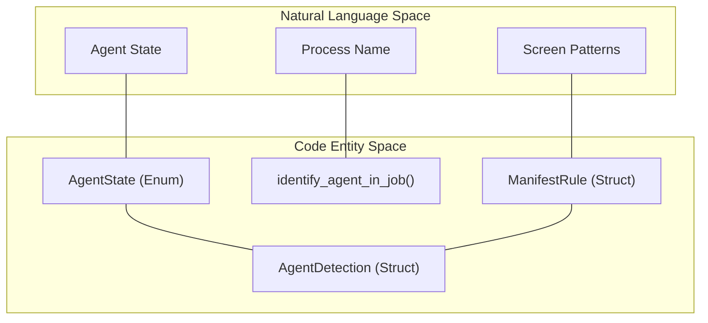
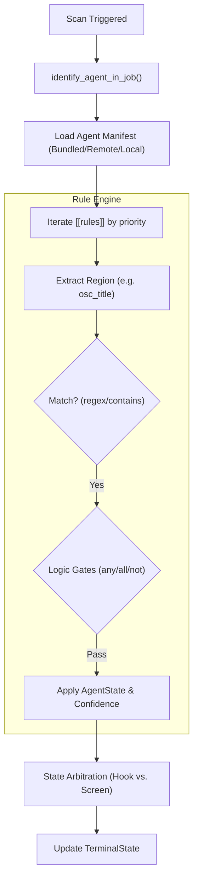

# Screen Heuristics and Detection Manifests

Relevant source files

The following files were used as context for generating this wiki page:

- [scripts/agent_detection_manifest_check.py](https://github.com/herdrdev/herdr/blob/HEAD/scripts/agent_detection_manifest_check.py)
- [scripts/test_agent_detection_manifest_check.py](https://github.com/herdrdev/herdr/blob/HEAD/scripts/test_agent_detection_manifest_check.py)
- [src/api/schema/integrations.rs](https://github.com/herdrdev/herdr/blob/HEAD/src/api/schema/integrations.rs)
- [src/config/sound.rs](https://github.com/herdrdev/herdr/blob/HEAD/src/config/sound.rs)
- [src/detect/manifest.rs](https://github.com/herdrdev/herdr/blob/HEAD/src/detect/manifest.rs)
- [src/detect/manifest/tests.rs](https://github.com/herdrdev/herdr/blob/HEAD/src/detect/manifest/tests.rs)
- [src/detect/manifest_update.rs](https://github.com/herdrdev/herdr/blob/HEAD/src/detect/manifest_update.rs)
- [src/detect/manifests/amp.toml](https://github.com/herdrdev/herdr/blob/HEAD/src/detect/manifests/amp.toml)
- [src/detect/manifests/antigravity.toml](https://github.com/herdrdev/herdr/blob/HEAD/src/detect/manifests/antigravity.toml)
- [src/detect/manifests/claude.toml](https://github.com/herdrdev/herdr/blob/HEAD/src/detect/manifests/claude.toml)
- [src/detect/manifests/codex.toml](https://github.com/herdrdev/herdr/blob/HEAD/src/detect/manifests/codex.toml)
- [src/detect/manifests/cursor.toml](https://github.com/herdrdev/herdr/blob/HEAD/src/detect/manifests/cursor.toml)
- [src/detect/manifests/github-copilot.toml](https://github.com/herdrdev/herdr/blob/HEAD/src/detect/manifests/github-copilot.toml)
- [src/detect/manifests/grok.toml](https://github.com/herdrdev/herdr/blob/HEAD/src/detect/manifests/grok.toml)
- [src/detect/manifests/kiro.toml](https://github.com/herdrdev/herdr/blob/HEAD/src/detect/manifests/kiro.toml)
- [src/detect/mod.rs](https://github.com/herdrdev/herdr/blob/HEAD/src/detect/mod.rs)
- [src/integration/actions.rs](https://github.com/herdrdev/herdr/blob/HEAD/src/integration/actions.rs)
- [src/integration/env.rs](https://github.com/herdrdev/herdr/blob/HEAD/src/integration/env.rs)
- [src/integration/registry.rs](https://github.com/herdrdev/herdr/blob/HEAD/src/integration/registry.rs)
- [src/integration/targets.rs](https://github.com/herdrdev/herdr/blob/HEAD/src/integration/targets.rs)
- [src/integration/tests.rs](https://github.com/herdrdev/herdr/blob/HEAD/src/integration/tests.rs)
- [src/integration/types.rs](https://github.com/herdrdev/herdr/blob/HEAD/src/integration/types.rs)
- [src/pane/agent_detection.rs](https://github.com/herdrdev/herdr/blob/HEAD/src/pane/agent_detection.rs)
- [website/agent-detection/amp.toml](https://github.com/herdrdev/herdr/blob/HEAD/website/agent-detection/amp.toml)
- [website/agent-detection/antigravity.toml](https://github.com/herdrdev/herdr/blob/HEAD/website/agent-detection/antigravity.toml)
- [website/agent-detection/claude.toml](https://github.com/herdrdev/herdr/blob/HEAD/website/agent-detection/claude.toml)
- [website/agent-detection/cline.toml](https://github.com/herdrdev/herdr/blob/HEAD/website/agent-detection/cline.toml)
- [website/agent-detection/codex.toml](https://github.com/herdrdev/herdr/blob/HEAD/website/agent-detection/codex.toml)
- [website/agent-detection/cursor.toml](https://github.com/herdrdev/herdr/blob/HEAD/website/agent-detection/cursor.toml)
- [website/agent-detection/droid.toml](https://github.com/herdrdev/herdr/blob/HEAD/website/agent-detection/droid.toml)
- [website/agent-detection/gemini.toml](https://github.com/herdrdev/herdr/blob/HEAD/website/agent-detection/gemini.toml)
- [website/agent-detection/github-copilot.toml](https://github.com/herdrdev/herdr/blob/HEAD/website/agent-detection/github-copilot.toml)
- [website/agent-detection/grok.toml](https://github.com/herdrdev/herdr/blob/HEAD/website/agent-detection/grok.toml)
- [website/agent-detection/kiro.toml](https://github.com/herdrdev/herdr/blob/HEAD/website/agent-detection/kiro.toml)

Herdr employs a sophisticated heuristic engine to detect the state of AI coding agents (e.g., Claude, Grok, Copilot) running within terminal panes. Because most agents do not provide official lifecycle hooks, Herdr uses a combination of process tree analysis, terminal output pattern matching, and OSC sequence tracking to determine if an agent is `Idle`, `Working`, or `Blocked` (waiting for user input).

## Agent Identification and State

The system identifies agents primarily through the foreground process group and then refines the agent's internal state by scanning the terminal screen buffer against rules defined in TOML manifests.

### Agent States
The `AgentState` enum defines the four primary states tracked by the system:
*   **Idle**: The agent is finished, the prompt is visible, and no processing is occurring [src/detect/mod.rs:13](https://github.com/herdrdev/herdr/blob/HEAD/src/detect/mod.rs#L13).
*   **Working**: The agent is actively processing or running a task [src/detect/mod.rs:15](https://github.com/herdrdev/herdr/blob/HEAD/src/detect/mod.rs#L15).
*   **Blocked**: The agent requires human intervention (e.g., a permission prompt or a question) [src/detect/mod.rs:17](https://github.com/herdrdev/herdr/blob/HEAD/src/detect/mod.rs#L17).
*   **Unknown**: The pane is running a plain shell or an unrecognized program [src/detect/mod.rs:19](https://github.com/herdrdev/herdr/blob/HEAD/src/detect/mod.rs#L19).

### Identification Logic
1.  **Process Scanning**: The system identifies the foreground job using platform-specific APIs (e.g., `/proc` on Linux, `proc_pidinfo` on macOS) [src/detect/mod.rs:210-211](https://github.com/herdrdev/herdr/blob/HEAD/src/detect/mod.rs#L210-L211).
2.  **Label Mapping**: Process names are normalized and mapped to known agent types (e.g., `ghcs` maps to `Agent::GithubCopilot`) [src/detect/mod.rs:190](https://github.com/herdrdev/herdr/blob/HEAD/src/detect/mod.rs#L190).
3.  **Heuristic Refinement**: Once an agent is identified, the screen buffer is analyzed using the corresponding manifest rules to determine the sub-state (Idle vs. Working vs. Blocked).

### Agent Detection Architecture
The following diagram bridges the high-level detection concepts to the internal Rust entities.

**Diagram: Detection Entity Mapping**

Sources: [src/detect/mod.rs:9-20](https://github.com/herdrdev/herdr/blob/HEAD/src/detect/mod.rs#L9-L20), [src/detect/mod.rs:206-210](https://github.com/herdrdev/herdr/blob/HEAD/src/detect/mod.rs#L206-L210), [src/detect/mod.rs:24-39](https://github.com/herdrdev/herdr/blob/HEAD/src/detect/mod.rs#L24-L39)

---

## Detection Manifests

Manifests are TOML files that define how to interpret terminal content for specific agents. They allow Herdr to support new agents or UI changes in existing agents without requiring a recompile of the core binary.

### Manifest Structure
Each manifest contains metadata and a list of `[[rules]]`. Rules are prioritized and can target specific "regions" of the terminal output.

| Field | Description |
| :--- | :--- |
| `id` | Unique identifier for the agent (e.g., "claude", "grok") [src/detect/manifests/grok.toml:1](https://github.com/herdrdev/herdr/blob/HEAD/src/detect/manifests/grok.toml#L1) |
| `priority` | Determines the order of rule evaluation; higher numbers win [src/detect/manifests/codex.toml:9](https://github.com/herdrdev/herdr/blob/HEAD/src/detect/manifests/codex.toml#L9) |
| `region` | The area to scan: `osc_title`, `osc_progress`, `bottom_non_empty_lines(n)`, `whole_recent`, etc. [src/detect/manifests/grok.toml:10, 44, 52](https://github.com/herdrdev/herdr/blob/HEAD/src/detect/manifests/grok.toml#L10) |
| `state` | The `AgentState` to assign if the rule matches [src/detect/manifests/codex.toml:8](https://github.com/herdrdev/herdr/blob/HEAD/src/detect/manifests/codex.toml#L8) |
| `contains` | Simple substring matching [src/detect/manifests/codex.toml:12](https://github.com/herdrdev/herdr/blob/HEAD/src/detect/manifests/codex.toml#L12) |
| `regex` | Regular expression matching [src/detect/manifests/codex.toml:20](https://github.com/herdrdev/herdr/blob/HEAD/src/detect/manifests/codex.toml#L20) |
| `visible_blocker` | Boolean flag indicating the rule detects a UI element blocking the agent [src/detect/manifests/codex.toml:11](https://github.com/herdrdev/herdr/blob/HEAD/src/detect/manifests/codex.toml#L11)
| `visible_idle` | Boolean flag indicating the rule detects a UI element showing the agent is idle [src/detect/manifests/codex.toml:73](https://github.com/herdrdev/herdr/blob/HEAD/src/detect/manifests/codex.toml#L73)
| `visible_working` | Boolean flag indicating the rule detects a UI element showing the agent is working [src/detect/manifests/codex.toml:19](https://github.com/herdrdev/herdr/blob/HEAD/src/detect/manifests/codex.toml#L19)
| `skip_state_update` | True when the current screen is an agent-owned viewer that shows transcript/history instead of the live prompt state [src/detect/manifests/codex.toml:27](https://github.com/herdrdev/herdr/blob/HEAD/src/detect/manifests/codex.toml#L27)

### Logic Gates
Rules support complex boolean logic via `any`, `all`, and `not` gates:
*   **`any`**: Matches if any sub-condition is true [src/detect/manifests/claude.toml:33-39](https://github.com/herdrdev/herdr/blob/HEAD/src/detect/manifests/claude.toml#L33-L39).
*   **`all`**: Matches if all sub-conditions are true [src/detect/manifests/claude.toml:105-107](https://github.com/herdrdev/herdr/blob/HEAD/src/detect/manifests/claude.toml#L105-L107).
*   **`not`**: Inverts the match result, often used to exclude false positives like "interrupted" messages [src/detect/manifests/codex.toml:66](https://github.com/herdrdev/herdr/blob/HEAD/src/detect/manifests/codex.toml#L66).

### Manifest Evaluation Flow
The following diagram illustrates how the `TerminalState` uses manifests to resolve the effective agent state.

**Diagram: Manifest Evaluation Logic**

Sources: [src/detect/manifest/tests.rs:103-104](https://github.com/herdrdev/herdr/blob/HEAD/src/detect/manifest/tests.rs#L103-L104), [src/pane/agent_detection.rs:1-211](https://github.com/herdrdev/herdr/blob/HEAD/src/pane/agent_detection.rs#L1-L211), [src/detect/manifests/codex.toml:6-79](https://github.com/herdrdev/herdr/blob/HEAD/src/detect/manifests/codex.toml#L6-L79)

---

## Manifest Management and Hot-Reload

Herdr supports a three-tier manifest loading system to ensure detection stays up-to-date with agent UI changes.

1.  **Bundled**: Manifests compiled directly into the `herdr` binary. These are located in `src/detect/manifests/` and are also mirrored in `website/agent-detection/` for documentation and remote catalog generation [src/detect/manifests/codex.toml](https://github.com/herdrdev/herdr/blob/HEAD/src/detect/manifests/codex.toml), [website/agent-detection/codex.toml](https://github.com/herdrdev/herdr/blob/HEAD/website/agent-detection/codex.toml).
2.  **Remote**: Manifests downloaded from `herdr.dev` and cached in the user's state directory [src/detect/manifest_update.rs:16](https://github.com/herdrdev/herdr/blob/HEAD/src/detect/manifest_update.rs#L16).
3.  **Local Overrides**: User-provided manifests in `~/.config/herdr/agent-detection/` that shadow both bundled and remote versions [src/detect/manifest/tests.rs:217-218](https://github.com/herdrdev/herdr/blob/HEAD/src/detect/manifest/tests.rs#L217-L218).

### Update System
The `ManifestUpdateStatus` tracks the versioning and update history for each agent [src/detect/manifest_update.rs:124-130](https://github.com/herdrdev/herdr/blob/HEAD/src/detect/manifest_update.rs#L124-L130).
*   **Engine Versioning**: Manifests specify a `min_engine_version` to ensure compatibility with the current `herdr` binary [src/detect/manifest_update.rs:15](https://github.com/herdrdev/herdr/blob/HEAD/src/detect/manifest_update.rs#L15).
*   **Auto-Update**: The system periodically checks `https://herdr.dev/agent-detection/index.toml` for new versions [src/detect/manifest_update.rs:16, 202-203](https://github.com/herdrdev/herdr/blob/HEAD/src/detect/manifest_update.rs#L16).
*   **Hot-Reload**: When a manifest is updated (either via auto-update or manual edit of a local override), the system calls `reload_manifests()`, which re-parses all rules and applies them to active panes without a server restart [src/detect/manifest/tests.rs:74, 173](https://github.com/herdrdev/herdr/blob/HEAD/src/detect/manifest/tests.rs#L74).

### Hysteresis and Stability
To prevent UI flickering when an agent rapidly transitions states (e.g., a spinner appearing/disappearing), Herdr implements a confirmation window:
*   **`PendingIdleConfirmation`**: When an agent appears to move from `Working` to `Idle`, Herdr waits for a short period (`AGENT_PENDING_IDLE_CAP`, ~700ms) or multiple confirmations (`AGENT_PENDING_IDLE_CONFIRMATIONS`) before publishing the state change [src/pane/agent_detection.rs:7-9, 23-27, 65](https://github.com/herdrdev/herdr/blob/HEAD/src/pane/agent_detection.rs#L7-L9).
*   **Signal Refresh**: If a `visible_blocker` remains stable on screen, the signal is refreshed every 800ms to ensure the UI remains reactive [src/pane/agent_detection.rs:10-11, 156-168](https://github.com/herdrdev/herdr/blob/HEAD/src/pane/agent_detection.rs#L10-L11).

Sources: [src/detect/manifest_update.rs:1-200](https://github.com/herdrdev/herdr/blob/HEAD/src/detect/manifest_update.rs#L1-L200), [src/pane/agent_detection.rs:1-211](https://github.com/herdrdev/herdr/blob/HEAD/src/pane/agent_detection.rs#L1-L211), [src/detect/manifest/tests.rs:157-236](https://github.com/herdrdev/herdr/blob/HEAD/src/detect/manifest/tests.rs#L157-L236), [src/detect/manifests/codex.toml](https://github.com/herdrdev/herdr/blob/HEAD/src/detect/manifests/codex.toml), [website/agent-detection/codex.toml](https://github.com/herdrdev/herdr/blob/HEAD/website/agent-detection/codex.toml)