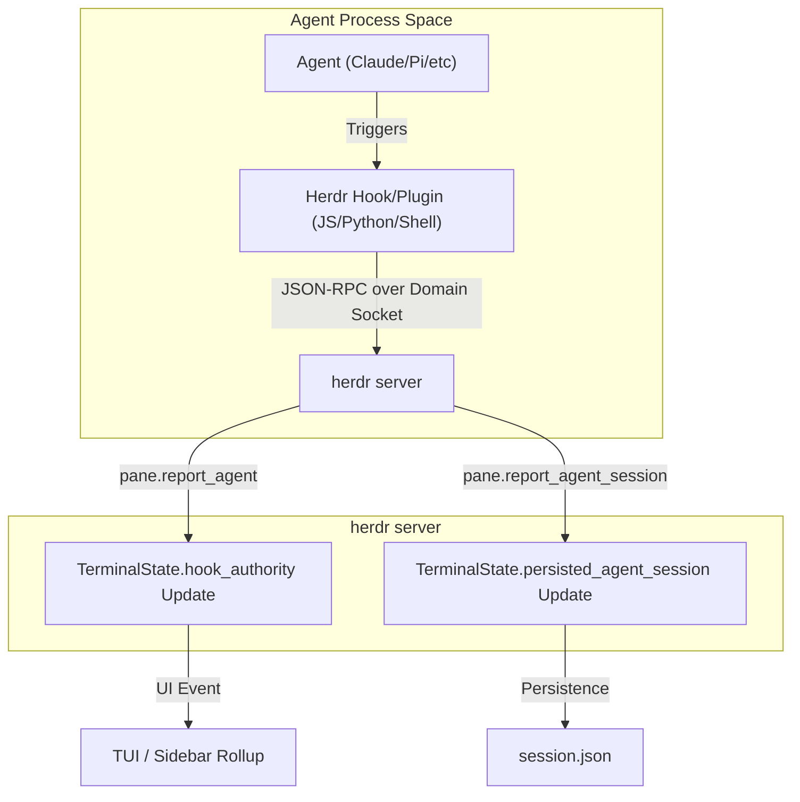
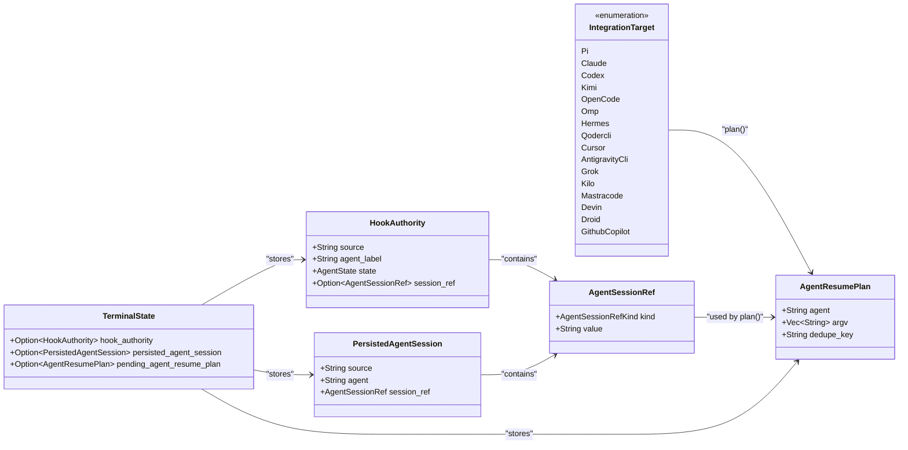

# Official Agent Integrations

Relevant source files

The following files were used as context for generating this wiki page:

- [docs/next/website/src/content/docs/integrations.mdx](https://github.com/herdrdev/herdr/blob/HEAD/docs/next/website/src/content/docs/integrations.mdx)
- [docs/next/website/src/content/docs/session-state.mdx](https://github.com/herdrdev/herdr/blob/HEAD/docs/next/website/src/content/docs/session-state.mdx)
- [scripts/test_hermes_integration_asset.py](https://github.com/herdrdev/herdr/blob/HEAD/scripts/test_hermes_integration_asset.py)
- [src/agent_resume.rs](https://github.com/herdrdev/herdr/blob/HEAD/src/agent_resume.rs)
- [src/api/schema/integrations.rs](https://github.com/herdrdev/herdr/blob/HEAD/src/api/schema/integrations.rs)
- [src/detect/mod.rs](https://github.com/herdrdev/herdr/blob/HEAD/src/detect/mod.rs)
- [src/integration/actions.rs](https://github.com/herdrdev/herdr/blob/HEAD/src/integration/actions.rs)
- [src/integration/assets/claude/herdr-agent-state.ps1](https://github.com/herdrdev/herdr/blob/HEAD/src/integration/assets/claude/herdr-agent-state.ps1)
- [src/integration/assets/claude/herdr-agent-state.sh](https://github.com/herdrdev/herdr/blob/HEAD/src/integration/assets/claude/herdr-agent-state.sh)
- [src/integration/assets/codex/herdr-agent-state.ps1](https://github.com/herdrdev/herdr/blob/HEAD/src/integration/assets/codex/herdr-agent-state.ps1)
- [src/integration/assets/codex/herdr-agent-state.sh](https://github.com/herdrdev/herdr/blob/HEAD/src/integration/assets/codex/herdr-agent-state.sh)
- [src/integration/assets/cursor/herdr-agent-state.ps1](https://github.com/herdrdev/herdr/blob/HEAD/src/integration/assets/cursor/herdr-agent-state.ps1)
- [src/integration/assets/devin/herdr-agent-state.ps1](https://github.com/herdrdev/herdr/blob/HEAD/src/integration/assets/devin/herdr-agent-state.ps1)
- [src/integration/assets/grok/herdr-agent-state.ps1](https://github.com/herdrdev/herdr/blob/HEAD/src/integration/assets/grok/herdr-agent-state.ps1)
- [src/integration/assets/herdr-agent-state.test.ts](https://github.com/herdrdev/herdr/blob/HEAD/src/integration/assets/herdr-agent-state.test.ts)
- [src/integration/assets/hermes/__init__.py](https://github.com/herdrdev/herdr/blob/HEAD/src/integration/assets/hermes/__init__.py)
- [src/integration/assets/kilo/herdr-agent-state.js](https://github.com/herdrdev/herdr/blob/HEAD/src/integration/assets/kilo/herdr-agent-state.js)
- [src/integration/assets/kimi/herdr-agent-state.ps1](https://github.com/herdrdev/herdr/blob/HEAD/src/integration/assets/kimi/herdr-agent-state.ps1)
- [src/integration/assets/kimi/herdr-agent-state.sh](https://github.com/herdrdev/herdr/blob/HEAD/src/integration/assets/kimi/herdr-agent-state.sh)
- [src/integration/assets/omp/herdr-agent-state.ts](https://github.com/herdrdev/herdr/blob/HEAD/src/integration/assets/omp/herdr-agent-state.ts)
- [src/integration/assets/opencode/herdr-agent-state.js](https://github.com/herdrdev/herdr/blob/HEAD/src/integration/assets/opencode/herdr-agent-state.js)
- [src/integration/assets/opencode/herdr-agent-state.test.ts](https://github.com/herdrdev/herdr/blob/HEAD/src/integration/assets/opencode/herdr-agent-state.test.ts)
- [src/integration/assets/pi/herdr-agent-state.ts](https://github.com/herdrdev/herdr/blob/HEAD/src/integration/assets/pi/herdr-agent-state.ts)
- [src/integration/env.rs](https://github.com/herdrdev/herdr/blob/HEAD/src/integration/env.rs)
- [src/integration/mod.rs](https://github.com/herdrdev/herdr/blob/HEAD/src/integration/mod.rs)
- [src/integration/registry.rs](https://github.com/herdrdev/herdr/blob/HEAD/src/integration/registry.rs)
- [src/integration/targets.rs](https://github.com/herdrdev/herdr/blob/HEAD/src/integration/targets.rs)
- [src/integration/tests.rs](https://github.com/herdrdev/herdr/blob/HEAD/src/integration/tests.rs)
- [src/integration/types.rs](https://github.com/herdrdev/herdr/blob/HEAD/src/integration/types.rs)
- [src/terminal/state.rs](https://github.com/herdrdev/herdr/blob/HEAD/src/terminal/state.rs)
- [tests/cli/hooks.rs](https://github.com/herdrdev/herdr/blob/HEAD/tests/cli/hooks.rs)

Herdr provides official integrations for high-profile AI coding agents to improve state detection accuracy and enable session persistence across server restarts. While Herdr uses screen heuristics for general detection, official integrations act as authoritative sources for lifecycle events (`idle`, `working`, `blocked`) and native session identity.

## Integration Architecture

Integrations function by injecting hooks or plugins into the agent's native environment. These hooks communicate back to the Herdr server via the JSON-RPC socket API using the `pane.report_agent` and `pane.report_agent_session` methods [src/integration/assets/pi/herdr-agent-state.ts:110-142](https://github.com/herdrdev/herdr/blob/HEAD/src/integration/assets/pi/herdr-agent-state.ts#L110-L142).

### Data Flow: Agent to Herdr

Sources: [src/integration/mod.rs:67-93](https://github.com/herdrdev/herdr/blob/HEAD/src/integration/mod.rs#L67-L93), [src/integration/assets/opencode/herdr-agent-state.js:105-123](https://github.com/herdrdev/herdr/blob/HEAD/src/integration/assets/opencode/herdr-agent-state.js#L105-L123), [src/integration/assets/pi/herdr-agent-state.ts:110-142](https://github.com/herdrdev/herdr/blob/HEAD/src/integration/assets/pi/herdr-agent-state.ts#L110-L142), [src/terminal/state.rs:126-130](https://github.com/herdrdev/herdr/blob/HEAD/src/terminal/state.rs#L126-L130)

## Integration Types

Herdr classifies integrations into two categories based on their authority level:

| Integration Type | Role | Supported Agents |
| :--- | :--- | :--- |
| **Lifecycle Authority** | Authoritative for `idle`, `working`, `blocked` states. Disables screen manifest fallback. | Pi, OMP, Kimi Code CLI, OpenCode, Kilo Code CLI, MastraCode |
| **Session Identity** | Provides session IDs for restore. State still uses screen manifest detection. | Claude Code, Codex, GitHub Copilot CLI, Devin CLI, Droid, Qoder CLI, Cursor Agent CLI, Hermes Agent, Antigravity CLI, Grok CLI |

Sources: [docs/next/website/src/content/docs/integrations.mdx:52-65](https://github.com/herdrdev/herdr/blob/HEAD/docs/next/website/src/content/docs/integrations.mdx#L52-L65), [src/agent_resume.rs:81-93](https://github.com/herdrdev/herdr/blob/HEAD/src/agent_resume.rs#L81-L93)

## Implementation Mechanisms

### 1. Shell Hooks (.sh / .ps1)
Used for agents like **Claude**, **Codex**, **Kimi**, **Copilot**, **Devin**, **Droid**, **QoderCLI**, **Cursor**, **AntigravityCLI**, **Grok**, and **MastraCode**. Herdr installs these scripts into the agent's local config directory (e.g., `~/.claude/hooks/`) and updates the agent's configuration files to execute them on specific events [src/integration/mod.rs:29-61](https://github.com/herdrdev/herdr/blob/HEAD/src/integration/mod.rs#L29-L61), [src/integration/mod.rs:94-104](https://github.com/herdrdev/herdr/blob/HEAD/src/integration/mod.rs#L94-L104), [src/integration/mod.rs:117-127](https://github.com/herdrdev/herdr/blob/HEAD/src/integration/mod.rs#L117-L127), [src/integration/mod.rs:144-154](https://github.com/herdrdev/herdr/blob/HEAD/src/integration/mod.rs#L144-L154), [src/integration/mod.rs:179-189](https://github.com/herdrdev/herdr/blob/HEAD/src/integration/mod.rs#L179-L189).

*   **Claude:** Writes `herdr-agent-state.sh` (or `.ps1`) to the `hooks` directory and updates `settings.json` to include the hook [src/integration/targets.rs:114-147](https://github.com/herdrdev/herdr/blob/HEAD/src/integration/targets.rs#L114-L147).
*   **Codex:** Writes `herdr-agent-state.sh` (or `.ps1`) to the agent's config directory and updates `hooks.json` [src/integration/targets.rs:149-177](https://github.com/herdrdev/herdr/blob/HEAD/src/integration/targets.rs#L149-L177).
*   **Kimi:** Writes `herdr-agent-state.sh` (or `.ps1`) to the agent's config directory and injects a TOML config block into `config.toml` [src/integration/targets.rs:179-207](https://github.com/herdrdev/herdr/blob/HEAD/src/integration/targets.rs#L179-L207). The config block is delimited by `KIMI_CONFIG_BLOCK_BEGIN` and `KIMI_CONFIG_BLOCK_END` [src/integration/mod.rs:62-63](https://github.com/herdrdev/herdr/blob/HEAD/src/integration/mod.rs#L62-L63).

### 2. JavaScript Plugins
Used for **Pi**, **OMP**, **OpenCode**, and **Kilo**. These are typically `.ts` or `.js` files placed in an `extensions` or `plugins` directory [src/integration/mod.rs:23-28](https://github.com/herdrdev/herdr/blob/HEAD/src/integration/mod.rs#L23-L28), [src/integration/mod.rs:167-172](https://github.com/herdrdev/herdr/blob/HEAD/src/integration/mod.rs#L167-L172).

*   **OpenCode/Kilo:** The `HerdrAgentStatePlugin` listens for various agent events (`chat.message`, `event`) and reports state or session updates via `pane.report_agent` or `pane.report_agent_session` [src/integration/assets/opencode/herdr-agent-state.js:125-202](https://github.com/herdrdev/herdr/blob/HEAD/src/integration/assets/opencode/herdr-agent-state.js#L125-L202).
*   **Pi/OMP:** The plugin registers event handlers for `session_start`, `agent_start`, and `agent_settled` to manage the `agentActive` state and publish state changes [src/integration/assets/pi/herdr-agent-state.ts:225-255](https://github.com/herdrdev/herdr/blob/HEAD/src/integration/assets/pi/herdr-agent-state.ts#L225-L255), [src/integration/assets/omp/herdr-agent-state.ts:300-328](https://github.com/herdrdev/herdr/blob/HEAD/src/integration/assets/omp/herdr-agent-state.ts#L300-L328).

### 3. Python Plugins
**Hermes Agent** uses a Python-based plugin consisting of a `plugin.yaml` manifest and an `__init__.py` script [src/integration/mod.rs:173-178](https://github.com/herdrdev/herdr/blob/HEAD/src/integration/mod.rs#L173-L178). Herdr installs these files into the Hermes plugin directory [src/integration/targets.rs:360-374](https://github.com/herdrdev/herdr/blob/HEAD/src/integration/targets.rs#L360-L374).

## Session Restore Logic

When an integration reports a session via `pane.report_agent_session`, Herdr stores an `AgentSessionRef` [src/agent_resume.rs:9-12](https://github.com/herdrdev/herdr/blob/HEAD/src/agent_resume.rs#L9-L12). Upon server restart, if `resume_agents_on_restore` is enabled, Herdr generates an `AgentResumePlan` to restart the agent with its native resume flags [src/agent_resume.rs:116-201](https://github.com/herdrdev/herdr/blob/HEAD/src/agent_resume.rs#L116-L201).

### Natural Language to Code Entity Mapping

Sources: [src/agent_resume.rs:9-26](https://github.com/herdrdev/herdr/blob/HEAD/src/agent_resume.rs#L9-L26), [src/agent_resume.rs:116-201](https://github.com/herdrdev/herdr/blob/HEAD/src/agent_resume.rs#L116-L201), [src/terminal/state.rs:126-148](https://github.com/herdrdev/herdr/blob/HEAD/src/terminal/state.rs#L126-L148)

## Versioning and Compatibility

Each integration has a hardcoded `INTEGRATION_VERSION` [src/integration/mod.rs:25-51](https://github.com/herdrdev/herdr/blob/HEAD/src/integration/mod.rs#L25-L51). Herdr tracks the `installed_integration_statuses` and compares them against bundled assets to prompt for updates [src/integration/registry.rs:18-21](https://github.com/herdrdev/herdr/blob/HEAD/src/integration/registry.rs#L18-L21).

For certain agents like **Kimi**, Herdr enforces a minimum binary version (`KIMI_MIN_VERSION = "0.14.0"`) before allowing integration installation [src/integration/mod.rs:64](https://github.com/herdrdev/herdr/blob/HEAD/src/integration/mod.rs#L64), [src/integration/tests.rs:41-48](https://github.com/herdrdev/herdr/blob/HEAD/src/integration/tests.rs#L41-L48).

### Key Integration Versions for Restore
| Agent | Minimum Herdr integration version | Resume command |
| :--- | :--- | :--- |
| Pi | `8` | `pi --session <path-or-id>` |
| OMP | `8` | `omp --resume=<path-or-id>` |
| Claude Code | `7` | `claude --resume <id>` |
| Codex | `7` | `codex resume <id>` |
| GitHub Copilot CLI | `2` | `copilot --resume=<id>` |
| Devin CLI | `2` | `devin --resume <id>` |
| Droid | `2` | `droid --resume <id>` |
| Kimi Code CLI | `6` | `kimi --session <id>` |
| Qoder CLI | `2` | `qodercli --resume <id>` |
| Cursor Agent CLI | `1` | `cursor-agent --resume <id>` |
| Grok CLI | `1` | `grok --resume <id>` |
| OpenCode | `9` | `opencode --session <id>` |
| Kilo Code CLI | `4` | `kilo --session <id>` |
| Hermes Agent | `5` | `hermes --resume <id>` |
| MastraCode | `1` | `mastracode --thread <id>` |
| Antigravity CLI | `1` | `agy --conversation <id>` |

Sources: [docs/next/website/src/content/docs/session-state.mdx:67-83](https://github.com/herdrdev/herdr/blob/HEAD/docs/next/website/src/content/docs/session-state.mdx#L67-L83), [src/agent_resume.rs:122-201](https://github.com/herdrdev/herdr/blob/HEAD/src/agent_resume.rs#L122-L201), [src/integration/mod.rs:25-29](https://github.com/herdrdev/herdr/blob/HEAD/src/integration/mod.rs#L25-L29), [src/integration/mod.rs:40-41](https://github.com/herdrdev/herdr/blob/HEAD/src/integration/mod.rs#L40-L41), [src/integration/mod.rs:51-52](https://github.com/herdrdev/herdr/blob/HEAD/src/integration/mod.rs#L51-L52), [src/integration/mod.rs:61-62](https://github.com/herdrdev/herdr/blob/HEAD/src/integration/mod.rs#L61-L62), [src/integration/mod.rs:104-105](https://github.com/herdrdev/herdr/blob/HEAD/src/integration/mod.rs#L104-L105), [src/integration/mod.rs:127-128](https://github.com/herdrdev/herdr/blob/HEAD/src/integration/mod.rs#L127-L128), [src/integration/mod.rs:154-155](https://github.com/herdrdev/herdr/blob/HEAD/src/integration/mod.rs#L154-L155), [src/integration/mod.rs:169-170](https://github.com/herdrdev/herdr/blob/HEAD/src/integration/mod.rs#L169-L170), [src/integration/mod.rs:172-173](https://github.com/herdrdev/herdr/blob/HEAD/src/integration/mod.rs#L172-L173), [src/integration/mod.rs:178-179](https://github.com/herdrdev/herdr/blob/HEAD/src/integration/mod.rs#L178-L179), [src/integration/mod.rs:189-190](https://github.com/herdrdev/herdr/blob/HEAD/src/integration/mod.rs#L189-L190)

## Environment Variables
Integrations rely on specific environment variables injected into the pane by `apply_pane_base_env` [src/integration/env.rs:16-20](https://github.com/herdrdev/herdr/blob/HEAD/src/integration/env.rs#L16-L20):
*   `HERDR_PANE_ID_ENV_VAR`: The unique identifier for the terminal pane.
*   `HERDR_SOCKET_PATH_ENV_VAR`: The path to the Unix domain socket (or Windows named pipe).
*   `HERDR_ENV_VAR`: Set to `1` to signal the agent that it is running inside Herdr.

Sources: [src/integration/env.rs:16-20](https://github.com/herdrdev/herdr/blob/HEAD/src/integration/env.rs#L16-L20), [src/integration/assets/pi/herdr-agent-state.ts:10-15](https://github.com/herdrdev/herdr/blob/HEAD/src/integration/assets/pi/herdr-agent-state.ts#L10-L15)