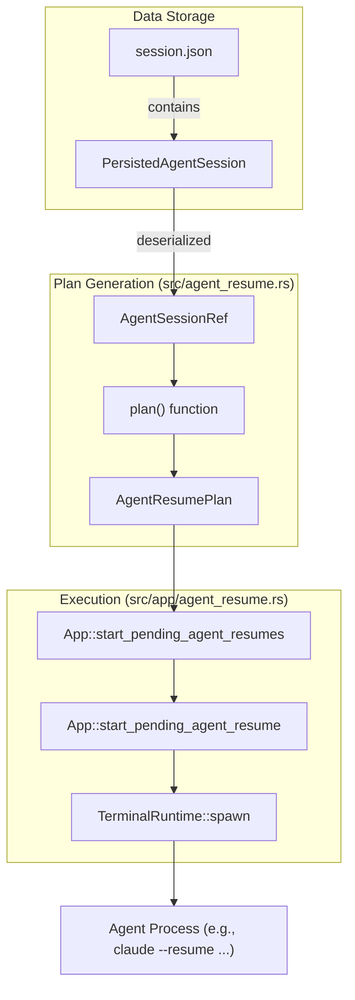

# Agent Session Resume

<details>
<summary>Relevant source files</summary>

The following files were used as context for generating this wiki page:

- [docs/next/website/src/content/docs/integrations.mdx](https://github.com/herdrdev/herdr/blob/HEAD/docs/next/website/src/content/docs/integrations.mdx)
- [docs/next/website/src/content/docs/session-state.mdx](https://github.com/herdrdev/herdr/blob/HEAD/docs/next/website/src/content/docs/session-state.mdx)
- [src/agent_resume.rs](https://github.com/herdrdev/herdr/blob/HEAD/src/agent_resume.rs)
- [src/app/agent_resume.rs](https://github.com/herdrdev/herdr/blob/HEAD/src/app/agent_resume.rs)
- [src/app/api/agents.rs](https://github.com/herdrdev/herdr/blob/HEAD/src/app/api/agents.rs)
- [src/app/api_helpers.rs](https://github.com/herdrdev/herdr/blob/HEAD/src/app/api_helpers.rs)
- [src/cli/agent.rs](https://github.com/herdrdev/herdr/blob/HEAD/src/cli/agent.rs)
- [src/cli/server_not_running.rs](https://github.com/herdrdev/herdr/blob/HEAD/src/cli/server_not_running.rs)
- [src/cli/status.rs](https://github.com/herdrdev/herdr/blob/HEAD/src/cli/status.rs)
- [src/integration/mod.rs](https://github.com/herdrdev/herdr/blob/HEAD/src/integration/mod.rs)
- [src/pane/terminal/windows_recent_fallback.rs](https://github.com/herdrdev/herdr/blob/HEAD/src/pane/terminal/windows_recent_fallback.rs)
- [src/server/handoff.rs](https://github.com/herdrdev/herdr/blob/HEAD/src/server/handoff.rs)
- [src/terminal/state.rs](https://github.com/herdrdev/herdr/blob/HEAD/src/terminal/state.rs)
- [tests/cli/agents.rs](https://github.com/herdrdev/herdr/blob/HEAD/tests/cli/agents.rs)
- [tests/live_handoff.rs](https://github.com/herdrdev/herdr/blob/HEAD/tests/live_handoff.rs)

</details>


Agent Session Resume is the mechanism by which `herdr` restores AI coding agent conversations across server restarts. Unlike standard terminal panes which return as fresh shells, agent-aware panes can re-invoke the agent process with specific flags to continue a previous session, provided a native session reference was captured before the server stopped [docs/next/website/src/content/docs/session-state.mdx:50-52](https://github.com/herdrdev/herdr/blob/HEAD/docs/next/website/src/content/docs/session-state.mdx#L50-L52).

## Core Mechanisms

`herdr` differentiates between standard snapshot restoration and native agent resume. While a snapshot restores the layout and working directory, the Agent Session Resume path specifically targets the re-execution of the agent binary with session-persisting arguments [docs/next/website/src/content/docs/session-state.mdx:31-35](https://github.com/herdrdev/herdr/blob/HEAD/docs/next/website/src/content/docs/session-state.mdx#L31-L35).

### Agent Session Identifiers
The system tracks two primary types of session references defined in the `AgentSessionRef` struct [src/agent_resume.rs:9-12](https://github.com/herdrdev/herdr/blob/HEAD/src/agent_resume.rs#L9-L12):
1.  **`Id`**: A string-based unique identifier (e.g., a UUID or hash) [src/agent_resume.rs:17](https://github.com/herdrdev/herdr/blob/HEAD/src/agent_resume.rs#L17).
2.  **`Path`**: A file system path pointing to a session database or state file [src/agent_resume.rs:18](https://github.com/herdrdev/herdr/blob/HEAD/src/agent_resume.rs#L18).

These references are validated against length constraints (`MAX_SESSION_ID_LEN` = 512, `MAX_SESSION_PATH_LEN` = 4096) before being accepted [src/agent_resume.rs:5-6](https://github.com/herdrdev/herdr/blob/HEAD/src/agent_resume.rs#L5-L6).

### The Resume Plan
When a session is restored, the `App` generates an `AgentResumePlan` [src/agent_resume.rs:22-26](https://github.com/herdrdev/herdr/blob/HEAD/src/agent_resume.rs#L22-L26). This plan contains the specific command-line arguments (`argv`) required to resume the agent. For example:
*   **Claude Code**: `claude --resume <id>` [src/agent_resume.rs:122-127](https://github.com/herdrdev/herdr/blob/HEAD/src/agent_resume.rs#L122-L127).
*   **GitHub Copilot CLI**: `copilot --resume=<id>` [src/agent_resume.rs:132-134](https://github.com/herdrdev/herdr/blob/HEAD/src/agent_resume.rs#L132-L134).
*   **Pi**: `pi --session <path-or-id>` [src/agent_resume.rs:151-153](https://github.com/herdrdev/herdr/blob/HEAD/src/agent_resume.rs#L151-L153).

### Code Entity Space: Resume Logic Flow

The following diagram illustrates how the `App` transitions from a persisted session to a running agent process.

| Entity | Role |
| :--- | :--- |
| `PersistedAgentSession` | Data structure containing the `agent_session_id` or `path` from `session.json`. |
| `AgentResumePlan` | The calculated `argv` used to spawn the new process. |
| `start_pending_agent_resume` | The `App` method that executes the plan. |


**Sources:** [src/agent_resume.rs:22-26](https://github.com/herdrdev/herdr/blob/HEAD/src/agent_resume.rs#L22-L26), [src/agent_resume.rs:116-121](https://github.com/herdrdev/herdr/blob/HEAD/src/agent_resume.rs#L116-L121), [src/app/agent_resume.rs:43-45](https://github.com/herdrdev/herdr/blob/HEAD/src/app/agent_resume.rs#L43-L45), [src/app/agent_resume.rs:204-213](https://github.com/herdrdev/herdr/blob/HEAD/src/app/agent_resume.rs#L204-L213), [src/agent_resume.rs:29-33](https://github.com/herdrdev/herdr/blob/HEAD/src/agent_resume.rs#L29-L33)

## Official Agent Integrations

Herdr only attempts to resume agents that use "official" integration sources [src/agent_resume.rs:59-61](https://github.com/herdrdev/herdr/blob/HEAD/src/agent_resume.rs#L59-L61). This ensures that the resume commands are well-formed and supported by the specific agent version.

### Integration Version Requirements
Native session restore requires specific minimum integration versions [docs/next/website/src/content/docs/session-state.mdx:67-83](https://github.com/herdrdev/herdr/blob/HEAD/docs/next/website/src/content/docs/session-state.mdx#L67-L83):

| Agent | Minimum Herdr integration version | Resume command |
| :--- | :--- | :--- |
| Pi | `2` | `pi --session <path-or-id>` |
| Antigravity CLI | `1` | `agy --conversation <id>` |
| OMP | `3` | `omp --resume=<path-or-id>` |
| Claude Code | `6` | `claude --resume <id>` |
| Codex | `5` | `codex resume <id>` |
| Cursor Agent CLI | `1` | `cursor-agent --resume <id>` |
| Grok CLI | `1` | `grok --resume <id>` |
| GitHub Copilot CLI | `2` | `copilot --resume=<id>` |
| Devin CLI | `2` | `devin --resume <id>` |
| Droid | `2` | `droid --resume <id>` |
| Kimi Code CLI | `3` | `kimi --session <id>` |
| Qoder CLI | `2` | `qodercli --resume <id>` |
| OpenCode | `5` | `opencode --session <id>` |
| Kilo Code CLI | `1` | `kilo --session <id>` |
| Hermes Agent | `2` | `hermes --resume <id>` |
| MastraCode | `1` | `mastracode --thread <id>` |

**Sources:** [docs/next/website/src/content/docs/session-state.mdx:67-83](https://github.com/herdrdev/herdr/blob/HEAD/docs/next/website/src/content/docs/session-state.mdx#L67-L83), [src/agent_resume.rs:121-204](https://github.com/herdrdev/herdr/blob/HEAD/src/agent_resume.rs#L121-L204)

## Data Flow: Session Capture to Restore

The lifecycle of an agent session reference involves capture via hooks and restoration via the `App` event loop.

```mermaid
sequenceDiagram
    participant Coding_Agent as "Coding Agent"
    participant Herdr_Integration_Hook_Plugin as "Herdr Integration (Hook/Plugin)"
    participant Herdr_Socket_API as "Herdr Socket API"
    participant TerminalState_src_terminal_state_rs as "TerminalState (src/terminal/state.rs)"
    participant Disk_session_json as "Disk (session.json)"
    participant App_src_app_agent_resume_rs as "App (src/app/agent_resume.rs)"
    participant TerminalRuntime as "TerminalRuntime"
    participant A as Coding_Agent
    participant H as Herdr_Integration_Hook_Plugin
    participant S as Herdr_Socket_API
    participant T as TerminalState_src_terminal_state_rs
    participant D as Disk_session_json
    participant App as App_src_app_agent_resume_rs
    participant TR as TerminalRuntime

    box "Capture Phase"
        A->>H: "Starts/Updates Session"
        H->>S: "pane.report_agent(agent_session_id, agent_session_path)"
        S->>T: "Update TerminalState.persisted_agent_session"
        T->>D: "Periodic Save (session.json)"
    end

    box "Restore Phase (Server Restart)"
        D->>App: "Load Session Snapshot"
        App->>App: "App::sync_pending_agent_resume_deadline()"
        App->>App: "App::pending_agent_resume_candidates()"
        App->>App: "App::start_pending_agent_resumes()"
        App->>TR: "TerminalRuntime::spawn(AgentResumePlan.argv)"
    end
```
**Sources:** [docs/next/website/src/content/docs/integrations.mdx:109-111](https://github.com/herdrdev/herdr/blob/HEAD/docs/next/website/src/content/docs/integrations.mdx#L109-L111), [src/app/agent_resume.rs:25-36](https://github.com/herdrdev/herdr/blob/HEAD/src/app/agent_resume.rs#L25-L36), [src/app/agent_resume.rs:157-163](https://github.com/herdrdev/herdr/blob/HEAD/src/app/agent_resume.rs#L157-L163), [src/terminal/state.rs:129](https://github.com/herdrdev/herdr/blob/HEAD/src/terminal/state.rs#L129), [src/agent_resume.rs:53-70](https://github.com/herdrdev/herdr/blob/HEAD/src/agent_resume.rs#L53-L70)

## Configuration and Constraints

### Enabling/Disabling
Agent resume is enabled by default. It can be disabled in `config.toml` [docs/next/website/src/content/docs/session-state.mdx:54-59](https://github.com/herdrdev/herdr/blob/HEAD/docs/next/website/src/content/docs/session-state.mdx#L54-L59):

```toml
[session]
resume_agents_on_restore = false
```

### The Theme Wait Period
Because agents often render rich UI, `herdr` waits for a client to attach and provide terminal dimensions and theme information before resuming. This is managed by `PENDING_AGENT_RESUME_THEME_WAIT` [src/app/agent_resume.rs:35](https://github.com/herdrdev/herdr/blob/HEAD/src/app/agent_resume.rs#L35).

### Deduplication
To prevent multiple panes from resuming the same agent session (which could lead to state corruption), `herdr` uses a `dedupe_key` generated from the source, agent name, and session reference [src/agent_resume.rs:203-208](https://github.com/herdrdev/herdr/blob/HEAD/src/agent_resume.rs#L203-L208).

### Target Resolution
The `App` uses `resolve_agent_target` to map CLI or API requests to specific workspace and pane indices before performing resume or rename operations [src/app/api/agents.rs:38-40](https://github.com/herdrdev/herdr/blob/HEAD/src/app/api/agents.rs#L38-L40), [src/app/api/agents.rs:93-95](https://github.com/herdrdev/herdr/blob/HEAD/src/app/api/agents.rs#L93-L95).

**Sources:** [docs/next/website/src/content/docs/session-state.mdx:54-59](https://github.com/herdrdev/herdr/blob/HEAD/docs/next/website/src/content/docs/session-state.mdx#L54-L59), [src/app/agent_resume.rs:34-36](https://github.com/herdrdev/herdr/blob/HEAD/src/app/agent_resume.rs#L34-L36), [src/agent_resume.rs:203-208](https://github.com/herdrdev/herdr/blob/HEAD/src/agent_resume.rs#L203-L208), [src/app/api/agents.rs:38-40](https://github.com/herdrdev/herdr/blob/HEAD/src/app/api/agents.rs#L38-L40)