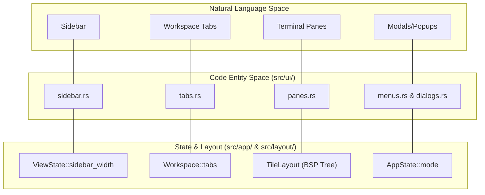
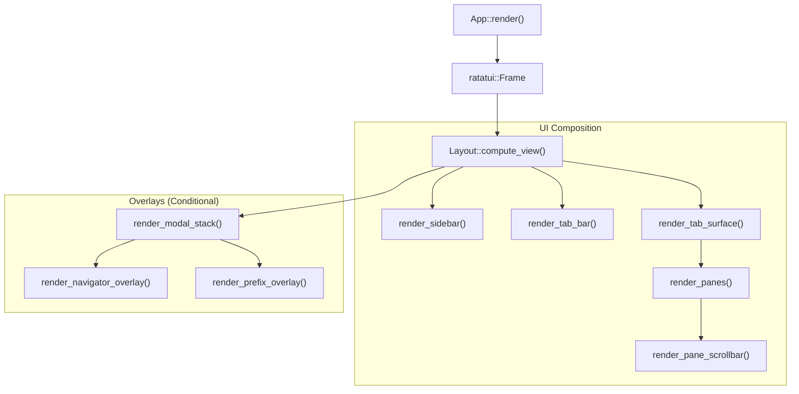

# User Interface

Relevant source files

The following files were used as context for generating this wiki page:

- [src/app/mod.rs](https://github.com/herdrdev/herdr/blob/HEAD/src/app/mod.rs)
- [src/app/state.rs](https://github.com/herdrdev/herdr/blob/HEAD/src/app/state.rs)
- [src/config.rs](https://github.com/herdrdev/herdr/blob/HEAD/src/config.rs)
- [src/config/model.rs](https://github.com/herdrdev/herdr/blob/HEAD/src/config/model.rs)
- [src/main.rs](https://github.com/herdrdev/herdr/blob/HEAD/src/main.rs)
- [src/ui.rs](https://github.com/herdrdev/herdr/blob/HEAD/src/ui.rs)
- [src/ui/panes.rs](https://github.com/herdrdev/herdr/blob/HEAD/src/ui/panes.rs)
- [src/ui/tabs.rs](https://github.com/herdrdev/herdr/blob/HEAD/src/ui/tabs.rs)

Herdr provides a high-performance, responsive Terminal User Interface (TUI) built on the `ratatui` library [src/ui.rs:1-6](https://github.com/herdrdev/herdr/blob/HEAD/src/ui.rs#L1-L6). The UI is designed to accommodate both desktop and mobile layouts, featuring a persistent sidebar, a tabbed workspace system, and a sophisticated modal overlay system for complex interactions.

The UI is driven by a stateless rendering pattern where `AppState` [src/app/state.rs:276-378](https://github.com/herdrdev/herdr/blob/HEAD/src/app/state.rs#L276-L378) is transformed into visual components during each frame.

## UI Architecture Overview

The interface is structured as a hierarchy of components managed within `src/ui.rs`. The rendering pipeline is split into two distinct phases: **Geometry Calculation** and **Drawing**.

1.  **Geometry Calculation (`compute_view`)**: Calculates the `Rect` areas for every UI element (sidebar, tabs, panes) based on the current terminal size and configuration [src/ui.rs:111-156](https://github.com/herdrdev/herdr/blob/HEAD/src/ui.rs#L111-L156).
2.  **Drawing (`render`)**: The `ratatui::Frame` is populated with widgets using the pre-calculated geometry [src/ui.rs:252-404](https://github.com/herdrdev/herdr/blob/HEAD/src/ui.rs#L252-L404).

### System Component Map

The following diagram maps high-level UI concepts to their underlying code entities and state management.

Sources: [src/ui.rs:8-23](https://github.com/herdrdev/herdr/blob/HEAD/src/ui.rs#L8-L23), [src/app/state.rs:276-378](https://github.com/herdrdev/herdr/blob/HEAD/src/app/state.rs#L276-L378), [src/layout/mod.rs:14-25](https://github.com/herdrdev/herdr/blob/HEAD/src/layout/mod.rs#L14-L25)

## View Geometry and Rendering

Herdr supports two primary layout modes: **Desktop** and **Mobile**. The transition is determined by `ui.mobile_width_threshold` in the configuration [src/config.model.rs:9](https://github.com/herdrdev/herdr/blob/HEAD/src/config.model.rs#L9).

*   **Desktop Mode**: Features a side-by-side layout with an optional sidebar (collapsed or expanded) and a top tab bar [src/ui.rs:191-209](https://github.com/herdrdev/herdr/blob/HEAD/src/ui.rs#L191-L209).
*   **Mobile Mode**: Optimized for narrow widths, hiding the sidebar in favor of a "Mobile Switcher" overlay and a condensed header [src/ui.rs:34-38](https://github.com/herdrdev/herdr/blob/HEAD/src/ui.rs#L34-L38).

The rendering pipeline utilizes a `TabSurface` abstraction to handle the complex rendering of terminal grids, including scrollbars and hit-area detection for mouse interactions [src/ui/tab_surface.rs:62-64](https://github.com/herdrdev/herdr/blob/HEAD/src/ui/tab_surface.rs#L62-L64).

For details, see [View Geometry and Rendering Pipeline](21_5.1-view-geometry-and-rendering-pipeline.md).

Sources: [src/ui.rs:111-156](https://github.com/herdrdev/herdr/blob/HEAD/src/ui.rs#L111-L156), [src/ui/mobile.rs:34-38](https://github.com/herdrdev/herdr/blob/HEAD/src/ui/mobile.rs#L34-L38), [src/config/model.rs:9](https://github.com/herdrdev/herdr/blob/HEAD/src/config/model.rs#L9)

## Input and Modal System

The UI behavior is governed by a `Mode` state machine [src/app/state.rs:256-274](https://github.com/herdrdev/herdr/blob/HEAD/src/app/state.rs#L256-L274):

| Mode | Description |
| :--- | :--- |
| `Terminal` | Raw input is forwarded directly to the active PTY. |
| `Prefix` | Triggered by `ctrl+b` (default), waiting for a command shortcut. |
| `Navigate` | Modal navigation for workspaces and panes using arrow/vim keys. |
| `Copy` | Scrollback exploration and text selection mode. |

When in non-terminal modes, Herdr renders **Modal Overlays** such as the `Global Launcher`, `Navigator`, or `Settings` dialogs [src/ui/menus.rs:30-33](https://github.com/herdrdev/herdr/blob/HEAD/src/ui/menus.rs#L30-L33).

For details, see [Input Handling and Modal System](22_5.2-input-handling-and-modal-system.md).

Sources: [src/app/state.rs:256-274](https://github.com/herdrdev/herdr/blob/HEAD/src/app/state.rs#L256-L274), [src/ui/menus.rs:30-33](https://github.com/herdrdev/herdr/blob/HEAD/src/ui/menus.rs#L30-L33)

## Sidebar and Panels

The sidebar is the primary navigation hub, divided into two main panels:
1.  **Spaces**: Lists all active `Workspace` entities, their associated Git branches, and worktrees [src/ui/sidebar.rs:82-87](https://github.com/herdrdev/herdr/blob/HEAD/src/ui/sidebar.rs#L82-L87).
2.  **Agents**: Displays detected AI coding agents, showing their status (Idle/Working), token usage, and session metadata [src/ui/sidebar.rs:79-81](https://github.com/herdrdev/herdr/blob/HEAD/src/ui/sidebar.rs#L79-L81).

The sidebar supports manual resizing via mouse drag and can be toggled between `Expanded`, `Collapsed`, and `Hidden` states [src/config/model.rs:144-148](https://github.com/herdrdev/herdr/blob/HEAD/src/config/model.rs#L144-L148).

For details, see [Sidebar, Navigator, and Agent Panel](23_5.3-sidebar-navigator-and-agent-panel.md).

Sources: [src/ui/sidebar.rs:78-89](https://github.com/herdrdev/herdr/blob/HEAD/src/ui/sidebar.rs#L78-L89), [src/app/state.rs:305-315](https://github.com/herdrdev/herdr/blob/HEAD/src/app/state.rs#L305-L315), [src/config/model.rs:144-148](https://github.com/herdrdev/herdr/blob/HEAD/src/config/model.rs#L144-L148)

## Theming and Visuals

Herdr implements a centralized `Palette` system [src/app/state.rs:103-138](https://github.com/herdrdev/herdr/blob/HEAD/src/app/state.rs#L103-L138). Themes are not just static color sets; they can be automatically switched based on the host terminal's appearance (Light/Dark mode) using OSC queries [src/app/theme_sync.rs:25](https://github.com/herdrdev/herdr/blob/HEAD/src/app/theme_sync.rs#L25).

### UI Element Relationship Diagram

Sources: [src/ui.rs:252-404](https://github.com/herdrdev/herdr/blob/HEAD/src/ui.rs#L252-L404), [src/ui/widgets.rs:100](https://github.com/herdrdev/herdr/blob/HEAD/src/ui/widgets.rs#L100)

For details, see [Theming System](24_5.4-theming-system.md).

Sources: [src/app/state.rs:103-138](https://github.com/herdrdev/herdr/blob/HEAD/src/app/state.rs#L103-L138), [src/app/theme_sync.rs:25](https://github.com/herdrdev/herdr/blob/HEAD/src/app/theme_sync.rs#L25)