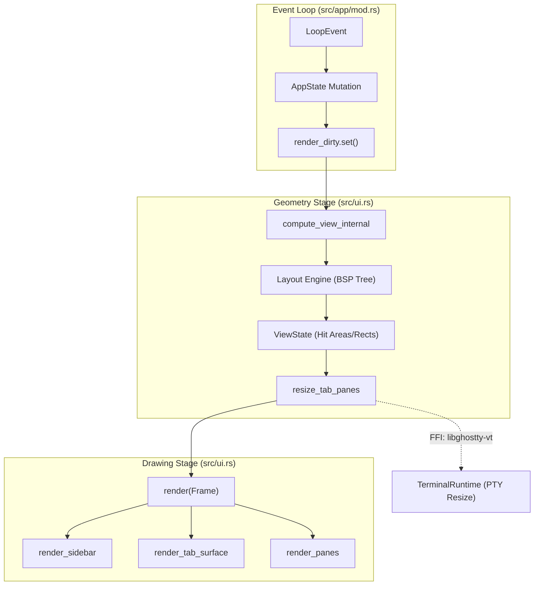
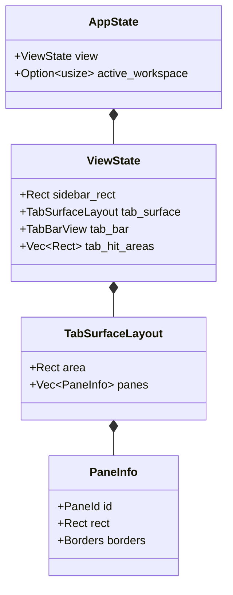
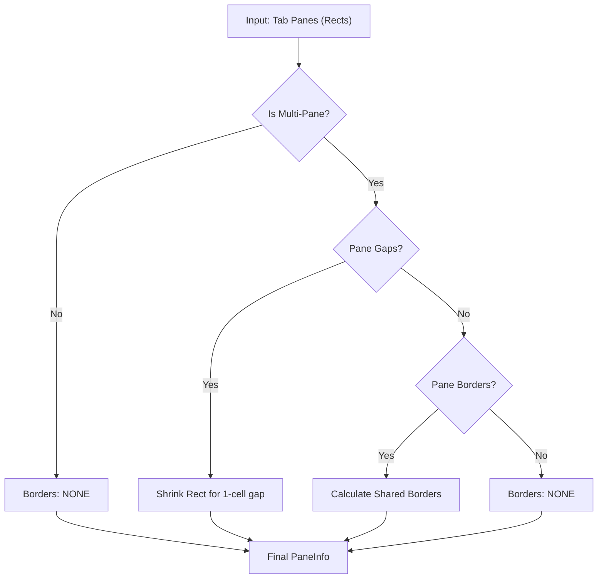

# View Geometry and Rendering Pipeline

Relevant source files

The following files were used as context for generating this wiki page:

- [src/app/mod.rs](https://github.com/herdrdev/herdr/blob/HEAD/src/app/mod.rs)
- [src/app/state.rs](https://github.com/herdrdev/herdr/blob/HEAD/src/app/state.rs)
- [src/config.rs](https://github.com/herdrdev/herdr/blob/HEAD/src/config.rs)
- [src/config/model.rs](https://github.com/herdrdev/herdr/blob/HEAD/src/config/model.rs)
- [src/main.rs](https://github.com/herdrdev/herdr/blob/HEAD/src/main.rs)
- [src/ui.rs](https://github.com/herdrdev/herdr/blob/HEAD/src/ui.rs)
- [src/ui/dialogs.rs](https://github.com/herdrdev/herdr/blob/HEAD/src/ui/dialogs.rs)
- [src/ui/panes.rs](https://github.com/herdrdev/herdr/blob/HEAD/src/ui/panes.rs)
- [src/ui/tabs.rs](https://github.com/herdrdev/herdr/blob/HEAD/src/ui/tabs.rs)

The rendering pipeline in `herdr` follows a stateless "Drain-Handle-Render" cycle. To ensure consistency between the visual display and mouse interaction, the system uses a two-stage approach: **Geometry Computation** (`compute_view`) and **Drawing** (`render`). This separation allows the application to calculate hit areas for mouse events and resize terminal runtimes before any pixels are drawn to the screen.

## Rendering Lifecycle

The `App` struct manages the main event loop, which triggers a render when the `render_dirty` signal is set [src/app/mod.rs:146](https://github.com/herdrdev/herdr/blob/HEAD/src/app/mod.rs#L146). The pipeline operates as follows:

1.  **Drain**: Events (Input, API, Internal) are consumed and applied to `AppState`.
2.  **Compute**: `compute_view_internal` calculates the `Rect` for every UI element (panes, sidebars, tabs) based on the current terminal size.
3.  **Resize**: Pane runtimes (PTYs) are resized to match their calculated geometry [src/ui/panes.rs:197-202](https://github.com/herdrdev/herdr/blob/HEAD/src/ui/panes.rs#L197-L202).
4.  **Render**: The `ratatui` frame is drawn using the pre-computed `ViewState`.

### Rendering Data Flow

Title: UI Geometry and Rendering Flow

Sources: [src/app/mod.rs:97-168](https://github.com/herdrdev/herdr/blob/HEAD/src/app/mod.rs#L97-L168), [src/ui.rs:111-157](https://github.com/herdrdev/herdr/blob/HEAD/src/ui.rs#L111-L157), [src/ui/panes.rs:197-202](https://github.com/herdrdev/herdr/blob/HEAD/src/ui/panes.rs#L197-L202)

## View Geometry Computation

The core of the layout logic resides in `compute_view_internal`. It determines whether to use a **Desktop** or **Mobile** layout based on the terminal width [src/ui/mobile.rs:32-34](https://github.com/herdrdev/herdr/blob/HEAD/src/ui/mobile.rs#L32-L34).

### Desktop vs Mobile Layouts

| Feature | Desktop Layout | Mobile Layout |
| :--- | :--- | :--- |
| **Trigger** | Width > `config.ui.mobile_width_threshold` | Width <= threshold |
| **Sidebar** | Persistent (Expanded or Collapsed) | Overlay Panel (Hidden by default) |
| **Tab Bar** | Top-aligned, scrollable | Header with "Switcher" overlay |
| **Source** | [src/ui.rs:191-230](https://github.com/herdrdev/herdr/blob/HEAD/src/ui.rs#L191-L230) | [src/ui.rs:248-283](https://github.com/herdrdev/herdr/blob/HEAD/src/ui.rs#L248-L283) |

### Sidebar Scaling
The sidebar width is determined by `SidebarConfig`. It can be `Expanded` (user-defined width), `Collapsed` (fixed width of 4), or `Hidden` [src/config/sidebar.rs:10-12](https://github.com/herdrdev/herdr/blob/HEAD/src/config/sidebar.rs#L10-L12).
*   **Collapsed**: Fixed at `COLLAPSED_WIDTH` (4 cells) to show workspace numbers and status dots [src/ui.rs:106](https://github.com/herdrdev/herdr/blob/HEAD/src/ui.rs#L106).
*   **Expanded**: Constraints are applied based on `sidebar_min_width` and `sidebar_max_width` from `config.toml` [src/config.rs:81-88](https://github.com/herdrdev/herdr/blob/HEAD/src/config.rs#L81-L88).

Sources: [src/ui.rs:106](https://github.com/herdrdev/herdr/blob/HEAD/src/ui.rs#L106), [src/ui.mobile.rs:32-34](https://github.com/herdrdev/herdr/blob/HEAD/src/ui.mobile.rs#L32-L34), [src/config/sidebar.rs:10-12](https://github.com/herdrdev/herdr/blob/HEAD/src/config/sidebar.rs#L10-L12), [src/config.rs:81-88](https://github.com/herdrdev/herdr/blob/HEAD/src/config.rs#L81-L88)

## Tab Surface and Pane Layout

The `TabSurfaceLayout` struct caches the results of the layout engine for a specific tab. This includes the geometry for every pane in the BSP (Binary Space Partitioning) tree [src/ui/tab_surface.rs:62-64](https://github.com/herdrdev/herdr/blob/HEAD/src/ui/tab_surface.rs#L62-L64).

### Hit Area Calculation
For mouse support, `herdr` calculates "hit areas" during the compute phase. These are stored in `ViewState` and used during input handling to map a screen coordinate to a specific action:
*   **Tab Hit Areas**: Calculated in `compute_tab_bar_view` to handle tab switching and "New Tab" button clicks [src/ui/tabs.rs:110-135](https://github.com/herdrdev/herdr/blob/HEAD/src/ui/tabs.rs#L110-L135).
*   **Sidebar Hit Areas**: Tracks workspace cards and agent entries for scrolling and selection [src/ui/sidebar.rs:78-88](https://github.com/herdrdev/herdr/blob/HEAD/src/ui/sidebar.rs#L78-L88).
*   **Pane Hit Areas**: Derived from `apply_pane_chrome`, which accounts for borders and gaps [src/ui/panes.rs:90-155](https://github.com/herdrdev/herdr/blob/HEAD/src/ui/panes.rs#L90-L155).

Title: Geometry to Code Entity Mapping

Sources: [src/app/state.rs:1-104](https://github.com/herdrdev/herdr/blob/HEAD/src/app/state.rs#L1-L104), [src/ui.rs:62-65](https://github.com/herdrdev/herdr/blob/HEAD/src/ui.rs#L62-L65), [src/ui/panes.rs:16-18](https://github.com/herdrdev/herdr/blob/HEAD/src/ui/panes.rs#L16-L18), [src/ui/tabs.rs:110-135](https://github.com/herdrdev/herdr/blob/HEAD/src/ui/tabs.rs#L110-L135), [src/ui/sidebar.rs:78-88](https://github.com/herdrdev/herdr/blob/HEAD/src/ui/sidebar.rs#L78-L88)

## The Stateless Render Pattern

The `render` function in `src/ui.rs` is essentially a pure function of `AppState`. It does not perform I/O or mutate the application state; it only reads the pre-computed `ViewState` to draw widgets to the `ratatui::Frame`.

### Pane Rendering and Chrome
`apply_pane_chrome` is responsible for calculating how borders and gaps are distributed between adjacent panes [src/ui/panes.rs:90-155](https://github.com/herdrdev/herdr/blob/HEAD/src/ui/panes.rs#L90-L155):
1.  **Gaps**: If `pane_gaps` is enabled, it shrinks the `Rect` of panes that have neighbors to the right or below [src/ui/panes.rs:117-122](https://github.com/herdrdev/herdr/blob/HEAD/src/ui/panes.rs#L117-L122).
2.  **Borders**: If `pane_borders` is enabled, it calculates which sides of the pane should have borders based on proximity to other panes [src/ui/panes.rs:125-151](https://github.com/herdrdev/herdr/blob/HEAD/src/ui/panes.rs#L125-L151).

### Scrollbar Logic
Scrollbars are rendered conditionally based on `ScrollMetrics`. The gutter is "stable," meaning the terminal content width is reduced by 1 cell if a scrollbar is possible, preventing the text from reflowing when the user scrolls back into history [src/ui/panes.rs:173-194](https://github.com/herdrdev/herdr/blob/HEAD/src/ui/panes.rs#L173-L194).

Title: Pane Chrome Calculation

Sources: [src/ui/panes.rs:90-155](https://github.com/herdrdev/herdr/blob/HEAD/src/ui/panes.rs#L90-L155), [src/ui/panes.rs:117-122](https://github.com/herdrdev/herdr/blob/HEAD/src/ui/panes.rs#L117-L122), [src/ui/panes.rs:125-151](https://github.com/herdrdev/herdr/blob/HEAD/src/ui/panes.rs#L125-L151)

## Summary of Key Functions

| Function | File | Purpose |
| :--- | :--- | :--- |
| `compute_view_internal` | `src/ui.rs` | Orchestrates the entire geometry calculation phase. |
| `resize_tab_panes` | `src/ui/panes.rs` | Propagates calculated geometry to the underlying PTY runtimes. |
| `apply_pane_chrome` | `src/ui/panes.rs` | Adjusts pane `Rects` for borders and spacing. |
| `compute_tab_bar_view` | `src/ui/tabs.rs` | Calculates hit areas for the scrollable tab bar. |
| `render` | `src/ui.rs` | The top-level drawing function. |

Sources: [src/ui.rs:111-157](https://github.com/herdrdev/herdr/blob/HEAD/src/ui.rs#L111-L157), [src/ui/panes.rs:197-202](https://github.com/herdrdev/herdr/blob/HEAD/src/ui/panes.rs#L197-L202), [src/ui/panes.rs:90-155](https://github.com/herdrdev/herdr/blob/HEAD/src/ui/panes.rs#L90-L155), [src/ui/tabs.rs:110-205](https://github.com/herdrdev/herdr/blob/HEAD/src/ui/tabs.rs#L110-L205)