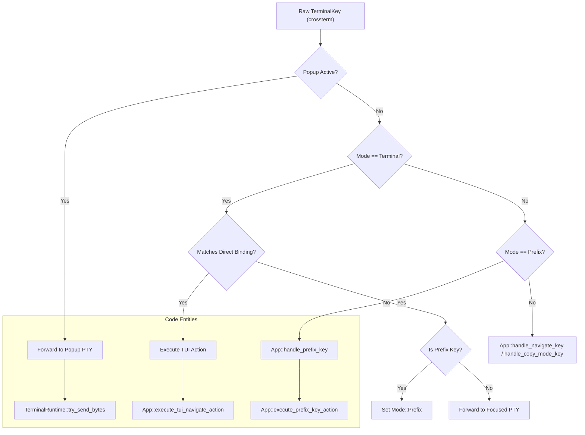
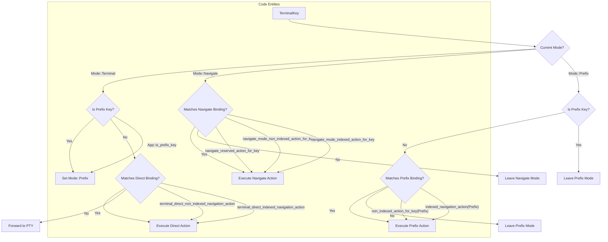
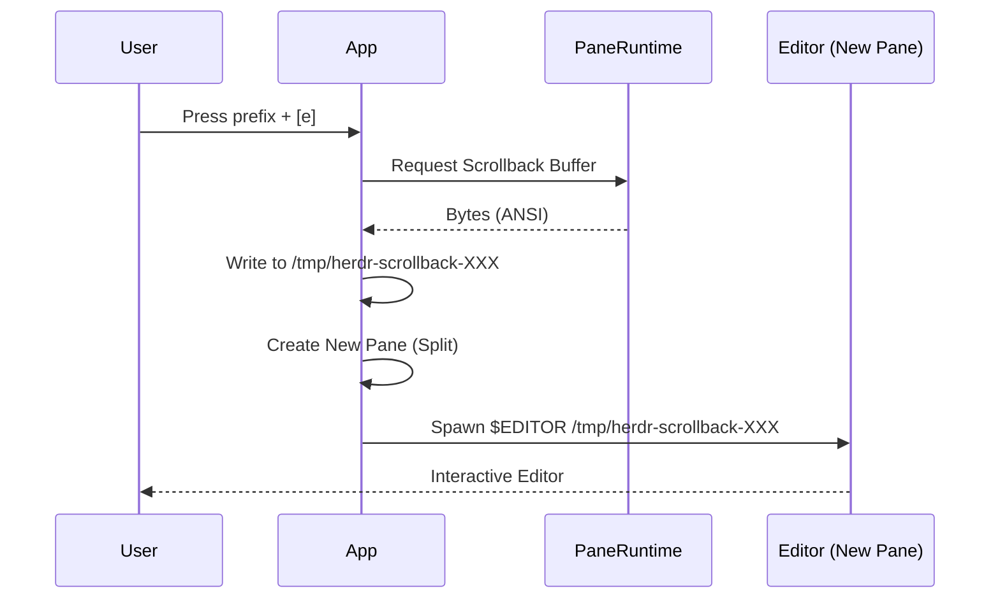

# Input Handling and Modal System

Relevant source files

The following files were used as context for generating this wiki page:

- [docs/next/website/src/content/docs/ja/keyboard.mdx](https://github.com/herdrdev/herdr/blob/HEAD/docs/next/website/src/content/docs/ja/keyboard.mdx)
- [docs/next/website/src/content/docs/keyboard.mdx](https://github.com/herdrdev/herdr/blob/HEAD/docs/next/website/src/content/docs/keyboard.mdx)
- [docs/next/website/src/content/docs/zh-cn/keyboard.mdx](https://github.com/herdrdev/herdr/blob/HEAD/docs/next/website/src/content/docs/zh-cn/keyboard.mdx)
- [src/app/input/copy_mode.rs](https://github.com/herdrdev/herdr/blob/HEAD/src/app/input/copy_mode.rs)
- [src/app/input/mod.rs](https://github.com/herdrdev/herdr/blob/HEAD/src/app/input/mod.rs)
- [src/app/input/modal.rs](https://github.com/herdrdev/herdr/blob/HEAD/src/app/input/modal.rs)
- [src/app/input/mouse.rs](https://github.com/herdrdev/herdr/blob/HEAD/src/app/input/mouse.rs)
- [src/app/input/navigate.rs](https://github.com/herdrdev/herdr/blob/HEAD/src/app/input/navigate.rs)
- [src/app/input/overlays.rs](https://github.com/herdrdev/herdr/blob/HEAD/src/app/input/overlays.rs)
- [src/app/input/sidebar.rs](https://github.com/herdrdev/herdr/blob/HEAD/src/app/input/sidebar.rs)
- [src/app/input/terminal.rs](https://github.com/herdrdev/herdr/blob/HEAD/src/app/input/terminal.rs)
- [src/config/keybinds.rs](https://github.com/herdrdev/herdr/blob/HEAD/src/config/keybinds.rs)
- [src/selection.rs](https://github.com/herdrdev/herdr/blob/HEAD/src/selection.rs)
- [src/ui/keybind_help.rs](https://github.com/herdrdev/herdr/blob/HEAD/src/ui/keybind_help.rs)
- [src/ui/menus.rs](https://github.com/herdrdev/herdr/blob/HEAD/src/ui/menus.rs)
- [src/ui/release_notes.rs](https://github.com/herdrdev/herdr/blob/HEAD/src/ui/release_notes.rs)

The herdr input system is a hierarchical state machine that routes terminal events (keyboard and mouse) through various layers of interception before they reach the underlying PTY. This system manages the transition between terminal interaction, command modes, and complex TUI overlays.

## Overview of the Mode State Machine

The application state (`AppState`) maintains a `Mode` enum that determines how input is routed. While the default mode is `Terminal` (pass-through), several other modes intercept keys to provide window management, navigation, and text manipulation features.

| Mode | Purpose |
| :--- | :--- |
| `Terminal` | Default state; keys are forwarded to the focused PTY unless they match a "Direct" keybinding. |
| `Prefix` | Entered via the prefix key (e.g., `Ctrl+b`). The next key is interpreted as a command. |
| `Navigate` | Entered via `prefix+g`. Provides a modal interface for workspace/tab/pane selection. |
| `Copy` | A Vi-like scrollback buffer exploration and selection mode. |
| `KeybindHelp` | A searchable overlay showing all active keybindings. |

Sources: [src/app/state.rs](https://github.com/herdrdev/herdr/blob/HEAD/src/app/state.rs), [src/app/input/mod.rs:91-122](https://github.com/herdrdev/herdr/blob/HEAD/src/app/input/mod.rs#L91-L122)

## Input Routing Hierarchy

Input flows through the `App::handle_key` function, which acts as the primary router. The routing priority is as follows:

1.  **Popup Interception**: If a popup pane is active, all keyboard input is forwarded directly to it [src/app/input/terminal.rs:80-82](https://github.com/herdrdev/herdr/blob/HEAD/src/app/input/terminal.rs#L80-L82).
2.  **Modal Shortcut Interception**: Specific global shortcuts (like paste into text inputs) are handled [src/app/input/mod.rs:84-89](https://github.com/herdrdev/herdr/blob/HEAD/src/app/input/mod.rs#L84-L89).
3.  **Mode-Specific Dispatch**: The event is handed to a handler corresponding to the current `Mode` [src/app/input/mod.rs:91-120](https://github.com/herdrdev/herdr/blob/HEAD/src/app/input/mod.rs#L91-L120).
4.  **Terminal Direct Interception**: In `Terminal` mode, keys are checked against "Direct" keybindings (e.g., `Alt+Left` to switch panes) before being sent to the PTY [src/app/input/terminal.rs:77-120](https://github.com/herdrdev/herdr/blob/HEAD/src/app/input/terminal.rs#L77-L120).

### Keyboard Event Data Flow

The following diagram illustrates how a raw `TerminalKey` (parsed from crossterm) is processed:

Sources: [src/app/input/mod.rs:76-122](https://github.com/herdrdev/herdr/blob/HEAD/src/app/input/mod.rs#L76-L122), [src/app/input/terminal.rs:39-61](https://github.com/herdrdev/herdr/blob/HEAD/src/app/input/terminal.rs#L39-L61), [src/app/input/navigate.rs:60-104](https://github.com/herdrdev/herdr/blob/HEAD/src/app/input/navigate.rs#L60-L104)

## Keybinding Resolution and Conflict Detection

Keybindings are defined in `Config` and resolved into `LiveKeybindConfig`. The resolution logic handles three distinct contexts, represented by the `ActionContext` enum [src/app/input/navigate.rs:47-51](https://github.com/herdrdev/herdr/blob/HEAD/src/app/input/navigate.rs#L47-L51):

*   **Direct**: Executed immediately from `Terminal` mode. Handled by `terminal_direct_non_indexed_navigation_action` [src/app/input/navigate.rs:33-37](https://github.com/herdrdev/herdr/blob/HEAD/src/app/input/navigate.rs#L33-L37) and `terminal_direct_indexed_navigation_action` [src/app/input/navigate.rs:39-43](https://github.com/herdrdev/herdr/blob/HEAD/src/app/input/navigate.rs#L39-L43).
*   **Prefix**: Executed after pressing the prefix key. Handled by `App::handle_prefix_key` [src/app/input/navigate.rs:60-104](https://github.com/herdrdev/herdr/blob/HEAD/src/app/input/navigate.rs#L60-L104).
*   **Navigate**: Executed while in the Navigator overlay. Handled by `App::handle_navigate_key` [src/app/input/navigate.rs:127-180](https://github.com/herdrdev/herdr/blob/HEAD/src/app/input/navigate.rs#L127-L180).

Keybindings are parsed from `BindingConfig` [src/config/keybinds.rs:20-24](https://github.com/herdrdev/herdr/blob/HEAD/src/config/keybinds.rs#L20-L24) into `ResolvedBinding` structs, which contain a `BindingTrigger` indicating whether it's a `Direct` or `Prefix` binding [src/config/keybinds.rs:128-153](https://github.com/herdrdev/herdr/blob/HEAD/src/config/keybinds.rs#L128-L153).

### Keybinding Resolution Flow

Sources: [src/app/input/mod.rs:91-120](https://github.com/herdrdev/herdr/blob/HEAD/src/app/input/mod.rs#L91-L120), [src/app/input/terminal.rs:77-125](https://github.com/herdrdev/herdr/blob/HEAD/src/app/input/terminal.rs#L77-L125), [src/app/input/navigate.rs:60-104](https://github.com/herdrdev/herdr/blob/HEAD/src/app/input/navigate.rs#L60-L104), [src/app/input/navigate.rs:127-180](https://github.com/herdrdev/herdr/blob/HEAD/src/app/input/navigate.rs#L127-L180)

### Conflict Detection
The system detects conflicts when a "Direct" keybinding overlaps with a key that should be sent to the terminal. Users can define "unsafe" bindings that override terminal input, but herdr generally prioritizes terminal pass-through for standard keys. The `docs/next/website/src/content/docs/keyboard.mdx` documentation provides guidance on choosing "prefix-free" direct chords to avoid conflicts with OS, terminal, and shell shortcuts [docs/next/website/src/content/docs/keyboard.mdx:79-111](https://github.com/herdrdev/herdr/blob/HEAD/docs/next/website/src/content/docs/keyboard.mdx#L79-L111).

Sources: [src/config/keybinds.rs:128-153](https://github.com/herdrdev/herdr/blob/HEAD/src/config/keybinds.rs#L128-L153), [src/app/input/navigate.rs:25-44](https://github.com/herdrdev/herdr/blob/HEAD/src/app/input/navigate.rs#L25-L44), [docs/next/website/src/content/docs/keyboard.mdx:79-111](https://github.com/herdrdev/herdr/blob/HEAD/docs/next/website/src/content/docs/keyboard.mdx#L79-L111)

## Modal Systems

### The Navigator (`Mode::Navigator`)
The Navigator is a searchable overlay (`src/ui/navigator.rs`) that allows users to fuzzy-find and jump to any Workspace, Tab, or Pane. It uses a tree-like structure to represent the session hierarchy.

*   **Search**: Filters results based on name or agent state (Working, Idle, Blocked) [src/ui/navigator.rs:64-92](https://github.com/herdrdev/herdr/blob/HEAD/src/ui/navigator.rs#L64-L92). The `insert_navigator_search_text` function handles text input for the search query [src/app/input/modal.rs:193-197](https://github.com/herdrdev/herdr/blob/HEAD/src/app/input/modal.rs#L193-L197).
*   **Selection**: Handled by `handle_navigator_key`, supporting arrow keys, Emacs-style `Ctrl+n/p`, and `Enter` to jump [src/app/input/modal.rs:162-200](https://github.com/herdrdev/herdr/blob/HEAD/src/app/input/modal.rs#L162-L200). Mouse interaction is also supported for selection and expanding/collapsing workspace entries [src/app/input/overlays.rs:126-161](https://github.com/herdrdev/herdr/blob/HEAD/src/app/input/overlays.rs#L126-L161).

Sources: [src/app/input/modal.rs:162-200](https://github.com/herdrdev/herdr/blob/HEAD/src/app/input/modal.rs#L162-L200), [src/app/input/overlays.rs:126-161](https://github.com/herdrdev/herdr/blob/HEAD/src/app/input/overlays.rs#L126-L161)

### Copy Mode and Selection
`Mode::Copy` allows navigating the pane's scrollback buffer using Vi-like motions (`h`, `j`, `k`, `l`, `g`, `G`). It is entered via `prefix+[` [docs/next/website/src/content/docs/keyboard.mdx:66-67]().

*   **Selection Lifecycle**: Starts with an `Anchor`, moves to `Dragging` phase as the cursor moves, and ends in `Done` phase [src/selection.rs:20-31](https://github.com/herdrdev/herdr/blob/HEAD/src/selection.rs#L20-L31). The `Selection` struct manages this state [src/selection.rs:34-44](https://github.com/herdrdev/herdr/blob/HEAD/src/selection.rs#L34-L44).
*   **Implementation**: Selection rows are stored in **absolute screen-buffer coordinates** rather than viewport-relative coordinates. This ensures the selection remains stable even if the underlying PTY produces new output and scrolls the buffer [src/selection.rs:12-13](https://github.com/herdrdev/herdr/blob/HEAD/src/selection.rs#L12-L13).
*   **Key Handling**: `AppState::handle_copy_mode_key` processes input, including movement, selection (`v`, `V`), search (`/`, `?`), and exit (`q`, `Esc`, `Enter`) [src/app/input/copy_mode.rs:78-185](https://github.com/herdrdev/herdr/blob/HEAD/src/app/input/copy_mode.rs#L78-L185).

Sources: [src/app/input/copy_mode.rs:29-76](https://github.com/herdrdev/herdr/blob/HEAD/src/app/input/copy_mode.rs#L29-L76), [src/selection.rs:34-44](https://github.com/herdrdev/herdr/blob/HEAD/src/selection.rs#L34-L44), [src/app/input/copy_mode.rs:78-185](https://github.com/herdrdev/herdr/blob/HEAD/src/app/input/copy_mode.rs#L78-L185), [docs/next/website/src/content/docs/keyboard.mdx:66-67](https://github.com/herdrdev/herdr/blob/HEAD/docs/next/website/src/content/docs/keyboard.mdx#L66-L67)

## Custom Commands

Users can define custom actions in `config.toml` that trigger shell commands or UI actions. These are configured using `CommandKeybindConfig` [src/config/keybinds.rs:89-104](https://github.com/herdrdev/herdr/blob/HEAD/src/config/keybinds.rs#L89-L104).

| Type | Execution Environment |
| :--- | :--- |
| `Shell` | Runs in the background; output is discarded or logged. |
| `Pane` | Spawns a new pane in the current tab to run the command. |
| `Popup` | Spawns a floating modal pane of a specific size to run the command. |
| `PluginAction` | Triggers a plugin-defined action. |

The `App::launch_custom_command` function handles the creation of the necessary `PaneRuntime` or background task based on the `action_type` defined in `CommandKeybindConfig` [src/app/input/navigate.rs:90-94](https://github.com/herdrdev/herdr/blob/HEAD/src/app/input/navigate.rs#L90-L94). Custom commands are also listed in the keybind help [src/ui/keybind_help.rs:162-179](https://github.com/herdrdev/herdr/blob/HEAD/src/ui/keybind_help.rs#L162-L179).

Sources: [src/config/keybinds.rs:80-104](https://github.com/herdrdev/herdr/blob/HEAD/src/config/keybinds.rs#L80-L104), [src/app/input/navigate.rs:90-94](https://github.com/herdrdev/herdr/blob/HEAD/src/app/input/navigate.rs#L90-L94), [src/ui/keybind_help.rs:162-179](https://github.com/herdrdev/herdr/blob/HEAD/src/ui/keybind_help.rs#L162-L179)

## EditScrollback Feature

The `EditScrollback` action (`NavigateAction::EditScrollback`) is a specialized input handler that:
1.  Captures the entire scrollback buffer of the focused pane.
2.  Writes it to a temporary file.
3.  Spawns a new pane running the user's `$EDITOR` (defaulting to `vi`) pointing at that file.

This allows for complex searching and text manipulation using standard text editors rather than a limited TUI implementation. This action is triggered from `Prefix` mode [src/app/input/navigate.rs:107-111](https://github.com/herdrdev/herdr/blob/HEAD/src/app/input/navigate.rs#L107-L111) or `Navigate` mode [src/app/input/navigate.rs:163-164](https://github.com/herdrdev/herdr/blob/HEAD/src/app/input/navigate.rs#L163-L164).

Sources: [src/app/input/navigate.rs:107-111](https://github.com/herdrdev/herdr/blob/HEAD/src/app/input/navigate.rs#L107-L111), [src/app/input/terminal.rs:86-91](https://github.com/herdrdev/herdr/blob/HEAD/src/app/input/terminal.rs#L86-L91), [src/app/input/navigate.rs:163-164](https://github.com/herdrdev/herdr/blob/HEAD/src/app/input/navigate.rs#L163-L164)

## Mouse Handling

Mouse events are routed similarly to keyboard events but involve coordinate translation. The `AppState::handle_mouse` function is the entry point for mouse events [src/app/input/mouse.rs:101-104](https://github.com/herdrdev/herdr/blob/HEAD/src/app/input/mouse.rs#L101-L104).

1.  **Hit Area Detection**: The system determines if the click occurred in the Sidebar, a specific Pane, or a Modal overlay. For example, `AppState::workspace_list_rect` [src/app/input/sidebar.rs:8-14](https://github.com/herdrdev/herdr/blob/HEAD/src/app/input/sidebar.rs#L8-L14) and `AppState::agent_panel_rect` [src/app/input/sidebar.rs:24-30](https://github.com/herdrdev/herdr/blob/HEAD/src/app/input/sidebar.rs#L24-L30) define sidebar areas.
2.  **Coordinate Mapping**: Clicks inside a pane are translated from global screen coordinates to pane-relative coordinates before being forwarded to the PTY or the selection engine [src/app/input/mouse.rs:73-83](https://github.com/herdrdev/herdr/blob/HEAD/src/app/input/mouse.rs#L73-L83).
3.  **Drag Handling**: The `DragState` tracks active drags for scrollbars (Sidebar, Release Notes) and pane resizing [src/app/input/mouse.8-11](https://github.com/herdrdev/herdr/blob/HEAD/src/app/input/mouse.8-11). Examples include `ScrollbarClickTarget::Thumb` and `ScrollbarClickTarget::Track` for scrollbar interactions [src/app/input/mod.rs:12-15](https://github.com/herdrdev/herdr/blob/HEAD/src/app/input/mod.rs#L12-L15), and `DragTarget::ReleaseNotesScrollbar` for release notes scrolling [src/app/input/overlays.rs:39-41](https://github.com/herdrdev/herdr/blob/HEAD/src/app/input/overlays.rs#L39-L41).

Sources: [src/app/input/mouse.rs](https://github.com/herdrdev/herdr/blob/HEAD/src/app/input/mouse.rs), [src/app/input/overlays.rs](https://github.com/herdrdev/herdr/blob/HEAD/src/app/input/overlays.rs), [src/app/input/mouse.rs:101-104](https://github.com/herdrdev/herdr/blob/HEAD/src/app/input/mouse.rs#L101-L104), [src/app/input/sidebar.rs:8-14](https://github.com/herdrdev/herdr/blob/HEAD/src/app/input/sidebar.rs#L8-L14), [src/app/input/sidebar.rs:24-30](https://github.com/herdrdev/herdr/blob/HEAD/src/app/input/sidebar.rs#L24-L30), [src/app/input/mouse.rs:73-83](https://github.com/herdrdev/herdr/blob/HEAD/src/app/input/mouse.rs#L73-L83), [src/app/input/mouse.rs:8-11](https://github.com/herdrdev/herdr/blob/HEAD/src/app/input/mouse.rs#L8-L11), [src/app/input/mod.rs:12-15](https://github.com/herdrdev/herdr/blob/HEAD/src/app/input/mod.rs#L12-L15), [src/app/input/overlays.rs:39-41](https://github.com/herdrdev/herdr/blob/HEAD/src/app/input/overlays.rs#L39-L41)