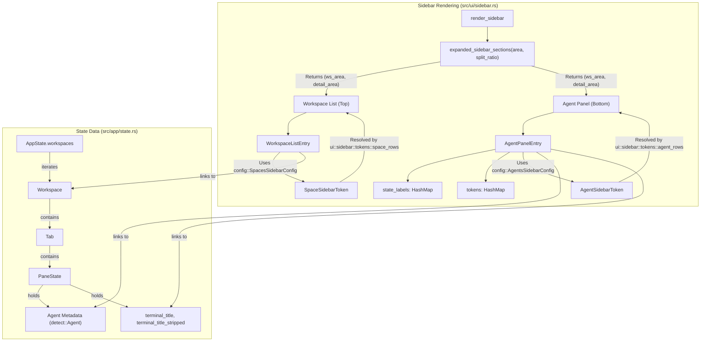
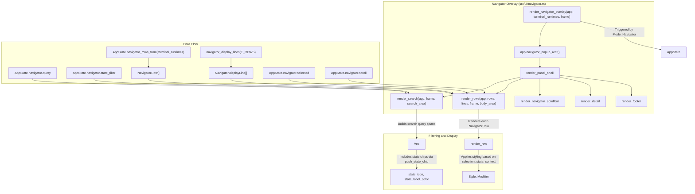
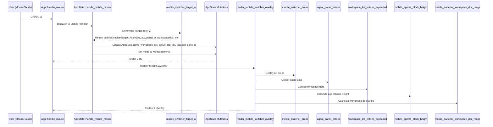

# Sidebar, Navigator, and Agent Panel

Relevant source files

The following files were used as context for generating this wiki page:

- [src/app/input/sidebar.rs](https://github.com/herdrdev/herdr/blob/HEAD/src/app/input/sidebar.rs)
- [src/app/terminal_titles.rs](https://github.com/herdrdev/herdr/blob/HEAD/src/app/terminal_titles.rs)
- [src/config/sidebar.rs](https://github.com/herdrdev/herdr/blob/HEAD/src/config/sidebar.rs)
- [src/ui/mobile.rs](https://github.com/herdrdev/herdr/blob/HEAD/src/ui/mobile.rs)
- [src/ui/navigator.rs](https://github.com/herdrdev/herdr/blob/HEAD/src/ui/navigator.rs)
- [src/ui/sidebar.rs](https://github.com/herdrdev/herdr/blob/HEAD/src/ui/sidebar.rs)
- [src/ui/sidebar/tokens.rs](https://github.com/herdrdev/herdr/blob/HEAD/src/ui/sidebar/tokens.rs)
- [src/ui/status.rs](https://github.com/herdrdev/herdr/blob/HEAD/src/ui/status.rs)

This section covers the primary navigation and monitoring interfaces of the `herdr` TUI. These components allow users to manage multiple workspaces, track AI agent status across panes, and quickly search for specific sessions or commands.

## Sidebar Overview

The sidebar is a persistent vertical panel (in Desktop layout) that provides a high-level view of the entire application state. It is divided into two primary sections: **Spaces** and **Agents**.

### Workspace and Tab List (Spaces)
The top section of the sidebar lists all active workspaces and their constituent tabs. 
- **Ordering**: Workspaces are ordered based on their `WorktreeSpaceMembership` if they belong to a Git worktree group, otherwise by their creation order [src/workspace.rs:34-41](https://github.com/herdrdev/herdr/blob/HEAD/src/workspace.rs#L34-L41).
- **Git Integration**: Workspace labels are often auto-derived from the CWD or Git branch name [src/workspace.rs:63-76](https://github.com/herdrdev/herdr/blob/HEAD/src/workspace.rs#L63-L76).
- **State Aggregation**: Workspaces display a "state dot" that aggregates the status of all agents within that workspace [src/ui/sidebar.rs:197-200](https://github.com/herdrdev/herdr/blob/HEAD/src/ui/sidebar.rs#L197-L200).
- **Customizable Tokens**: The display of workspace entries can be customized using `SpaceSidebarToken`s defined in `config.toml`. These tokens can include `StateIcon`, `StateText`, `Workspace` name, `Branch` name, `GitStatus` (ahead/behind), and custom tokens [src/config/sidebar.rs:121-132](https://github.com/herdrdev/herdr/blob/HEAD/src/config/sidebar.rs#L121-L132), [src/ui/sidebar/tokens.rs:100-142](https://github.com/herdrdev/herdr/blob/HEAD/src/ui/sidebar/tokens.rs#L100-L142).

### Agent Panel
The bottom section, the **Agent Panel**, tracks all panes where an AI agent has been detected.
- **Agent Detection**: Entries are populated by `collect_agent_panel_entries_with_runtimes`, which iterates through all workspaces and panes to identify those with active `Agent` metadata [src/ui/sidebar.rs:136-184](https://github.com/herdrdev/herdr/blob/HEAD/src/ui/sidebar.rs#L136-L184).
- **State Labels and Tokens**: Agents can report arbitrary `state_labels` (e.g., "Thinking", "Executing") and `tokens` (e.g., usage counts) which are rendered inline in the sidebar [src/ui/sidebar.rs:23-40](https://github.com/herdrdev/herdr/blob/HEAD/src/ui/sidebar.rs#L23-L40).
- **Customizable Tokens**: Similar to spaces, agent panel entries can be customized using `AgentSidebarToken`s. These include `StateIcon`, `StateText`, `Workspace`, `Tab`, `Pane`, `Agent` label, `TerminalTitle`, `TerminalTitleStripped`, and custom tokens [src/config/sidebar.rs:104-118](https://github.com/herdrdev/herdr/blob/HEAD/src/config/sidebar.rs#L104-L118), [src/ui/sidebar/tokens.rs:38-89](https://github.com/herdrdev/herdr/blob/HEAD/src/ui/sidebar/tokens.rs#L38-L89). The `terminal_title_sidebar_configured` function checks if any sidebar configuration uses terminal title tokens, which can trigger additional redraws [src/app/terminal_titles.rs:4-17](https://github.com/herdrdev/herdr/blob/HEAD/src/app/terminal_titles.rs#L4-L17).
- **Sorting**: Users can toggle between `Spaces` (grouped by workspace) and `Priority` (grouped by activity/state) [src/ui/sidebar.rs:81-86](https://github.com/herdrdev/herdr/blob/HEAD/src/ui/sidebar.rs#L81-L86).

### Sidebar Layout Logic
The split between the Spaces section and the Agent Panel is controlled by a `split_ratio` (default 0.5), which can be adjusted via mouse dragging [src/ui/sidebar.rs:42-57](https://github.com/herdrdev/herdr/blob/HEAD/src/ui/sidebar.rs#L42-L57). The `expanded_sidebar_sections` function calculates the `Rect` for both sections based on the total area and split ratio [src/ui/sidebar.rs:59-69](https://github.com/herdrdev/herdr/blob/HEAD/src/ui/sidebar.rs#L59-L69).

**Sources:** [src/ui/sidebar.rs:23-69](https://github.com/herdrdev/herdr/blob/HEAD/src/ui/sidebar.rs#L23-L69), [src/workspace.rs:171-202](https://github.com/herdrdev/herdr/blob/HEAD/src/workspace.rs#L171-L202), [src/app/state.rs:149-184](https://github.com/herdrdev/herdr/blob/HEAD/src/app/state.rs#L149-L184), [src/config/sidebar.rs:104-132](https://github.com/herdrdev/herdr/blob/HEAD/src/config/sidebar.rs#L104-L132), [src/ui/sidebar/tokens.rs:38-142](https://github.com/herdrdev/herdr/blob/HEAD/src/ui/sidebar/tokens.rs#L38-L142), [src/app/terminal_titles.rs:4-17](https://github.com/herdrdev/herdr/blob/HEAD/src/app/terminal_titles.rs#L4-L17)

---

## Session Navigator (prefix+g)

The Navigator is a modal overlay that provides a fuzzy-search interface for all workspaces, tabs, and panes. It is triggered by the `Navigator` mode [src/app/input/modal.rs:162-166](https://github.com/herdrdev/herdr/blob/HEAD/src/app/input/modal.rs#L162-L166).

### Implementation and Filtering
The Navigator uses a `NavigatorStateFilter` to narrow down results based on:
- **Query String**: Text-based fuzzy matching against workspace and tab names [src/ui/navigator.rs:63-98](https://github.com/herdrdev/herdr/blob/HEAD/src/ui/navigator.rs#L63-L98).
- **State Filter**: Quick filters for "Blocked", "Working", "Idle", or "Done" agents, implemented by `push_state_chip` [src/ui/navigator.rs:65-91](https://github.com/herdrdev/herdr/blob/HEAD/src/ui/navigator.rs#L65-L91), [src/ui/navigator.rs:109-125](https://github.com/herdrdev/herdr/blob/HEAD/src/ui/navigator.rs#L109-L125).
- **Row Rendering**: `render_rows` iterates through `NavigatorDisplayLine`s, which are derived from `NavigatorRow`s, to display the filtered and sorted entries [src/ui/navigator.rs:145-156](https://github.com/herdrdev/herdr/blob/HEAD/src/ui/navigator.rs#L145-L156). `render_row` applies styling based on selection, context, and agent state [src/ui/navigator.rs:158-211](https://github.com/herdrdev/herdr/blob/HEAD/src/ui/navigator.rs#L158-L211).

### Navigation Logic
Key presses in `Mode::Navigator` are handled by `handle_navigator_key` [src/app/input/modal.rs:162-166](https://github.com/herdrdev/herdr/blob/HEAD/src/app/input/modal.rs#L162-L166).
- **Movement**: `Up`/`Down` or `Ctrl+n`/`Ctrl+p` move the selection [src/app/input/modal.rs:180-187](https://github.com/herdrdev/herdr/blob/HEAD/src/app/input/modal.rs#L180-L187).
- **Execution**: `Enter` calls `accept_navigator_selection_from`, which updates `AppState.active` and the focused pane within the target workspace [src/app/input/modal.rs:172-174](https://github.com/herdrdev/herdr/blob/HEAD/src/app/input/modal.rs#L172-L174).

**Sources:** [src/app/input/modal.rs:162-201](https://github.com/herdrdev/herdr/blob/HEAD/src/app/input/modal.rs#L162-L201), [src/app/actions.rs:18-23](https://github.com/herdrdev/herdr/blob/HEAD/src/app/actions.rs#L18-L23), [src/ui/navigator.rs:21-47](https://github.com/herdrdev/herdr/blob/HEAD/src/ui/navigator.rs#L21-L47), [src/ui/navigator.rs:49-107](https://github.com/herdrdev/herdr/blob/HEAD/src/ui/navigator.rs#L49-L107), [src/ui/navigator.rs:109-125](https://github.com/herdrdev/herdr/blob/HEAD/src/ui/navigator.rs#L109-L125), [src/ui/navigator.rs:145-156](https://github.com/herdrdev/herdr/blob/HEAD/src/ui/navigator.rs#L145-L156), [src/ui/navigator.rs:158-211](https://github.com/herdrdev/herdr/blob/HEAD/src/ui/navigator.rs#L158-L211)

---

## Agent Panel Entries and State

Agent entries are the core of the monitoring experience. Each entry in the sidebar or mobile switcher represents a `PaneId` associated with an `AgentState`. The `AgentPanelEntry` struct holds all relevant information for rendering, including labels, terminal titles, agent kind, and state [src/ui/sidebar.rs:23-40](https://github.com/herdrdev/herdr/blob/HEAD/src/ui/sidebar.rs#L23-L40).

| State | Sidebar Label | Description |
| :--- | :--- | :--- |
| `Idle` (unseen) | `done` | Agent finished a task and the user hasn't viewed the pane yet [src/ui/sidebar.rs:188](https://github.com/herdrdev/herdr/blob/HEAD/src/ui/sidebar.rs#L188). |
| `Idle` (seen) | `idle` | Agent is waiting for input [src/ui/sidebar.rs:189](https://github.com/herdrdev/herdr/blob/HEAD/src/ui/sidebar.rs#L189). |
| `Working` | `working` | Agent is currently processing/typing [src/ui/sidebar.rs:190](https://github.com/herdrdev/herdr/blob/HEAD/src/ui/sidebar.rs#L190). |
| `Blocked` | `blocked` | Agent requires user intervention/approval [src/ui/sidebar.rs:191](https://github.com/herdrdev/herdr/blob/HEAD/src/ui/sidebar.rs#L191). |
| `Unknown` | `unknown` | Agent state could not be determined [src/ui/sidebar.rs:192](https://github.com/herdrdev/herdr/blob/HEAD/src/ui/sidebar.rs#L192). |

The `agent_panel_status_key` function maps the `AgentState` and `seen` status to a string key for display [src/ui/sidebar.rs:186-195](https://github.com/herdrdev/herdr/blob/HEAD/src/ui/sidebar.rs#L186-L195). The `state_icon` and `state_label_color` functions (from `src/ui/status.rs`) are used to render the visual indicators for these states [src/ui/status.rs:196-211](https://github.com/herdrdev/herdr/blob/HEAD/src/ui/status.rs#L196-L211).

### Notification Flow
When an agent transitions to `Blocked` or `Idle` (completion), the system generates:
1.  **Sound**: Triggered by `notification_sound_for_effective_state_change` [src/app/actions.rs:115-132](https://github.com/herdrdev/herdr/blob/HEAD/src/app/actions.rs#L115-L132).
2.  **Toast**: A temporary TUI notification via `notification_toast_for_pane_state_update` [src/app/actions.rs:176-191](https://github.com/herdrdev/herdr/blob/HEAD/src/app/actions.rs#L176-L191).

**Sources:** [src/ui/sidebar.rs:186-195](https://github.com/herdrdev/herdr/blob/HEAD/src/ui/sidebar.rs#L186-L195), [src/app/actions.rs:115-191](https://github.com/herdrdev/herdr/blob/HEAD/src/app/actions.rs#L115-L191), [src/ui/sidebar.rs:23-40](https://github.com/herdrdev/herdr/blob/HEAD/src/ui/sidebar.rs#L23-L40), [src/ui/status.rs:196-211](https://github.com/herdrdev/herdr/blob/HEAD/src/ui/status.rs#L196-L211)

---

## Mobile Switcher Overlay

In `ViewLayout::Mobile`, the sidebar is hidden to save horizontal space. Instead, a `MobileSwitcher` overlay is used to change contexts.

### Mobile Interaction
- **Trigger**: Tapping the top-right header area, which is defined by `MobileHeaderHitAreas.menu` [src/ui/mobile.rs:53-67](https://github.com/herdrdev/herdr/blob/HEAD/src/ui/mobile.rs#L53-L67), [src/ui/mobile.rs:204-218](https://github.com/herdrdev/herdr/blob/HEAD/src/ui/mobile.rs#L204-L218).
- **Hit Detection**: The `mobile_switcher_target_at` function maps screen coordinates to a `MobileSwitcherTarget` (Workspace, Tab, Agent, or Menu). It calculates the document row based on scroll position and then identifies the corresponding target [src/ui/mobile.rs:127-201](https://github.com/herdrdev/herdr/blob/HEAD/src/ui/mobile.rs#L127-L201).
- **Rendering**: The switcher renders a full-screen list with specialized "touch-friendly" row heights (usually 2 rows per entry). `mobile_agents_block_height` determines the height needed for the agents section, and `mobile_switcher_workspace_doc_range` calculates the document row range for workspaces [src/ui/mobile.rs:98-122](https://github.com/herdrdev/herdr/blob/HEAD/src/ui/mobile.rs#L98-L122).

**Sources:** [src/ui/mobile.rs:127-201](https://github.com/herdrdev/herdr/blob/HEAD/src/ui/mobile.rs#L127-L201), [src/app/input/mouse.rs:179-185](https://github.com/herdrdev/herdr/blob/HEAD/src/app/input/mouse.rs#L179-L185), [src/ui/mobile.rs:53-67](https://github.com/herdrdev/herdr/blob/HEAD/src/ui/mobile.rs#L53-L67), [src/ui/mobile.rs:204-218](https://github.com/herdrdev/herdr/blob/HEAD/src/ui/mobile.rs#L204-L218), [src/ui/mobile.rs:98-122](https://github.com/herdrdev/herdr/blob/HEAD/src/ui/mobile.rs#L98-L122)

---

## Workspace List Ordering

Workspace ordering is not purely chronological. The system attempts to group related workspaces:

1.  **Worktree Groups**: Workspaces belonging to the same Git repository via `WorktreeSpaceMembership` are grouped together [src/workspace.rs:34-41](https://github.com/herdrdev/herdr/blob/HEAD/src/workspace.rs#L34-L41).
2.  **Pinned/Active**: The active workspace is highlighted, but the list order remains stable to maintain muscle memory during `Navigate` mode [src/app/input/navigate.rs:142-155](https://github.com/herdrdev/herdr/blob/HEAD/src/app/input/navigate.rs#L142-L155).
3.  **Manual Reordering**: Users can move workspaces up or down in the list, which updates the `workspaces` vector in `AppState` [src/app/input/mouse.rs:42-48](https://github.com/herdrdev/herdr/blob/HEAD/src/app/input/mouse.rs#L42-L48).

**Sources:** [src/workspace.rs:34-41](https://github.com/herdrdev/herdr/blob/HEAD/src/workspace.rs#L34-L41), [src/app/input/navigate.rs:142-155](https://github.com/herdrdev/herdr/blob/HEAD/src/app/input/navigate.rs#L142-L155), [src/app/input/mouse.rs:42-48](https://github.com/herdrdev/herdr/blob/HEAD/src/app/input/mouse.rs#L42-L48)