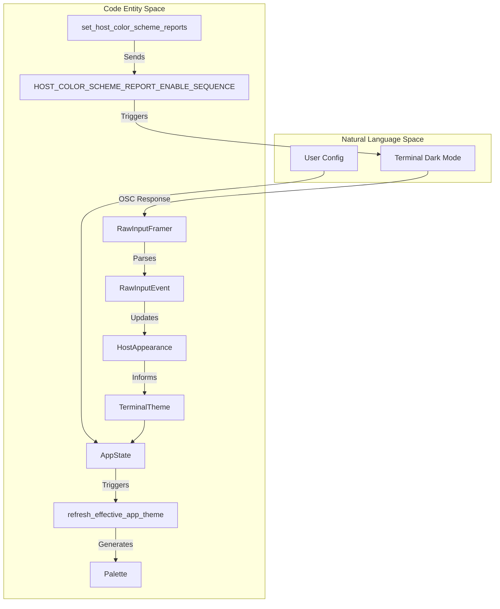
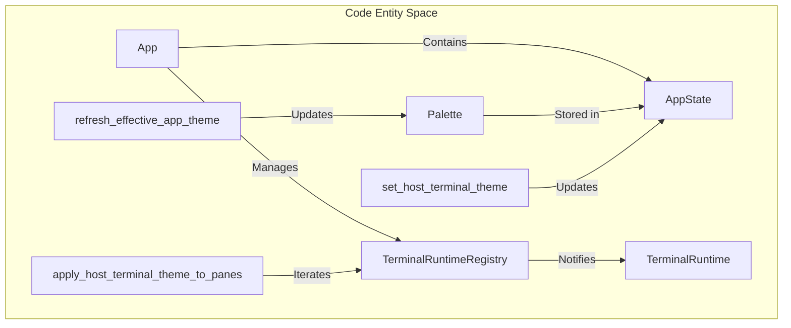

# Theming System

Relevant source files

The following files were used as context for generating this wiki page:

- [src/app/mod.rs](https://github.com/herdrdev/herdr/blob/HEAD/src/app/mod.rs)
- [src/app/runtime.rs](https://github.com/herdrdev/herdr/blob/HEAD/src/app/runtime.rs)
- [src/app/state.rs](https://github.com/herdrdev/herdr/blob/HEAD/src/app/state.rs)
- [src/app/theme_sync.rs](https://github.com/herdrdev/herdr/blob/HEAD/src/app/theme_sync.rs)
- [src/client/input.rs](https://github.com/herdrdev/herdr/blob/HEAD/src/client/input.rs)
- [src/client/mod.rs](https://github.com/herdrdev/herdr/blob/HEAD/src/client/mod.rs)
- [src/config.rs](https://github.com/herdrdev/herdr/blob/HEAD/src/config.rs)
- [src/config/io.rs](https://github.com/herdrdev/herdr/blob/HEAD/src/config/io.rs)
- [src/config/model.rs](https://github.com/herdrdev/herdr/blob/HEAD/src/config/model.rs)
- [src/config/theme.rs](https://github.com/herdrdev/herdr/blob/HEAD/src/config/theme.rs)
- [src/main.rs](https://github.com/herdrdev/herdr/blob/HEAD/src/main.rs)
- [src/raw_input.rs](https://github.com/herdrdev/herdr/blob/HEAD/src/raw_input.rs)
- [src/server/clients.rs](https://github.com/herdrdev/herdr/blob/HEAD/src/server/clients.rs)
- [src/server/headless/tests/pane_graphics.rs](https://github.com/herdrdev/herdr/blob/HEAD/src/server/headless/tests/pane_graphics.rs)
- [src/terminal_theme.rs](https://github.com/herdrdev/herdr/blob/HEAD/src/terminal_theme.rs)
- [src/ui.rs](https://github.com/herdrdev/herdr/blob/HEAD/src/ui.rs)
- [tests/cli/workspace.rs](https://github.com/herdrdev/herdr/blob/HEAD/tests/cli/workspace.rs)

The herdr theming system provides a centralized way to define, apply, and synchronize UI aesthetics across the entire application. It supports built-in palettes (such as Catppuccin, Tokyo Night, and Nord), custom color overrides, and automatic switching based on the host terminal's light/dark appearance.

## Palette Definition

The core of the system is the `Palette` struct, which serves as the single source of truth for all UI colors [src/app/state.rs:67-104](https://github.com/herdrdev/herdr/blob/HEAD/src/app/state.rs#L67-L104). It abstracts color tokens like `accent`, `panel_bg`, and `surface0` into a format that the Ratatui-based UI can consume.

### Key Palette Tokens
| Token | Purpose |
| :--- | :--- |
| `accent` | Primary highlight color for active borders and focus indicators [src/app/state.rs:71](https://github.com/herdrdev/herdr/blob/HEAD/src/app/state.rs#L71). |
| `panel_bg` | Background for the tab bar, floating panels, overlays, and modals [src/app/state.rs:73](https://github.com/herdrdev/herdr/blob/HEAD/src/app/state.rs#L73). |
| `surface0/1` | Subtle surface background for selected/focused items and slightly lighter for hover/active states [src/app/state.rs:77-79](https://github.com/herdrdev/herdr/blob/HEAD/src/app/state.rs#L77-L79). |
| `text` | Main text color — soft white [src/app/state.rs:83](https://github.com/herdrdev/herdr/blob/HEAD/src/app/state.rs#L83). |
| `mauve/green/red` | Semantic colors for branches, success states, and errors [src/app/state.rs:91-95](https://github.com/herdrdev/herdr/blob/HEAD/src/app/state.rs#L91-L95). |

### Built-in Themes
Herdr includes several pre-defined palettes:
- **Catppuccin Mocha** (Default) [src/app/state.rs:108-127](https://github.com/herdrdev/herdr/blob/HEAD/src/app/state.rs#L108-L127).
- **Catppuccin Latte** (Light variant) [src/app/state.rs:130-149](https://github.com/herdrdev/herdr/blob/HEAD/src/app/state.rs#L130-L149).
- **Terminal** (Uses host ANSI colors) [src/app/state.rs:152-171](https://github.com/herdrdev/herdr/blob/HEAD/src/app/state.rs#L152-L171).
- **Other flavors**: Tokyo Night, Dracula, Nord, Gruvbox, One Dark, Solarized, Kanagawa, Rose Pine, and Vesper [src/main.rs:118-121](https://github.com/herdrdev/herdr/blob/HEAD/src/main.rs#L118-L121).

Sources: [src/app/state.rs:67-205](https://github.com/herdrdev/herdr/blob/HEAD/src/app/state.rs#L67-L205), [src/main.rs:116-135](https://github.com/herdrdev/herdr/blob/HEAD/src/main.rs#L116-L135)

## Host Appearance Detection

Herdr can detect whether the host terminal is in light or dark mode and switch the UI theme accordingly. This is controlled via the `theme.auto_switch` configuration [src/main.rs:124](https://github.com/herdrdev/herdr/blob/HEAD/src/main.rs#L124).

### The Detection Flow
1. **Query**: The app sends an ANSI escape sequence to the host terminal to query its background color [src/terminal_theme.rs:100-102](https://github.com/herdrdev/herdr/blob/HEAD/src/terminal_theme.rs#L100-L102). This sequence is defined as `HOST_COLOR_SCHEME_REPORT_ENABLE_SEQUENCE` [src/terminal_theme.rs:100](https://github.com/herdrdev/herdr/blob/HEAD/src/terminal_theme.rs#L100).
2. **Response**: The terminal responds with an OSC sequence containing RGB values or a specific code for light/dark [src/raw_input.rs:139-141](https://github.com/herdrdev/herdr/blob/HEAD/src/raw_input.rs#L139-L141).
3. **Parsing**: The `RawInputFramer` parses the incoming bytes into `RawInputEvent::HostColorSchemeChanged` or `RawInputEvent::HostDefaultColor` [src/raw_input.rs:141](https://github.com/herdrdev/herdr/blob/HEAD/src/raw_input.rs#L141).
4. **Inference**: `RgbColor::inferred_appearance()` determines if the color is light or dark [src/terminal_theme.rs:49-52](https://github.com/herdrdev/herdr/blob/HEAD/src/terminal_theme.rs#L49-L52).
5. **Application**: The `AppState` is updated with the `HostAppearance` [src/app/theme_sync.rs:51-54](https://github.com/herdrdev/herdr/blob/HEAD/src/app/theme_sync.rs#L51-L54).

### Data Flow: Host to UI Palette
This diagram shows how host terminal signals are transformed into the `Palette` used for rendering.

Sources: [src/app/theme_sync.rs:4-25](https://github.com/herdrdev/herdr/blob/HEAD/src/app/theme_sync.rs#L4-L25), [src/app/theme_sync.rs:83-96](https://github.com/herdrdev/herdr/blob/HEAD/src/app/theme_sync.rs#L83-L96), [src/terminal_theme.rs:49-52](https://github.com/herdrdev/herdr/blob/HEAD/src/terminal_theme.rs#L49-L52), [src/main.rs:45-55](https://github.com/herdrdev/herdr/blob/HEAD/src/main.rs#L45-L55), [src/raw_input.rs:139-141](https://github.com/herdrdev/herdr/blob/HEAD/src/raw_input.rs#L139-L141)

## Theme Application and Synchronization

Once a palette is resolved, it must be applied to two distinct areas: the **Application UI** (sidebar, tabs, borders) and the **Terminal Panes** (internal PTY colors).

### UI Rendering
The `AppState` holds the current `Palette` [src/app/state.rs:92](https://github.com/herdrdev/herdr/blob/HEAD/src/app/state.rs#L92). During the render cycle, UI components (like `render_sidebar` or `render_tab_bar`) access this palette to generate `ratatui::style::Style` objects [src/ui.rs:57-65](https://github.com/herdrdev/herdr/blob/HEAD/src/ui.rs#L57-L65).

### PTY Synchronization
For consistency, Herdr forwards host terminal theme information to the underlying terminal runtimes.
- `App::set_host_terminal_theme` updates the global host theme state [src/app/theme_sync.rs:78](https://github.com/herdrdev/herdr/blob/HEAD/src/app/theme_sync.rs#L78).
- `App::apply_host_terminal_theme_to_panes` iterates through all active `TerminalRuntime` instances and notifies them of the change [src/app/theme_sync.rs:98-105](https://github.com/herdrdev/herdr/blob/HEAD/src/app/theme_sync.rs#L98-L105).

Sources: [src/app/mod.rs:95-152](https://github.com/herdrdev/herdr/blob/HEAD/src/app/mod.rs#L95-L152), [src/app/theme_sync.rs:71-106](https://github.com/herdrdev/herdr/blob/HEAD/src/app/theme_sync.rs#L71-L106), [src/ui.rs:111-120](https://github.com/herdrdev/herdr/blob/HEAD/src/ui.rs#L111-L120)

## Configuration and Customization

Users can customize themes in `config.toml` under the `[theme]` section.

### Manual Overrides
The `[theme.custom]` table allows overriding specific palette tokens. For example, setting `panel_bg = "reset"` allows the terminal's true background to show through in the UI panels [src/main.rs:130-135](https://github.com/herdrdev/herdr/blob/HEAD/src/main.rs#L130-L135).

### Config Model
The `ThemeConfig` struct handles the deserialization of these settings [src/config.rs:32](https://github.com/herdrdev/herdr/blob/HEAD/src/config.rs#L32).
- `name`: The primary theme name [src/config/theme.rs:16](https://github.com/herdrdev/herdr/blob/HEAD/src/config/theme.rs#L16).
- `auto_switch`: Boolean toggle for host-based switching [src/config/theme.rs:20](https://github.com/herdrdev/herdr/blob/HEAD/src/config/theme.rs#L20).
- `light_name` / `dark_name`: Specific themes to use for each mode [src/config/theme.rs:26-35](https://github.com/herdrdev/herdr/blob/HEAD/src/config/theme.rs#L26-L35).

Sources: [src/main.rs:116-135](https://github.com/herdrdev/herdr/blob/HEAD/src/main.rs#L116-L135), [src/config/theme.rs:1-35](https://github.com/herdrdev/herdr/blob/HEAD/src/config/theme.rs#L1-L35), [src/config.rs:32](https://github.com/herdrdev/herdr/blob/HEAD/src/config.rs#L32)2f