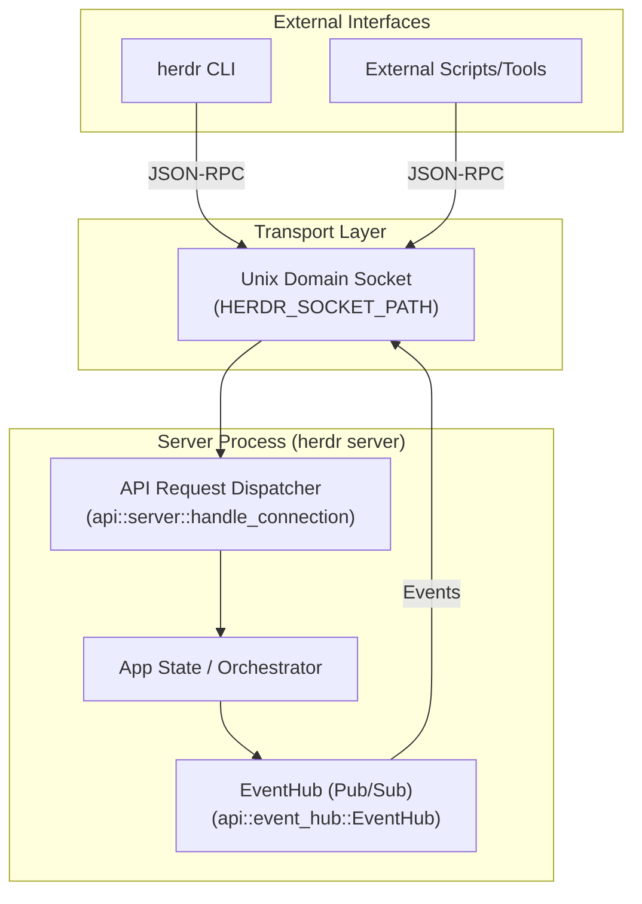

# API and CLI Reference

Relevant source files

The following files were used as context for generating this wiki page:

- [docs/next/api/herdr-api.schema.json](https://github.com/herdrdev/herdr/blob/HEAD/docs/next/api/herdr-api.schema.json)
- [docs/next/website/src/content/docs/ja/cli-reference.mdx](https://github.com/herdrdev/herdr/blob/HEAD/docs/next/website/src/content/docs/ja/cli-reference.mdx)
- [docs/next/website/src/content/docs/ja/socket-api.mdx](https://github.com/herdrdev/herdr/blob/HEAD/docs/next/website/src/content/docs/ja/socket-api.mdx)
- [docs/next/website/src/content/docs/socket-api.mdx](https://github.com/herdrdev/herdr/blob/HEAD/docs/next/website/src/content/docs/socket-api.mdx)
- [docs/next/website/src/content/docs/zh-cn/cli-reference.mdx](https://github.com/herdrdev/herdr/blob/HEAD/docs/next/website/src/content/docs/zh-cn/cli-reference.mdx)
- [docs/next/website/src/content/docs/zh-cn/socket-api.mdx](https://github.com/herdrdev/herdr/blob/HEAD/docs/next/website/src/content/docs/zh-cn/socket-api.mdx)
- [src/api/mod.rs](https://github.com/herdrdev/herdr/blob/HEAD/src/api/mod.rs)
- [src/api/schema.rs](https://github.com/herdrdev/herdr/blob/HEAD/src/api/schema.rs)
- [src/api/schema/panes.rs](https://github.com/herdrdev/herdr/blob/HEAD/src/api/schema/panes.rs)
- [src/api/server.rs](https://github.com/herdrdev/herdr/blob/HEAD/src/api/server.rs)
- [src/cli.rs](https://github.com/herdrdev/herdr/blob/HEAD/src/cli.rs)
- [src/cli/spec.rs](https://github.com/herdrdev/herdr/blob/HEAD/src/cli/spec.rs)
- [src/protocol/wire.rs](https://github.com/herdrdev/herdr/blob/HEAD/src/protocol/wire.rs)
- [tests/api_ping.rs](https://github.com/herdrdev/herdr/blob/HEAD/tests/api_ping.rs)

Herdr provides a robust set of external interfaces designed for both interactive use and programmatic automation. The system follows a client/server architecture where the CLI communicates with a background server process via a Unix domain socket using a JSON-RPC 2.0-inspired protocol.

### Interface Architecture

The primary entry point for all external interaction is the `herdr` binary. Depending on the arguments provided, it either starts a session server or acts as a client that dispatches requests to an existing server [src/cli.rs:71-106](https://github.com/herdrdev/herdr/blob/HEAD/src/cli.rs#L71-L106).

**Diagram Title: Herdr Client-Server Communication Flow**
Sources: [src/api/mod.rs:20-22](https://github.com/herdrdev/herdr/blob/HEAD/src/api/mod.rs#L20-L22), [src/api/server.rs:1-50](https://github.com/herdrdev/herdr/blob/HEAD/src/api/server.rs#L1-L50), [src/cli.rs:71-106](https://github.com/herdrdev/herdr/blob/HEAD/src/cli.rs#L71-L106)

---

### Socket API (JSON-RPC)

The Socket API is the low-level foundation for all Herdr communication. It utilizes line-delimited JSON objects sent over a Unix domain socket [tests/api_ping.rs:162-213](https://github.com/herdrdev/herdr/blob/HEAD/tests/api_ping.rs#L162-L213). The location of this socket is typically determined by the `HERDR_SOCKET_PATH` environment variable [src/api/mod.rs:20-21](https://github.com/herdrdev/herdr/blob/HEAD/src/api/mod.rs#L20-L21).

Key characteristics include:
*   **Request/Response Framing**: Every request includes a unique `id` and a `method` with associated `params` [src/api/schema.rs:34-45](https://github.com/herdrdev/herdr/blob/HEAD/src/api/schema.rs#L34-L45). The server responds with either a `SuccessResponse` or `ErrorResponse` [src/api/schema.rs:16-27](https://github.com/herdrdev/herdr/blob/HEAD/src/api/schema.rs#L16-L27).
*   **Method Dispatch**: The server handles a wide variety of methods ranging from simple `ping` to complex workspace management and agent control [src/api/schema.rs:46-202](https://github.com/herdrdev/herdr/blob/HEAD/src/api/schema.rs#L46-L202). The `Method` enum in `src/api/schema.rs` defines all available API calls.
*   **Event Subscription**: Clients can subscribe to server-side events (e.g., pane updates, agent state changes) via the `EventHub` [src/api/event_hub.rs:1-10](https://github.com/herdrdev/herdr/blob/HEAD/src/api/event_hub.rs#L1-L10). This allows for real-time updates and reactive automation.
*   **Protocol Versioning**: The API includes a `PROTOCOL_VERSION` [src/protocol/wire.rs:16](https://github.com/herdrdev/herdr/blob/HEAD/src/protocol/wire.rs#L16) to ensure compatibility between clients and servers. The `herdr api schema` command can be used to inspect the bundled schema [docs/next/website/src/content/docs/socket-api.mdx:22-29](https://github.com/herdrdev/herdr/blob/HEAD/docs/next/website/src/content/docs/socket-api.mdx#L22-L29).

For detailed protocol specifications, request schemas, and subscription models, see **[Socket API (#6.1)]**.

**Sources:** [src/api/schema.rs:16-202](https://github.com/herdrdev/herdr/blob/HEAD/src/api/schema.rs#L16-L202), [src/api/mod.rs:20-21](https://github.com/herdrdev/herdr/blob/HEAD/src/api/mod.rs#L20-L21), [tests/api_ping.rs:162-213](https://github.com/herdrdev/herdr/blob/HEAD/tests/api_ping.rs#L162-L213), [src/protocol/wire.rs:16](https://github.com/herdrdev/herdr/blob/HEAD/src/protocol/wire.rs#L16), [docs/next/website/src/content/docs/socket-api.mdx:22-29](https://github.com/herdrdev/herdr/blob/HEAD/docs/next/website/src/content/docs/socket-api.mdx#L22-L29)

---

### CLI Command Hierarchy

The `herdr` CLI provides a user-friendly wrapper around the JSON-RPC API. It is structured into several subcommands that reflect the internal state hierarchy (Workspaces -> Tabs -> Panes) [src/cli.rs:80-101](https://github.com/herdrdev/herdr/blob/HEAD/src/cli.rs#L80-L101). The `clap` crate is used to define the command-line interface structure [src/cli/spec.rs:1-47](https://github.com/herdrdev/herdr/blob/HEAD/src/cli/spec.rs#L1-L47).

```mermaid
graph TD
    herdr["herdr"]
    herdr -- "server" --> server_cmd["server"]
    herdr -- "api" --> api_cmd["api"]
    herdr -- "status" --> status_cmd["status"]
    herdr -- "completion" --> completion_cmd["completion"]
    herdr -- "config" --> config_cmd["config"]
    herdr -- "channel" --> channel_cmd["channel"]
    herdr -- "workspace" --> workspace_cmd["workspace"]
    herdr -- "worktree" --> worktree_cmd["worktree"]
    herdr -- "tab" --> tab_cmd["tab"]
    herdr -- "notification" --> notification_cmd["notification"]
    herdr -- "agent" --> agent_cmd["agent"]
    herdr -- "terminal" --> terminal_cmd["terminal"]
    herdr -- "pane" --> pane_cmd["pane"]
    herdr -- "plugin" --> plugin_cmd["plugin"]
    herdr -- "integration" --> integration_cmd["integration"]
    herdr -- "session" --> session_cmd["session"]

    server_cmd -- "stop" --> server_stop["server stop"]
    server_cmd -- "reload-config" --> server_reload_config["server reload-config"]
    api_cmd -- "schema" --> api_schema["api schema"]
    workspace_cmd -- "create" --> workspace_create["workspace create"]
    tab_cmd -- "create" --> tab_create["tab create"]
    pane_cmd -- "split" --> pane_split["pane split"]
    agent_cmd -- "wait" --> agent_wait["agent wait"]
```

**Diagram Title: Herdr CLI Command Hierarchy (Partial)**
Sources: [src/cli.rs:80-101](https://github.com/herdrdev/herdr/blob/HEAD/src/cli.rs#L80-L101), [src/cli/spec.rs:1-47](https://github.com/herdrdev/herdr/blob/HEAD/src/cli/spec.rs#L1-L47)

The CLI uses an `ApiClient` to handle socket connection, protocol version guarding, and request serialization [src/api/client.rs:5-10](https://github.com/herdrdev/herdr/blob/HEAD/src/api/client.rs#L5-L10). This client ensures that CLI commands are properly formatted and sent to the running Herdr server.

For a full reference of commands, flags, and usage examples, see **[CLI Commands (#6.2)]**.

**Sources:** [src/cli.rs:80-101](https://github.com/herdrdev/herdr/blob/HEAD/src/cli.rs#L80-L101), [src/api/client.rs:5-10](https://github.com/herdrdev/herdr/blob/HEAD/src/api/client.rs#L5-L10), [src/cli/spec.rs:1-47](https://github.com/herdrdev/herdr/blob/HEAD/src/cli/spec.rs#L1-L47)

---

### Agent Automation API

A specialized subset of the CLI and Socket API is dedicated to "Agent Automation." This allows external scripts to treat Herdr panes as programmable entities, enabling AI coding agents to interact with the terminal environment.

The automation API bridges the gap between raw terminal PTYs and AI logic by providing:
*   **State Observation**: Reading pane contents or waiting for specific output patterns using `pane.read` [src/api/schema.rs:173](https://github.com/herdrdev/herdr/blob/HEAD/src/api/schema.rs#L173) or `agent.wait` [src/api/schema.rs:129](https://github.com/herdrdev/herdr/blob/HEAD/src/api/schema.rs#L129).
*   **Input Injection**: Sending keys or text to agents precisely via `agent.send_keys` [src/api/schema.rs:115](https://github.com/herdrdev/herdr/blob/HEAD/src/api/schema.rs#L115) or `pane.send_text` [src/api/schema.rs:169](https://github.com/herdrdev/herdr/blob/HEAD/src/api/schema.rs#L169).
*   **Metadata Reporting**: Allowing agents to report their own status (e.g., "thinking", "working") back to the Herdr UI using `pane.report_agent` [src/api/schema.rs:198](https://github.com/herdrdev/herdr/blob/HEAD/src/api/schema.rs#L198) and `pane.report_agent_session` [src/api/schema.rs:199](https://github.com/herdrdev/herdr/blob/HEAD/src/api/schema.rs#L199).
*   **Agent View Management**: Agents can control their dedicated view area within a pane using `agent.view.set` and `agent.view.clear` [src/api/schema.rs:119-121](https://github.com/herdrdev/herdr/blob/HEAD/src/api/schema.rs#L119-L121).

These capabilities are exposed through the `agent` subcommand group in the CLI and corresponding methods in the Socket API.

For details on scripting workflows and the `agent` subcommand group, see **[Agent Automation API (#6.3)]**.

**Sources:** [src/api/schema.rs:106-129](https://github.com/herdrdev/herdr/blob/HEAD/src/api/schema.rs#L106-L129), [src/api/schema.rs:169](https://github.com/herdrdev/herdr/blob/HEAD/src/api/schema.rs#L169), [src/api/schema.rs:173](https://github.com/herdrdev/herdr/blob/HEAD/src/api/schema.rs#L173), [src/api/schema.rs:198-199](https://github.com/herdrdev/herdr/blob/HEAD/src/api/schema.rs#L198-L199)