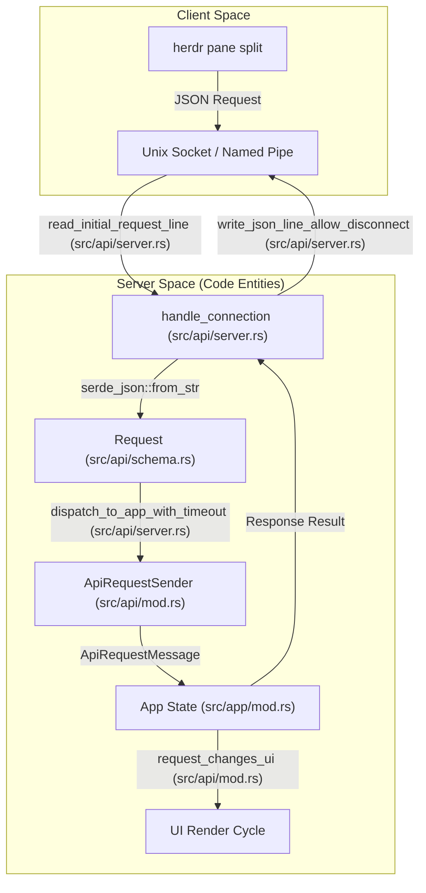
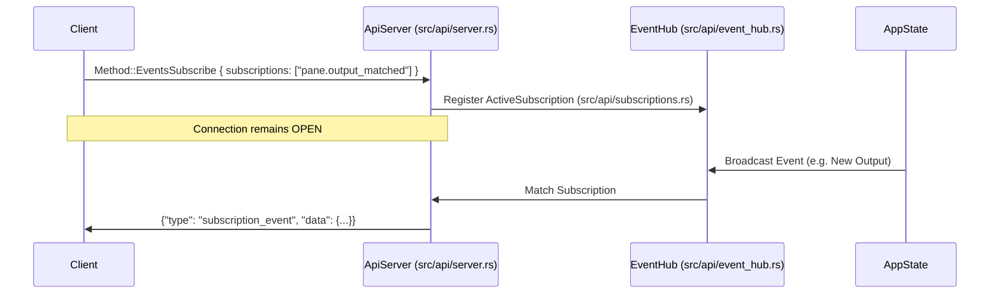

# Socket API

<details>
<summary>Relevant source files</summary>

The following files were used as context for generating this wiki page:

- [docs/next/api/herdr-api.schema.json](https://github.com/herdrdev/herdr/blob/HEAD/docs/next/api/herdr-api.schema.json)
- [docs/next/website/src/content/docs/agent-automation.mdx](https://github.com/herdrdev/herdr/blob/HEAD/docs/next/website/src/content/docs/agent-automation.mdx)
- [docs/next/website/src/content/docs/ja/agent-automation.mdx](https://github.com/herdrdev/herdr/blob/HEAD/docs/next/website/src/content/docs/ja/agent-automation.mdx)
- [docs/next/website/src/content/docs/socket-api.mdx](https://github.com/herdrdev/herdr/blob/HEAD/docs/next/website/src/content/docs/socket-api.mdx)
- [docs/next/website/src/content/docs/zh-cn/agent-automation.mdx](https://github.com/herdrdev/herdr/blob/HEAD/docs/next/website/src/content/docs/zh-cn/agent-automation.mdx)
- [src/api/mod.rs](https://github.com/herdrdev/herdr/blob/HEAD/src/api/mod.rs)
- [src/api/schema.rs](https://github.com/herdrdev/herdr/blob/HEAD/src/api/schema.rs)
- [src/api/schema/agents.rs](https://github.com/herdrdev/herdr/blob/HEAD/src/api/schema/agents.rs)
- [src/api/schema/common.rs](https://github.com/herdrdev/herdr/blob/HEAD/src/api/schema/common.rs)
- [src/api/schema/events.rs](https://github.com/herdrdev/herdr/blob/HEAD/src/api/schema/events.rs)
- [src/api/schema/panes.rs](https://github.com/herdrdev/herdr/blob/HEAD/src/api/schema/panes.rs)
- [src/api/schema/response.rs](https://github.com/herdrdev/herdr/blob/HEAD/src/api/schema/response.rs)
- [src/api/schema/tabs.rs](https://github.com/herdrdev/herdr/blob/HEAD/src/api/schema/tabs.rs)
- [src/api/schema/tests.rs](https://github.com/herdrdev/herdr/blob/HEAD/src/api/schema/tests.rs)
- [src/api/schema/workspaces.rs](https://github.com/herdrdev/herdr/blob/HEAD/src/api/schema/workspaces.rs)
- [src/api/server.rs](https://github.com/herdrdev/herdr/blob/HEAD/src/api/server.rs)
- [src/api/subscriptions.rs](https://github.com/herdrdev/herdr/blob/HEAD/src/api/subscriptions.rs)
- [src/api/wait.rs](https://github.com/herdrdev/herdr/blob/HEAD/src/api/wait.rs)
- [src/app/api/plugins/context.rs](https://github.com/herdrdev/herdr/blob/HEAD/src/app/api/plugins/context.rs)
- [src/cli.rs](https://github.com/herdrdev/herdr/blob/HEAD/src/cli.rs)
- [src/protocol/wire.rs](https://github.com/herdrdev/herdr/blob/HEAD/src/protocol/wire.rs)
- [tests/api_ping.rs](https://github.com/herdrdev/herdr/blob/HEAD/tests/api_ping.rs)

</details>


The Herdr Socket API is a local Unix domain socket (or Named Pipe on Windows) interface that allows external scripts, tools, and coding agents to inspect and control a running Herdr server. It uses JSON-RPC 2.0-style framing over a line-delimited stream.

## Protocol Framing and Lifecycle

The API operates over a local socket identified by the `HERDR_SOCKET_PATH` environment variable [src/api/mod.rs:19-19](https://github.com/herdrdev/herdr/blob/HEAD/src/api/mod.rs#L19). If this variable is unset, the system defaults to a path based on the active session [src/api/mod.rs:93-95](https://github.com/herdrdev/herdr/blob/HEAD/src/api/mod.rs#L93-L95).

### Request/Response Flow
1.  **Connection**: A client connects to the Unix domain socket (Unix) or Named Pipe (Windows) [src/api/server.rs:89-90](https://github.com/herdrdev/herdr/blob/HEAD/src/api/server.rs#L89-L90).
2.  **Request**: The client sends a single JSON object followed by a newline `\n` [tests/api_ping.rs:176-178](https://github.com/herdrdev/herdr/blob/HEAD/tests/api_ping.rs#L176-L178).
3.  **Validation**: The server validates the JSON against the `Request` struct [src/api/server.rs:158-173](https://github.com/herdrdev/herdr/blob/HEAD/src/api/server.rs#L158-L173).
4.  **Execution**: The server dispatches the `Method` to the internal `App` event loop [src/api/server.rs:218-223](https://github.com/herdrdev/herdr/blob/HEAD/src/api/server.rs#L218-L223).
5.  **Response**: The server writes a `SuccessResponse` or `ErrorResponse` followed by a newline back to the stream [src/api/server.rs:224-227](https://github.com/herdrdev/herdr/blob/HEAD/src/api/server.rs#L224-L227).

### Protocol Versioning and Guard
The API includes a **Protocol Guard** to ensure compatibility between the CLI and the running server [src/cli/protocol_guard.rs](https://github.com/herdrdev/herdr/blob/HEAD/src/cli/protocol_guard.rs).
*   **Protocol Version**: The current protocol version is defined as `PROTOCOL_VERSION` [src/protocol/wire.rs:16-16](https://github.com/herdrdev/herdr/blob/HEAD/src/protocol/wire.rs#L16).
*   **Version Check**: Every connection is checked against the server's supported version. If a mismatch is detected, the server rejects the request to prevent state corruption.
*   **Capabilities**: The server reports its `ServerCapabilities` (e.g., if `live_handoff` is supported) during the handshake or in snapshots [src/api/server.rs:66-71](https://github.com/herdrdev/herdr/blob/HEAD/src/api/server.rs#L66-L71).

Sources: [src/api/server.rs:1-200](https://github.com/herdrdev/herdr/blob/HEAD/src/api/server.rs#L1-L200), [tests/api_ping.rs:162-213](https://github.com/herdrdev/herdr/blob/HEAD/tests/api_ping.rs#L162-L213), [src/api/mod.rs:19-19](https://github.com/herdrdev/herdr/blob/HEAD/src/api/mod.rs#L19), [src/api/mod.rs:93-95](https://github.com/herdrdev/herdr/blob/HEAD/src/api/mod.rs#L93-L95), [src/api/server.rs:89-90](https://github.com/herdrdev/herdr/blob/HEAD/src/api/server.rs#L89-L90), [tests/api_ping.rs:176-178](https://github.com/herdrdev/herdr/blob/HEAD/tests/api_ping.rs#L176-L178), [src/api/server.rs:158-173](https://github.com/herdrdev/herdr/blob/HEAD/src/api/server.rs#L158-L173), [src/api/server.rs:218-223](https://github.com/herdrdev/herdr/blob/HEAD/src/api/server.rs#L218-L223), [src/api/server.rs:224-227](https://github.com/herdrdev/herdr/blob/HEAD/src/api/server.rs#L224-L227), [src/cli/protocol_guard.rs](https://github.com/herdrdev/herdr/blob/HEAD/src/cli/protocol_guard.rs), [src/protocol/wire.rs:16-16](https://github.com/herdrdev/herdr/blob/HEAD/src/protocol/wire.rs#L16), [src/api/server.rs:66-71](https://github.com/herdrdev/herdr/blob/HEAD/src/api/server.rs#L66-L71)

## Method Dispatch and Data Flow

The `Method` enum defines all available actions. Methods are categorized by the subsystem they control (e.g., `workspace.*`, `pane.*`, `agent.*`) [src/api/schema.rs:45-210](https://github.com/herdrdev/herdr/blob/HEAD/src/api/schema.rs#L45-L210).

### Request Dispatch Diagram
This diagram maps the natural language request to the internal code entities that process it.


Sources: [src/api/server.rs:98-174](https://github.com/herdrdev/herdr/blob/HEAD/src/api/server.rs#L98-L174), [src/api/mod.rs:21-80](https://github.com/herdrdev/herdr/blob/HEAD/src/api/mod.rs#L21-L80), [src/api/schema.rs:34-45](https://github.com/herdrdev/herdr/blob/HEAD/src/api/schema.rs#L34-L45), [src/api/server.rs:158-173](https://github.com/herdrdev/herdr/blob/HEAD/src/api/server.rs#L158-L173), [src/api/server.rs:218-223](https://github.com/herdrdev/herdr/blob/HEAD/src/api/server.rs#L218-L223), [src/api/server.rs:224-227](https://github.com/herdrdev/herdr/blob/HEAD/src/api/server.rs#L224-L227)

## Event Subscription Model (EventHub)

Herdr uses a pub/sub model for real-time updates. Clients can subscribe to specific event types using the `events.subscribe` method [src/api/schema/events.rs:12-14](https://github.com/herdrdev/herdr/blob/HEAD/src/api/schema/events.rs#L12-L14).

### Subscription Types
*   **Resource Events**: `workspace.created`, `tab.focused`, `pane.closed`, etc. [src/api/schema/events.rs:18-62](https://github.com/herdrdev/herdr/blob/HEAD/src/api/schema/events.rs#L18-L62).
*   **Output Matching**: `pane.output_matched` allows clients to wait for specific substrings or regex patterns in a pane's output stream [src/api/schema/events.rs:65-74](https://github.com/herdrdev/herdr/blob/HEAD/src/api/schema/events.rs#L65-L74).
*   **Agent Status**: `pane.agent_status_changed` tracks the lifecycle of AI agents (e.g., `working` -> `done`) [src/api/schema/events.rs:75-80](https://github.com/herdrdev/herdr/blob/HEAD/src/api/schema/events.rs#L75-L80).

### Event Subscription Flow
Subscriptions are managed by the `EventHub` [src/api/event_hub.rs](https://github.com/herdrdev/herdr/blob/HEAD/src/api/event_hub.rs). When a client subscribes, the connection remains open, and the server pushes `SubscriptionEventEnvelope` objects down the socket whenever a matching event occurs [src/api/server.rs:198-216](https://github.com/herdrdev/herdr/blob/HEAD/src/api/server.rs#L198-L216).


Sources: [src/api/subscriptions.rs:99-180](https://github.com/herdrdev/herdr/blob/HEAD/src/api/subscriptions.rs#L99-L180), [src/api/server.rs:198-216](https://github.com/herdrdev/herdr/blob/HEAD/src/api/server.rs#L198-L216), [src/api/schema/events.rs:11-85](https://github.com/herdrdev/herdr/blob/HEAD/src/api/schema/events.rs#L11-L85), [src/api/event_hub.rs](https://github.com/herdrdev/herdr/blob/HEAD/src/api/event_hub.rs)

## OpenAPI and JSON Schema

Herdr generates a comprehensive JSON Schema that describes the entire Socket API. This is used for generating documentation and providing type safety for external tools.

### Schema Structure
The schema is bundled into a single document containing:
*   **Request**: All `Method` variants and their parameters [src/api/schema/tests.rs:39-39](https://github.com/herdrdev/herdr/blob/HEAD/src/api/schema/tests.rs#L39).
*   **SuccessResponse**: The shape of successful results [src/api/schema/tests.rs:40-40](https://github.com/herdrdev/herdr/blob/HEAD/src/api/schema/tests.rs#L40).
*   **ErrorResponse**: Standardized error codes (e.g., `invalid_request`, `pane_not_found`) [src/api/schema/tests.rs:41-41](https://github.com/herdrdev/herdr/blob/HEAD/src/api/schema/tests.rs#L41).
*   **Event**: The envelope for server-initiated notifications [src/api/schema/tests.rs:42-42](https://github.com/herdrdev/herdr/blob/HEAD/src/api/schema/tests.rs#L42).

### Exporting the Schema
Users can export the schema via the CLI:
```bash
herdr api schema --json --output herdr-api.schema.json
```
This triggers `protocol_schema_document()` which uses `schemars` to reflect on the Rust types [src/api/schema/tests.rs:32-46](https://github.com/herdrdev/herdr/blob/HEAD/src/api/schema/tests.rs#L32-L46).

Sources: [docs/next/api/herdr-api.schema.json:1-100](https://github.com/herdrdev/herdr/blob/HEAD/docs/next/api/herdr-api.schema.json#L1-L100), [src/api/schema/tests.rs:32-46](https://github.com/herdrdev/herdr/blob/HEAD/src/api/schema/tests.rs#L32-L46), [docs/next/website/src/content/docs/socket-api.mdx:20-34](https://github.com/herdrdev/herdr/blob/HEAD/docs/next/website/src/content/docs/socket-api.mdx#L20-L34)

## Key API Areas

| Area | Key Methods | Description |
| :--- | :--- | :--- |
| **Server** | `ping`, `server.stop`, `server.reload_config` | Basic lifecycle and health checks. |
| **Workspace** | `workspace.create`, `workspace.focus`, `workspace.close` | Manage high-level groupings of tabs. |
| **Tab** | `tab.create`, `tab.rename`, `tab.move` | Manage tab lifecycle within a workspace. |
| **Pane** | `pane.split`, `pane.send_keys`, `pane.read` | The core interaction layer for terminal panes. |
| **Agent** | `agent.start`, `agent.prompt`, `agent.wait` | Orchestrate AI coding agents. |
| **Graphics** | `pane.graphics.set`, `pane.graphics.stream` | Control Kitty-protocol image rendering in panes. |

Sources: [src/api/schema.rs:45-210](https://github.com/herdrdev/herdr/blob/HEAD/src/api/schema.rs#L45-L210), [docs/next/website/src/content/docs/socket-api.mdx:93-112](https://github.com/herdrdev/herdr/blob/HEAD/docs/next/website/src/content/docs/socket-api.mdx#L93-L112)