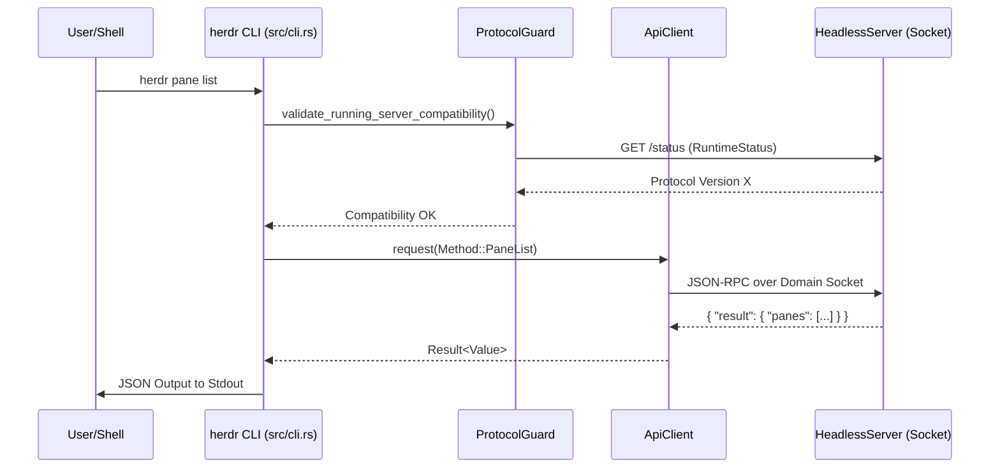
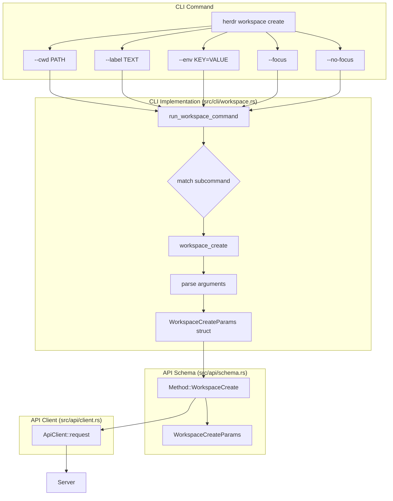

# CLI Commands

Relevant source files

The following files were used as context for generating this wiki page:

- [README.md](https://github.com/herdrdev/herdr/blob/HEAD/README.md)
- [docs/next/README.md](https://github.com/herdrdev/herdr/blob/HEAD/docs/next/README.md)
- [docs/next/website/src/content/docs/agents.mdx](https://github.com/herdrdev/herdr/blob/HEAD/docs/next/website/src/content/docs/agents.mdx)
- [docs/next/website/src/content/docs/cli-reference.mdx](https://github.com/herdrdev/herdr/blob/HEAD/docs/next/website/src/content/docs/cli-reference.mdx)
- [docs/next/website/src/content/docs/ja/cli-reference.mdx](https://github.com/herdrdev/herdr/blob/HEAD/docs/next/website/src/content/docs/ja/cli-reference.mdx)
- [docs/next/website/src/content/docs/ja/socket-api.mdx](https://github.com/herdrdev/herdr/blob/HEAD/docs/next/website/src/content/docs/ja/socket-api.mdx)
- [docs/next/website/src/content/docs/zh-cn/cli-reference.mdx](https://github.com/herdrdev/herdr/blob/HEAD/docs/next/website/src/content/docs/zh-cn/cli-reference.mdx)
- [docs/next/website/src/content/docs/zh-cn/socket-api.mdx](https://github.com/herdrdev/herdr/blob/HEAD/docs/next/website/src/content/docs/zh-cn/socket-api.mdx)
- [src/cli/integration.rs](https://github.com/herdrdev/herdr/blob/HEAD/src/cli/integration.rs)
- [src/cli/pane.rs](https://github.com/herdrdev/herdr/blob/HEAD/src/cli/pane.rs)
- [src/cli/spec.rs](https://github.com/herdrdev/herdr/blob/HEAD/src/cli/spec.rs)
- [src/cli/tab.rs](https://github.com/herdrdev/herdr/blob/HEAD/src/cli/tab.rs)
- [src/cli/workspace.rs](https://github.com/herdrdev/herdr/blob/HEAD/src/cli/workspace.rs)
- [src/cli/worktree.rs](https://github.com/herdrdev/herdr/blob/HEAD/src/cli/worktree.rs)

The `herdr` CLI acts as the primary interface for users and scripts to interact with the persistent headless server. It leverages a local Unix domain socket (or Named Pipes on Windows) to transmit JSON-RPC requests. The CLI is responsible for session management, server orchestration, and providing a deterministic scripting interface for agent automation.

## Command Dispatch and Execution

The CLI entry point is `maybe_run`, which identifies the subcommand and routes execution to specialized modules within the `src/cli/` directory [src/cli.rs:71-106](https://github.com/herdrdev/herdr/blob/HEAD/src/cli.rs#L71-L106). Subcommands are defined using `clap` in `src/cli/spec.rs` [src/cli/spec.rs:5-47](https://github.com/herdrdev/herdr/blob/HEAD/src/cli/spec.rs#L5-L47).

### ApiClient and Protocol Guard

Most subcommands rely on `ApiClient` to communicate with the server [src/api/client.rs:35-37](https://github.com/herdrdev/herdr/blob/HEAD/src/api/client.rs#L35-L37). Before any request is sent, the CLI performs a **Protocol Guard** check to ensure the client binary is compatible with the running server's protocol version [src/server/autodetect.rs:150-173](https://github.com/herdrdev/herdr/blob/HEAD/src/server/autodetect.rs#L150-L173).

- **Protocol Versioning**: Defined by `PROTOCOL_VERSION` [src/server/autodetect.rs:170](https://github.com/herdrdev/herdr/blob/HEAD/src/server/autodetect.rs#L170).
- **Compatibility Check**: The client fetches the server's `RuntimeStatus` [src/api/status.rs:24-30](https://github.com/herdrdev/herdr/blob/HEAD/src/api/status.rs#L24-L30). If versions mismatch, the client provides guidance on restarting the server to match the updated binary [src/server/autodetect.rs:162-172](https://github.com/herdrdev/herdr/blob/HEAD/src/server/autodetect.rs#L162-L172).

### CLI Command Flow
The following diagram illustrates how a CLI command like `herdr pane list` traverses the system.

**Diagram: CLI Request Flow**

Sources: [src/cli.rs:71-106](https://github.com/herdrdev/herdr/blob/HEAD/src/cli.rs#L71-L106), [src/api/client.rs:35-37](https://github.com/herdrdev/herdr/blob/HEAD/src/api/client.rs#L35-L37), [src/server/autodetect.rs:150-173](https://github.com/herdrdev/herdr/blob/HEAD/src/server/autodetect.rs#L150-L173)

---

## Core Subcommands

### Server and Session Management
The `server` and `session` commands manage the lifecycle of the background process and its persistent data.

| Command | Function | Key File |
| :--- | :--- | :--- |
| `herdr server` | Runs the headless server process. | `src/cli/server.rs` |
| `herdr server stop` | Sends `Method::ServerStop` to the active socket. | `src/api/schema.rs:48-49` |
| `herdr session list` | Lists directories in `~/.config/herdr/sessions`. | `src/session.rs:187-212` |
| `herdr session attach` | Connects the TUI client to a named session socket. | `src/session.rs:35-52` |

**Session Persistence**: Sessions are isolated by directory. The `default` session resides in the base config directory, while named sessions reside in `sessions/<name>/` [src/session.rs:161-167](https://github.com/herdrdev/herdr/blob/HEAD/src/session.rs#L161-L167). Each session maintains its own `herdr.sock` for API calls [src/session.rs:169-171](https://github.com/herdrdev/herdr/blob/HEAD/src/session.rs#L169-L171).

Sources: [src/cli/server.rs:1-20](https://github.com/herdrdev/herdr/blob/HEAD/src/cli/server.rs#L1-L20), [src/session.rs:11-27](https://github.com/herdrdev/herdr/blob/HEAD/src/session.rs#L11-L27), [src/session.rs:157-181](https://github.com/herdrdev/herdr/blob/HEAD/src/session.rs#L157-L181)

### Workspace, Tab, and Pane
These commands manipulate the internal layout tree. They translate CLI arguments into JSON-RPC `Method` variants.

*   **Workspace**: Top-level containers. `workspace create` accepts `--cwd`, `--label`, and `--env` [src/cli/spec.rs:196-203](https://github.com/herdrdev/herdr/blob/HEAD/src/cli/spec.rs#L196-L203).
*   **Tab**: Layouts within a workspace. `tab create` allows targeting a specific workspace ID [src/cli/spec.rs:232-243](https://github.com/herdrdev/herdr/blob/HEAD/src/cli/spec.rs#L232-L243).
*   **Pane**: Individual terminal instances. Commands include `split`, `resize`, `focus`, and `send-keys` [src/cli/spec.rs:326-440](https://github.com/herdrdev/herdr/blob/HEAD/src/cli/spec.rs#L326-L440).

**Diagram: Workspace Creation Command to API Method**

Sources: [src/cli/spec.rs:191-225](https://github.com/herdrdev/herdr/blob/HEAD/src/cli/spec.rs#L191-L225), [src/cli/workspace.rs:1-25](https://github.com/herdrdev/herdr/blob/HEAD/src/cli/workspace.rs#L1-L25), [src/api/schema.rs:66-67](https://github.com/herdrdev/herdr/blob/HEAD/src/api/schema.rs#L66-L67)

### Agent and Integration
Herdr provides deep integration for AI coding agents.

*   **Agent Detection**: `server agent-manifests` displays the status of TOML-based detection rules [src/cli/spec.rs:164-167](https://github.com/herdrdev/herdr/blob/HEAD/src/cli/spec.rs#L164-L167).
*   **Integration Management**: `integration install <agent>` sets up shell hooks or plugins for supported agents like Claude, Pi, or OMP [src/cli/integration.rs:10-11](https://github.com/herdrdev/herdr/blob/HEAD/src/cli/integration.rs#L10-L11), [src/cli/integration.rs:117-140](https://github.com/herdrdev/herdr/blob/HEAD/src/cli/integration.rs#L117-L140).
*   **Automation**: The `agent` subcommand group (e.g., `agent wait`, `agent prompt`) allows for scripted interaction with agents by monitoring their lifecycle state (`idle`, `working`, `blocked`) [docs/next/website/src/content/docs/agents.mdx:12-34](https://github.com/herdrdev/herdr/blob/HEAD/docs/next/website/src/content/docs/agents.mdx#L12-L34).

**Agent Session Resume**: When a server restarts, Herdr uses `AgentResumePlan` to re-execute agent processes with their native session IDs (e.g., `claude --resume <id>`) if an official integration is present [src/agent_resume.rs:22-26](https://github.com/herdrdev/herdr/blob/HEAD/src/agent_resume.rs#L22-L26), [src/agent_resume.rs:116-194](https://github.com/herdrdev/herdr/blob/HEAD/src/agent_resume.rs#L116-L194).

Sources: [src/agent_resume.rs:116-194](https://github.com/herdrdev/herdr/blob/HEAD/src/agent_resume.rs#L116-L194), [src/cli/integration.rs:1-15](https://github.com/herdrdev/herdr/blob/HEAD/src/cli/integration.rs#L1-L15), [docs/next/website/src/content/docs/agents.mdx:38-60](https://github.com/herdrdev/herdr/blob/HEAD/docs/next/website/src/content/docs/agents.mdx#L38-L60)

### Worktree
The `worktree` subcommand group manages Git worktrees as Herdr workspaces.

*   `herdr worktree list [--workspace ID | --cwd PATH]`: Lists worktrees, optionally filtered by workspace ID or current working directory [src/cli/worktree.rs:27-62](https://github.com/herdrdev/herdr/blob/HEAD/src/cli/worktree.rs#L27-L62).
*   `herdr worktree create [--workspace ID | --cwd PATH] [--branch NAME] [--base REF] [--path PATH] [--label TEXT] [--focus] [--no-focus]`: Creates a new Git worktree, opens it as a Herdr workspace, and groups it with the parent repository [src/cli/worktree.rs:66-157](https://github.com/herdrdev/herdr/blob/HEAD/src/cli/worktree.rs#L66-L157).
*   `herdr worktree open [--workspace ID | --cwd PATH] (--path PATH | --branch NAME) [--label TEXT] [--focus] [--no-focus]`: Opens an existing Git worktree as a Herdr workspace [src/cli/worktree.rs:159-239](https://github.com/herdrdev/herdr/blob/HEAD/src/cli/worktree.rs#L159-L239).
*   `herdr worktree remove --workspace ID [--force]`: Removes a Git worktree and closes its associated Herdr workspace [src/cli/worktree.rs:241-279](https://github.com/herdrdev/herdr/blob/HEAD/src/cli/worktree.rs#L241-L279).

Worktrees are normal Herdr workspaces but carry Git checkout provenance. `worktree create` will create the checkout under `<worktrees.directory>/<repo>/<branch-slug>` if `--path` is not specified [docs/next/website/src/content/docs/cli-reference.mdx:144](https://github.com/herdrdev/herdr/blob/HEAD/docs/next/website/src/content/docs/cli-reference.mdx#L144). The `remove` command runs `git worktree remove` and requires `--force` if the checkout is dirty [docs/next/website/src/content/docs/cli-reference.mdx:147](https://github.com/herdrdev/herdr/blob/HEAD/docs/next/website/src/content/docs/cli-reference.mdx#L147).

Sources: [src/cli/worktree.rs:1-25](https://github.com/herdrdev/herdr/blob/HEAD/src/cli/worktree.rs#L1-L25), [src/cli/worktree.rs:27-62](https://github.com/herdrdev/herdr/blob/HEAD/src/cli/worktree.rs#L27-L62), [src/cli/worktree.rs:66-157](https://github.com/herdrdev/herdr/blob/HEAD/src/cli/worktree.rs#L66-L157), [src/cli/worktree.rs:159-239](https://github.com/herdrdev/herdr/blob/HEAD/src/cli/worktree.rs#L159-L239), [src/cli/worktree.rs:241-279](https://github.com/herdrdev/herdr/blob/HEAD/src/cli/worktree.rs#L241-L279), [docs/next/website/src/content/docs/cli-reference.mdx:144](https://github.com/herdrdev/herdr/blob/HEAD/docs/next/website/src/content/docs/cli-reference.mdx#L144), [docs/next/website/src/content/docs/cli-reference.mdx:147](https://github.com/herdrdev/herdr/blob/HEAD/docs/next/website/src/content/docs/cli-reference.mdx#L147)

### Terminal
The `terminal` subcommand provides utilities related to the terminal environment.

*   `herdr terminal show-colors`: Displays the terminal's color capabilities.
*   `herdr terminal show-character-sets`: Displays supported character sets.
*   `herdr terminal show-fonts`: Displays available fonts.

These commands are primarily for diagnostic and informational purposes, helping users understand their terminal's capabilities within the Herdr environment.

Sources: [src/cli/spec.rs:442-450](https://github.com/herdrdev/herdr/blob/HEAD/src/cli/spec.rs#L442-L450)

### Plugin
The `plugin` subcommand manages Herdr plugins.

*   `herdr plugin link <path>`: Links a local plugin directory for development.
*   `herdr plugin unlink <name>`: Unlinks a previously linked plugin.
*   `herdr plugin list`: Lists installed and linked plugins.
*   `herdr plugin enable <name>`: Enables a plugin.
*   `herdr plugin disable <name>`: Disables a plugin.
*   `herdr plugin action invoke <plugin_name> <action_name> [--pane ID] [--payload JSON]`: Invokes a specific action defined by a plugin.

Plugins extend Herdr's functionality, allowing custom actions, pane placements, and event handling.

Sources: [src/cli/spec.rs:452-473](https://github.com/herdrdev/herdr/blob/HEAD/src/cli/spec.rs#L452-L473)

### Update
The `update` command handles Herdr's self-update mechanism.

*   `herdr update`: Downloads and installs the latest version from the configured channel (stable or preview) [src/cli/spec.rs:116-119](https://github.com/herdrdev/herdr/blob/HEAD/src/cli/spec.rs#L116-L119).
*   `herdr update --handoff`: Attempts a live handoff after installing, allowing the new binary to take over the running session without interruption [src/cli/spec.rs:118](https://github.com/herdrdev/herdr/blob/HEAD/src/cli/spec.rs#L118).

The update process involves fetching manifests, verifying checksums, and atomically replacing the binary.

Sources: [src/cli/spec.rs:116-119](https://github.com/herdrdev/herdr/blob/HEAD/src/cli/spec.rs#L116-L119)

## Technical Implementation Details

### API Request Handling
Requests are mapped to the `Method` enum in `src/api/schema.rs`. The CLI uses `ApiClient::request` which handles:
1.  **Serialization**: Converting the `Method` and its parameters to JSON [src/api/client.rs:65-70](https://github.com/herdrdev/herdr/blob/HEAD/src/api/client.rs#L65-L70).
2.  **Framing**: Appending a newline for the line-delimited JSON protocol [src/api/client.rs:72-75](https://github.com/herdrdev/herdr/blob/HEAD/src/api/client.rs#L72-L75).
3.  **Timeout**: Enforcing response deadlines (defaulting to 5 seconds for standard requests) [src/api/client.rs:80-85](https://github.com/herdrdev/herdr/blob/HEAD/src/api/client.rs#L80-L85).

### Environment Variables
The CLI behavior is heavily influenced by environment variables:
*   `HERDR_SESSION`: Sets the active session name [src/session.rs:10](https://github.com/herdrdev/herdr/blob/HEAD/src/session.rs#L10).
*   `HERDR_SOCKET_PATH`: Overrides the Unix domain socket location [src/api/mod.rs:20](https://github.com/herdrdev/herdr/blob/HEAD/src/api/mod.rs#L20).
*   `HERDR_STARTUP_CWD`: Used by the daemon spawner to set the initial working directory of a new server [src/server/autodetect.rs:33](https://github.com/herdrdev/herdr/blob/HEAD/src/server/autodetect.rs#L33).

### Update and Handoff
The `update` command manages binary replacement. If the `--handoff` flag is used, the CLI attempts a **Live Handoff**, where the old server process passes open PTY file descriptors to the new server process via `SCM_RIGHTS` [docs/next/website/src/content/docs/cli-reference.mdx:21](https://github.com/herdrdev/herdr/blob/HEAD/docs/next/website/src/content/docs/cli-reference.mdx#L21).

Sources: [src/api/client.rs:35-100](https://github.com/herdrdev/herdr/blob/HEAD/src/api/client.rs#L35-L100), [src/session.rs:82-91](https://github.com/herdrdev/herdr/blob/HEAD/src/session.rs#L82-L91), [src/server/autodetect.rs:150-173](https://github.com/herdrdev/herdr/blob/HEAD/src/server/autodetect.rs#L150-L173), [docs/next/website/src/content/docs/cli-reference.mdx:21](https://github.com/herdrdev/herdr/blob/HEAD/docs/next/website/src/content/docs/cli-reference.mdx#L21)