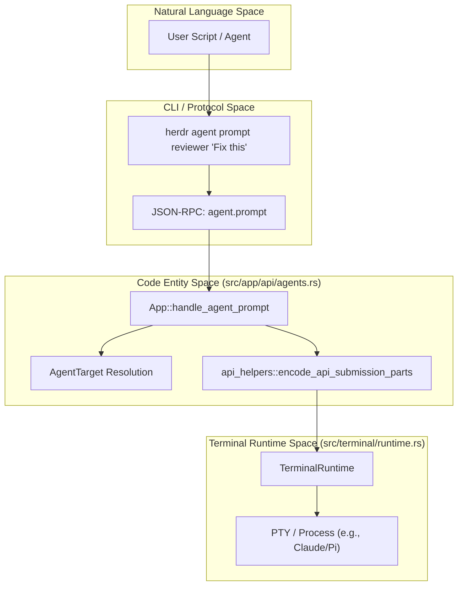

# Agent Automation API

<details>
<summary>Relevant source files</summary>

The following files were used as context for generating this wiki page:

- [README.md](https://github.com/herdrdev/herdr/blob/HEAD/README.md)
- [docs/next/README.md](https://github.com/herdrdev/herdr/blob/HEAD/docs/next/README.md)
- [docs/next/website/src/content/docs/agent-automation.mdx](https://github.com/herdrdev/herdr/blob/HEAD/docs/next/website/src/content/docs/agent-automation.mdx)
- [docs/next/website/src/content/docs/agents.mdx](https://github.com/herdrdev/herdr/blob/HEAD/docs/next/website/src/content/docs/agents.mdx)
- [docs/next/website/src/content/docs/cli-reference.mdx](https://github.com/herdrdev/herdr/blob/HEAD/docs/next/website/src/content/docs/cli-reference.mdx)
- [docs/next/website/src/content/docs/ja/agent-automation.mdx](https://github.com/herdrdev/herdr/blob/HEAD/docs/next/website/src/content/docs/ja/agent-automation.mdx)
- [docs/next/website/src/content/docs/zh-cn/agent-automation.mdx](https://github.com/herdrdev/herdr/blob/HEAD/docs/next/website/src/content/docs/zh-cn/agent-automation.mdx)
- [src/api/schema/events.rs](https://github.com/herdrdev/herdr/blob/HEAD/src/api/schema/events.rs)
- [src/api/schema/tests.rs](https://github.com/herdrdev/herdr/blob/HEAD/src/api/schema/tests.rs)
- [src/api/subscriptions.rs](https://github.com/herdrdev/herdr/blob/HEAD/src/api/subscriptions.rs)
- [src/api/wait.rs](https://github.com/herdrdev/herdr/blob/HEAD/src/api/wait.rs)
- [src/app/api/agents.rs](https://github.com/herdrdev/herdr/blob/HEAD/src/app/api/agents.rs)
- [src/app/api/plugins/context.rs](https://github.com/herdrdev/herdr/blob/HEAD/src/app/api/plugins/context.rs)
- [src/app/api_helpers.rs](https://github.com/herdrdev/herdr/blob/HEAD/src/app/api_helpers.rs)
- [src/cli/agent.rs](https://github.com/herdrdev/herdr/blob/HEAD/src/cli/agent.rs)
- [src/cli/integration.rs](https://github.com/herdrdev/herdr/blob/HEAD/src/cli/integration.rs)
- [src/cli/server_not_running.rs](https://github.com/herdrdev/herdr/blob/HEAD/src/cli/server_not_running.rs)
- [src/cli/status.rs](https://github.com/herdrdev/herdr/blob/HEAD/src/cli/status.rs)
- [src/pane/terminal/windows_recent_fallback.rs](https://github.com/herdrdev/herdr/blob/HEAD/src/pane/terminal/windows_recent_fallback.rs)
- [src/server/handoff.rs](https://github.com/herdrdev/herdr/blob/HEAD/src/server/handoff.rs)
- [tests/cli/agents.rs](https://github.com/herdrdev/herdr/blob/HEAD/tests/cli/agents.rs)
- [tests/live_handoff.rs](https://github.com/herdrdev/herdr/blob/HEAD/tests/live_handoff.rs)

</details>


The Agent Automation API provides a structured interface for controlling, monitoring, and orchestrating AI coding agents within `herdr`. It abstracts raw terminal interactions into higher-level primitives like "prompts" and "lifecycle states," allowing scripts and other agents to coordinate complex workflows.

## Architecture and Data Flow

The automation layer bridges the gap between the TUI's terminal emulation and the external JSON-RPC socket API. When an automation command is issued, it flows from the CLI or a socket client through the `App`'s API handlers, eventually interacting with the `TerminalRuntime`.

### Agent Automation Flow
The following diagram illustrates how a natural language request (e.g., "prompt the reviewer agent") translates into code entities and PTY interactions.


**Sources:** [src/app/api/agents.rs:62-111](https://github.com/herdrdev/herdr/blob/HEAD/src/app/api/agents.rs#L62-L111), [src/app/api_helpers.rs:51-61](https://github.com/herdrdev/herdr/blob/HEAD/src/app/api_helpers.rs#L51-L61), [src/terminal/runtime.rs:17-19](https://github.com/herdrdev/herdr/blob/HEAD/src/terminal/runtime.rs#L17-L19)

## Core Automation Primitives

Herdr distinguishes between three primary levels of automation responsibility:

| Primitive | Responsibility | Code Entity |
| :--- | :--- | :--- |
| **Layout** | Managing workspaces, tabs, and pane topology. | `crate::layout::TileLayout` |
| **Pane** | Raw terminal control: run, send-text, wait-output. | `crate::pane::PaneRuntime` |
| **Agent** | Lifecycle-aware control: start, prompt, wait. | `crate::detect::AgentState` |

**Sources:** [docs/next/website/src/content/docs/agent-automation.mdx:8-14](https://github.com/herdrdev/herdr/blob/HEAD/docs/next/website/src/content/docs/agent-automation.mdx#L8-L14)

## The Agent Subcommand Group

The `agent` subcommand group is the primary interface for scripting agent workflows. Unlike `pane` commands, `agent` commands are lifecycle-aware and will reject operations if the targeted agent is no longer the foreground process.

### 1. Starting Agents (`agent start`)
Starts a recognized coding agent in an existing pane. It supports various "kinds" (e.g., `pi`, `claude`, `codex`) and waits for the agent to reach an interactive state before returning.
*   **Implementation:** `App::handle_agent_start` in [src/app/api/agents.rs:53-60](https://github.com/herdrdev/herdr/blob/HEAD/src/app/api/agents.rs#L53-L60).
*   **Timeout:** Defaults to 30s; configurable via `--timeout` (3,000ms to 300,000ms).

### 2. Prompting and Input (`agent prompt` / `agent send-keys`)
*   **`agent prompt`**: Encodes text and an `Enter` key event. It automatically respects the terminal's **Bracketed Paste Mode** if active [src/app/api_helpers.rs:25-35](https://github.com/herdrdev/herdr/blob/HEAD/src/app/api_helpers.rs#L25-L35). The `App::handle_agent_prompt` method uses `encode_api_submission_parts` to send the text and then the enter key with a delay [src/app/api/agents.rs:101-106](https://github.com/herdrdev/herdr/blob/HEAD/src/app/api/agents.rs#L101-L106).
*   **`agent send-keys`**: Sends specific terminal sequences or modifier chords (e.g., `ctrl+c`, `esc`). The `encode_api_keys` function handles the conversion of key strings to terminal-compatible byte sequences [src/app/api_helpers.rs:37-49](https://github.com/herdrdev/herdr/blob/HEAD/src/app/api_helpers.rs#L37-L49).
*   **Submission Delay:** A 300ms delay is enforced after the text but before the `Enter` key to ensure the agent process processes the buffer correctly [src/app/api/agents.rs:13](https://github.com/herdrdev/herdr/blob/HEAD/src/app/api/agents.rs#L13).

### 3. Lifecycle Waiting (`agent wait`)
Allows scripts to block until an agent reaches a specific state (e.g., `idle`, `working`, `blocked`).
*   **States:**
    *   `idle`: Ready for input and seen in UI.
    *   `done`: Background work finished but not yet seen.
    *   `blocked`: Waiting for user approval/input.
*   **Mechanism:** Uses the `EventHub` to monitor state transitions and blocks the JSON-RPC response until the condition is met [src/api/wait.rs:131-174](https://github.com/herdrdev/herdr/blob/HEAD/src/api/wait.rs#L131-L174). The `AgentPromptWaitOptions` struct defines the `until` states and `timeout_ms` for waiting [src/api/schema/tests.rs:104-107](https://github.com/herdrdev/herdr/blob/HEAD/src/api/schema/tests.rs#L104-L107).

## Terminal Inspection (ReadSource & Format)

The `agent read` and `pane read` commands allow inspecting terminal content. The API provides several sources for this data. The `App::handle_agent_read` method is responsible for processing `agent read` requests [src/app/api/agents.rs:113-152](https://github.com/herdrdev/herdr/blob/HEAD/src/app/api/agents.rs#L113-L152).

### Read Source Options
| Source | Description | Implementation |
| :--- | :--- | :--- |
| `visible` | Currently rendered terminal grid. | `terminal.visible_text()` |
| `recent` | Last N rows (default 80) including history. | `terminal.recent_text_snapshot()` |
| `recent-unwrapped` | Recent rows with hard-wraps removed. | `terminal.recent_unwrapped_text_snapshot()` |
| `detection` | Plain text used for agent state heuristics. | `terminal.detection_text()` |

**Sources:** [src/app/api_helpers.rs:112-144](https://github.com/herdrdev/herdr/blob/HEAD/src/app/api_helpers.rs#L112-L144), [docs/next/website/src/content/docs/agent-automation.mdx:82-82](https://github.com/herdrdev/herdr/blob/HEAD/docs/next/website/src/content/docs/agent-automation.mdx#L82)

### Read Formats
*   **`text`**: UTF-8 text with ANSI escapes stripped.
*   **`ansi`**: Raw terminal output including color and styling sequences.

## Wait for Output Implementation

The `pane.wait_for_output` method implements a polling loop that snapshots the terminal and applies either a substring match or a regular expression. The `match_output` function in `src/api/subscriptions.rs` handles the actual matching logic [src/api/subscriptions.rs:20-35](https://github.com/herdrdev/herdr/blob/HEAD/src/api/subscriptions.rs#L20-L35).

```mermaid
sequenceDiagram
    participant C as Client (CLI/Socket)
    participant S as API Server (src/api/wait.rs)
    participant A as App State (src/app/api/agents.rs)
    participant R as TerminalRuntime
    participant Sub as ActiveOutputMatchedSubscription (src/api/subscriptions.rs)

    C->>S: pane.wait_for_output(regex="passed")
    S->>Sub: Create ActiveOutputMatchedSubscription
    loop Every 50ms (CONNECTION_POLL_INTERVAL)
        S->>A: Method::PaneRead(source=recent)
        A->>R: Get snapshot
        R-->>A: Text Buffer
        A-->>S: PaneReadResult
        S->>Sub: match_output(buffer, regex)
        alt Match Found
            Sub-->>S: Matched Line
            S-->>C: ResponseResult::OutputMatched
            break
        else Timeout Reached
            S-->>C: ErrorResponse(code="timeout")
            break
        end
    end
```
**Sources:** [src/api/wait.rs:22-129](https://github.com/herdrdev/herdr/blob/HEAD/src/api/wait.rs#L22-L129), [src/api/wait.rs:13-14](https://github.com/herdrdev/herdr/blob/HEAD/src/api/wait.rs#L13-L14), [src/api/subscriptions.rs:38-46](https://github.com/herdrdev/herdr/blob/HEAD/src/api/subscriptions.rs#L38-L46)

## Key Functions and Classes

### `TerminalRuntime`
The core wrapper around the PTY and terminal emulator. It provides the methods for input encoding and buffer snapshots.
*   **Location:** [src/terminal/runtime.rs:17-19](https://github.com/herdrdev/herdr/blob/HEAD/src/terminal/runtime.rs#L17-L19)
*   **Key Method:** `encode_terminal_key` used by `api_helpers` to generate PTY-compatible bytes from abstract key names [src/app/api_helpers.rs:46](https://github.com/herdrdev/herdr/blob/HEAD/src/app/api_helpers.rs#L46).

### `api_helpers`
A utility module that translates high-level API parameters into PTY-level data.
*   **`encode_api_submission`**: Combines text and `Enter` with proper bracketed paste wrapping [src/app/api_helpers.rs:63-70](https://github.com/herdrdev/herdr/blob/HEAD/src/app/api_helpers.rs#L63-L70).
*   **`read_terminal_snapshot`**: Dispatches to the correct `TerminalRuntime` method based on `ReadSource` [src/app/api_helpers.rs:112-144](https://github.com/herdrdev/herdr/blob/HEAD/src/app/api_helpers.rs#L112-L144).

### `ResolvedAgentWait`
A struct used by the `wait` logic to track the target agent and the desired state sequence.
*   **Location:** [src/api/wait.rs:155-164](https://github.com/herdrdev/herdr/blob/HEAD/src/api/wait.rs#L155-L164)
*   **Logic:** It tracks `last_event_sequence` to ensure it doesn't miss transitions that occur immediately after a prompt [src/api/wait.rs:195](https://github.com/herdrdev/herdr/blob/HEAD/src/api/wait.rs#L195).

## Sources
*   [src/terminal/runtime.rs:1-109](https://github.com/herdrdev/herdr/blob/HEAD/src/terminal/runtime.rs#L1-L109)
*   [src/app/api/agents.rs:1-179](https://github.com/herdrdev/herdr/blob/HEAD/src/app/api/agents.rs#L1-L179)
*   [src/app/api_helpers.rs:1-201](https://github.com/herdrdev/herdr/blob/HEAD/src/app/api_helpers.rs#L1-L201)
*   [src/api/wait.rs:1-200](https://github.com/herdrdev/herdr/blob/HEAD/src/api/wait.rs#L1-L200)
*   [src/api/subscriptions.rs:1-300](https://github.com/herdrdev/herdr/blob/HEAD/src/api/subscriptions.rs#L1-L300)
*   [src/api/schema/tests.rs:1-210](https://github.com/herdrdev/herdr/blob/HEAD/src/api/schema/tests.rs#L1-L210)
*   [docs/next/website/src/content/docs/agent-automation.mdx:1-83](https://github.com/herdrdev/herdr/blob/HEAD/docs/next/website/src/content/docs/agent-automation.mdx#L1-L83)