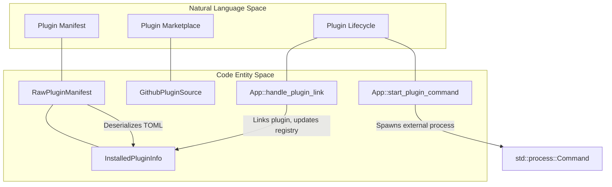
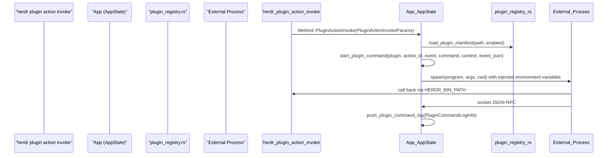

# Plugin System

Relevant source files

The following files were used as context for generating this wiki page:

- [.gitignore](https://github.com/herdrdev/herdr/blob/HEAD/.gitignore)
- [docs/next/website/src/content/docs/marketplace.mdx](https://github.com/herdrdev/herdr/blob/HEAD/docs/next/website/src/content/docs/marketplace.mdx)
- [docs/next/website/src/content/docs/plugins.mdx](https://github.com/herdrdev/herdr/blob/HEAD/docs/next/website/src/content/docs/plugins.mdx)
- [src/api/schema/plugins.rs](https://github.com/herdrdev/herdr/blob/HEAD/src/api/schema/plugins.rs)
- [src/app/api/plugins/manifest.rs](https://github.com/herdrdev/herdr/blob/HEAD/src/app/api/plugins/manifest.rs)
- [src/app/api/plugins/mod.rs](https://github.com/herdrdev/herdr/blob/HEAD/src/app/api/plugins/mod.rs)
- [src/app/api/plugins/panes.rs](https://github.com/herdrdev/herdr/blob/HEAD/src/app/api/plugins/panes.rs)
- [src/app/api/plugins/runtime.rs](https://github.com/herdrdev/herdr/blob/HEAD/src/app/api/plugins/runtime.rs)
- [src/cli/plugin.rs](https://github.com/herdrdev/herdr/blob/HEAD/src/cli/plugin.rs)
- [src/noninteractive_process.rs](https://github.com/herdrdev/herdr/blob/HEAD/src/noninteractive_process.rs)
- [src/persist/plugin_registry.rs](https://github.com/herdrdev/herdr/blob/HEAD/src/persist/plugin_registry.rs)
- [src/plugin_command.rs](https://github.com/herdrdev/herdr/blob/HEAD/src/plugin_command.rs)
- [src/plugin_paths.rs](https://github.com/herdrdev/herdr/blob/HEAD/src/plugin_paths.rs)
- [tests/cli/plugins.rs](https://github.com/herdrdev/herdr/blob/HEAD/tests/cli/plugins.rs)
- [workers/plugin-marketplace/package.json](https://github.com/herdrdev/herdr/blob/HEAD/workers/plugin-marketplace/package.json)
- [workers/plugin-marketplace/src/index.test.ts](https://github.com/herdrdev/herdr/blob/HEAD/workers/plugin-marketplace/src/index.test.ts)
- [workers/plugin-marketplace/src/index.ts](https://github.com/herdrdev/herdr/blob/HEAD/workers/plugin-marketplace/src/index.ts)
- [workers/plugin-marketplace/wrangler.toml](https://github.com/herdrdev/herdr/blob/HEAD/workers/plugin-marketplace/wrangler.toml)

The herdr plugin system provides a framework for extending the application's functionality through shareable, executable workflow packages [docs/next/website/src/content/docs/plugins.mdx:6-11](https://github.com/herdrdev/herdr/blob/HEAD/docs/next/website/src/content/docs/plugins.mdx#L6-L11). Unlike traditional SDKs, herdr plugins are language-agnostic; they can be written in Bash, JavaScript, Python, Rust, or any other language that can be executed as a command [docs/next/website/src/content/docs/plugins.mdx:125-133](https://github.com/herdrdev/herdr/blob/HEAD/docs/next/website/src/content/docs/plugins.mdx#L125-L133).

The system is designed to keep the core `herdr` binary lean by moving specialized workflows—such as custom layout managers, notification hooks, or project boards—into external plugins [docs/next/website/src/content/docs/plugins.mdx:13-17](https://github.com/herdrdev/herdr/blob/HEAD/docs/next/website/src/content/docs/plugins.mdx#L13-L17).

### System Architecture

The plugin system bridges the `App` state with external processes using a manifest-driven approach.

Plugin System Overview

**Sources:** [src/app/api/plugins/manifest.rs:12-34](https://github.com/herdrdev/herdr/blob/HEAD/src/app/api/plugins/manifest.rs#L12-L34), [src/app/api/plugins/mod.rs:68-88](https://github.com/herdrdev/herdr/blob/HEAD/src/app/api/plugins/mod.rs#L68-L88), [src/app/api/plugins/runtime.rs:16-24](https://github.com/herdrdev/herdr/blob/HEAD/src/app/api/plugins/runtime.rs#L16-L24), [src/cli/plugin.rs:159-165](https://github.com/herdrdev/herdr/blob/HEAD/src/cli/plugin.rs#L159-L165)

### Core Components

#### 1. Manifest Format (`herdr-plugin.toml`)
The manifest serves as the contract between `herdr` and the plugin [docs/next/website/src/content/docs/plugins.mdx:55-59](https://github.com/herdrdev/herdr/blob/HEAD/docs/next/website/src/content/docs/plugins.mdx#L55-L59). It defines:
*   **Metadata**: `id`, `name`, `version`, and `min_herdr_version` [src/app/api/plugins/manifest.rs:144-152](https://github.com/herdrdev/herdr/blob/HEAD/src/app/api/plugins/manifest.rs#L144-L152).
*   **Actions**: Executable commands registered to specific UI contexts (e.g., `workspace`) [src/app/api/plugins/manifest.rs:51-61](https://github.com/herdrdev/herdr/blob/HEAD/src/app/api/plugins/manifest.rs#L51-L61).
*   **Panes**: Custom terminal UI components with specific placements like `overlay`, `popup`, or `tab` [src/api/schema/plugins.rs:300-306](https://github.com/herdrdev/herdr/blob/HEAD/src/api/schema/plugins.rs#L300-L306).
*   **Events**: Hooks that trigger commands based on system events like `worktree.created` [src/app/api/plugins/manifest.rs:64-69](https://github.com/herdrdev/herdr/blob/HEAD/src/app/api/plugins/manifest.rs#L64-L69).
*   **Link Handlers**: Regex patterns for intercepting terminal hyperlinks and routing them to plugin actions [src/app/api/plugins/manifest.rs:89-96](https://github.com/herdrdev/herdr/blob/HEAD/src/app/api/plugins/manifest.rs#L89-L96).

For detailed schema information and authoring guides, see **[Plugin Authoring and Manifest](30_7.1-plugin-authoring-and-manifest.md)**.

#### 2. Installation and Persistence
Plugins can be installed via GitHub shorthand (`owner/repo/subdir`) or linked from a local directory for development [src/cli/plugin.rs:48-86](https://github.com/herdrdev/herdr/blob/HEAD/src/cli/plugin.rs#L48-L86), [src/cli/plugin.rs:154-192](https://github.com/herdrdev/herdr/blob/HEAD/src/cli/plugin.rs#L154-L192).
*   **Registry**: Installed plugins are persisted in `plugins.json` within the herdr configuration directory [src/persist/plugin_registry.rs:11-13](https://github.com/herdrdev/herdr/blob/HEAD/src/persist/plugin_registry.rs#L11-L13).
*   **Locking**: A file-based lock (`.plugins.lock`) ensures atomic updates to the registry across multiple `herdr` sessions [src/persist/plugin_registry.rs:9-32](https://github.com/herdrdev/herdr/blob/HEAD/src/persist/plugin_registry.rs#L9-L32).
*   **Discovery**: The marketplace at `herdr.dev/plugins` indexes repositories tagged with `herdr-plugin` on GitHub [docs/next/website/src/content/docs/marketplace.mdx:6-15](https://github.com/herdrdev/herdr/blob/HEAD/docs/next/website/src/content/docs/marketplace.mdx#L6-L15).

For details on the installation pipeline and discovery, see **[Plugin Runtime and Marketplace](31_7.2-plugin-runtime-and-marketplace.md)**.

#### 3. Runtime Environment
When a plugin command is executed, `herdr` injects a rich execution environment via environment variables [src/app/api/plugins/runtime.rs:39-81](https://github.com/herdrdev/herdr/blob/HEAD/src/app/api/plugins/runtime.rs#L39-L81):
*   `HERDR_BIN_PATH`: Path to the current `herdr` binary for calling back into the CLI [src/app/api/plugins/runtime.rs:49-54](https://github.com/herdrdev/herdr/blob/HEAD/src/app/api/plugins/runtime.rs#L49-L54).
*   `HERDR_PLUGIN_CONTEXT_JSON`: A serialized `PluginInvocationContext` containing the active workspace, tab, and pane IDs [src/app/api/plugins/runtime.rs:47](https://github.com/herdrdev/herdr/blob/HEAD/src/app/api/plugins/runtime.rs#L47).
*   `HERDR_PLUGIN_ID`: The unique identifier of the executing plugin [src/app/api/plugins/runtime.rs:46](https://github.com/herdrdev/herdr/blob/HEAD/src/app/api/plugins/runtime.rs#L46).

Plugin Execution Flow

**Sources:** [src/app/api/plugins/mod.rs:177-186](https://github.com/herdrdev/herdr/blob/HEAD/src/app/api/plugins/mod.rs#L177-L186), [src/app/api/plugins/runtime.rs:16-81](https://github.com/herdrdev/herdr/blob/HEAD/src/app/api/plugins/runtime.rs#L16-L81), [src/plugin_command.rs:7-12](https://github.com/herdrdev/herdr/blob/HEAD/src/plugin_command.rs#L7-L12), [docs/next/website/src/content/docs/plugins.mdx:24-31](https://github.com/herdrdev/herdr/blob/HEAD/docs/next/website/src/content/docs/plugins.mdx#L24-L31)

### Command Lifecycle
The system manages the lifecycle of plugin commands with strict resource limits:
*   **Output Capping**: Standard output and error are capped at 64 KB to prevent memory exhaustion [src/app/api/plugins/runtime.rs:11](https://github.com/herdrdev/herdr/blob/HEAD/src/app/api/plugins/runtime.rs#L11).
*   **Concurrency**: A maximum of 32 plugin commands can run in flight simultaneously [src/app/api/plugins/runtime.rs:12](https://github.com/herdrdev/herdr/blob/HEAD/src/app/api/plugins/runtime.rs#L12).
*   **Logging**: Execution results, including exit codes and capped output, are stored in a circular log buffer for debugging [src/app/api/plugins/runtime.rs:13-100](https://github.com/herdrdev/herdr/blob/HEAD/src/app/api/plugins/runtime.rs#L13-L100).

| Feature | Code Entity | Role |
| :--- | :--- | :--- |
| **Manifest Loading** | `load_plugin_manifest` | Parses TOML and canonicalizes paths [src/app/api/plugins/manifest.rs:118-131](https://github.com/herdrdev/herdr/blob/HEAD/src/app/api/plugins/manifest.rs#L118-L131) |
| **Command Spawning** | `command_for_argv_in_dir` | Handles OS-specific argv execution (e.g., Windows batch files) [src/plugin_command.rs:7-12](https://github.com/herdrdev/herdr/blob/HEAD/src/plugin_command.rs#L7-L12) |
| **Registry Updates** | `plugin_registry::update` | Thread-safe mutation of the global plugin list [src/persist/plugin_registry.rs:59-69](https://github.com/herdrdev/herdr/blob/HEAD/src/persist/plugin_registry.rs#L59-L69) |
| **UI Integration** | `open_plugin_pane` | Integrates plugin commands into the TUI layout engine [src/app/api/plugins/panes.rs:44-50](https://github.com/herdrdev/herdr/blob/HEAD/src/app/api/plugins/panes.rs#L44-L50) |

**Sources:** [src/app/api/plugins/runtime.rs:11-13](https://github.com/herdrdev/herdr/blob/HEAD/src/app/api/plugins/runtime.rs#L11-L13), [src/app/api/plugins/mod.rs:28-37](https://github.com/herdrdev/herdr/blob/HEAD/src/app/api/plugins/mod.rs#L28-L37), [src/persist/plugin_registry.rs:112-132](https://github.com/herdrdev/herdr/blob/HEAD/src/persist/plugin_registry.rs#L112-L132)

---
**Child Pages:**
*   **[Plugin Authoring and Manifest](30_7.1-plugin-authoring-and-manifest.md)**: Manifest schema, placement strategies, and invocation context.
*   **[Plugin Runtime and Marketplace](31_7.2-plugin-runtime-and-marketplace.md)**: Installation workflows, environment injection, and marketplace discovery.34:T