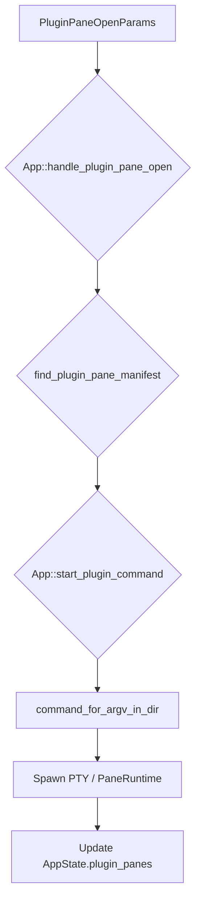
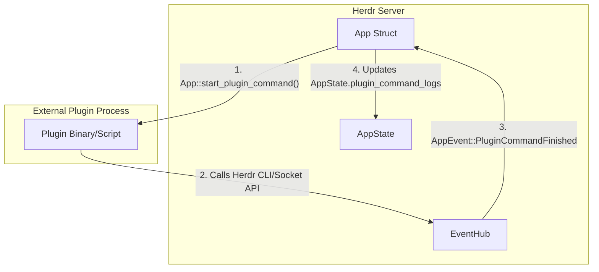

# Plugin Authoring and Manifest

Relevant source files

The following files were used as context for generating this wiki page:

- [docs/next/website/src/content/docs/plugins.mdx](https://github.com/herdrdev/herdr/blob/HEAD/docs/next/website/src/content/docs/plugins.mdx)
- [src/api/schema/plugins.rs](https://github.com/herdrdev/herdr/blob/HEAD/src/api/schema/plugins.rs)
- [src/app/api/plugins/manifest.rs](https://github.com/herdrdev/herdr/blob/HEAD/src/app/api/plugins/manifest.rs)
- [src/app/api/plugins/mod.rs](https://github.com/herdrdev/herdr/blob/HEAD/src/app/api/plugins/mod.rs)
- [src/app/api/plugins/panes.rs](https://github.com/herdrdev/herdr/blob/HEAD/src/app/api/plugins/panes.rs)
- [src/app/api/plugins/runtime.rs](https://github.com/herdrdev/herdr/blob/HEAD/src/app/api/plugins/runtime.rs)
- [src/cli/plugin.rs](https://github.com/herdrdev/herdr/blob/HEAD/src/cli/plugin.rs)
- [src/ipc.rs](https://github.com/herdrdev/herdr/blob/HEAD/src/ipc.rs)
- [src/noninteractive_process.rs](https://github.com/herdrdev/herdr/blob/HEAD/src/noninteractive_process.rs)
- [src/persist/plugin_registry.rs](https://github.com/herdrdev/herdr/blob/HEAD/src/persist/plugin_registry.rs)
- [src/plugin_command.rs](https://github.com/herdrdev/herdr/blob/HEAD/src/plugin_command.rs)
- [src/plugin_paths.rs](https://github.com/herdrdev/herdr/blob/HEAD/src/plugin_paths.rs)
- [tests/cli/plugins.rs](https://github.com/herdrdev/herdr/blob/HEAD/tests/cli/plugins.rs)

Herdr plugins are shareable, executable workflow packages that extend the terminal workspace. A plugin can be any executable (Bash script, JavaScript app, Rust binary, etc.) that interacts with Herdr via the CLI or JSON-RPC socket. The core of a plugin is its `herdr-plugin.toml` manifest, which defines how it integrates with the UI and event loop.

## Plugin Manifest Schema

The `herdr-plugin.toml` file is the contract between Herdr and the plugin. It is parsed into the `RawPluginManifest` struct during loading [src/app/api/plugins/manifest.rs:12-34](https://github.com/herdrdev/herdr/blob/HEAD/src/app/api/plugins/manifest.rs#L12-L34).

### Metadata Fields
- `id`: Globally unique identifier (e.g., `example.layout`). Local IDs (actions, panes) are qualified as `plugin.id.action` [docs/next/website/src/content/docs/plugins.mdx:106-113](https://github.com/herdrdev/herdr/blob/HEAD/docs/next/website/src/content/docs/plugins.mdx#L106-L113).
- `min_herdr_version`: Minimum version of Herdr required to run the plugin [src/app/api/plugins/manifest.rs:152](https://github.com/herdrdev/herdr/blob/HEAD/src/app/api/plugins/manifest.rs#L152).
- `platforms`: List of supported OSs (`linux`, `macos`, `windows`) [src/app/api/plugins/manifest.rs:107-115](https://github.com/herdrdev/herdr/blob/HEAD/src/app/api/plugins/manifest.rs#L107-L115).

### Entrypoints
The manifest supports several entrypoint types:

| Type | Key | Purpose |
| :--- | :--- | :--- |
| **Build** | `[[build]]` | Commands run during installation (e.g., `npm install`) [src/app/api/plugins/manifest.rs:37-41](https://github.com/herdrdev/herdr/blob/HEAD/src/app/api/plugins/manifest.rs#L37-L41). |
| **Startup** | `[[startup]]` | Commands run when the Herdr server starts [src/app/api/plugins/manifest.rs:44-48](https://github.com/herdrdev/herdr/blob/HEAD/src/app/api/plugins/manifest.rs#L44-L48). |
| **Actions** | `[[actions]]` | User-invocable commands, often bound to keys or context menus [src/app/api/plugins/manifest.rs:51-61](https://github.com/herdrdev/herdr/blob/HEAD/src/app/api/plugins/manifest.rs#L51-L61). |
| **Events** | `[[events]]` | Hooks that trigger on system events (e.g., `worktree.created`) [src/app/api/plugins/manifest.rs:64-69](https://github.com/herdrdev/herdr/blob/HEAD/src/app/api/plugins/manifest.rs#L64-L69). |
| **Panes** | `[[panes]]` | Declarations for custom terminal panes [src/app/api/plugins/manifest.rs:72-86](https://github.com/herdrdev/herdr/blob/HEAD/src/app/api/plugins/manifest.rs#L72-L86). |
| **Link Handlers** | `[[link_handlers]]` | Regex patterns to intercept URL clicks [src/app/api/plugins/manifest.rs:89-96](https://github.com/herdrdev/herdr/blob/HEAD/src/app/api/plugins/manifest.rs#L89-L96). |

**Sources:** [src/app/api/plugins/manifest.rs:12-96](https://github.com/herdrdev/herdr/blob/HEAD/src/app/api/plugins/manifest.rs#L12-L96), [docs/next/website/src/content/docs/plugins.mdx:61-100](https://github.com/herdrdev/herdr/blob/HEAD/docs/next/website/src/content/docs/plugins.mdx#L61-L100)

---

## Placement Strategies and Panes

Plugins can define panes that are rendered within the Herdr TUI. The `placement` field in the manifest determines how the pane is integrated into the layout.

### Placement Modes
- **Overlay**: A modal-like pane that covers a portion of the screen [src/app/api/plugins/panes.rs:45-75](https://github.com/herdrdev/herdr/blob/HEAD/src/app/api/plugins/panes.rs#L45-L75).
- **Popup**: A floating window with specific `width` and `height` (defined via `PopupSize`) [src/app/api/plugins/panes.rs:11-41](https://github.com/herdrdev/herdr/blob/HEAD/src/app/api/plugins/panes.rs#L11-L41).
- **Split**: Divides an existing pane horizontally or vertically [src/app/api/plugins/panes.rs:79-167](https://github.com/herdrdev/herdr/blob/HEAD/src/app/api/plugins/panes.rs#L79-L167).
- **Tab**: Opens the plugin in a new dedicated tab [src/app/api/plugins/panes.rs:170-200](https://github.com/herdrdev/herdr/blob/HEAD/src/app/api/plugins/panes.rs#L170-L200).
- **Zoomed**: Occupies the full workspace area [src/app/api/plugins/panes.rs:149-158](https://github.com/herdrdev/herdr/blob/HEAD/src/app/api/plugins/panes.rs#L149-L158).

### Pane Data Flow
When a plugin pane is opened, Herdr spawns the command in a PTY and manages its lifecycle.

**Plugin Pane Invocation Logic**

Sources: [src/app/api/plugins/panes.rs](https://github.com/herdrdev/herdr/blob/HEAD/src/app/api/plugins/panes.rs), [src/app/api/plugins/runtime.rs:121-127](https://github.com/herdrdev/herdr/blob/HEAD/src/app/api/plugins/runtime.rs#L121-L127), [src/plugin_command.rs:7-12](https://github.com/herdrdev/herdr/blob/HEAD/src/plugin_command.rs#L7-L12)

---

## PluginInvocationContext

Whenever Herdr executes a plugin command (Action, Event, or Pane), it injects a `PluginInvocationContext`. This context provides the plugin with environmental data about where it was triggered.

### Environment Variables
The context is serialized and passed via `HERDR_PLUGIN_CONTEXT_JSON`, but key fields are also flattened into individual environment variables for easy access in shell scripts [src/app/api/plugins/runtime.rs:40-81](https://github.com/herdrdev/herdr/blob/HEAD/src/app/api/plugins/runtime.rs#L40-L81):

- `HERDR_BIN_PATH`: Path to the current `herdr` binary [src/app/api/plugins/runtime.rs:50-53](https://github.com/herdrdev/herdr/blob/HEAD/src/app/api/plugins/runtime.rs#L50-L53).
- `HERDR_WORKSPACE_ID`: The ID of the active workspace [src/app/api/plugins/runtime.rs:64-66](https://github.com/herdrdev/herdr/blob/HEAD/src/app/api/plugins/runtime.rs#L64-L66).
- `HERDR_TAB_ID`: The ID of the active tab [src/app/api/plugins/runtime.rs:67-69](https://github.com/herdrdev/herdr/blob/HEAD/src/app/api/plugins/runtime.rs#L67-L69).
- `HERDR_PANE_ID`: The ID of the focused pane [src/app/api/plugins/runtime.rs:70-72](https://github.com/herdrdev/herdr/blob/HEAD/src/app/api/plugins/runtime.rs#L70-L72).
- `HERDR_PLUGIN_CLICKED_URL`: The URL that triggered a `link_handler` [src/app/api/plugins/runtime.rs:73-75](https://github.com/herdrdev/herdr/blob/HEAD/src/app/api/plugins/runtime.rs#L73-L75).
- `HERDR_PLUGIN_ACTION_ID`: The ID of the invoked action [src/app/api/plugins/runtime.rs:55-57](https://github.com/herdrdev/herdr/blob/HEAD/src/app/api/plugins/runtime.rs#L55-L57).
- `HERDR_PLUGIN_EVENT`: The name of the event that triggered the hook [src/app/api/plugins/runtime.rs:58-60](https://github.com/herdrdev/herdr/blob/HEAD/src/app/api/plugins/runtime.rs#L58-L60).
- `HERDR_PLUGIN_EVENT_JSON`: The JSON payload of the event [src/app/api/plugins/runtime.rs:61-63](https://github.com/herdrdev/herdr/blob/HEAD/src/app/api/plugins/runtime.rs#L61-L63).
- `HERDR_PLUGIN_LINK_HANDLER_ID`: The ID of the link handler that was invoked [src/app/api/plugins/runtime.rs:76-80](https://github.com/herdrdev/herdr/blob/HEAD/src/app/api/plugins/runtime.rs#L76-L80).

**Sources:** [src/app/api/plugins/runtime.rs:32-81](https://github.com/herdrdev/herdr/blob/HEAD/src/app/api/plugins/runtime.rs#L32-L81), [docs/next/website/src/content/docs/plugins.mdx:150-164](https://github.com/herdrdev/herdr/blob/HEAD/docs/next/website/src/content/docs/plugins.mdx#L150-L164)

---

## Execution Runtime and Security

Plugin commands are executed as non-interactive processes. Herdr captures `stdout` and `stderr`, capping them at 64KB to prevent memory exhaustion [src/app/api/plugins/runtime.rs:11-13](https://github.com/herdrdev/herdr/blob/HEAD/src/app/api/plugins/runtime.rs#L11-L13).

### Command Lifecycle
1. **Validation**: Herdr ensures the platform is supported and the command exists [src/app/api/plugins/runtime.rs:25-30](https://github.com/herdrdev/herdr/blob/HEAD/src/app/api/plugins/runtime.rs#L25-L30).
2. **Environment Setup**: Injects `HERDR_ENV=1` and socket paths [src/app/api/plugins/runtime.rs:45-48](https://github.com/herdrdev/herdr/blob/HEAD/src/app/api/plugins/runtime.rs#L45-L48).
3. **Execution**: Uses `std::thread::spawn` to run the process without blocking the main TUI event loop [src/app/api/plugins/runtime.rs:121-127](https://github.com/herdrdev/herdr/blob/HEAD/src/app/api/plugins/runtime.rs#L121-L127).
4. **Logging**: Results are stored in `AppState.plugin_command_logs` (limited to the last 200 entries) [src/app/api/plugins/runtime.rs:13-100](https://github.com/herdrdev/herdr/blob/HEAD/src/app/api/plugins/runtime.rs#L13-L100).

**Runtime Process Architecture**

Sources: [src/app/api/plugins/runtime.rs:15-163](https://github.com/herdrdev/herdr/blob/HEAD/src/app/api/plugins/runtime.rs#L15-L163), [src/plugin_command.rs:25-50](https://github.com/herdrdev/herdr/blob/HEAD/src/plugin_command.rs#L25-L50), [src/ipc.rs:35-52](https://github.com/herdrdev/herdr/blob/HEAD/src/ipc.rs#L35-L52)

### Security Model
Plugins run with the user's permissions. There is no sandbox; however, Herdr provides a "preview" during `herdr plugin install` so users can inspect the manifest and build commands before execution [docs/next/website/src/content/docs/plugins.mdx:38-53](https://github.com/herdrdev/herdr/blob/HEAD/docs/next/website/src/content/docs/plugins.mdx#L38-L53).

**Sources:** [src/app/api/plugins/runtime.rs:15-163](https://github.com/herdrdev/herdr/blob/HEAD/src/app/api/plugins/runtime.rs#L15-L163), [src/plugin_command.rs:25-50](https://github.com/herdrdev/herdr/blob/HEAD/src/plugin_command.rs#L25-L50), [docs/next/website/src/content/docs/plugins.mdx:36-54](https://github.com/herdrdev/herdr/blob/HEAD/docs/next/website/src/content/docs/plugins.mdx#L36-L54)