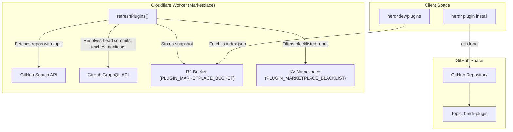
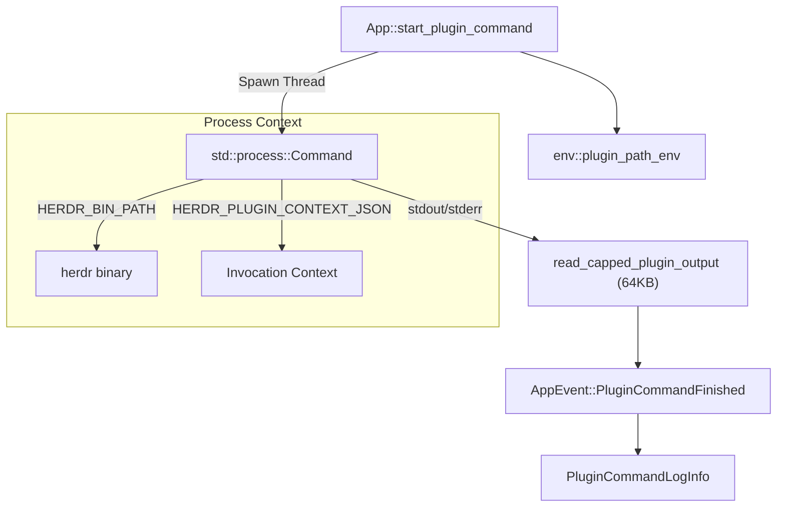

# Plugin Runtime and Marketplace

Relevant source files

The following files were used as context for generating this wiki page:

- [.gitignore](https://github.com/herdrdev/herdr/blob/HEAD/.gitignore)
- [docs/next/website/src/content/docs/marketplace.mdx](https://github.com/herdrdev/herdr/blob/HEAD/docs/next/website/src/content/docs/marketplace.mdx)
- [docs/next/website/src/content/docs/plugins.mdx](https://github.com/herdrdev/herdr/blob/HEAD/docs/next/website/src/content/docs/plugins.mdx)
- [src/api/schema/plugins.rs](https://github.com/herdrdev/herdr/blob/HEAD/src/api/schema/plugins.rs)
- [src/app/api/plugins/manifest.rs](https://github.com/herdrdev/herdr/blob/HEAD/src/app/api/plugins/manifest.rs)
- [src/app/api/plugins/mod.rs](https://github.com/herdrdev/herdr/blob/HEAD/src/app/api/plugins/mod.rs)
- [src/app/api/plugins/panes.rs](https://github.com/herdrdev/herdr/blob/HEAD/src/app/api/plugins/panes.rs)
- [src/app/api/plugins/runtime.rs](https://github.com/herdrdev/herdr/blob/HEAD/src/app/api/plugins/runtime.rs)
- [src/cli/plugin.rs](https://github.com/herdrdev/herdr/blob/HEAD/src/cli/plugin.rs)
- [src/noninteractive_process.rs](https://github.com/herdrdev/herdr/blob/HEAD/src/noninteractive_process.rs)
- [src/persist/plugin_registry.rs](https://github.com/herdrdev/herdr/blob/HEAD/src/persist/plugin_registry.rs)
- [src/plugin_command.rs](https://github.com/herdrdev/herdr/blob/HEAD/src/plugin_command.rs)
- [src/plugin_paths.rs](https://github.com/herdrdev/herdr/blob/HEAD/src/plugin_paths.rs)
- [tests/cli/plugins.rs](https://github.com/herdrdev/herdr/blob/HEAD/tests/cli/plugins.rs)
- [website/src/data/plugins-fixture.json](https://github.com/herdrdev/herdr/blob/HEAD/website/src/data/plugins-fixture.json)
- [website/src/pages/plugins.astro](https://github.com/herdrdev/herdr/blob/HEAD/website/src/pages/plugins.astro)
- [workers/plugin-marketplace/package.json](https://github.com/herdrdev/herdr/blob/HEAD/workers/plugin-marketplace/package.json)
- [workers/plugin-marketplace/src/index.test.ts](https://github.com/herdrdev/herdr/blob/HEAD/workers/plugin-marketplace/src/index.test.ts)
- [workers/plugin-marketplace/src/index.ts](https://github.com/herdrdev/herdr/blob/HEAD/workers/plugin-marketplace/src/index.ts)
- [workers/plugin-marketplace/wrangler.toml](https://github.com/herdrdev/herdr/blob/HEAD/workers/plugin-marketplace/wrangler.toml)

The herdr plugin system allows extending the terminal workspace with custom actions, event hooks, and dedicated UI panes. Plugins are executable packages that interact with herdr via the CLI or JSON-RPC socket. The system handles lifecycle management, including installation from GitHub, local development linking, and secure execution with environment injection and output management.

## Plugin Discovery and Marketplace

Plugins are discovered via the **Plugin Marketplace**, which is implemented as a Cloudflare Worker that indexes GitHub repositories.

*   **Discovery Mechanism**: The marketplace identifies plugins by searching for public repositories tagged with the `herdr-plugin` GitHub topic [docs/next/website/src/content/docs/marketplace.mdx:37-39](https://github.com/herdrdev/herdr/blob/HEAD/docs/next/website/src/content/docs/marketplace.mdx#L37-L39).
*   **Indexing**: The index refreshes every 30 minutes, capturing repository metadata such as name, description, stars, and primary language [docs/next/website/src/content/docs/marketplace.mdx:39-49](https://github.com/herdrdev/herdr/blob/HEAD/docs/next/website/src/content/docs/marketplace.mdx#L39-L49).
*   **Installation**: Users install plugins using the GitHub shorthand `owner/repo/subdir`. The CLI clones the repository using `git`, validates the `herdr-plugin.toml` manifest, and runs any declared `[[build]]` commands [src/cli/plugin.rs:154-205](https://github.com/herdrdev/herdr/blob/HEAD/src/cli/plugin.rs#L154-L205).

### Plugin Discovery Data Flow

Title: Plugin Marketplace Discovery Flow

Sources: [docs/next/website/src/content/docs/marketplace.mdx:6-54](https://github.com/herdrdev/herdr/blob/HEAD/docs/next/website/src/content/docs/marketplace.mdx#L6-L54), [src/cli/plugin.rs:154-205](https://github.com/herdrdev/herdr/blob/HEAD/src/cli/plugin.rs#L154-L205), [workers/plugin-marketplace/src/index.ts:218-250](https://github.com/herdrdev/herdr/blob/HEAD/workers/plugin-marketplace/src/index.ts#L218-L250), [workers/plugin-marketplace/wrangler.toml:9-22](https://github.com/herdrdev/herdr/blob/HEAD/workers/plugin-marketplace/wrangler.toml#L9-L22)

## Plugin Installation and Persistence

Herdr supports two primary methods for adding plugins: `install` (managed copies) and `link` (local development paths).

*   **Registry Persistence**: Installed plugins are recorded in `plugins.json` within the herdr config directory [src/persist/plugin_registry.rs:11-13](https://github.com/herdrdev/herdr/blob/HEAD/src/persist/plugin_registry.rs#L11-L13).
*   **Concurrency Control**: Access to the registry is guarded by a file lock (`.plugins.lock`) to prevent corruption when multiple herdr sessions (e.g., named sessions `alpha` and `beta`) modify the registry simultaneously [src/persist/plugin_registry.rs:15-32](https://github.com/herdrdev/herdr/blob/HEAD/src/persist/plugin_registry.rs#L15-L32).
*   **Registry Syncing**: The `App` struct synchronizes its in-memory `InstalledPluginRegistry` with the disk using `refresh_installed_plugins` and `update_installed_plugins` [src/app/api/plugins/mod.rs:39-66](https://github.com/herdrdev/herdr/blob/HEAD/src/app/api/plugins/mod.rs#L39-L66).

### Persistence Entities

| Entity | Code Reference | Purpose |
| :--- | :--- | :--- |
| `InstalledPluginInfo` | [src/api/schema/plugins.rs:37-68](https://github.com/herdrdev/herdr/blob/HEAD/src/api/schema/plugins.rs#L37-L68) | Data structure for a registered plugin, including its manifest and source. |
| `plugins.json` | [src/persist/plugin_registry.rs:11-13](https://github.com/herdrdev/herdr/blob/HEAD/src/persist/plugin_registry.rs#L11-L13) | Persistent JSON store for all registered plugins. |
| `plugin_registry::update` | [src/persist/plugin_registry.rs:59-69](https://github.com/herdrdev/herdr/blob/HEAD/src/persist/plugin_registry.rs#L59-L69) | Function for atomic, locked mutations of the plugin list. |
| `reload_manifests` | [src/persist/plugin_registry.rs:112-132](https://github.com/herdrdev/herdr/blob/HEAD/src/persist/plugin_registry.rs#L112-L132) | Re-validates plugin manifests from disk during registry load. |

Sources: [src/persist/plugin_registry.rs:8-132](https://github.com/herdrdev/herdr/blob/HEAD/src/persist/plugin_registry.rs#L8-L132), [src/app/api/plugins/mod.rs:27-66](https://github.com/herdrdev/herdr/blob/HEAD/src/app/api/plugins/mod.rs#L27-L66), [src/api/schema/plugins.rs:37-68](https://github.com/herdrdev/herdr/blob/HEAD/src/api/schema/plugins.rs#L37-L68)

## Execution Runtime

Plugins are executed as non-interactive child processes. The runtime injects context via environment variables and captures output with size limits.

### Environment Injection
When a plugin command (Action, Event, or Pane) is executed, `start_plugin_command` populates the environment with:
*   `HERDR_BIN_PATH`: Path to the current herdr binary [src/app/api/plugins/runtime.rs:49-54](https://github.com/herdrdev/herdr/blob/HEAD/src/app/api/plugins/runtime.rs#L49-L54).
*   `HERDR_PLUGIN_ID`: The unique ID of the plugin [src/app/api/plugins/runtime.rs:46](https://github.com/herdrdev/herdr/blob/HEAD/src/app/api/plugins/runtime.rs#L46).
*   `HERDR_PLUGIN_CONTEXT_JSON`: A serialized `PluginInvocationContext` [src/app/api/plugins/runtime.rs:47](https://github.com/herdrdev/herdr/blob/HEAD/src/app/api/plugins/runtime.rs#L47).
*   **Scoped IDs**: `HERDR_WORKSPACE_ID`, `HERDR_TAB_ID`, and `HERDR_PANE_ID` based on where the plugin was triggered [src/app/api/plugins/runtime.rs:64-72](https://github.com/herdrdev/herdr/blob/HEAD/src/app/api/plugins/runtime.rs#L64-L72).

### Resource Constraints and Logging
*   **Output Capping**: `stdout` and `stderr` are capped at 64 KB (`PLUGIN_COMMAND_OUTPUT_MAX_BYTES`) to prevent memory exhaustion [src/app/api/plugins/runtime.rs:11-12](https://github.com/herdrdev/herdr/blob/HEAD/src/app/api/plugins/runtime.rs#L11-L12).
*   **Concurrency Limit**: A maximum of 32 plugin commands can run in flight simultaneously (`MAX_PLUGIN_COMMANDS_IN_FLIGHT`) [src/app/api/plugins/runtime.rs:12](https://github.com/herdrdev/herdr/blob/HEAD/src/app/api/plugins/runtime.rs#L12).
*   **Log Persistence**: Command results (exit code, output, timing) are stored in the `App` state and can be queried via `PluginLogList` [src/app/api/plugins/runtime.rs:86-118](https://github.com/herdrdev/herdr/blob/HEAD/src/app/api/plugins/runtime.rs#L86-L118).

### Runtime Process Architecture

Title: Plugin Command Execution Architecture

Sources: [src/app/api/plugins/runtime.rs:16-154](https://github.com/herdrdev/herdr/blob/HEAD/src/app/api/plugins/runtime.rs#L16-L154), [src/plugin_command.rs:7-12](https://github.com/herdrdev/herdr/blob/HEAD/src/plugin_command.rs#L7-L12)

## Plugin Panes

Plugins can define custom UI entrypoints in their manifest. These are launched as PTY-backed terminal panes running the plugin's command.

*   **Placement Strategies**: Plugins support `Overlay`, `Popup`, `Split`, `Tab`, and `Zoomed` placements [src/app/api/plugins/panes.rs:5-7](https://github.com/herdrdev/herdr/blob/HEAD/src/app/api/plugins/panes.rs#L5-L7).
*   **Geometry**: Popup panes can specify `width` and `height` using `PopupSize` (percentage or fixed cells) [src/app/api/plugins/panes.rs:25-31](https://github.com/herdrdev/herdr/blob/HEAD/src/app/api/plugins/panes.rs#L25-L31).
*   **Integration**: Plugin panes are tracked in `self.state.plugin_panes`, associating a specific `PaneId` with a `plugin_id` and its manifest entrypoint [src/app/api/plugins/panes.rs:63-75](https://github.com/herdrdev/herdr/blob/HEAD/src/app/api/plugins/panes.rs#L63-L75).

### Key Functions
*   `open_plugin_popup_pane`: Spawns a floating modal pane [src/app/api/plugins/panes.rs:11-42](https://github.com/herdrdev/herdr/blob/HEAD/src/app/api/plugins/panes.rs#L11-L42).
*   `open_plugin_split_pane`: Splits an existing pane to insert the plugin UI [src/app/api/plugins/panes.rs:78-167](https://github.com/herdrdev/herdr/blob/HEAD/src/app/api/plugins/panes.rs#L78-L167).
*   `plugin_pane_launch_env`: Generates the specific environment for a pane, including `HERDR_PANE_ID` [src/app/api/plugins/panes.rs:19-23](https://github.com/herdrdev/herdr/blob/HEAD/src/app/api/plugins/panes.rs#L19-L23).

Sources: [src/app/api/plugins/panes.rs:1-187](https://github.com/herdrdev/herdr/blob/HEAD/src/app/api/plugins/panes.rs#L1-L187), [src/api/schema/plugins.rs:72-86](https://github.com/herdrdev/herdr/blob/HEAD/src/api/schema/plugins.rs#L72-L86)