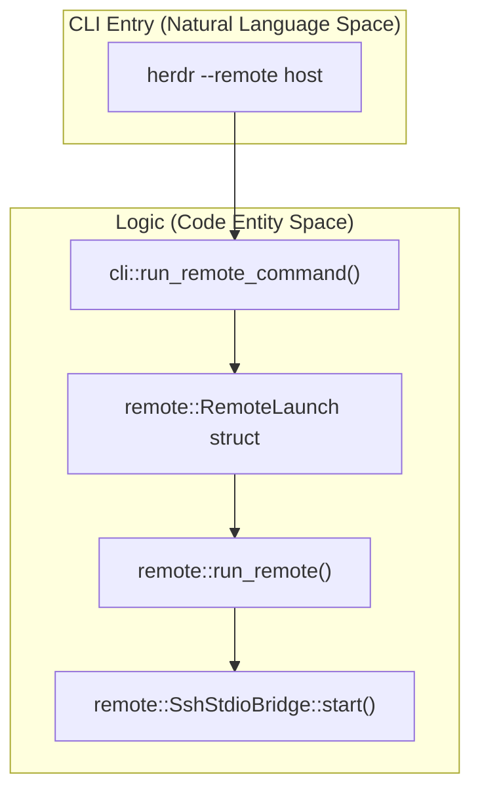
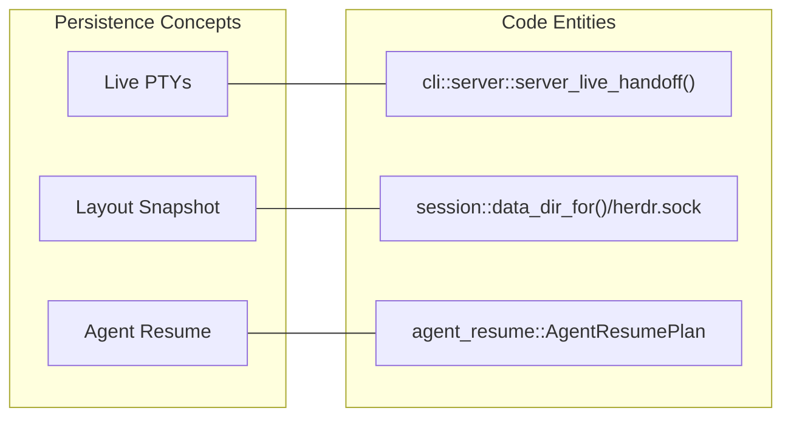

# Remote Access and SSH

Relevant source files

The following files were used as context for generating this wiki page:

- [docs/next/website/src/content/docs/persistence-remote.mdx](https://github.com/herdrdev/herdr/blob/HEAD/docs/next/website/src/content/docs/persistence-remote.mdx)
- [src/app/runtime.rs](https://github.com/herdrdev/herdr/blob/HEAD/src/app/runtime.rs)
- [src/app/theme_sync.rs](https://github.com/herdrdev/herdr/blob/HEAD/src/app/theme_sync.rs)
- [src/cli/protocol_guard.rs](https://github.com/herdrdev/herdr/blob/HEAD/src/cli/protocol_guard.rs)
- [src/cli/server.rs](https://github.com/herdrdev/herdr/blob/HEAD/src/cli/server.rs)
- [src/client/input.rs](https://github.com/herdrdev/herdr/blob/HEAD/src/client/input.rs)
- [src/client/mod.rs](https://github.com/herdrdev/herdr/blob/HEAD/src/client/mod.rs)
- [src/raw_input.rs](https://github.com/herdrdev/herdr/blob/HEAD/src/raw_input.rs)
- [src/remote.rs](https://github.com/herdrdev/herdr/blob/HEAD/src/remote.rs)
- [src/server/autodetect.rs](https://github.com/herdrdev/herdr/blob/HEAD/src/server/autodetect.rs)
- [src/server/clients.rs](https://github.com/herdrdev/herdr/blob/HEAD/src/server/clients.rs)
- [src/server/headless/tests/pane_graphics.rs](https://github.com/herdrdev/herdr/blob/HEAD/src/server/headless/tests/pane_graphics.rs)
- [src/session.rs](https://github.com/herdrdev/herdr/blob/HEAD/src/session.rs)
- [src/terminal_theme.rs](https://github.com/herdrdev/herdr/blob/HEAD/src/terminal_theme.rs)

Herdr provides a robust remote access system that allows users to treat a remote server as a local development environment. By using the `herdr --remote <target>` command, the local Herdr binary acts as a **thin client**, bridging local UI and keyboard input to a remote **headless server** over an SSH tunnel. This system handles automated binary provisioning, platform detection, and persistent session management.

## Thin Client Architecture

When running in remote mode, the local process does not manage any PTYs or agent state. Instead, it establishes an `SshStdioBridge` to facilitate communication between the local terminal and the remote `HeadlessServer`.

*   **Local Thin Client**: Responsible for rendering the TUI using `ratatui`, capturing local keybindings, and handling local desktop integration (e.g., clipboard bridging) [docs/next/website/src/content/docs/persistence-remote.mdx:43-49](https://github.com/herdrdev/herdr/blob/HEAD/docs/next/website/src/content/docs/persistence-remote.mdx#L43-L49). The client connects to the server's client socket, sets up the terminal, receives frames, and sends input [src/client/mod.rs:1-8](https://github.com/herdrdev/herdr/blob/HEAD/src/client/mod.rs#L1-L8).
*   **Remote Headless Server**: Manages the actual workspaces, tabs, and panes on the remote host. It persists even if the SSH connection is severed [docs/next/website/src/content/docs/persistence-remote.mdx:6-7](https://github.com/herdrdev/herdr/blob/HEAD/docs/next/website/src/content/docs/persistence-remote.mdx#L6-L7).
*   **SshStdioBridge**: An IPC tunnel that wraps the standard Herdr socket protocol over SSH `stdin`/`stdout` [src/remote/attach.rs:1-2](https://github.com/herdrdev/herdr/blob/HEAD/src/remote/attach.rs#L1-L2).

### Code Entity Mapping: Remote Launch

The following diagram illustrates how CLI arguments are transformed into a remote session.

**Sources:** [src/remote/attach.rs:61-143](https://github.com/herdrdev/herdr/blob/HEAD/src/remote/attach.rs#L61-L143), [src/remote/attach.rs:155-192](https://github.com/herdrdev/herdr/blob/HEAD/src/remote/attach.rs#L155-L192)

## SSH Bootstrap and Provisioning

Herdr automates the lifecycle of the remote environment. When a user connects to a new host, Herdr performs several "bootstrap" steps:

1.  **Platform Detection**: It queries the remote OS and architecture (e.g., Linux aarch64 vs macOS x86_64) [docs/next/website/src/content/docs/persistence-remote.mdx:66-67](https://github.com/herdrdev/herdr/blob/HEAD/docs/next/website/src/content/docs/persistence-remote.mdx#L66-L67).
2.  **Binary Discovery**: It looks for an existing `herdr` binary on the remote `$PATH`, Homebrew, mise, or Nix paths [docs/next/website/src/content/docs/persistence-remote.mdx:66-67](https://github.com/herdrdev/herdr/blob/HEAD/docs/next/website/src/content/docs/persistence-remote.mdx#L66-L67).
3.  **Automated Provisioning**: If no binary is found, it can download the matching release from `herdr.dev` or copy the local binary if the platforms match [docs/next/website/src/content/docs/persistence-remote.mdx:89-91](https://github.com/herdrdev/herdr/blob/HEAD/docs/next/website/src/content/docs/persistence-remote.mdx#L89-L91).
4.  **SSH Configuration**: By default, Herdr manages a temporary SSH config with `ControlMaster` settings for connection reuse and keepalives [docs/next/website/src/content/docs/persistence-remote.mdx:70-71](https://github.com/herdrdev/herdr/blob/HEAD/docs/next/website/src/content/docs/persistence-remote.mdx#L70-L71).

For details on the step-by-step connection process, see [Remote Session Lifecycle](33_8.1-remote-session-lifecycle.md).

**Sources:** [src/remote/attach.rs:174-181](https://github.com/herdrdev/herdr/blob/HEAD/src/remote/attach.rs#L174-L181), [src/remote/attach.rs:23-26](https://github.com/herdrdev/herdr/blob/HEAD/src/remote/attach.rs#L23-L26)

## Session Persistence and Handoff

Persistence is a core feature of the remote experience. Herdr supports three tiers of state recovery to ensure work is never lost:

| Tier | Mechanism | Result |
| :--- | :--- | :--- |
| **Live Persistence** | Background Server | Processes keep running after SSH disconnect [docs/next/website/src/content/docs/persistence-remote.mdx:6-7](https://github.com/herdrdev/herdr/blob/HEAD/docs/next/website/src/content/docs/persistence-remote.mdx#L6-L7). |
| **Snapshot Restore** | `session.json` | Reconstructs layout/CWD after a full server reboot [docs/next/website/src/content/docs/persistence-remote.mdx:14](https://github.com/herdrdev/herdr/blob/HEAD/docs/next/website/src/content/docs/persistence-remote.mdx#L14). |
| **Live Handoff** | `SCM_RIGHTS` | Zero-downtime transfer of PTY file descriptors to a new server process [src/cli/server.rs:196-207](https://github.com/herdrdev/herdr/blob/HEAD/src/cli/server.rs#L196-L207). |

### Code Entity Mapping: Persistence Layers

This diagram maps the persistence concepts to the files and structs that implement them.

**Sources:** [src/cli/server.rs:196-207](https://github.com/herdrdev/herdr/blob/HEAD/src/cli/server.rs#L196-L207), [src/session.rs:158-167](https://github.com/herdrdev/herdr/blob/HEAD/src/session.rs#L158-L167), [src/session.rs:173-181](https://github.com/herdrdev/herdr/blob/HEAD/src/session.rs#L173-L181)

For details on how PTYs are transferred or how agents are resumed using `AgentResumePlan`, see [Persistence Modes](34_8.2-persistence-modes.md).

## Keybindings and Muscle Memory

A unique feature of `herdr --remote` is the handling of keybindings. By default, the thin client uses **local keybindings** [docs/next/website/src/content/docs/persistence-remote.mdx:49](https://github.com/herdrdev/herdr/blob/HEAD/docs/next/website/src/content/docs/persistence-remote.mdx#L49). This means your local `config.toml` shortcuts work even if the remote server has a different configuration.

Users can override this behavior using:
*   `--remote-keybindings server`: Use the remote server's configuration instead [src/remote/attach.rs:32-35](https://github.com/herdrdev/herdr/blob/HEAD/src/remote/attach.rs#L32-L35).

**Sources:** [src/remote/attach.rs:29-52](https://github.com/herdrdev/herdr/blob/HEAD/src/remote/attach.rs#L29-L52), [docs/next/website/src/content/docs/persistence-remote.mdx:49-50](https://github.com/herdrdev/herdr/blob/HEAD/docs/next/website/src/content/docs/persistence-remote.mdx#L49-L50)

## Child Pages

*   [Remote Session Lifecycle](33_8.1-remote-session-lifecycle.md) — Detailed walkthrough of platform detection, `ControlMaster` setup, and the `SshStdioBridge` handshake.
*   [Persistence Modes](34_8.2-persistence-modes.md) — Deep dive into `session.json` rehydration, `session-history.json` replay, and the `SCM_RIGHTS` mechanism for live handoff.37:T