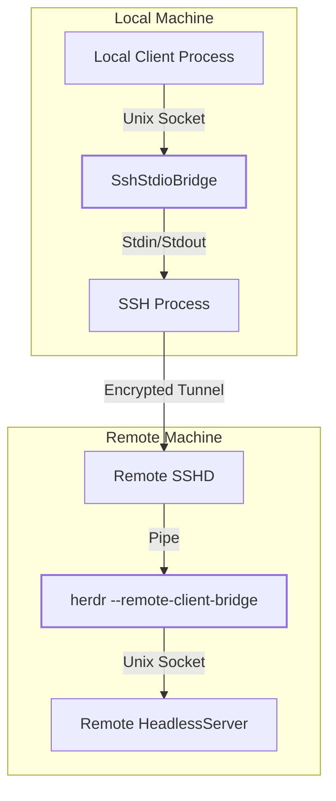
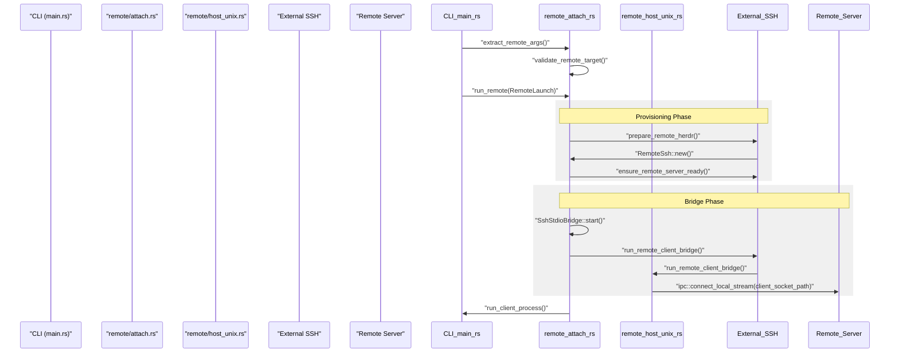

# Remote Session Lifecycle

Relevant source files

The following files were used as context for generating this wiki page:

- [docs/next/website/src/content/docs/persistence-remote.mdx](https://github.com/herdrdev/herdr/blob/HEAD/docs/next/website/src/content/docs/persistence-remote.mdx)
- [src/cli/protocol_guard.rs](https://github.com/herdrdev/herdr/blob/HEAD/src/cli/protocol_guard.rs)
- [src/cli/server.rs](https://github.com/herdrdev/herdr/blob/HEAD/src/cli/server.rs)
- [src/ipc.rs](https://github.com/herdrdev/herdr/blob/HEAD/src/ipc.rs)
- [src/remote.rs](https://github.com/herdrdev/herdr/blob/HEAD/src/remote.rs)
- [src/server/autodetect.rs](https://github.com/herdrdev/herdr/blob/HEAD/src/server/autodetect.rs)
- [src/session.rs](https://github.com/herdrdev/herdr/blob/HEAD/src/session.rs)

The `herdr --remote` workflow enables a "thin client" mode where the local `herdr` binary acts as a UI frontend, connecting over SSH to a remote `herdr` server. This lifecycle manages automated platform detection, binary provisioning, and the establishment of a specialized IPC tunnel.

## Remote Launch Sequence

When a user executes `herdr --remote <target>`, the application transitions through several phases to ensure the remote environment is compatible and the server is operational.

### 1. Argument Extraction and Validation
The CLI first separates local flags from remote-specific instructions.
*   **Target Parsing**: Validates the SSH destination (e.g., `user@host` or `ssh://host:port`) [src/remote/attach.rs:145-153](https://github.com/herdrdev/herdr/blob/HEAD/src/remote/attach.rs#L145-L153).
*   **Keybinding Policy**: Determines if the session should use the local client's keybindings (`RemoteKeybindings::Local`) or the remote server's configuration (`RemoteKeybindings::Server`) [src/remote/attach.rs:31-52](https://github.com/herdrdev/herdr/blob/HEAD/src/remote/attach.rs#L31-L52).
*   **Handoff Opt-in**: Checks for the `--handoff` flag to determine if an existing remote server should be replaced via live PTY transfer [src/remote/attach.rs:80-84](https://github.com/herdrdev/herdr/blob/HEAD/src/remote/attach.rs#L80-L84).

### 2. Remote Platform Discovery
Herdr executes a series of discovery commands over SSH to identify the remote operating system and architecture.
*   **Binary Search**: It searches the remote `PATH` and common installation directories (Homebrew, mise, Nix, `~/.local/bin`) for an existing `herdr` binary [docs/next/website/src/content/docs/persistence-remote.mdx:66-66](https://github.com/herdrdev/herdr/blob/HEAD/docs/next/website/src/content/docs/persistence-remote.mdx#L66).
*   **Version Check**: If a binary is found, it verifies the `PROTOCOL_VERSION` to ensure compatibility with the local client [src/remote/attach.rs:22-22](https://github.com/herdrdev/herdr/blob/HEAD/src/remote/attach.rs#L22).

### 3. Automated Provisioning
If no compatible binary is found, Herdr initiates an automated install:
*   **Binary Source**: If local and remote platforms match, it can copy the local binary. Otherwise, it fetches the appropriate release asset for the current client version from `https://herdr.dev/latest.json` [docs/next/website/src/content/docs/persistence-remote.mdx:89-91](https://github.com/herdrdev/herdr/blob/HEAD/docs/next/website/src/content/docs/persistence-remote.mdx#L89-L91).
*   **Custom Binaries**: Users can override this by setting the `HERDR_REMOTE_BINARY` environment variable [src/remote/attach.rs:25-25](https://github.com/herdrdev/herdr/blob/HEAD/src/remote/attach.rs#L25).
*   **Installation Path**: Binaries are typically installed to `~/.local/bin/herdr` on the remote host [docs/next/website/src/content/docs/persistence-remote.mdx:66-66](https://github.com/herdrdev/herdr/blob/HEAD/docs/next/website/src/content/docs/persistence-remote.mdx#L66).

### 4. Server Readiness
Before attaching the client, the lifecycle ensures the background server is running:
*   **Start/Attach**: If no server is running for the specified session, it starts one.
*   **Protocol Compatibility**: If a running server has an incompatible protocol, Herdr prompts to stop the old server or performs a `--handoff` if requested [src/remote/attach.rs:175-181](https://github.com/herdrdev/herdr/blob/HEAD/src/remote/attach.rs#L175-L181).

Sources: [src/remote/attach.rs:31-181](https://github.com/herdrdev/herdr/blob/HEAD/src/remote/attach.rs#L31-L181), [docs/next/website/src/content/docs/persistence-remote.mdx:40-96](https://github.com/herdrdev/herdr/blob/HEAD/docs/next/website/src/content/docs/persistence-remote.mdx#L40-L96)

---

## SSH Infrastructure and ControlMaster

Herdr optimizes the remote connection by managing a temporary SSH configuration and connection multiplexing.

| Feature | Implementation Detail |
| :--- | :--- |
| **Generated Config** | Creates a temporary config including fallback keepalives [docs/next/website/src/content/docs/persistence-remote.mdx:70-70](https://github.com/herdrdev/herdr/blob/HEAD/docs/next/website/src/content/docs/persistence-remote.mdx#L70). |
| **ControlMaster** | Uses a private control socket (named `ctl`) for connection reuse [src/remote/attach.rs:26-26](https://github.com/herdrdev/herdr/blob/HEAD/src/remote/attach.rs#L26). |
| **Authentication** | Leverages `ssh-agent`. If authentication fails, it provides hints to run `ssh-add` [src/remote.rs:18-25](https://github.com/herdrdev/herdr/blob/HEAD/src/remote.rs#L18-L25). |
| **User Override** | Can be disabled via `[remote].manage_ssh_config = false` [docs/next/website/src/content/docs/persistence-remote.mdx:70-70](https://github.com/herdrdev/herdr/blob/HEAD/docs/next/website/src/content/docs/persistence-remote.mdx#L70). |

Sources: [src/remote.rs:18-25](https://github.com/herdrdev/herdr/blob/HEAD/src/remote.rs#L18-L25), [src/remote/attach.rs:26-26](https://github.com/herdrdev/herdr/blob/HEAD/src/remote/attach.rs#L26), [docs/next/website/src/content/docs/persistence-remote.mdx:70-72](https://github.com/herdrdev/herdr/blob/HEAD/docs/next/website/src/content/docs/persistence-remote.mdx#L70-L72)

---

## SshStdioBridge and IPC Tunneling

The `SshStdioBridge` is the core component that tunnels the JSON-RPC protocol from the remote Unix domain socket to the local client's virtual socket.

### Data Flow: Remote to Local

The bridge functions as a bidirectional proxy between a remote Unix socket and the local stdio of the SSH process.

Title: Remote Session IPC Bridge

### Key Components

*   **`run_remote_client_bridge`**: A specialized mode of the `herdr` binary executed on the remote host. It connects to the local Unix socket of the `HeadlessServer` and proxies bytes to its own `stdout` [src/remote/host_unix.rs:194-210](https://github.com/herdrdev/herdr/blob/HEAD/src/remote/host_unix.rs#L194-L210). This function is conditionally compiled for Unix systems [src/remote.rs:6-7](https://github.com/herdrdev/herdr/blob/HEAD/src/remote.rs#L6-L7).
*   **`SshStdioBridge`**: Manages the local side of the tunnel. It creates a local Unix socket (path generated by `local_forward_socket_path`) and spawns the SSH command that invokes the remote bridge [src/remote/attach.rs:183-192](https://github.com/herdrdev/herdr/blob/HEAD/src/remote/attach.rs#L183-L192).
*   **`run_client_process`**: The final step where the local UI process connects to the local bridge socket, unaware that the server is actually remote [src/remote/attach.rs:191-192](https://github.com/herdrdev/herdr/blob/HEAD/src/remote/attach.rs#L191-L192).

Sources: [src/remote/host_unix.rs:194-210](https://github.com/herdrdev/herdr/blob/HEAD/src/remote/host_unix.rs#L194-L210), [src/remote/attach.rs:183-192](https://github.com/herdrdev/herdr/blob/HEAD/src/remote/attach.rs#L183-L192), [src/remote/attach.rs:158-168](https://github.com/herdrdev/herdr/blob/HEAD/src/remote/attach.rs#L158-L168), [src/remote.rs:6-7](https://github.com/herdrdev/herdr/blob/HEAD/src/remote.rs#L6-L7)

---

## Technical Entity Mapping

The following diagram maps the logical lifecycle stages to the specific functions and structs in the codebase.

Title: Remote Lifecycle Code Entities

Sources: [src/remote/attach.rs:61-63](https://github.com/herdrdev/herdr/blob/HEAD/src/remote/attach.rs#L61-L63), [src/remote/attach.rs:155-192](https://github.com/herdrdev/herdr/blob/HEAD/src/remote/attach.rs#L155-L192), [src/remote/attach.rs:194-206](https://github.com/herdrdev/herdr/blob/HEAD/src/remote/attach.rs#L194-L206), [src/remote/host_unix.rs:194-206](https://github.com/herdrdev/herdr/blob/HEAD/src/remote/host_unix.rs#L194-L206), [src/ipc.rs:35-52](https://github.com/herdrdev/herdr/blob/HEAD/src/ipc.rs#L35-L52)