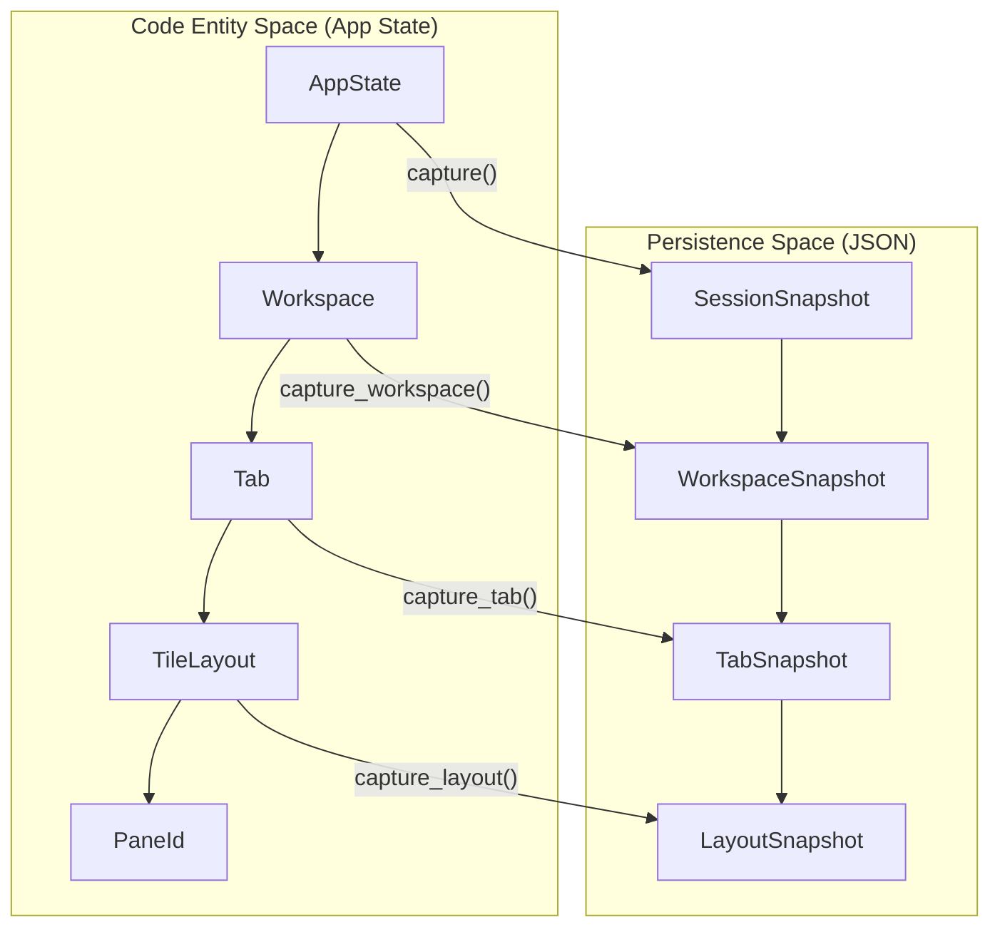
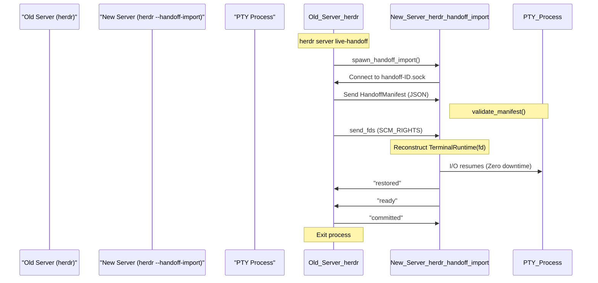

# Persistence Modes

Relevant source files

The following files were used as context for generating this wiki page:

- [docs/next/website/src/content/docs/persistence-remote.mdx](https://github.com/herdrdev/herdr/blob/HEAD/docs/next/website/src/content/docs/persistence-remote.mdx)
- [src/app/api/agents.rs](https://github.com/herdrdev/herdr/blob/HEAD/src/app/api/agents.rs)
- [src/app/api_helpers.rs](https://github.com/herdrdev/herdr/blob/HEAD/src/app/api_helpers.rs)
- [src/cli/agent.rs](https://github.com/herdrdev/herdr/blob/HEAD/src/cli/agent.rs)
- [src/cli/protocol_guard.rs](https://github.com/herdrdev/herdr/blob/HEAD/src/cli/protocol_guard.rs)
- [src/cli/server.rs](https://github.com/herdrdev/herdr/blob/HEAD/src/cli/server.rs)
- [src/cli/server_not_running.rs](https://github.com/herdrdev/herdr/blob/HEAD/src/cli/server_not_running.rs)
- [src/cli/status.rs](https://github.com/herdrdev/herdr/blob/HEAD/src/cli/status.rs)
- [src/pane/terminal/windows_recent_fallback.rs](https://github.com/herdrdev/herdr/blob/HEAD/src/pane/terminal/windows_recent_fallback.rs)
- [src/persist/snapshot.rs](https://github.com/herdrdev/herdr/blob/HEAD/src/persist/snapshot.rs)
- [src/remote.rs](https://github.com/herdrdev/herdr/blob/HEAD/src/remote.rs)
- [src/server/autodetect.rs](https://github.com/herdrdev/herdr/blob/HEAD/src/server/autodetect.rs)
- [src/server/handoff.rs](https://github.com/herdrdev/herdr/blob/HEAD/src/server/handoff.rs)
- [src/session.rs](https://github.com/herdrdev/herdr/blob/HEAD/src/session.rs)
- [tests/cli/agents.rs](https://github.com/herdrdev/herdr/blob/HEAD/tests/cli/agents.rs)
- [tests/live_handoff.rs](https://github.com/herdrdev/herdr/blob/HEAD/tests/live_handoff.rs)

Herdr implements three distinct tiers of persistence to ensure that user sessions, terminal state, and process lifecycles are preserved across different scenarios ranging from simple client detachment to full server binary upgrades.

## Persistence Tiers Overview

The system distinguishes between preserving the UI state, the PTY process lifecycle, and the active socket connections.

| Tier | Name | Mechanism | Scope |
| :--- | :--- | :--- | :--- |
| **Tier 1** | **Live Persistence** | Background Server | PTY survives client `detach`. |
| **Tier 2** | **Snapshot Restore** | `session.json` | Reconstructs UI shape after server stop/crash. |
| **Tier 3** | **Live Handoff** | `SCM_RIGHTS` | Zero-downtime transfer of PTY FDs to a new server process. |

Sources: [src/server/autodetect.rs:1-10](https://github.com/herdrdev/herdr/blob/HEAD/src/server/autodetect.rs#L1-L10), [docs/next/website/src/content/docs/persistence-remote.mdx:10-14](https://github.com/herdrdev/herdr/blob/HEAD/docs/next/website/src/content/docs/persistence-remote.mdx#L10-L14)

---

## 1. Live Persistence (Background Server)

Herdr operates on a client/server model where the `HeadlessServer` maintains the `AppState` independently of any connected TUI clients [src/server/autodetect.rs:1-10](https://github.com/herdrdev/herdr/blob/HEAD/src/server/autodetect.rs#L1-L10).

### Behavior
- **Detach:** When a client sends a detach command (default `Ctrl+b q`), the server remains running in the background [docs/next/website/src/content/docs/persistence-remote.mdx:10-12](https://github.com/herdrdev/herdr/blob/HEAD/docs/next/website/src/content/docs/persistence-remote.mdx#L10-L12).
- **PTY Survival:** The `PaneRuntime` and `TerminalRuntime` instances are owned by the `App` struct. Since the server process does not exit, the PTY file descriptors remain open and the child processes continue execution [src/app/mod.rs:1-10](https://github.com/herdrdev/herdr/blob/HEAD/src/app/mod.rs#L1-L10).
- **Reattach:** New clients connect to the Unix domain socket (`herdr-client.sock`), perform a handshake, and receive the current `FrameData` to synchronize the UI [src/server/autodetect.rs:19-20](https://github.com/herdrdev/herdr/blob/HEAD/src/server/autodetect.rs#L19-L20).

Sources: [src/server/autodetect.rs:1-10](https://github.com/herdrdev/herdr/blob/HEAD/src/server/autodetect.rs#L1-L10), [src/app/mod.rs:1-10](https://github.com/herdrdev/herdr/blob/HEAD/src/app/mod.rs#L1-L10), [src/server/autodetect.rs:19-20](https://github.com/herdrdev/herdr/blob/HEAD/src/server/autodetect.rs#L19-L20)

---

## 2. Snapshot Restore

When the server process is stopped (e.g., via `herdr server stop` or a system reboot), live PTY processes are terminated. Herdr uses a snapshotting mechanism to reconstruct the session's "shape" upon the next start.

### Data Structures
The session state is serialized into `~/.config/herdr/session.json` using the following hierarchy:
- `SessionSnapshot`: The root container for the entire server state [src/persist/snapshot.rs:15-29](https://github.com/herdrdev/herdr/blob/HEAD/src/persist/snapshot.rs#L15-L29).
- `WorkspaceSnapshot`: Contains tabs and layout trees [src/persist/snapshot.rs:50-69](https://github.com/herdrdev/herdr/blob/HEAD/src/persist/snapshot.rs#L50-L69).
- `TabSnapshot`: Captures the BSP (Binary Space Partitioning) tree of panes [src/persist/snapshot.rs:85-95](https://github.com/herdrdev/herdr/blob/HEAD/src/persist/snapshot.rs#L85-L95).
- `LayoutSnapshot`: Encodes the specific `TileLayout` for the tab [src/persist/snapshot.rs:127-135](https://github.com/herdrdev/herdr/blob/HEAD/src/persist/snapshot.rs#L127-L135).

### Rehydration Logic
1. **Capture:** The `capture` function traverses the `AppState` and generates a `SessionSnapshot` [src/persist/snapshot.rs:240-242](https://github.com/herdrdev/herdr/blob/HEAD/src/persist/snapshot.rs#L240-L242).
2. **Restore:** The `restore` function reads the JSON, maps old IDs to new runtime IDs, and spawns new PTYs in the previously recorded working directories [src/persist/restore.rs:13-15](https://github.com/herdrdev/herdr/blob/HEAD/src/persist/restore.rs#L13-L15).
3. **History Replay:** To provide visual continuity, pane screen history is stored in `session-history.json` and replayed into the new PTY buffer [src/persist/snapshot.rs:32-37](https://github.com/herdrdev/herdr/blob/HEAD/src/persist/snapshot.rs#L32-L37).

### Persistence Logic Flow
The following diagram illustrates how the `AppState` is translated into a persistent `SessionSnapshot`.

**Diagram: State to Snapshot Mapping**

Sources: [src/persist/snapshot.rs:15-29](https://github.com/herdrdev/herdr/blob/HEAD/src/persist/snapshot.rs#L15-L29), [src/persist/snapshot.rs:50-69](https://github.com/herdrdev/herdr/blob/HEAD/src/persist/snapshot.rs#L50-L69), [src/persist/snapshot.rs:85-95](https://github.com/herdrdev/herdr/blob/HEAD/src/persist/snapshot.rs#L85-L95), [src/persist/snapshot.rs:127-135](https://github.com/herdrdev/herdr/blob/HEAD/src/persist/snapshot.rs#L127-L135), [src/persist/snapshot.rs:240-242](https://github.com/herdrdev/herdr/blob/HEAD/src/persist/snapshot.rs#L240-L242), [src/persist/restore.rs:13-15](https://github.com/herdrdev/herdr/blob/HEAD/src/persist/restore.rs#L13-L15), [src/persist/snapshot.rs:32-37](https://github.com/herdrdev/herdr/blob/HEAD/src/persist/snapshot.rs#L32-L37)

---

## 3. Live Handoff (Zero-Downtime Transfer)

Live Handoff is an experimental feature (Unix-only) that allows a running Herdr server to transfer its active PTY file descriptors to a new server process (typically a newer version) without killing the child processes.

### The Handoff Protocol
1. **Initiation:** The old server spawns a new server process with the `--handoff-import` flag [src/server/handoff.rs:57-82](https://github.com/herdrdev/herdr/blob/HEAD/src/server/handoff.rs#L57-L82). This is triggered by the `herdr server live-handoff` CLI command [src/cli/server.rs:10](https://github.com/herdrdev/herdr/blob/HEAD/src/cli/server.rs#L10).
2. **Manifest Exchange:** The old server sends a `HandoffManifest` containing the `SessionSnapshot` and metadata for every active pane [src/server/handoff.rs:33-42](https://github.com/herdrdev/herdr/blob/HEAD/src/server/handoff.rs#L33-L42).
3. **FD Passing:** Using `SCM_RIGHTS` over a Unix socket, the old server sends the actual file descriptors of the PTY masters to the new process [src/server/handoff.rs:171-178](https://github.com/herdrdev/herdr/blob/HEAD/src/server/handoff.rs#L171-L178).
4. **Validation & Ownership:** The new server validates the manifest, adopts the FDs into new `TerminalRuntime` instances, and sends an `owned` acknowledgement [src/server/handoff.rs:139-168](https://github.com/herdrdev/herdr/blob/HEAD/src/server/handoff.rs#L139-L168).
5. **Atomic Switch:** Once the new server is ready, the old server closes its sockets and exits.

### Data Flow and Coordination
The `SshStdioBridge` and `HeadlessServer` coordinate to ensure clients are migrated to the new listener.

**Diagram: Handoff Sequence**

Sources: [src/server/handoff.rs:1-50](https://github.com/herdrdev/herdr/blob/HEAD/src/server/handoff.rs#L1-L50), [src/server/handoff.rs:130-204](https://github.com/herdrdev/herdr/blob/HEAD/src/server/handoff.rs#L130-L204), [tests/live_handoff.rs:1-20](https://github.com/herdrdev/herdr/blob/HEAD/tests/live_handoff.rs#L1-L20), [src/cli/server.rs:10](https://github.com/herdrdev/herdr/blob/HEAD/src/cli/server.rs#L10)

---

## Screen History Replay

When a pane is restored via **Snapshot Restore** or **Live Handoff**, Herdr attempts to fill the initial terminal buffer so the user doesn't see a blank screen.

- **Storage:** Pane history is capped at `MAX_REPLAY_BYTES_PER_PANE` (8 KB) [src/server/handoff.rs:27-28](https://github.com/herdrdev/herdr/blob/HEAD/src/server/handoff.rs#L27-L28).
- **Capture:** The `capture_history` function extracts the current visible grid from the `GhosttyVT` engine [src/persist/snapshot.rs:32-37](https://github.com/herdrdev/herdr/blob/HEAD/src/persist/snapshot.rs#L32-L37). This involves iterating through `RenderedLine`s [src/pane/terminal/windows_recent_fallback.rs:161-184](https://github.com/herdrdev/herdr/blob/HEAD/src/pane/terminal/windows_recent_fallback.rs#L161-L184).
- **Replay:** During `restore_handoff`, these bytes are written directly to the new PTY's master FD before the process is resumed, effectively "painting" the last known state onto the new terminal [src/persist/restore.rs:14-15](https://github.com/herdrdev/herdr/blob/HEAD/src/persist/restore.rs#L14-L15). The `recent_text_snapshot` and `recent_ansi_snapshot` methods on `TerminalRuntime` are used to retrieve this history [src/app/api_helpers.rs:127-143](https://github.com/herdrdev/herdr/blob/HEAD/src/app/api_helpers.rs#L127-L143).

Sources: [src/server/handoff.rs:27-28](https://github.com/herdrdev/herdr/blob/HEAD/src/server/handoff.rs#L27-L28), [src/persist/snapshot.rs:32-37](https://github.com/herdrdev/herdr/blob/HEAD/src/persist/snapshot.rs#L32-L37), [src/persist/restore.rs:14-15](https://github.com/herdrdev/herdr/blob/HEAD/src/persist/restore.rs#L14-L15), [src/pane/terminal/windows_recent_fallback.rs:161-184](https://github.com/herdrdev/herdr/blob/HEAD/src/pane/terminal/windows_recent_fallback.rs#L161-L184), [src/app/api_helpers.rs:127-143](https://github.com/herdrdev/herdr/blob/HEAD/src/app/api_helpers.rs#L127-L143)