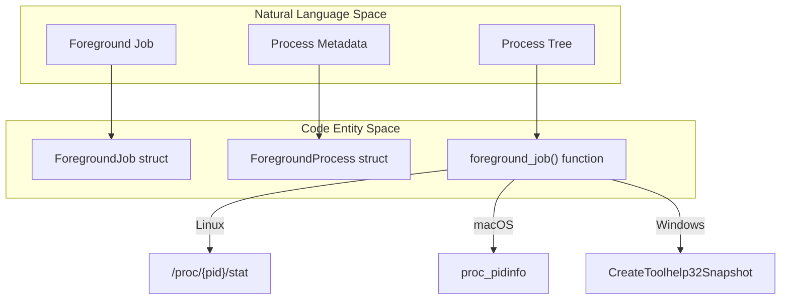
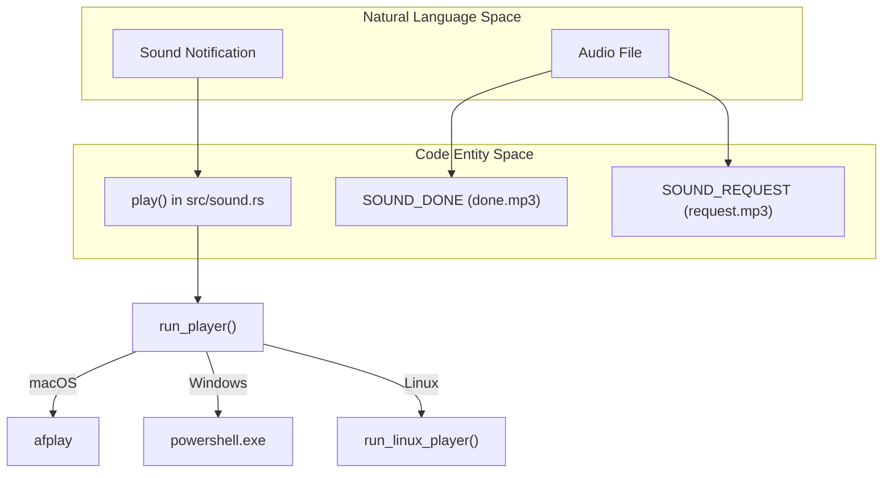

# Platform Abstraction Layer

Relevant source files

The following files were used as context for generating this wiki page:

- [src/platform/fallback.rs](https://github.com/herdrdev/herdr/blob/HEAD/src/platform/fallback.rs)
- [src/platform/linux.rs](https://github.com/herdrdev/herdr/blob/HEAD/src/platform/linux.rs)
- [src/platform/macos.rs](https://github.com/herdrdev/herdr/blob/HEAD/src/platform/macos.rs)
- [src/platform/mod.rs](https://github.com/herdrdev/herdr/blob/HEAD/src/platform/mod.rs)
- [src/platform/windows.rs](https://github.com/herdrdev/herdr/blob/HEAD/src/platform/windows.rs)
- [src/sound.rs](https://github.com/herdrdev/herdr/blob/HEAD/src/sound.rs)

The **Platform Abstraction Layer (PAL)** isolates herdr's core logic from the specificities of Windows, macOS, and Linux. It provides a unified interface for process discovery, clipboard management, terminal resizing, and audio playback, ensuring that features like AI agent tracking and session management remain consistent across different operating systems.

The PAL is primarily defined in `src/platform/mod.rs` [src/platform/mod.rs:1-216](https://github.com/herdrdev/herdr/blob/HEAD/src/platform/mod.rs#L1-L216), which dispatches to platform-specific modules:
*   `src/platform/macos.rs` [src/platform/macos.rs:1-213](https://github.com/herdrdev/herdr/blob/HEAD/src/platform/macos.rs#L1-L213)
*   `src/platform/linux.rs` [src/platform/linux.rs:1-228](https://github.com/herdrdev/herdr/blob/HEAD/src/platform/linux.rs#L1-L228)
*   `src/platform/windows.rs` [src/platform/windows.rs:1-190](https://github.com/herdrdev/herdr/blob/HEAD/src/platform/windows.rs#L1-L190)

### Platform Capabilities

Herdr uses a `PlatformCapabilities` struct to communicate which features are supported by the current host environment [src/platform/mod.rs:53-57](https://github.com/herdrdev/herdr/blob/HEAD/src/platform/mod.rs#L53-L57). This allows the UI and server logic to gracefully degrade or hide options that are unavailable (e.g., live handoff is currently Unix-only).

| Capability | Unix (Linux/macOS) | Windows |
| :--- | :--- | :--- |
| `live_handoff` | Supported [src/platform/mod.rs:61-61](https://github.com/herdrdev/herdr/blob/HEAD/src/platform/mod.rs#L61) | Unsupported [src/platform/mod.rs:61-61](https://github.com/herdrdev/herdr/blob/HEAD/src/platform/mod.rs#L61) |
| `direct_terminal_attach` | Supported [src/platform/mod.rs:62-62](https://github.com/herdrdev/herdr/blob/HEAD/src/platform/mod.rs#L62) | Unsupported [src/platform/mod.rs:62-62](https://github.com/herdrdev/herdr/blob/HEAD/src/platform/mod.rs#L62) |
| `preserve_legacy_doubled_escape_input` | Supported (macOS only) [src/platform/mod.rs:63-63](https://github.com/herdrdev/herdr/blob/HEAD/src/platform/mod.rs#L63) | Unsupported [src/platform/mod.rs:63-63](https://github.com/herdrdev/herdr/blob/HEAD/src/platform/mod.rs#L63) |

**Sources:** [src/platform/mod.rs:53-65](https://github.com/herdrdev/herdr/blob/HEAD/src/platform/mod.rs#L53-L65)

### Foreground Process Discovery

A key feature of herdr is its ability to identify what is running inside a terminal pane to provide context for AI agents. The PAL provides abstractions to crawl process trees and identify the "foreground job."

*   **Unix:** Uses `/proc` crawling on Linux [src/platform/linux.rs:136-146](https://github.com/herdrdev/herdr/blob/HEAD/src/platform/linux.rs#L136-L146) and `proc_pidinfo` on macOS [src/platform/macos.rs:21-22](https://github.com/herdrdev/herdr/blob/HEAD/src/platform/macos.rs#L21-L22) to find the Terminal Process Group ID (`tpgid`).
*   **Windows:** Relies on `CreateToolhelp32Snapshot` [src/platform/windows.rs:36-38](https://github.com/herdrdev/herdr/blob/HEAD/src/platform/windows.rs#L36-L38) to cache process entries and identifies descendants of the pane shell.

#### Entity Mapping: Process Discovery

**Sources:** [src/platform/mod.rs:7-19](https://github.com/herdrdev/herdr/blob/HEAD/src/platform/mod.rs#L7-L19), [src/platform/linux.rs:136-146](https://github.com/herdrdev/herdr/blob/HEAD/src/platform/linux.rs#L136-L146), [src/platform/macos.rs:21-22](https://github.com/herdrdev/herdr/blob/HEAD/src/platform/macos.rs#L21-L22), [src/platform/windows.rs:36-38](https://github.com/herdrdev/herdr/blob/HEAD/src/platform/windows.rs#L36-L38)

### Clipboard and Desktop Integration

Herdr bridges the terminal's clipboard to the host OS, supporting both text and images (where available).

*   **Clipboard:** Implemented via `read_clipboard_text` and `write_clipboard`. On Linux, this may call `wl-copy` or `xclip` [src/platform/linux.rs:389-400](https://github.com/herdrdev/herdr/blob/HEAD/src/platform/linux.rs#L389-L400), while Windows uses native Win32 APIs like `OpenClipboard` [src/platform/windows.rs:30-30](https://github.com/herdrdev/herdr/blob/HEAD/src/platform/windows.rs#L30).
*   **Notifications:** The `show_desktop_notification` function triggers system-level alerts [src/platform/windows.rs:11590-11592](https://github.com/herdrdev/herdr/blob/HEAD/src/platform/windows.rs#L11590-L11592).
*   **IME Management:** On macOS, herdr can automatically switch the Input Method Editor (IME) to an ASCII-capable source when entering "Prefix Mode" to ensure keybindings work reliably [src/platform/macos.rs:192-207](https://github.com/herdrdev/herdr/blob/HEAD/src/platform/macos.rs#L192-L207). On Windows, IME toggling is handled via `WM_IME_CONTROL` messages [src/platform/windows.rs:11570-11570](https://github.com/herdrdev/herdr/blob/HEAD/src/platform/windows.rs#L11570).

### Sound Playback

Herdr provides audio feedback for agent state changes (e.g., "Task Done"). The `src/sound.rs` module manages this without external Rust audio dependencies by invoking system-native players [src/sound.rs:1-5](https://github.com/herdrdev/herdr/blob/HEAD/src/sound.rs#L1-L5).

| Platform | Audio Backend |
| :--- | :--- |
| **macOS** | `afplay` [src/sound.rs:120-124](https://github.com/herdrdev/herdr/blob/HEAD/src/sound.rs#L120-L124) |
| **Windows** | `System.Windows.Media.MediaPlayer` via PowerShell [src/sound.rs:132-167](https://github.com/herdrdev/herdr/blob/HEAD/src/sound.rs#L132-L167) |
| **Linux** | `paplay`, `aplay`, or `ffplay` [src/sound.rs:219-221](https://github.com/herdrdev/herdr/blob/HEAD/src/sound.rs#L219-L221) |

#### Entity Mapping: Sound System

**Sources:** [src/sound.rs:26-66](https://github.com/herdrdev/herdr/blob/HEAD/src/sound.rs#L26-L66), [src/sound.rs:113-129](https://github.com/herdrdev/herdr/blob/HEAD/src/sound.rs#L113-L129), [src/sound.rs:219-221](https://github.com/herdrdev/herdr/blob/HEAD/src/sound.rs#L219-L221)

### OS-Specific Implementations

For deep technical details on how these abstractions are implemented for specific kernels and windowing systems, see the child pages:

*   **[macOS and Linux Platform Implementations](36_9.1-macos-and-linux-platform-implementations.md)**: Covers Carbon TIS for IMEs, `/proc` crawling, and Unix signal handling (like `SIGWINCH` for terminal resizing [src/platform/mod.rs:91-112](https://github.com/herdrdev/herdr/blob/HEAD/src/platform/mod.rs#L91-L112)).
*   **[Windows Platform and ConPTY](37_9.2-windows-platform-and-conpty.md)**: Covers the experimental Windows beta, ConPTY integration, and the use of Named Pipes for IPC.

**Sources:** [src/platform/mod.rs:200-210](https://github.com/herdrdev/herdr/blob/HEAD/src/platform/mod.rs#L200-L210), [src/platform/windows.rs:11570-11570](https://github.com/herdrdev/herdr/blob/HEAD/src/platform/windows.rs#L11570)