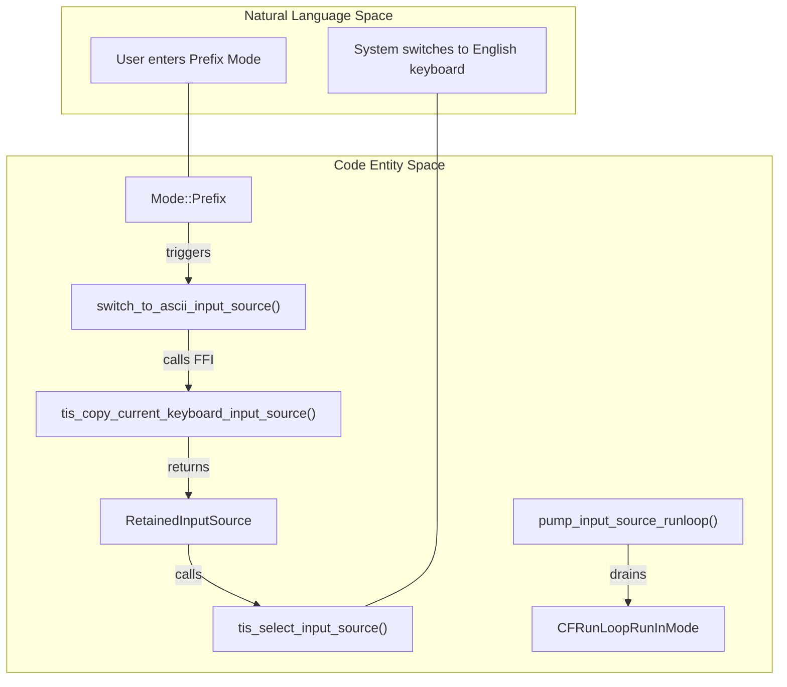
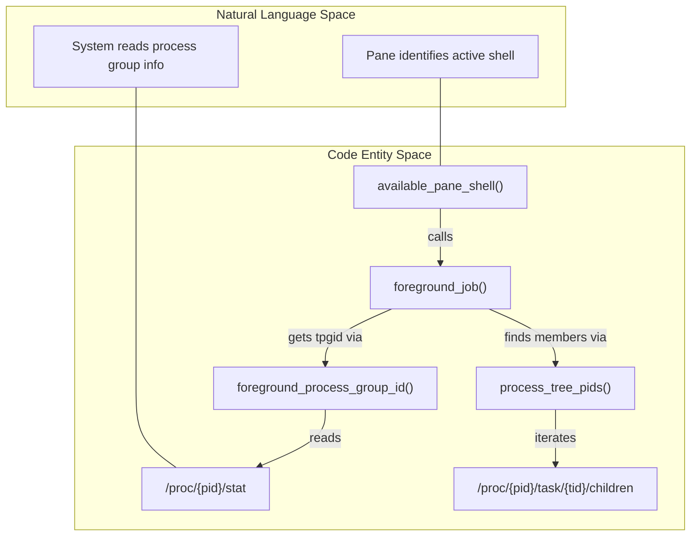

# macOS and Linux Platform Implementations

Relevant source files

The following files were used as context for generating this wiki page:

- [src/platform/fallback.rs](https://github.com/herdrdev/herdr/blob/HEAD/src/platform/fallback.rs)
- [src/platform/linux.rs](https://github.com/herdrdev/herdr/blob/HEAD/src/platform/linux.rs)
- [src/platform/macos.rs](https://github.com/herdrdev/herdr/blob/HEAD/src/platform/macos.rs)
- [src/platform/mod.rs](https://github.com/herdrdev/herdr/blob/HEAD/src/platform/mod.rs)
- [src/platform/windows.rs](https://github.com/herdrdev/herdr/blob/HEAD/src/platform/windows.rs)
- [src/sound.rs](https://github.com/herdrdev/herdr/blob/HEAD/src/sound.rs)

The herdr platform abstraction layer isolates OS-specific behaviors such as process discovery, clipboard interaction, and system notifications. This allows the core application logic to remain platform-agnostic while leveraging native capabilities for performance and deep system integration.

## Platform Capabilities and Traits

Herdr defines a set of capabilities that are enabled or disabled based on the target operating system. These are centralized in the `PlatformCapabilities` struct.

| Capability | macOS | Linux | Windows |
| :--- | :--- | :--- | :--- |
| `live_handoff` | Yes | Yes | No |
| `remote_attach` | Yes | Yes | No |
| `direct_terminal_attach` | Yes | Yes | No |
| `preserve_legacy_doubled_escape_input` | Yes | No | No |

**Sources:** [src/platform/mod.rs:54-60](https://github.com/herdrdev/herdr/blob/HEAD/src/platform/mod.rs#L54-L60)

## macOS Implementation

The macOS implementation (`src/platform/macos.rs`) focuses on deep integration with the Carbon framework for input management and efficient process introspection via `libproc`.

### Input Method Editor (IME) Switching
Herdr automatically switches the system input source to an ASCII-capable layout when entering "Prefix Mode" (and restores it afterward). This prevents non-Latin characters from interfering with command shortcuts.

*   **`switch_to_ascii_input_source`**: Uses `TISCopyCurrentKeyboardInputSource` and `TISSelectInputSource` to swap layouts [src/platform/macos.rs:192-213](https://github.com/herdrdev/herdr/blob/HEAD/src/platform/macos.rs#L192-L213).
*   **`pump_input_source_runloop`**: Because the headless server does not typically run a UI loop, it must manually pump the `CFRunLoop` to receive `kTISNotifySelectedKeyboardInputSourceChanged` notifications, ensuring the process-local cache of the current input source is fresh [src/platform/macos.rs:129-140](https://github.com/herdrdev/herdr/blob/HEAD/src/platform/macos.rs#L129-L140).

### Process and Environment Management
*   **Process Info**: Uses `proc_pidinfo` and `proc_pidpath` to resolve process names and current working directories (CWD) [src/platform/macos.rs:266-316](https://github.com/herdrdev/herdr/blob/HEAD/src/platform/macos.rs#L266-L316).
*   **File Limits**: Automatically raises the `NOFILE` limit to `8192` for the server process using `setrlimit` [src/platform/macos.rs:215-230](https://github.com/herdrdev/herdr/blob/HEAD/src/platform/macos.rs#L215-L230).
*   **Clipboard**: Implements clipboard access by piping data to `pbcopy` and reading from `pbpaste` [src/platform/macos.rs:451-486](https://github.com/herdrdev/herdr/blob/HEAD/src/platform/macos.rs#L451-L486).

### macOS Data Flow: IME Switching
This diagram shows how the TUI mode change triggers a platform-specific call to the Carbon framework.

Title: macOS IME Source Switching Flow

**Sources:** [src/platform/macos.rs:129-213](https://github.com/herdrdev/herdr/blob/HEAD/src/platform/macos.rs#L129-L213)

---

## Linux Implementation

The Linux implementation (`src/platform/linux.rs`) relies heavily on the `/proc` filesystem for process introspection and standard command-line utilities for desktop features.

### Process Discovery and Foreground Jobs
Herdr identifies which process is currently "active" in a pane by crawling the process tree.
*   **`foreground_job`**: Determines the Terminal Process Group ID (`tpgid`) for a PTY and identifies all members of that group [src/platform/linux.rs:136-146](https://github.com/herdrdev/herdr/blob/HEAD/src/platform/linux.rs#L136-L146).
*   **`/proc` Crawling**:
    *   `process_task_ids`: Reads `/proc/{pid}/task` to find all threads [src/platform/linux.rs:180-187](https://github.com/herdrdev/herdr/blob/HEAD/src/platform/linux.rs#L180-L187).
    *   `process_task_children`: Reads `/proc/{pid}/task/{tid}/children` to find child processes [src/platform/linux.rs:189-198](https://github.com/herdrdev/herdr/blob/HEAD/src/platform/linux.rs#L189-L198).
*   **WSL Detection**: Specifically checks `/proc/sys/kernel/osrelease` and environment variables like `WSL_DISTRO_NAME` to adjust cursor drawing behavior [src/platform/linux.rs:40-50](https://github.com/herdrdev/herdr/blob/HEAD/src/platform/linux.rs#L40-L50).

### Clipboard and Sound
*   **Clipboard**: Supports `wl-copy`/`wl-paste` (Wayland) and `xclip`/`xsel` (X11). It iterates through available binaries until one succeeds [src/platform/linux.rs:480-530](https://github.com/herdrdev/herdr/blob/HEAD/src/platform/linux.rs#L480-L530).
*   **Sound Playback**: Uses a prioritized list of players: `paplay` (PulseAudio), `pw-play` (PipeWire), `aplay` (ALSA), or `ffplay` [src/sound.rs:208-220](https://github.com/herdrdev/herdr/blob/HEAD/src/sound.rs#L208-L220).

### Linux Data Flow: Process Tree Discovery
This diagram illustrates the relationship between PTY management and the `/proc` filesystem crawler.

Title: Linux Foreground Process Detection

**Sources:** [src/platform/linux.rs:136-198](https://github.com/herdrdev/herdr/blob/HEAD/src/platform/linux.rs#L136-L198)

---

## Shared Unix Behaviors

Both macOS and Linux share implementations for daemonization and signal handling.

### Daemonization
When the server is detached, herdr uses `libc::setsid()` to create a new session, ensuring the server process is not killed when the parent terminal session ends.
*   **`detach_server_daemon_command`**: Uses `pre_exec` to call `setsid` before the child process starts [src/platform/mod.rs:74-85](https://github.com/herdrdev/herdr/blob/HEAD/src/platform/mod.rs#L74-L85).
*   **`current_process_is_detached_server_daemon`**: Checks if the current Session ID matches the PID [src/platform/mod.rs:88-90](https://github.com/herdrdev/herdr/blob/HEAD/src/platform/mod.rs#L88-L90).

### Terminal Resizing
Herdr captures `SIGWINCH` signals to handle terminal window resizing.
*   **`watch_terminal_resize_signal`**: Sets up a `sigaction` handler with `SA_RESTART` to prevent interrupting system calls [src/platform/mod.rs:104-114](https://github.com/herdrdev/herdr/blob/HEAD/src/platform/mod.rs#L104-L114).
*   **`TERMINAL_RESIZE_SIGNALLED`**: An `AtomicBool` used to communicate the signal from the low-level handler to the application event loop [src/platform/mod.rs:94-100](https://github.com/herdrdev/herdr/blob/HEAD/src/platform/mod.rs#L94-L100).

## Sound Notification System

The `src/sound.rs` module provides a cross-platform wrapper for playing notification sounds (e.g., when an AI agent finishes a task). It embeds MP3 assets directly into the binary.

| OS | Primary Tool | Fallback |
| :--- | :--- | :--- |
| macOS | `afplay` | None |
| Linux | `paplay` | `pw-play`, `aplay`, `ffplay` |
| Windows | `powershell.exe` | `System.Windows.Media.MediaPlayer` |

**Sources:** [src/sound.rs:118-125](https://github.com/herdrdev/herdr/blob/HEAD/src/sound.rs#L118-L125), [src/sound.rs:194-220](https://github.com/herdrdev/herdr/blob/HEAD/src/sound.rs#L194-L220)