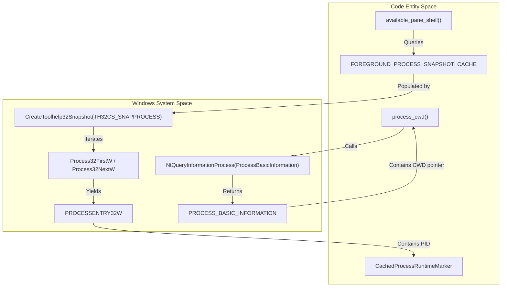
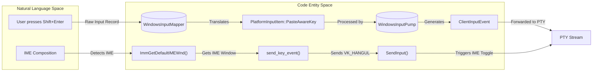

# Windows Platform and ConPTY

Relevant source files

The following files were used as context for generating this wiki page:

- [scripts/windows_smoke_conpty_path.ps1](https://github.com/herdrdev/herdr/blob/HEAD/scripts/windows_smoke_conpty_path.ps1)
- [src/client/input/windows_vti.rs](https://github.com/herdrdev/herdr/blob/HEAD/src/client/input/windows_vti.rs)
- [src/platform/fallback.rs](https://github.com/herdrdev/herdr/blob/HEAD/src/platform/fallback.rs)
- [src/platform/linux.rs](https://github.com/herdrdev/herdr/blob/HEAD/src/platform/linux.rs)
- [src/platform/macos.rs](https://github.com/herdrdev/herdr/blob/HEAD/src/platform/macos.rs)
- [src/platform/mod.rs](https://github.com/herdrdev/herdr/blob/HEAD/src/platform/mod.rs)
- [src/platform/windows.rs](https://github.com/herdrdev/herdr/blob/HEAD/src/platform/windows.rs)
- [src/sound.rs](https://github.com/herdrdev/herdr/blob/HEAD/src/sound.rs)
- [vendor/portable-pty/Cargo.toml](https://github.com/herdrdev/herdr/blob/HEAD/vendor/portable-pty/Cargo.toml)
- [vendor/portable-pty/Cargo.toml.orig](https://github.com/herdrdev/herdr/blob/HEAD/vendor/portable-pty/Cargo.toml.orig)
- [vendor/portable-pty/src/win/psuedocon.rs](https://github.com/herdrdev/herdr/blob/HEAD/vendor/portable-pty/src/win/psuedocon.rs)

Native Windows support in `herdr` is currently in an experimental beta status. Unlike the Unix-based implementations that rely on PTY file descriptors and process groups, the Windows platform abstraction utilizes the **Windows Pseudo Console (ConPTY)** API and specific Win32/WDK system calls to manage process lifecycles and terminal I/O [docs/next/website/src/content/docs/windows-beta.mdx:6-10](https://github.com/herdrdev/herdr/blob/HEAD/docs/next/website/src/content/docs/windows-beta.mdx#L6-L10).

## Process Management and Caching

Because Windows lacks a native `/proc` filesystem or process group signals equivalent to Unix, `herdr` implements a custom process discovery and caching mechanism.

### CreateToolhelp32Snapshot Cache
To identify foreground processes and build process trees for agent detection, `herdr` uses `CreateToolhelp32Snapshot` [src/platform/windows.rs:36-38](https://github.com/herdrdev/herdr/blob/HEAD/src/platform/windows.rs#L36-L38). To avoid the performance overhead of frequent snapshots, results are stored in a `FOREGROUND_PROCESS_SNAPSHOT_CACHE` with a Time-To-Live (TTL) of 250ms [src/platform/windows.rs:79](https://github.com/herdrdev/herdr/blob/HEAD/src/platform/windows.rs#L79).

### CWD Detection via NtQueryInformationProcess
While Unix platforms can easily read a process's current working directory (CWD), Windows requires querying internal process structures. `herdr` uses `NtQueryInformationProcess` to retrieve `ProcessBasicInformation` [src/platform/windows.rs:18-20](https://github.com/herdrdev/herdr/blob/HEAD/src/platform/windows.rs#L18-L20). This allows the server to track the CWD of shell panes, which is essential for workspace labeling and agent context [docs/next/website/src/content/docs/windows-beta.mdx:24-35](https://github.com/herdrdev/herdr/blob/HEAD/docs/next/website/src/content/docs/windows-beta.mdx#L24-L35).

### Process Hierarchy Diagram
This diagram illustrates how code entities interact with Windows system APIs to resolve process metadata.

**Title: Windows Process Metadata Resolution**

Sources: [src/platform/windows.rs:18-20](https://github.com/herdrdev/herdr/blob/HEAD/src/platform/windows.rs#L18-L20), [src/platform/windows.rs:36-38](https://github.com/herdrdev/herdr/blob/HEAD/src/platform/windows.rs#L36-L38), [src/platform/windows.rs:79](https://github.com/herdrdev/herdr/blob/HEAD/src/platform/windows.rs#L79), [src/platform/windows.rs:88-90](https://github.com/herdrdev/herdr/blob/HEAD/src/platform/windows.rs#L88-L90)

## ConPTY Integration

`herdr` integrates with ConPTY to provide native terminal panes. On Windows, `herdr` bundles a specific version of `conpty.dll` and `OpenConsole.exe` to ensure compatibility with features like the Kitty keyboard protocol, which may be missing in older system-provided ConPTY versions [docs/next/website/src/content/docs/windows-beta.mdx:80-83](https://github.com/herdrdev/herdr/blob/HEAD/docs/next/website/src/content/docs/windows-beta.mdx#L80-L83).

The `portable-pty` crate, used by `herdr`, attempts to load a bundled `conpty.dll` first. If `HERDR_WINDOWS_CONPTY=system` is set, or if the bundled version is invalid, it falls back to the system-provided `kernel32.dll` version [vendor/portable-pty/src/win/psuedocon.rs:138-140](https://github.com/herdrdev/herdr/blob/HEAD/vendor/portable-pty/src/win/psuedocon.rs#L138-L140). The bundled `conpty.dll` and `OpenConsole.exe` files are verified against SHA256 hashes to ensure integrity [vendor/portable-pty/src/win/psuedocon.rs:158-171](https://github.com/herdrdev/herdr/blob/HEAD/vendor/portable-pty/src/win/psuedocon.rs#L158-L171).

### Data Flow and Named Pipes
Since Windows does not use Unix domain sockets for PTY I/O, `herdr` utilizes **Named Pipes** for IPC between the server and the terminal panes.

| Component | Windows Implementation |
| :--- | :--- |
| **PTY Backend** | ConPTY (`CreatePseudoConsole`) |
| **Shell Spawning** | `portable_pty::CommandBuilder` with `cmd.exe` or `powershell.exe` |
| **Input Encoding** | Custom Shift+Enter handling for ConPTY |

Sources: [src/platform/windows.rs:62-71](https://github.com/herdrdev/herdr/blob/HEAD/src/platform/windows.rs#L62-L71), [src/platform/windows.rs:189-204](https://github.com/herdrdev/herdr/blob/HEAD/src/platform/windows.rs#L189-L204), [docs/next/website/src/content/docs/windows-beta.mdx:24-30](https://github.com/herdrdev/herdr/blob/HEAD/docs/next/website/src/content/docs/windows-beta.mdx#L24-L30), [vendor/portable-pty/src/win/psuedocon.rs:138-140](https://github.com/herdrdev/herdr/blob/HEAD/vendor/portable-pty/src/win/psuedocon.rs#L138-L140), [vendor/portable-pty/src/win/psuedocon.rs:158-171](https://github.com/herdrdev/herdr/blob/HEAD/vendor/portable-pty/src/win/psuedocon.rs#L158-L171)

## Input and IME Handling

Windows input handling differs significantly from Unix due to how modified keys and IMEs (Input Method Editors) are processed.

### VK_HANGUL and IME Toggling
To support CJK (Chinese, Japanese, Korean) users, `herdr` manages IME states. In specific modes, it may trigger `VK_HANGUL` or use `ImmGetDefaultIMEWnd` to interact with the IME window [src/platform/windows.rs:58-63](https://github.com/herdrdev/herdr/blob/HEAD/src/platform/windows.rs#L58-L63). The `send_key_event` function is responsible for sending keyboard input, including `VK_HANGUL` toggles [src/platform/windows.rs:1000-1002](https://github.com/herdrdev/herdr/blob/HEAD/src/platform/windows.rs#L1000-L1002).

### Shift+Enter Encoding
ConPTY requires specific escape sequences for modified keys that aren't standard in raw VT. `herdr` explicitly encodes `Shift+Enter` using the sequence `\x1b[13;28;13;...` to ensure it is recognized by the underlying shell or agent [src/client/input/windows_vti.rs:200-213](). This is handled within the `WindowsInputMapper` and `WindowsInputPump` components [src/client/input/windows_vti.rs:178-197](https://github.com/herdrdev/herdr/blob/HEAD/src/client/input/windows_vti.rs#L178-L197).

### Input Handling Diagram
This diagram bridges the physical key events to the internal encoding logic.

**Title: Windows Input Processing Pipeline**

Sources: [src/platform/windows.rs:58-63](https://github.com/herdrdev/herdr/blob/HEAD/src/platform/windows.rs#L58-L63), [src/platform/windows.rs:1000-1002](https://github.com/herdrdev/herdr/blob/HEAD/src/platform/windows.rs#L1000-L1002), [src/client/input/windows_vti.rs:178-197](https://github.com/herdrdev/herdr/blob/HEAD/src/client/input/windows_vti.rs#L178-L197), [src/client/input/windows_vti.rs:200-213](https://github.com/herdrdev/herdr/blob/HEAD/src/client/input/windows_vti.rs#L200-L213)

## Sound and Notifications

`herdr` provides audio feedback for agent state changes (e.g., when an agent finishes a task). On Windows, this is implemented by spawning a hidden **PowerShell** process that utilizes the `System.Windows.Media.MediaPlayer` class [src/sound.rs:132-167](https://github.com/herdrdev/herdr/blob/HEAD/src/sound.rs#L132-L167).

1.  The sound data is embedded in the binary as MP3 bytes [src/sound.rs:27-28](https://github.com/herdrdev/herdr/blob/HEAD/src/sound.rs#L27-L28).
2.  At runtime, these bytes are written to a temporary file in `%TEMP%` [src/sound.rs:108-111](https://github.com/herdrdev/herdr/blob/HEAD/src/sound.rs#L108-L111).
3.  `run_windows_player` executes a PowerShell script that loads `PresentationCore` and plays the file [src/sound.rs:132-142](https://github.com/herdrdev/herdr/blob/HEAD/src/sound.rs#L132-L142).

Sources: [src/sound.rs:27-28](https://github.com/herdrdev/herdr/blob/HEAD/src/sound.rs#L27-L28), [src/sound.rs:132-167](https://github.com/herdrdev/herdr/blob/HEAD/src/sound.rs#L132-L167), [src/sound.rs:187-192](https://github.com/herdrdev/herdr/blob/HEAD/src/sound.rs#L187-L192)

## Windows Beta Status and Limitations

The Windows implementation is currently in **Beta** with several known architectural differences from the Unix version:

*   **No Live Handoff:** Unix-specific `SCM_RIGHTS` for file descriptor passing is not available on Windows [docs/next/website/src/content/docs/windows-beta.mdx:90-97](https://github.com/herdrdev/herdr/blob/HEAD/docs/next/website/src/content/docs/windows-beta.mdx#L90-L97). The `PlatformCapabilities` struct explicitly sets `live_handoff` to `false` for non-Unix platforms [src/platform/mod.rs:61](https://github.com/herdrdev/herdr/blob/HEAD/src/platform/mod.rs#L61).
*   **Host Cursor Rendering:** By default, `herdr` draws its own cursor as terminal cell content (`host_cursor = "auto"`) to avoid flicker caused by ConPTY's intermediate repaint states [docs/next/website/src/content/docs/windows-beta.mdx:63-68](https://github.com/herdrdev/herdr/blob/HEAD/docs/next/website/src/content/docs/windows-beta.mdx#L63-L68).
*   **Named Session Persistence:** Local persistent sessions are supported, but server-client communication uses Named Pipes instead of Unix Sockets [docs/next/website/src/content/docs/windows-beta.mdx:24-26](https://github.com/herdrdev/herdr/blob/HEAD/docs/next/website/src/content/docs/windows-beta.mdx#L24-L26).

Sources: [docs/next/website/src/content/docs/windows-beta.mdx:6-10](https://github.com/herdrdev/herdr/blob/HEAD/docs/next/website/src/content/docs/windows-beta.mdx#L6-L10), [docs/next/website/src/content/docs/windows-beta.mdx:63-76](https://github.com/herdrdev/herdr/blob/HEAD/docs/next/website/src/content/docs/windows-beta.mdx#L63-L76), [docs/next/website/src/content/docs/windows-beta.mdx:90-101](https://github.com/herdrdev/herdr/blob/HEAD/docs/next/website/src/content/docs/windows-beta.mdx#L90-L101), [src/platform/mod.rs:61](https://github.com/herdrdev/herdr/blob/HEAD/src/platform/mod.rs#L61)