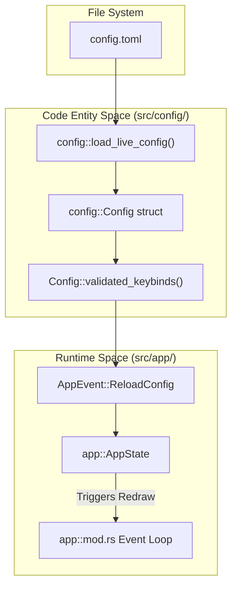
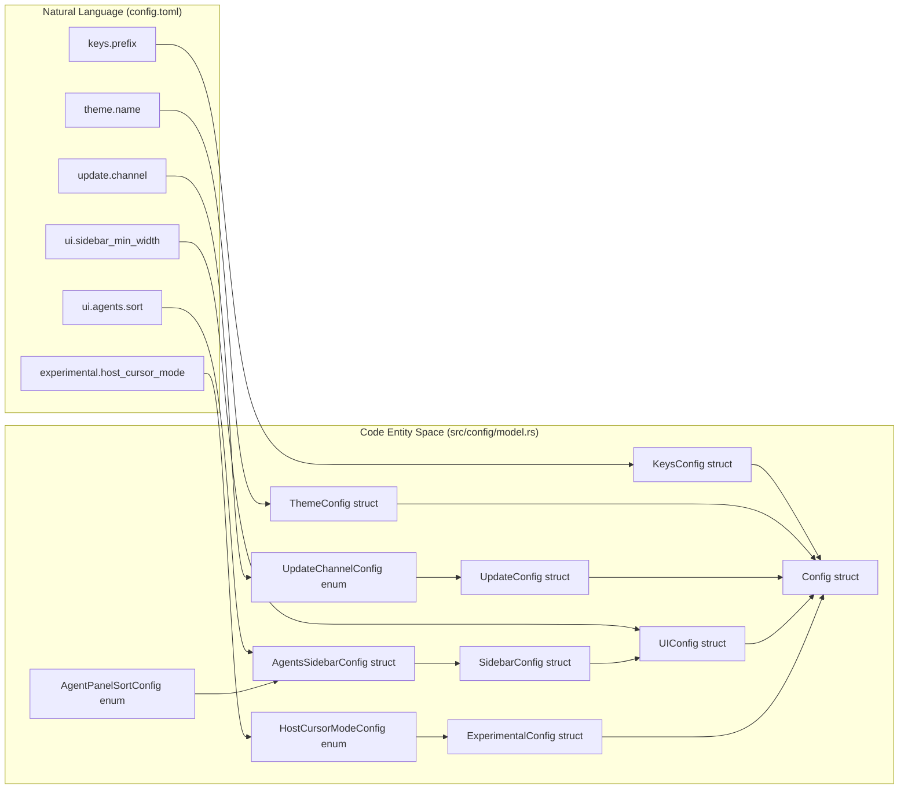

# Configuration Reference

Relevant source files

The following files were used as context for generating this wiki page:

- [docs/next/website/src/content/docs/configuration.mdx](https://github.com/herdrdev/herdr/blob/HEAD/docs/next/website/src/content/docs/configuration.mdx)
- [docs/next/website/src/content/docs/ja/configuration.mdx](https://github.com/herdrdev/herdr/blob/HEAD/docs/next/website/src/content/docs/ja/configuration.mdx)
- [docs/next/website/src/content/docs/zh-cn/configuration.mdx](https://github.com/herdrdev/herdr/blob/HEAD/docs/next/website/src/content/docs/zh-cn/configuration.mdx)
- [docs/next/website/src/data/config-reference.json](https://github.com/herdrdev/herdr/blob/HEAD/docs/next/website/src/data/config-reference.json)
- [src/app/mod.rs](https://github.com/herdrdev/herdr/blob/HEAD/src/app/mod.rs)
- [src/app/state.rs](https://github.com/herdrdev/herdr/blob/HEAD/src/app/state.rs)
- [src/config.rs](https://github.com/herdrdev/herdr/blob/HEAD/src/config.rs)
- [src/config/model.rs](https://github.com/herdrdev/herdr/blob/HEAD/src/config/model.rs)
- [src/main.rs](https://github.com/herdrdev/herdr/blob/HEAD/src/main.rs)
- [src/ui.rs](https://github.com/herdrdev/herdr/blob/HEAD/src/ui.rs)

Herdr is designed to be functional out-of-the-box without a configuration file, but it provides a comprehensive `config.toml` for users who want to customize keybindings, UI themes, sidebar behavior, and advanced terminal settings [docs/next/website/src/content/docs/configuration.mdx:6-8](https://github.com/herdrdev/herdr/blob/HEAD/docs/next/website/src/content/docs/configuration.mdx#L6-L8).

The configuration system supports **hot-reloading**, allowing most changes to take effect immediately without restarting the server or active terminal panes [docs/next/website/src/content/docs/configuration.mdx:41-52](https://github.com/herdrdev/herdr/blob/HEAD/docs/next/website/src/content/docs/configuration.mdx#L41-L52).

### Configuration Locations
Herdr searches for `config.toml` in the following platform-specific directories:
- **Linux/macOS**: `~/.config/herdr/config.toml` [docs/next/website/src/content/docs/configuration.mdx:15-15](https://github.com/herdrdev/herdr/blob/HEAD/docs/next/website/src/content/docs/configuration.mdx#L15)
- **Windows**: `%APPDATA%\herdr\config.toml` [docs/next/website/src/content/docs/configuration.mdx:16-16](https://github.com/herdrdev/herdr/blob/HEAD/docs/next/website/src/content/docs/configuration.mdx#L16)

### Configuration Data Flow
The following diagram illustrates how the `Config` struct is loaded, validated, and applied to the `AppState`.

**Diagram: Configuration Loading and Application**

Sources: [src/config/io.rs:11-16](https://github.com/herdrdev/herdr/blob/HEAD/src/config/io.rs#L11-L16), [src/app/mod.rs:150-152](https://github.com/herdrdev/herdr/blob/HEAD/src/app/mod.rs#L150-L152), [src/config/model.rs:22-26](https://github.com/herdrdev/herdr/blob/HEAD/src/config/model.rs#L22-L26)

---

## Configuration Sections

### [keys] — Keybindings
This section defines the interaction model for Herdr. It supports a `prefix` key (defaulting to `ctrl+b`) and various action contexts.
- **Direct Bindings**: Keys that trigger actions immediately (e.g., `ctrl+alt+n`).
- **Prefix Bindings**: Keys that require the prefix first (e.g., `prefix+c` for `new_tab`).
- **Navigate Mode**: Context-specific keys for moving between panes and workspaces.

For details on binding syntax and custom command types (shell, popup, pane), see [Keybindings Configuration](39_10.1-keybindings-configuration.md).
Sources: [src/main.rs:162-215](https://github.com/herdrdev/herdr/blob/HEAD/src/main.rs#L162-L215), [src/config/keybinds.rs:16-20](https://github.com/herdrdev/herdr/blob/HEAD/src/config/keybinds.rs#L16-L20)

### [theme] — UI Appearance
Herdr includes several built-in themes like `catppuccin`, `tokyo-night`, and `nord`. It also supports automatic switching based on the host terminal's light/dark mode [src/main.rs:116-135](https://github.com/herdrdev/herdr/blob/HEAD/src/main.rs#L116-L135).

| Key | Type | Description |
| :--- | :--- | :--- |
| `name` | String | The base theme name. |
| `auto_switch` | Boolean | Enable theme switching based on host appearance. |
| `custom` | Table | Override individual colors (e.g., `panel_bg`, `accent`). |

Sources: [src/app/state.rs:105-138](https://github.com/herdrdev/herdr/blob/HEAD/src/app/state.rs#L105-L138), [src/main.rs:116-127](https://github.com/herdrdev/herdr/blob/HEAD/src/main.rs#L116-L127)

### [sidebar] — Sidebar Behavior
This section controls the appearance and behavior of the Herdr sidebar, including its width, collapsed state, and how agent and workspace information is displayed.

| Key | Type | Description |
| :--- | :--- | :--- |
| `sidebar_min_width` | Integer | Minimum width of the sidebar in terminal columns. |
| `sidebar_max_width` | Integer | Maximum width of the sidebar in terminal columns. |
| `collapsed_mode` | Enum | How the sidebar behaves when collapsed (`Compact`, `Hidden`). |
| `agents.sort` | Enum | Sorting order for agents in the sidebar (`Spaces`, `Priority`). |
| `agents.status_indicator_style` | Enum | Style of status indicators for agents (`Dots`, `Symbols`). |
| `spaces.show_workspace_name` | Boolean | Whether to show the full workspace name in the sidebar. |

Sources: [src/config/model.rs:145-148](https://github.com/herdrdev/herdr/blob/HEAD/src/config/model.rs#L145-L148), [src/config/model.rs:93-96](https://github.com/herdrdev/herdr/blob/HEAD/src/config/model.rs#L93-L96), [src/config/model.rs:118-122](https://github.com/herdrdev/herdr/blob/HEAD/src/config/model.rs#L118-L122)

### [sound] — Audio Notifications
Configures sound notifications for various events within Herdr.

| Key | Type | Description |
| :--- | :--- | :--- |
| `enable_bell` | Boolean | Enable audible bell for terminal events. |
| `enable_copy_feedback` | Boolean | Play a sound when text is copied. |
| `enable_notification_sound` | Boolean | Play a sound for system notifications. |
| `bell_path` | String | Path to a custom sound file for the bell. |

Sources: [src/config/sound.rs:10-15](https://github.com/herdrdev/herdr/blob/HEAD/src/config/sound.rs#L10-L15)

### [session] — Session Management
Settings related to session persistence and behavior.

| Key | Type | Description |
| :--- | :--- | :--- |
| `persist_pane_history` | Boolean | Whether to save pane scrollback history across sessions. |
| `resume_agents_on_restore` | Boolean | Attempt to resume agent conversations when restoring a session. |

Sources: [src/app/mod.rs:142-142](https://github.com/herdrdev/herdr/blob/HEAD/src/app/mod.rs#L142)

### [update] — Self-Updates
Controls background version and manifest checks.
- `channel`: `stable` or `preview` [src/config/model.rs:14-20](https://github.com/herdrdev/herdr/blob/HEAD/src/config/model.rs#L14-L20).
- `version_check`: Toggle background checks for new Herdr binaries.
- `manifest_check`: Toggle background checks for agent detection rule updates.

Sources: [src/config/model.rs:31-37](https://github.com/herdrdev/herdr/blob/HEAD/src/config/model.rs#L31-L37), [src/main.rs:150-161](https://github.com/herdrdev/herdr/blob/HEAD/src/main.rs#L150-L161)

### [experimental] — Advanced Features
This section contains settings for experimental features that may change or be removed in future versions.

| Key | Type | Description |
| :--- | :--- | :--- |
| `host_cursor_mode` | Enum | Controls how the host terminal cursor is rendered (`Auto`, `Native`, `Drawn`). |
| `right_click_passthrough_modifier` | String | Modifier key to pass right-clicks through to the terminal. |
| `mouse_scroll_lines` | Integer | Number of lines to scroll per mouse wheel tick. |
| `scrollback_limit_bytes` | Integer | Maximum size of the scrollback buffer in bytes. |
| `mobile_width_threshold` | Integer | Terminal width below which Herdr switches to mobile UI layout. |

Sources: [src/config/model.rs:133-136](https://github.com/herdrdev/herdr/blob/HEAD/src/config/model.rs#L133-L136), [src/config/model.rs:151-154](https://github.com/herdrdev/herdr/blob/HEAD/src/config/model.rs#L151-L154), [src/config.rs:40-42](https://github.com/herdrdev/herdr/blob/HEAD/src/config.rs#L40-L42)

---

## Technical Schema Reference

Herdr maintains a `config-reference.json` schema used for validation and documentation generation. This schema bridges the natural language configuration keys to the internal Rust types.

**Diagram: Schema Mapping (Natural Language to Code Entities)**

Sources: [src/config/model.rs:14-47](https://github.com/herdrdev/herdr/blob/HEAD/src/config/model.rs#L14-L47), [src/config/model.rs:233-242](https://github.com/herdrdev/herdr/blob/HEAD/src/config/model.rs#L233-L242), [src/config/model.rs:93-96](https://github.com/herdrdev/herdr/blob/HEAD/src/config/model.rs#L93-L96), [src/config/model.rs:133-136](https://github.com/herdrdev/herdr/blob/HEAD/src/config/model.rs#L133-L136), [docs/next/website/src/data/config-reference.json:1-37468](https://github.com/herdrdev/herdr/blob/HEAD/docs/next/website/src/data/config-reference.json#L1-L37468)

### Hot-Reload Behavior
When `herdr server reload-config` is called, or the "reload config" menu item is selected, the `App` instance triggers a reload [docs/next/website/src/content/docs/configuration.mdx:41-52](https://github.com/herdrdev/herdr/blob/HEAD/docs/next/website/src/content/docs/configuration.mdx#L41-L52).
1. The file is re-read from disk.
2. If valid, the new `Config` is stored in `AppState`.
3. UI-only settings (themes, sidebar visibility, keybindings) are applied immediately [src/app/mod.rs:150-151](https://github.com/herdrdev/herdr/blob/HEAD/src/app/mod.rs#L150-L151).
4. **Note**: `terminal` settings (like `default_shell`) only apply to *new* panes created after the reload [docs/next/website/src/content/docs/configuration.mdx:62-63](https://github.com/herdrdev/herdr/blob/HEAD/docs/next/website/src/content/docs/configuration.mdx#L62-L63).

Sources: [src/app/mod.rs:150-152](https://github.com/herdrdev/herdr/blob/HEAD/src/app/mod.rs#L150-L152), [docs/next/website/src/content/docs/configuration.mdx:41-52](https://github.com/herdrdev/herdr/blob/HEAD/docs/next/website/src/content/docs/configuration.mdx#L41-L52)3d:T2dab,# Key