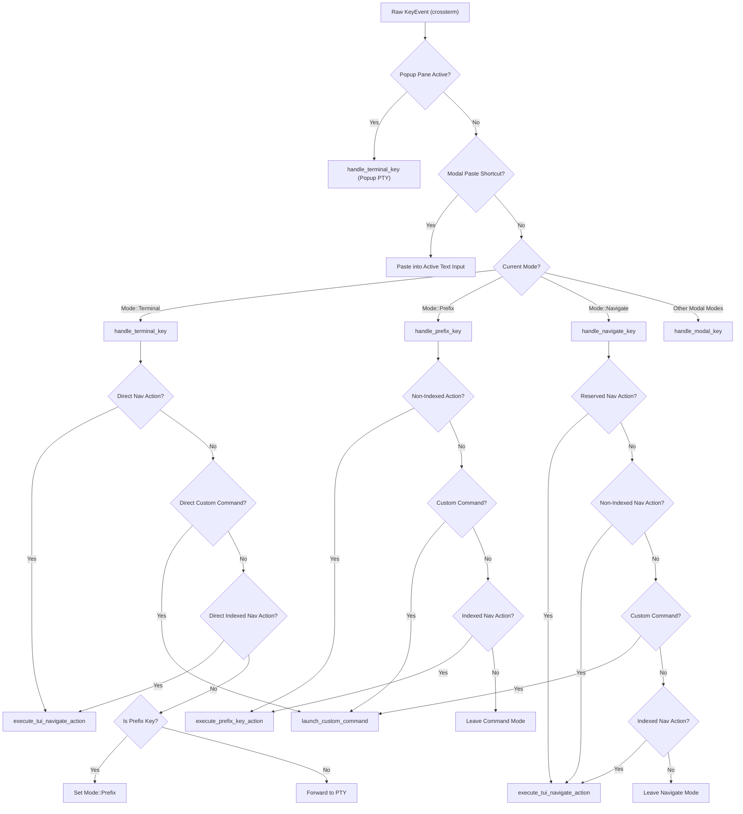
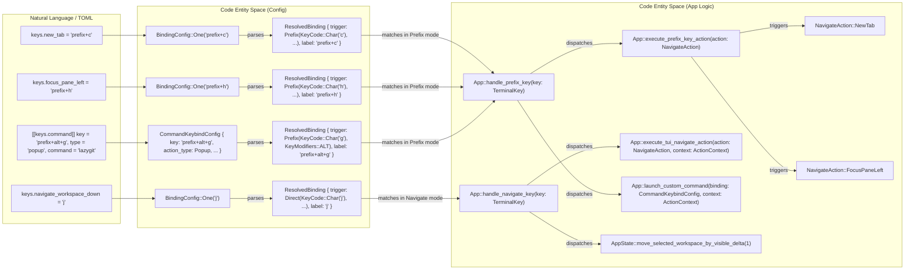

# Keybindings Configuration

Relevant source files

The following files were used as context for generating this wiki page:

- [docs/next/website/src/content/docs/configuration.mdx](https://github.com/herdrdev/herdr/blob/HEAD/docs/next/website/src/content/docs/configuration.mdx)
- [docs/next/website/src/content/docs/ja/configuration.mdx](https://github.com/herdrdev/herdr/blob/HEAD/docs/next/website/src/content/docs/ja/configuration.mdx)
- [docs/next/website/src/content/docs/ja/keyboard.mdx](https://github.com/herdrdev/herdr/blob/HEAD/docs/next/website/src/content/docs/ja/keyboard.mdx)
- [docs/next/website/src/content/docs/keyboard.mdx](https://github.com/herdrdev/herdr/blob/HEAD/docs/next/website/src/content/docs/keyboard.mdx)
- [docs/next/website/src/content/docs/zh-cn/configuration.mdx](https://github.com/herdrdev/herdr/blob/HEAD/docs/next/website/src/content/docs/zh-cn/configuration.mdx)
- [docs/next/website/src/content/docs/zh-cn/keyboard.mdx](https://github.com/herdrdev/herdr/blob/HEAD/docs/next/website/src/content/docs/zh-cn/keyboard.mdx)
- [docs/next/website/src/data/config-reference.json](https://github.com/herdrdev/herdr/blob/HEAD/docs/next/website/src/data/config-reference.json)
- [src/app/input/copy_mode.rs](https://github.com/herdrdev/herdr/blob/HEAD/src/app/input/copy_mode.rs)
- [src/app/input/mod.rs](https://github.com/herdrdev/herdr/blob/HEAD/src/app/input/mod.rs)
- [src/app/input/modal.rs](https://github.com/herdrdev/herdr/blob/HEAD/src/app/input/modal.rs)
- [src/app/input/mouse.rs](https://github.com/herdrdev/herdr/blob/HEAD/src/app/input/mouse.rs)
- [src/app/input/navigate.rs](https://github.com/herdrdev/herdr/blob/HEAD/src/app/input/navigate.rs)
- [src/app/input/terminal.rs](https://github.com/herdrdev/herdr/blob/HEAD/src/app/input/terminal.rs)
- [src/config/keybinds.rs](https://github.com/herdrdev/herdr/blob/HEAD/src/config/keybinds.rs)
- [src/selection.rs](https://github.com/herdrdev/herdr/blob/HEAD/src/selection.rs)
- [src/ui/keybind_help.rs](https://github.com/herdrdev/herdr/blob/HEAD/src/ui/keybind_help.rs)
- [src/ui/menus.rs](https://github.com/herdrdev/herdr/blob/HEAD/src/ui/menus.rs)

Herdr provides a multi-layered input handling system that allows for global shortcuts, modal navigation, and custom command execution. Keybindings are resolved through a hierarchy that prioritizes internal TUI modes before falling back to forwarding input to terminal panes.

## BindingConfig Syntax

The configuration for keybindings is defined in the `config.toml` file and parsed into the `BindingConfig` enum [src/config/keybinds.rs:21-26](https://github.com/herdrdev/herdr/blob/HEAD/src/config/keybinds.rs#L21-L26). It supports two formats:
- **Single String**: A single key combo (e.g., `key = "ctrl+b"`).
- **Array of Strings**: Multiple alternative combos for the same action (e.g., `key = ["ctrl+b", "f1"]`).

### Parsing and Modifiers
Key strings are parsed into `KeyCombo` tuples containing a `KeyCode` and `KeyModifiers` [src/config/keybinds.rs:13-13](https://github.com/herdrdev/herdr/blob/HEAD/src/config/keybinds.rs#L13). Supported modifiers include `ctrl`, `shift`, `alt`, and `cmd` (for `super` on macOS). Named punctuation like `minus`, `comma`, `ampersand`, `plus`, and `backtick` are also accepted [docs/next/website/src/content/docs/configuration.mdx:142-142](https://github.com/herdrdev/herdr/blob/HEAD/docs/next/website/src/content/docs/configuration.mdx#L142).

Sources: [src/config/keybinds.rs:13-13](https://github.com/herdrdev/herdr/blob/HEAD/src/config/keybinds.rs#L13), [src/config/keybinds.rs:21-26](https://github.com/herdrdev/herdr/blob/HEAD/src/config/keybinds.rs#L21-L26), [docs/next/website/src/content/docs/configuration.mdx:142-142](https://github.com/herdrdev/herdr/blob/HEAD/docs/next/website/src/content/docs/configuration.mdx#L142)

## ActionContext and Dispatch

Herdr categorizes key resolution into three primary contexts via the `ActionContext` enum [src/app/input/navigate.rs:47-52](https://github.com/herdrdev/herdr/blob/HEAD/src/app/input/navigate.rs#L47-L52):

| Context | Description |
| :--- | :--- |
| `Direct` | Keys processed immediately in `Mode::Terminal` before being sent to the PTY [src/app/input/terminal.rs:78-121](https://github.com/herdrdev/herdr/blob/HEAD/src/app/input/terminal.rs#L78-L121). |
| `Prefix` | Keys processed after the global prefix (default `ctrl+b`) is pressed [src/app/input/navigate.rs:61-105](https://github.com/herdrdev/herdr/blob/HEAD/src/app/input/navigate.rs#L61-L105). |
| `Navigate` | Keys processed while the UI is in `Mode::Navigate` (Navigator or Sidebar focus) [src/app/input/navigate.rs:128-182](https://github.com/herdrdev/herdr/blob/HEAD/src/app/input/navigate.rs#L128-L182). |

### Binding Dispatch
The system uses `BindingDispatch` (an internal enum not directly exposed in `ActionContext`) to determine how to match a key against the configuration. This ensures that a key like `1` can mean "Type the character 1" in `Direct` mode but "Switch to Workspace 1" in `Prefix` mode.

Sources: [src/app/input/navigate.rs:47-52](https://github.com/herdrdev/herdr/blob/HEAD/src/app/input/navigate.rs#L47-L52), [src/app/input/terminal.rs:78-121](https://github.com/herdrdev/herdr/blob/HEAD/src/app/input/terminal.rs#L78-L121), [src/app/input/navigate.rs:61-105](https://github.com/herdrdev/herdr/blob/HEAD/src/app/input/navigate.rs#L61-L105)

## Indexed Bindings (1-9)

Actions like switching workspaces, tabs, or agents support indexed ranges. In the configuration, these are often defined as `prefix+1..9` [docs/next/website/src/content/docs/configuration.mdx:152-154](https://github.com/herdrdev/herdr/blob/HEAD/docs/next/website/src/content/docs/configuration.mdx#L152-L154).

The `indexed_navigation_action` function resolves these keys by checking if the input matches a digit `1` through `9` and mapping it to the corresponding entity index [src/app/input/navigate.rs:40-45](https://github.com/herdrdev/herdr/blob/HEAD/src/app/input/navigate.rs#L40-L45). The `BindingConfig::indexed_labels` method can extract labels for indexed bindings [src/config/keybinds.rs:52-75](https://github.com/herdrdev/herdr/blob/HEAD/src/config/keybinds.rs#L52-L75).

Sources: [src/app/input/navigate.rs:40-45](https://github.com/herdrdev/herdr/blob/HEAD/src/app/input/navigate.rs#L40-L45), [src/config/keybinds.rs:52-75](https://github.com/herdrdev/herdr/blob/HEAD/src/config/keybinds.rs#L52-L75), [docs/next/website/src/content/docs/configuration.mdx:152-154](https://github.com/herdrdev/herdr/blob/HEAD/docs/next/website/src/content/docs/configuration.mdx#L152-L154)

## Conflict Detection

Herdr performs conflict detection during configuration loading and UI rendering.
1.  **Unsafe Binding Rules**: Certain keys are protected to prevent locking users out of the PTY. For example, modifier-only events are dropped [src/app/input/terminal.rs:128-136](https://github.com/herdrdev/herdr/blob/HEAD/src/app/input/terminal.rs#L128-L136). Plain direct printable keys are considered unsafe as they intercept typing [docs/next/website/src/content/docs/configuration.mdx:142-142](https://github.com/herdrdev/herdr/blob/HEAD/docs/next/website/src/content/docs/configuration.mdx#L142).
2.  **Priority Hierarchy**: The `handle_key` function in `App` routes input based on the current `AppState.mode` [src/app/input/mod.rs:78-123](https://github.com/herdrdev/herdr/blob/HEAD/src/app/input/mod.rs#L78-L123). If a modal (like `RenameWorkspace`) is active, it intercepts keys before they reach the navigation or terminal handlers.

### Input Routing Flow
The following diagram illustrates how a raw key event is dispatched through the system:

**Key Event Dispatch Pipeline**

Sources: [src/app/input/mod.rs:78-123](https://github.com/herdrdev/herdr/blob/HEAD/src/app/input/mod.rs#L78-L123), [src/app/input/terminal.rs:39-61](https://github.com/herdrdev/herdr/blob/HEAD/src/app/input/terminal.rs#L39-L61), [src/app/input/navigate.rs:61-105](https://github.com/herdrdev/herdr/blob/HEAD/src/app/input/navigate.rs#L61-L105), [src/app/input/navigate.rs:128-182](https://github.com/herdrdev/herdr/blob/HEAD/src/app/input/navigate.rs#L128-L182), [src/app/input/terminal.rs:128-136](https://github.com/herdrdev/herdr/blob/HEAD/src/app/input/terminal.rs#L128-L136), [docs/next/website/src/content/docs/configuration.mdx:142-142](https://github.com/herdrdev/herdr/blob/HEAD/docs/next/website/src/content/docs/configuration.mdx#L142)

## Custom Commands

Users can define arbitrary commands in `config.toml` using the `[[keys.command]]` array [docs/next/website/src/content/docs/configuration.mdx:161-171](https://github.com/herdrdev/herdr/blob/HEAD/docs/next/website/src/content/docs/configuration.mdx#L161-L171). These are represented by the `CommandKeybindConfig` struct [src/config/keybinds.rs:90-104](https://github.com/herdrdev/herdr/blob/HEAD/src/config/keybinds.rs#L90-L104).

### Command Types (`CommandKeybindType`)
-   **Shell**: Runs a command in the background using the user's default shell [src/config/keybinds.rs:82-82](https://github.com/herdrdev/herdr/blob/HEAD/src/config/keybinds.rs#L82). On Unix, commands run via `/bin/sh -c` for pane commands and `/bin/sh -lc` for detached commands; on Windows, they run via `cmd.exe /d /c` [docs/next/website/src/content/docs/configuration.mdx:62-62](https://github.com/herdrdev/herdr/blob/HEAD/docs/next/website/src/content/docs/configuration.mdx#L62).
-   **Pane**: Opens a new temporary terminal pane to run the command, which closes when the command exits [src/config/keybinds.rs:83-83](https://github.com/herdrdev/herdr/blob/HEAD/src/config/keybinds.rs#L83).
-   **Popup**: Opens a floating modal terminal of a specific size (`width`/`height`) to run the command [src/config/keybinds.rs:84-84](https://github.com/herdrdev/herdr/blob/HEAD/src/config/keybinds.rs#L84). Popup commands do not receive `HERDR_PANE_ID` but can use `HERDR_ACTIVE_PANE_ID` [docs/next/website/src/content/docs/configuration.mdx:177-178](https://github.com/herdrdev/herdr/blob/HEAD/docs/next/website/src/content/docs/configuration.mdx#L177-L178).
-   **PluginAction**: Triggers a specific action defined by an installed plugin [src/config/keybinds.rs:85-85](https://github.com/herdrdev/herdr/blob/HEAD/src/config/keybinds.rs#L85).

### Implementation
When a custom command key is matched, `App::launch_custom_command` is called [src/app/input/navigate.rs:92-93](https://github.com/herdrdev/herdr/blob/HEAD/src/app/input/navigate.rs#L92-L93). This function uses the `CommandKeybindConfig` to determine the execution strategy. Custom commands receive environment variables like `HERDR_SOCKET_PATH`, `HERDR_BIN_PATH`, `HERDR_ACTIVE_WORKSPACE_ID`, `HERDR_ACTIVE_TAB_ID`, `HERDR_ACTIVE_PANE_ID`, and `HERDR_ACTIVE_PANE_CWD` [docs/next/website/src/content/docs/configuration.mdx:210-211](https://github.com/herdrdev/herdr/blob/HEAD/docs/next/website/src/content/docs/configuration.mdx#L210-L211).

Sources: [src/config/keybinds.rs:80-104](https://github.com/herdrdev/herdr/blob/HEAD/src/config/keybinds.rs#L80-L104), [src/app/input/navigate.rs:90-94](https://github.com/herdrdev/herdr/blob/HEAD/src/app/input/navigate.rs#L90-L94), [docs/next/website/src/content/docs/configuration.mdx:62-62](https://github.com/herdrdev/herdr/blob/HEAD/docs/next/website/src/content/docs/configuration.mdx#L62), [docs/next/website/src/content/docs/configuration.mdx:161-171](https://github.com/herdrdev/herdr/blob/HEAD/docs/next/website/src/content/docs/configuration.mdx#L161-L171), [docs/next/website/src/content/docs/configuration.mdx:177-178](https://github.com/herdrdev/herdr/blob/HEAD/docs/next/website/src/content/docs/configuration.mdx#L177-L178), [docs/next/website/src/content/docs/configuration.mdx:210-211](https://github.com/herdrdev/herdr/blob/HEAD/docs/next/website/src/content/docs/configuration.mdx#L210-L211)

## Keybinding Resolution Logic

The resolution logic bridges the gap between the configuration (Natural Language/TOML) and the internal application logic (Code Entities).

**Configuration to Execution Mapping**

### Key Functions
-   `non_indexed_action_for_key`: Checks standard navigation actions (splits, focus, etc.) [src/app/input/navigate.rs:32-37](https://github.com/herdrdev/herdr/blob/HEAD/src/app/input/navigate.rs#L32-L37).
-   `command_for_key`: Specifically looks for user-defined custom commands [src/app/input/navigate.rs:90-94](https://github.com/herdrdev/herdr/blob/HEAD/src/app/input/navigate.rs#L90-L94).
-   `matches_direct_key` / `matches_prefix_key`: Helper methods on `ActionKeybinds` to validate if a `TerminalKey` matches a configured trigger [src/config/keybinds.rs:211-221](https://github.com/herdrdev/herdr/blob/HEAD/src/config/keybinds.rs#L211-L221).

Sources: [src/app/input/navigate.rs:32-37](https://github.com/herdrdev/herdr/blob/HEAD/src/app/input/navigate.rs#L32-L37), [src/app/input/navigate.rs:90-94](https://github.com/herdrdev/herdr/blob/HEAD/src/app/input/navigate.rs#L90-L94), [src/config/keybinds.rs:211-221](https://github.com/herdrdev/herdr/blob/HEAD/src/config/keybinds.rs#L211-L221)