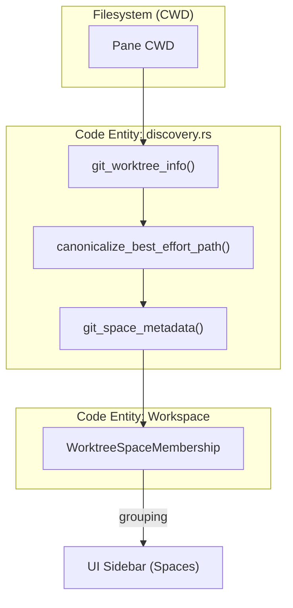
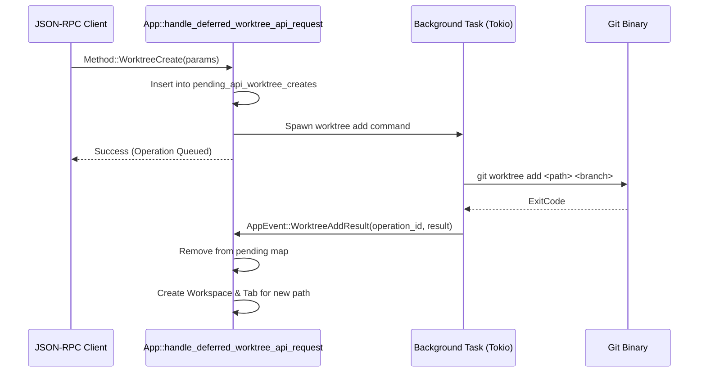

# Git Worktree Integration

Relevant source files

The following files were used as context for generating this wiki page:

- [src/app/api/panes.rs](https://github.com/herdrdev/herdr/blob/HEAD/src/app/api/panes.rs)
- [src/app/api/worktrees.rs](https://github.com/herdrdev/herdr/blob/HEAD/src/app/api/worktrees.rs)
- [src/app/api/worktrees/deferred.rs](https://github.com/herdrdev/herdr/blob/HEAD/src/app/api/worktrees/deferred.rs)
- [src/app/creation.rs](https://github.com/herdrdev/herdr/blob/HEAD/src/app/creation.rs)
- [src/app/runtime_mutations.rs](https://github.com/herdrdev/herdr/blob/HEAD/src/app/runtime_mutations.rs)
- [src/app/worktrees.rs](https://github.com/herdrdev/herdr/blob/HEAD/src/app/worktrees.rs)
- [src/logging.rs](https://github.com/herdrdev/herdr/blob/HEAD/src/logging.rs)
- [src/persist.rs](https://github.com/herdrdev/herdr/blob/HEAD/src/persist.rs)
- [src/workspace.rs](https://github.com/herdrdev/herdr/blob/HEAD/src/workspace.rs)
- [src/workspace/git/discovery.rs](https://github.com/herdrdev/herdr/blob/HEAD/src/workspace/git/discovery.rs)
- [src/workspace/git/mod.rs](https://github.com/herdrdev/herdr/blob/HEAD/src/workspace/git/mod.rs)
- [src/workspace/git/status.rs](https://github.com/herdrdev/herdr/blob/HEAD/src/workspace/git/status.rs)
- [src/workspace/git/test_support.rs](https://github.com/herdrdev/herdr/blob/HEAD/src/workspace/git/test_support.rs)
- [src/workspace/tab.rs](https://github.com/herdrdev/herdr/blob/HEAD/src/workspace/tab.rs)
- [src/worktree.rs](https://github.com/herdrdev/herdr/blob/HEAD/src/worktree.rs)

Herdr provides deep integration with `git worktree`, treating worktrees as a primary mechanism for managing concurrent development contexts. Instead of switching branches within a single directory, Herdr encourages a workflow where each branch or task lives in its own dedicated workspace. This integration includes automated worktree lifecycle management, specialized UI grouping, and optimized metadata caching.

## WorktreeSpace and Grouping

Herdr organizes workspaces using the concept of a `WorktreeSpace`. When multiple workspaces belong to the same Git repository (either as the main checkout or linked worktrees), they are grouped together in the sidebar.

### Metadata Discovery
The system identifies Git repositories and worktrees by traversing the filesystem from a pane's current working directory (CWD). The `git_worktree_info` function [src/workspace/git/discovery.rs:42-56](https://github.com/herdrdev/herdr/blob/HEAD/src/workspace/git/discovery.rs#L42-L56) extracts the `repo_root`, `git_dir`, and `git_common_dir`.
- **Main Checkout:** `git_dir` and `git_common_dir` are identical.
- **Linked Worktree:** `git_dir` points to the worktree-specific metadata, while `git_common_dir` points back to the parent repository's objects and config [src/workspace/git/discovery.rs:46-46](https://github.com/herdrdev/herdr/blob/HEAD/src/workspace/git/discovery.rs#L46).

The `GitSpaceMetadata` struct [src/workspace/git/discovery.rs:4-10](https://github.com/herdrdev/herdr/blob/HEAD/src/workspace/git/discovery.rs#L4-L10) serves as the unique identifier for a repository group, using the canonicalized `git_common_dir` as the `key` [src/workspace/git/discovery.rs:72-74](https://github.com/herdrdev/herdr/blob/HEAD/src/workspace/git/discovery.rs#L72-L74).

### Data Flow: Git Discovery to UI
The following diagram illustrates how raw filesystem data is transformed into the `WorktreeSpace` entities used by the UI.

**Git Metadata Resolution Pipeline**

Sources: [src/workspace/git/discovery.rs:4-10](https://github.com/herdrdev/herdr/blob/HEAD/src/workspace/git/discovery.rs#L4-L10), [src/workspace/git/discovery.rs:42-56](https://github.com/herdrdev/herdr/blob/HEAD/src/workspace/git/discovery.rs#L42-L56), [src/workspace/git/discovery.rs:58-61](https://github.com/herdrdev/herdr/blob/HEAD/src/workspace/git/discovery.rs#L58-L61)

## Git Status Caching

To maintain UI responsiveness while displaying branch names and ahead/behind counts across many workspaces, Herdr implements a fingerprint-based caching layer in `src/workspace/git/status.rs`.

### Fingerprinting Logic
A `GitStatusFingerprint` [src/workspace/git/status.rs:41-46](https://github.com/herdrdev/herdr/blob/HEAD/src/workspace/git/status.rs#L41-L46) is generated to determine if a cache entry is still valid. It includes:
1. **HEAD Identity:** The current branch OID or detached commit hash [src/workspace/git/status.rs:49-58](https://github.com/herdrdev/herdr/blob/HEAD/src/workspace/git/status.rs#L49-L58).
2. **Upstream Identity:** The OID of the tracked remote branch [src/workspace/git/status.rs:61-66](https://github.com/herdrdev/herdr/blob/HEAD/src/workspace/git/status.rs#L61-L66).
3. **Paths:** Canonicalized `git_dir` and `git_common_dir` [src/workspace/git/status.rs:42-43](https://github.com/herdrdev/herdr/blob/HEAD/src/workspace/git/status.rs#L42-L43).

The `git_status_snapshot_for_cwd_with_demand` function [src/workspace/git/status.rs:84-186](https://github.com/herdrdev/herdr/blob/HEAD/src/workspace/git/status.rs#L84-L186) checks the `GitStatusCacheEntry`. If the fingerprint matches, it returns the cached `ahead_behind` data; otherwise, it executes a background `git rev-list --count --left-right` to recalculate the delta [src/workspace/git/status.rs:168-171](https://github.com/herdrdev/herdr/blob/HEAD/src/workspace/git/status.rs#L168-L171).

Sources: [src/workspace/git/status.rs:34-38](https://github.com/herdrdev/herdr/blob/HEAD/src/workspace/git/status.rs#L34-L38), [src/workspace/git/status.rs:41-46](https://github.com/herdrdev/herdr/blob/HEAD/src/workspace/git/status.rs#L41-L46), [src/workspace/git/status.rs:84-186](https://github.com/herdrdev/herdr/blob/HEAD/src/workspace/git/status.rs#L84-L186)

## Sidebar Interactions

The TUI sidebar provides interactive management of worktrees via the `App` state machine.

### Creating Worktrees
Users can initiate a new worktree from a "parent" workspace (the main repo checkout).
1. **Dialog Initialization:** `open_new_linked_worktree_dialog` [src/app/worktrees.rs:80-125](https://github.com/herdrdev/herdr/blob/HEAD/src/app/worktrees.rs#L80-L125) generates a random branch slug using `generated_branch_slug` [src/worktree.rs:21-32](https://github.com/herdrdev/herdr/blob/HEAD/src/worktree.rs#L21-L32) and calculates a default path in the configured worktree directory.
2. **Execution:** The UI collects the branch name and path. When confirmed, it transitions to `Mode::NewLinkedWorktree` [src/app/worktrees.rs:124-124](https://github.com/herdrdev/herdr/blob/HEAD/src/app/worktrees.rs#L124).

### Removing Worktrees
Worktrees can be removed directly from the sidebar:
1. **Confirmation:** `open_remove_linked_worktree_confirmation` [src/app/worktrees.rs:127-152](https://github.com/herdrdev/herdr/blob/HEAD/src/app/worktrees.rs#L127-L152) validates that the workspace is a Herdr-managed worktree.
2. **Dirty Check:** If the worktree has uncommitted changes, the system detects this via `checkout_has_dirty_files` [src/worktree.rs:200-226](https://github.com/herdrdev/herdr/blob/HEAD/src/worktree.rs#L200-L226) and requires a "force" confirmation.

Sources: [src/app/worktrees.rs:80-125](https://github.com/herdrdev/herdr/blob/HEAD/src/app/worktrees.rs#L80-L125), [src/worktree.rs:21-32](https://github.com/herdrdev/herdr/blob/HEAD/src/worktree.rs#L21-L32), [src/worktree.rs:200-226](https://github.com/herdrdev/herdr/blob/HEAD/src/worktree.rs#L200-L226)

## Deferred Worktree API

For programmatic control (e.g., via the JSON-RPC API or CLI), Herdr implements a deferred execution model for worktree operations. This is necessary because `git worktree` commands are I/O bound and should not block the main application event loop.

### Request Handling
API requests for `WorktreeCreate` or `WorktreeRemove` are intercepted by `handle_deferred_worktree_api_request` [src/app/api/worktrees/deferred.rs:15-31](https://github.com/herdrdev/herdr/blob/HEAD/src/app/api/worktrees/deferred.rs#L15-L31).

### Process Flow
1. **Start Operation:** The app generates a unique `operation_id` and marks the path as pending in `pending_api_worktree_creates` [src/app/api/worktrees/deferred.rs:158-160](https://github.com/herdrdev/herdr/blob/HEAD/src/app/api/worktrees/deferred.rs#L158-L160).
2. **Async Execution:** The operation is offloaded to a background task.
3. **Event Completion:** Once the `git` process exits, the result is sent back to the main loop as a `WorktreeAddResult` or `WorktreeRemoveResult` [src/events.rs](https://github.com/herdrdev/herdr/blob/HEAD/src/events.rs).

**Deferred API Execution Model**

Sources: [src/app/api/worktrees/deferred.rs:15-31](https://github.com/herdrdev/herdr/blob/HEAD/src/app/api/worktrees/deferred.rs#L15-L31), [src/app/api/worktrees/deferred.rs:158-160](https://github.com/herdrdev/herdr/blob/HEAD/src/app/api/worktrees/deferred.rs#L158-L160), [src/events.rs](https://github.com/herdrdev/herdr/blob/HEAD/src/events.rs), [src/worktree.rs:228-245](https://github.com/herdrdev/herdr/blob/HEAD/src/worktree.rs#L228-L245)

## Key Implementation Entities

| Struct / Function | File | Description |
| :--- | :--- | :--- |
| `GitSpaceMetadata` | `src/workspace/git/discovery.rs` | Defines the identity of a repository group. |
| `GitStatusFingerprint` | `src/workspace/git/status.rs` | Used to invalidate cached git status (branch/ahead/behind). |
| `WorktreeCommand` | `src/worktree.rs` | Encapsulates the `git` binary and arguments for worktree ops. |
| `WorktreeCreateState` | `src/app/state.rs` | Holds transient state for the TUI worktree creation dialog. |
| `handle_worktree_open` | `src/app/api/worktrees.rs` | Logic for attaching a workspace to an existing worktree path. |

Sources: [src/workspace/git/discovery.rs:4-10](https://github.com/herdrdev/herdr/blob/HEAD/src/workspace/git/discovery.rs#L4-L10), [src/workspace/git/status.rs:41-46](https://github.com/herdrdev/herdr/blob/HEAD/src/workspace/git/status.rs#L41-L46), [src/worktree.rs:7-10](https://github.com/herdrdev/herdr/blob/HEAD/src/worktree.rs#L7-L10), [src/app/api/worktrees.rs:75-172](https://github.com/herdrdev/herdr/blob/HEAD/src/app/api/worktrees.rs#L75-L172)