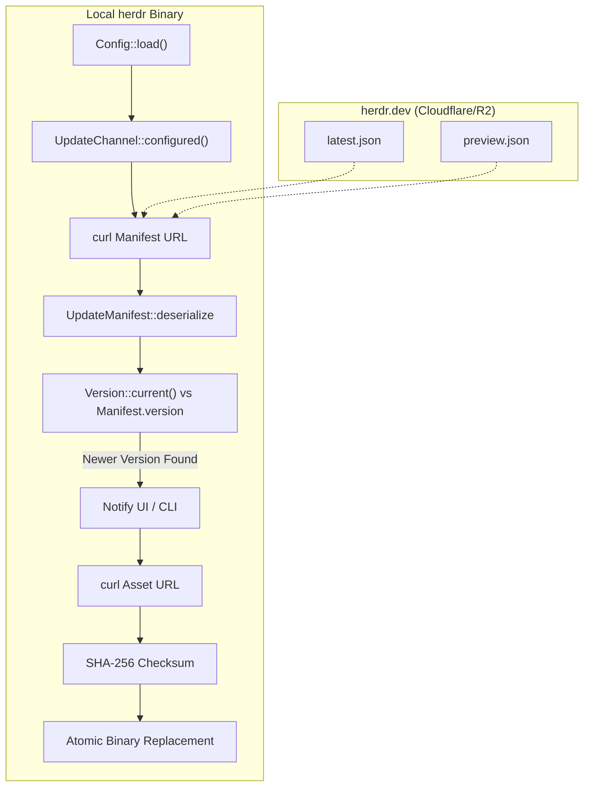
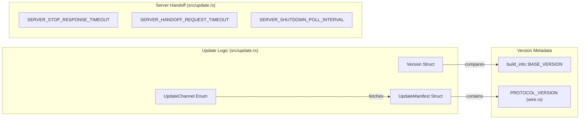

# Self-Update System

Relevant source files

The following files were used as context for generating this wiki page:

- [.github/workflows/build-artifacts-manual.yml](https://github.com/herdrdev/herdr/blob/HEAD/.github/workflows/build-artifacts-manual.yml)
- [.github/workflows/label-next-release-issues.yml](https://github.com/herdrdev/herdr/blob/HEAD/.github/workflows/label-next-release-issues.yml)
- [.github/workflows/preview.yml](https://github.com/herdrdev/herdr/blob/HEAD/.github/workflows/preview.yml)
- [.github/workflows/release.yml](https://github.com/herdrdev/herdr/blob/HEAD/.github/workflows/release.yml)
- [docs/next/product-announcement.json](https://github.com/herdrdev/herdr/blob/HEAD/docs/next/product-announcement.json)
- [scripts/changelog.py](https://github.com/herdrdev/herdr/blob/HEAD/scripts/changelog.py)
- [scripts/test_changelog.py](https://github.com/herdrdev/herdr/blob/HEAD/scripts/test_changelog.py)
- [scripts/test_unix_installer.py](https://github.com/herdrdev/herdr/blob/HEAD/scripts/test_unix_installer.py)
- [scripts/windows_install_conpty_package_test.ps1](https://github.com/herdrdev/herdr/blob/HEAD/scripts/windows_install_conpty_package_test.ps1)
- [src/remote/attach.rs](https://github.com/herdrdev/herdr/blob/HEAD/src/remote/attach.rs)
- [src/update.rs](https://github.com/herdrdev/herdr/blob/HEAD/src/update.rs)
- [website/install.ps1](https://github.com/herdrdev/herdr/blob/HEAD/website/install.ps1)
- [website/install.sh](https://github.com/herdrdev/herdr/blob/HEAD/website/install.sh)
- [website/latest.json](https://github.com/herdrdev/herdr/blob/HEAD/website/latest.json)
- [website/preview.json](https://github.com/herdrdev/herdr/blob/HEAD/website/preview.json)

The self-update system allows `herdr` to discover, verify, and install new versions of itself. It supports multiple distribution channels (stable and preview), detects the host platform and package manager, and provides an experimental "live handoff" mechanism to update running servers without losing session state.

## Update Manifests and Channels

`herdr` fetches update metadata from JSON manifests hosted on `herdr.dev`. These manifests define the latest available version, release notes, protocol version, and platform-specific asset URLs with SHA-256 checksums.

| Channel | Manifest URL | Purpose |
| :--- | :--- | :--- |
| **Stable** | `https://herdr.dev/latest.json` | Official production releases. |
| **Preview** | `https://herdr.dev/preview.json` | Automated builds from the `master` branch. |

The update logic is primarily contained within `src/update.rs` [src/update.rs:1-10](https://github.com/herdrdev/herdr/blob/HEAD/src/update.rs#L1-L10). It uses `curl` as a subprocess to fetch manifests, avoiding heavy Rust HTTP dependencies [src/update.rs:6-7](https://github.com/herdrdev/herdr/blob/HEAD/src/update.rs#L6-L7).

### Manifest Structure
The `UpdateManifest` and `PreviewManifest` structs handle the deserialization of these files [src/update.rs:165-210](https://github.com/herdrdev/herdr/blob/HEAD/src/update.rs#L165-L210).
- **Protocol Version**: Used to determine if a client-server mismatch will occur after update [src/update.rs:168-169](https://github.com/herdrdev/herdr/blob/HEAD/src/update.rs#L168-L169).
- **Assets**: A map of platform strings (e.g., `linux-x86_64`) to `AssetRef` objects containing the download URL and checksum [src/update.rs:125-162](https://github.com/herdrdev/herdr/blob/HEAD/src/update.rs#L125-L162).

### Update Data Flow

Sources: [src/update.rs:26-32](https://github.com/herdrdev/herdr/blob/HEAD/src/update.rs#L26-L32), [src/update.rs:102-122](https://github.com/herdrdev/herdr/blob/HEAD/src/update.rs#L102-L122), [src/update.rs:165-175](https://github.com/herdrdev/herdr/blob/HEAD/src/update.rs#L165-L175)

## Platform and Package Manager Detection

Before attempting a self-update, `herdr` detects how it was installed. If a package manager is managing the binary, `herdr` directs the user to use that manager's update command instead of performing an atomic binary replacement.

| Detection Method | Package Manager | Update Command |
| :--- | :--- | :--- |
| `brew` in path + formula match | **Homebrew** | `brew update && brew upgrade herdr` [src/update.rs:30](https://github.com/herdrdev/herdr/blob/HEAD/src/update.rs#L30) |
| `MISE_INSTALLS_DIR` env | **mise** | `mise upgrade herdr` [src/update.rs:31](https://github.com/herdrdev/herdr/blob/HEAD/src/update.rs#L31) |
| Binary path in `/nix/store` | **Nix** | `update through Nix` [src/update.rs:32](https://github.com/herdrdev/herdr/blob/HEAD/src/update.rs#L32) |
| Standard filesystem | **Standalone** | `herdr update` [src/update.rs:29](https://github.com/herdrdev/herdr/blob/HEAD/src/update.rs#L29) |

Detection constants are defined in `src/update.rs` [src/update.rs:28-33](https://github.com/herdrdev/herdr/blob/HEAD/src/update.rs#L28-L33). For Nix, the system specifically checks if the current executable path contains the Nix store prefix.

Sources: [src/update.rs:28-33](https://github.com/herdrdev/herdr/blob/HEAD/src/update.rs#L28-L33)

## Atomic Binary Replacement

For standalone installations, `herdr` performs a "safe" update by downloading the new binary to a temporary location, verifying its integrity, and then moving it to the destination path.

1.  **Download**: The binary is fetched using `curl` to a temporary file.
2.  **Verification**: The SHA-256 hash of the downloaded file is compared against the `sha256` field in the manifest [src/update.rs:127-127](https://github.com/herdrdev/herdr/blob/HEAD/src/update.rs#L127).
3.  **Permissions**: On Unix-like systems, the executable bit is set via `chmod`.
4.  **Replacement**:
    *   **Unix**: The new binary is moved over the old one. Because the old binary's file descriptor is held by the running process, the file is unlinked from the directory entry but remains on disk until the process exits.
    *   **Windows**: Windows prevents overwriting a running `.exe`. The `install.ps1` script uses versioned folders and updates a `current` junction/symlink to point to the new version [website/install.ps1:300-304](https://github.com/herdrdev/herdr/blob/HEAD/website/install.ps1#L300-L304).

Sources: [src/update.rs:125-162](https://github.com/herdrdev/herdr/blob/HEAD/src/update.rs#L125-L162), [website/install.ps1:300-304](https://github.com/herdrdev/herdr/blob/HEAD/website/install.ps1#L300-L304)

## Live Server Handoff

When the `--handoff` flag is used with `herdr update`, the system attempts to transfer running PTY sessions from the old server process to the new one without termination [src/remote/attach.rs:87-88](https://github.com/herdrdev/herdr/blob/HEAD/src/remote/attach.rs#L87-L88).

### Handoff Process
1.  **Protocol Guard**: The system checks the `protocol` version in the new binary's manifest [website/latest.json:3](https://github.com/herdrdev/herdr/blob/HEAD/website/latest.json#L3). If the protocol has changed, a standard restart is usually required.
2.  **Socket Communication**: The update process communicates with the running server via the Unix Domain Socket (UDS).
3.  **FD Passing**: On supported Unix platforms, `SCM_RIGHTS` is used to pass PTY file descriptors from the old server to the new one.
4.  **State Rehydration**: The new server process loads the latest `session.json` to reconstruct the workspace and tab layout, then re-attaches to the passed PTY descriptors.

### Code Entity Map: Update and Handoff

Sources: [src/update.rs:67-90](https://github.com/herdrdev/herdr/blob/HEAD/src/update.rs#L67-L90), [src/update.rs:102-122](https://github.com/herdrdev/herdr/blob/HEAD/src/update.rs#L102-L122), [src/update.rs:37-44](https://github.com/herdrdev/herdr/blob/HEAD/src/update.rs#L37-L44), [website/latest.json:2-3](https://github.com/herdrdev/herdr/blob/HEAD/website/latest.json#L2-L3)

## Preview Build Pipeline

The preview channel is populated by a GitHub Action (`.github/workflows/preview.yml`) that triggers on master branch updates [ .github/workflows/preview.yml:1-10](https://github.com/herdrdev/herdr/blob/HEAD/.github/workflows/preview.yml#L1-L10).

1.  **Build**: Binaries are built for `x86_64-unknown-linux-musl`, `aarch64-unknown-linux-musl`, `x86_64-apple-darwin`, `aarch64-apple-darwin`, and `x86_64-pc-windows-msvc` [ .github/workflows/preview.yml:126-142](https://github.com/herdrdev/herdr/blob/HEAD/.github/workflows/preview.yml#L126-L142).
2.  **Manifest Generation**: The `scripts/preview.py` script generates the `preview.json` manifest [ .github/workflows/preview.yml:57-59](https://github.com/herdrdev/herdr/blob/HEAD/.github/workflows/preview.yml#L57-L59).
3.  **Notes Extraction**: Conventional commits are parsed to generate "Humanized" release notes (e.g., `feat:` becomes `Added`) [website/preview.json:9](https://github.com/herdrdev/herdr/blob/HEAD/website/preview.json#L9).
4.  **Deployment**: Assets are uploaded to GitHub Releases and the manifest is published to `herdr.dev`.

Sources: [ .github/workflows/preview.yml:126-142](https://github.com/herdrdev/herdr/blob/HEAD/.github/workflows/preview.yml#L126-L142), [website/preview.json:9](https://github.com/herdrdev/herdr/blob/HEAD/website/preview.json#L9), [ .github/workflows/preview.yml:57-59](https://github.com/herdrdev/herdr/blob/HEAD/.github/workflows/preview.yml#L57-L59)