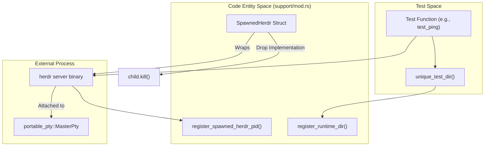
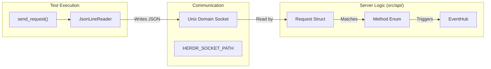

# Testing Infrastructure

Relevant source files

The following files were used as context for generating this wiki page:

- [src/api/mod.rs](https://github.com/herdrdev/herdr/blob/HEAD/src/api/mod.rs)
- [src/api/schema.rs](https://github.com/herdrdev/herdr/blob/HEAD/src/api/schema.rs)
- [src/cli.rs](https://github.com/herdrdev/herdr/blob/HEAD/src/cli.rs)
- [tests/api_ping.rs](https://github.com/herdrdev/herdr/blob/HEAD/tests/api_ping.rs)
- [tests/client_mode.rs](https://github.com/herdrdev/herdr/blob/HEAD/tests/client_mode.rs)
- [tests/cross_area.rs](https://github.com/herdrdev/herdr/blob/HEAD/tests/cross_area.rs)
- [tests/detach_reattach.rs](https://github.com/herdrdev/herdr/blob/HEAD/tests/detach_reattach.rs)
- [tests/multi_client.rs](https://github.com/herdrdev/herdr/blob/HEAD/tests/multi_client.rs)
- [tests/server_headless.rs](https://github.com/herdrdev/herdr/blob/HEAD/tests/server_headless.rs)
- [tests/support/mod.rs](https://github.com/herdrdev/herdr/blob/HEAD/tests/support/mod.rs)

Herdr's testing infrastructure is designed to verify the integrity of the client-server boundary, the JSON-RPC API, and the persistence of terminal sessions across restarts and live handoffs. The test suite combines unit tests with extensive integration tests that spawn real `herdr` binaries in isolated environments.

## Overview of the Test Suite

The test suite is located in the `tests/` directory and utilizes a custom support harness to manage the lifecycle of spawned server and client processes. Tests are generally categorized by the subsystem or flow they exercise:

*   **API Integration:** Verifies every JSON-RPC method, event subscription, and protocol versioning.
*   **Client/Server Interaction:** Tests the binary protocol between the thin client and the headless server, including rendering and input.
*   **Session Lifecycle:** Validates detaching, reattaching, and the complex "live handoff" process where PTY file descriptors are passed between processes.
*   **CLI and Headless Behavior:** Ensures the server operates correctly without a TUI and that CLI commands correctly interface with the socket API.

### Test Support Harness
The `tests/support/mod.rs` file provides the foundation for all integration tests. It manages:
*   **Process Registry:** Tracking spawned PIDs to ensure they are killed even if a test panics [tests/support/mod.rs:12-28](https://github.com/herdrdev/herdr/blob/HEAD/tests/support/mod.rs#L12-L28).
*   **Isolated Environments:** Creating unique `XDG_RUNTIME_DIR` and `XDG_CONFIG_HOME` directories for every test to prevent interference [tests/support/mod.rs:43-54](https://github.com/herdrdev/herdr/blob/HEAD/tests/support/mod.rs#L43-L54).
*   **Protocol Helpers:** Utilities for manual binary handshakes and framing messages [tests/support/mod.rs:135-140](https://github.com/herdrdev/herdr/blob/HEAD/tests/support/mod.rs#L135-L140).

Sources: [tests/support/mod.rs:1-180](https://github.com/herdrdev/herdr/blob/HEAD/tests/support/mod.rs#L1-L180), [tests/api_ping.rs:1-60](https://github.com/herdrdev/herdr/blob/HEAD/tests/api_ping.rs#L1-L60)

## Integration and API Tests

The API test suite ensures that the `herdr` server correctly implements the JSON-RPC interface defined in `src/api/schema.rs`. These tests spin up a server and connect via Unix Domain Sockets to send requests and assert on responses.

*   **Method Validation:** Every variant of the `Method` enum [src/api/schema.rs:45-201](https://github.com/herdrdev/herdr/blob/HEAD/src/api/schema.rs#L45-L201) is exercised, including workspace management, tab operations, and agent automation.
*   **Event Subscriptions:** Tests verify that clients can subscribe to the `EventHub` [src/api/mod.rs:9](https://github.com/herdrdev/herdr/blob/HEAD/src/api/mod.rs#L9) and receive asynchronous notifications like `pane.output` or `workspace.updated`.
*   **Protocol Guard:** Ensures that clients with incompatible protocol versions are rejected with a clear error message [src/cli/protocol_guard.rs:1-50](https://github.com/herdrdev/herdr/blob/HEAD/src/cli/protocol_guard.rs#L1-L50).

For details, see [Integration and API Tests](43_12.1-integration-and-api-tests.md).

Sources: [tests/api_ping.rs:215-235](https://github.com/herdrdev/herdr/blob/HEAD/tests/api_ping.rs#L215-L235), [src/api/schema.rs:33-205](https://github.com/herdrdev/herdr/blob/HEAD/src/api/schema.rs#L33-L205), [src/api/mod.rs:22-80](https://github.com/herdrdev/herdr/blob/HEAD/src/api/mod.rs#L22-L80)

## Client and Server Tests

These tests focus on the interaction between the `herdr client` and `herdr server`. Unlike API tests which use JSON, these tests often exercise the binary `bincode` protocol used for high-performance terminal synchronization.

*   **Multi-Client Behavior:** Verifies that multiple clients can attach to the same session, receive synchronized updates, and that the "foreground client" logic correctly handles input [tests/multi_client.rs:143-176](https://github.com/herdrdev/herdr/blob/HEAD/tests/multi_client.rs#L143-L176).
*   **Live Handoff:** A critical test suite that verifies the `server.live_handoff` method. It ensures that PTY file descriptors are successfully passed from an old server process to a new one using `SCM_RIGHTS` [src/server/handoff.rs:171-188](https://github.com/herdrdev/herdr/blob/HEAD/src/server/handoff.rs#L171-L188), resulting in zero-downtime updates for running shell processes.
*   **Headless Mode:** Confirms the server can maintain state and PTY processes even when no clients are attached [tests/server_headless.rs:99-140](https://github.com/herdrdev/herdr/blob/HEAD/tests/server_headless.rs#L99-L140).

For details, see [Client and Server Tests](44_12.2-client-and-server-tests.md).

Sources: [tests/client_mode.rs:79-112](https://github.com/herdrdev/herdr/blob/HEAD/tests/client_mode.rs#L79-L112), [tests/live_handoff.rs:50-96](https://github.com/herdrdev/herdr/blob/HEAD/tests/live_handoff.rs#L50-L96), [src/server/handoff.rs:32-49](https://github.com/herdrdev/herdr/blob/HEAD/src/server/handoff.rs#L32-L49)

## Testing Architecture

The following diagrams illustrate how the test infrastructure bridges natural language concepts (like "spawning a server") to the specific code entities involved.

### Server Spawn and Lifecycle
This diagram shows how a test initiates a herdr environment using the support harness.

Sources: [tests/api_ping.rs:25-50](https://github.com/herdrdev/herdr/blob/HEAD/tests/api_ping.rs#L25-L50), [tests/support/mod.rs:20-54](https://github.com/herdrdev/herdr/blob/HEAD/tests/support/mod.rs#L20-L54)

### API Request Flow in Tests
This diagram tracks a JSON-RPC request from a test file through the socket to the server's schema handling.

Sources: [tests/api_ping.rs:162-213](https://github.com/herdrdev/herdr/blob/HEAD/tests/api_ping.rs#L162-L213), [src/api/schema.rs:33-45](https://github.com/herdrdev/herdr/blob/HEAD/src/api/schema.rs#L33-L45), [src/api/mod.rs:82-93](https://github.com/herdrdev/herdr/blob/HEAD/src/api/mod.rs#L82-L93)

## Test Fixtures

Herdr uses JSON fixtures to test session restoration and compatibility with older versions. These are located in `tests/fixtures/session/`.

| Fixture Name | Purpose |
| :--- | :--- |
| `current-herdr-session.json` | Validates the current schema for `SessionSnapshot`. |
| `legacy-pre-tabs-v2.json` | Ensures backward compatibility for sessions created before the Tab V2 refactor. |
| `config.toml` | Standardized test configuration to disable onboarding and sound [tests/api_ping.rs:126-130](https://github.com/herdrdev/herdr/blob/HEAD/tests/api_ping.rs#L126-L130).

Sources: [tests/api_ping.rs:126-130](https://github.com/herdrdev/herdr/blob/HEAD/tests/api_ping.rs#L126-L130), [src/server/handoff.rs:40-42](https://github.com/herdrdev/herdr/blob/HEAD/src/server/handoff.rs#L40-L42)