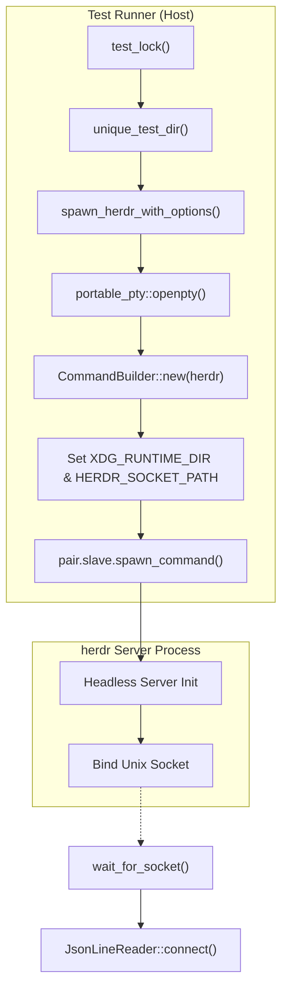
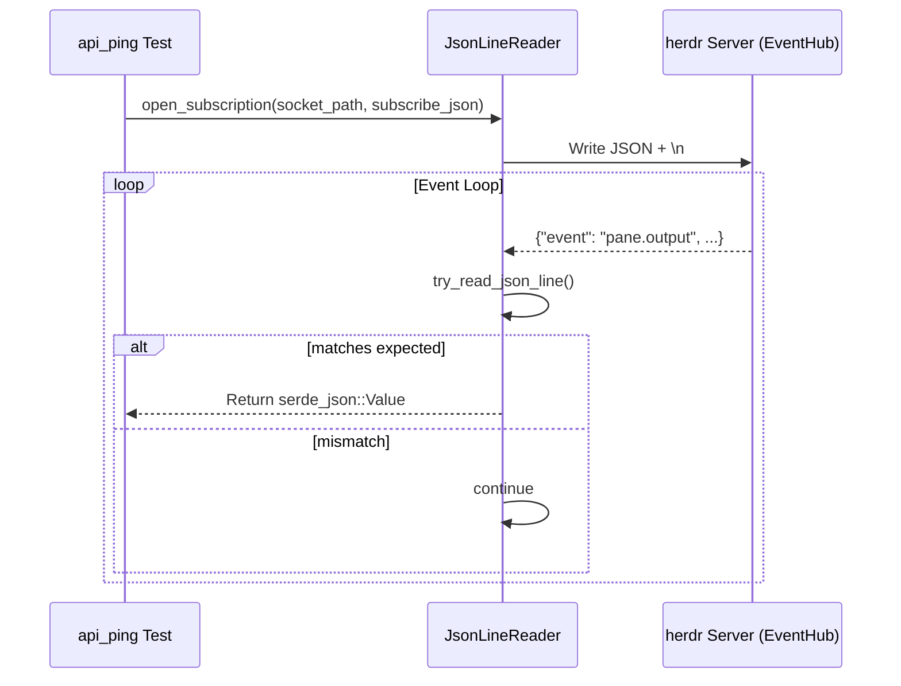
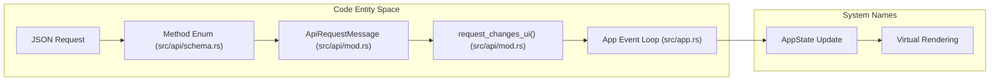

# Integration and API Tests

Relevant source files

The following files were used as context for generating this wiki page:

- [docs/next/website/src/content/docs/agent-automation.mdx](https://github.com/herdrdev/herdr/blob/HEAD/docs/next/website/src/content/docs/agent-automation.mdx)
- [docs/next/website/src/content/docs/ja/agent-automation.mdx](https://github.com/herdrdev/herdr/blob/HEAD/docs/next/website/src/content/docs/ja/agent-automation.mdx)
- [docs/next/website/src/content/docs/zh-cn/agent-automation.mdx](https://github.com/herdrdev/herdr/blob/HEAD/docs/next/website/src/content/docs/zh-cn/agent-automation.mdx)
- [src/api/mod.rs](https://github.com/herdrdev/herdr/blob/HEAD/src/api/mod.rs)
- [src/api/schema.rs](https://github.com/herdrdev/herdr/blob/HEAD/src/api/schema.rs)
- [src/api/schema/events.rs](https://github.com/herdrdev/herdr/blob/HEAD/src/api/schema/events.rs)
- [src/api/schema/tests.rs](https://github.com/herdrdev/herdr/blob/HEAD/src/api/schema/tests.rs)
- [src/api/subscriptions.rs](https://github.com/herdrdev/herdr/blob/HEAD/src/api/subscriptions.rs)
- [src/api/wait.rs](https://github.com/herdrdev/herdr/blob/HEAD/src/api/wait.rs)
- [src/app/api/plugins/context.rs](https://github.com/herdrdev/herdr/blob/HEAD/src/app/api/plugins/context.rs)
- [src/cli.rs](https://github.com/herdrdev/herdr/blob/HEAD/src/cli.rs)
- [tests/api_ping.rs](https://github.com/herdrdev/herdr/blob/HEAD/tests/api_ping.rs)
- [tests/cli/sessions.rs](https://github.com/herdrdev/herdr/blob/HEAD/tests/cli/sessions.rs)

The `api_ping` test suite serves as the primary integration layer for verifying the `herdr` server's JSON-RPC interface. Unlike unit tests, these tests exercise the full system lifecycle: spawning a real server process, establishing Unix domain socket connections, and performing end-to-end request/response validation across the entire `Method` schema.

## Test Harness Architecture

The integration suite utilizes a custom harness defined in `tests/api_ping.rs` to manage the lifecycle of the `herdr` binary during testing. It ensures that each test runs in an isolated environment with its own temporary `XDG_CONFIG_HOME` and `XDG_RUNTIME_DIR`.

### Key Components

| Component | Code Entity | Responsibility |
| :--- | :--- | :--- |
| **Server Process** | `SpawnedHerdr` | Manages the `portable_pty` child process, ensuring the server is killed and reaped on test completion [tests/api_ping.rs:25-50](https://github.com/herdrdev/herdr/blob/HEAD/tests/api_ping.rs#L25-L50). |
| **IPC Reader** | `JsonLineReader` | A stateful wrapper around `UnixStream` that handles line-buffered JSON parsing and non-blocking reads with timeouts [tests/api_ping.rs:162-213](https://github.com/herdrdev/herdr/blob/HEAD/tests/api_ping.rs#L162-L213). |
| **Test Isolation** | `unique_test_dir` | Generates a unique path in `/tmp` using the process ID and current nanoseconds to prevent socket collisions [tests/api_ping.rs:17-23](https://github.com/herdrdev/herdr/blob/HEAD/tests/api_ping.rs#L17-L23). |
| **Global Lock** | `test_lock` | A static `Mutex` used to prevent concurrent execution of tests that might conflict on shared resources [tests/api_ping.rs:57-62](https://github.com/herdrdev/herdr/blob/HEAD/tests/api_ping.rs#L57-L62). |

### Server Spawning Flow
The harness uses the `CARGO_BIN_EXE_herdr` environment variable to locate the compiled binary and starts it in `server` mode.

**Sources:** [tests/api_ping.rs:87-160](https://github.com/herdrdev/herdr/blob/HEAD/tests/api_ping.rs#L87-L160), [tests/api_ping.rs:64-73](https://github.com/herdrdev/herdr/blob/HEAD/tests/api_ping.rs#L64-L73)

## API Protocol Verification

The test suite exercises the `Method` enum defined in `src/api/schema.rs`. This ensures that every variant can be serialized, transmitted, and handled by the server.

### Request/Response Lifecycle
1. **Connection**: A `UnixStream` connects to the path specified by `HERDR_SOCKET_PATH` [tests/api_ping.rs:168-173](https://github.com/herdrdev/herdr/blob/HEAD/tests/api_ping.rs#L168-L173).
2. **Transmission**: The `JsonLineReader` sends a JSON string followed by a newline [tests/api_ping.rs:175-180](https://github.com/herdrdev/herdr/blob/HEAD/tests/api_ping.rs#L175-L180).
3. **Validation**: The test waits for a response and verifies the `id` matches the request and the `result` or `error` fields are present [tests/api_ping.rs:215-219](https://github.com/herdrdev/herdr/blob/HEAD/tests/api_ping.rs#L215-L219).

### Protocol Guard Behavior
The `herdr` CLI and server implement a protocol guard to ensure compatibility between different versions of the binary. The integration tests verify that:
- Clients with matching versions can communicate.
- The `ping` method returns valid server metadata, including version and capabilities.

**Sources:** [src/api/schema.rs:45-202](https://github.com/herdrdev/herdr/blob/HEAD/src/api/schema.rs#L45-L202), [src/cli.rs:18-19](https://github.com/herdrdev/herdr/blob/HEAD/src/cli.rs#L18-L19)

## Event Subscriptions and Hubs

Testing asynchronous events (e.g., agent state changes or workspace updates) requires a subscription model. The `EventHub` in the server broadcasts these to connected clients.

### Event Verification Logic
The test suite uses `wait_for_event` to filter the stream of JSON messages for specific event types.

**Sources:** [tests/api_ping.rs:221-226](https://github.com/herdrdev/herdr/blob/HEAD/tests/api_ping.rs#L221-L226), [src/api/event_hub.rs:9-11](https://github.com/herdrdev/herdr/blob/HEAD/src/api/event_hub.rs#L9-L11)

## Integration Coverage

The suite specifically targets high-risk areas where client/server synchronization is critical:

1. **Workspace/Tab Management**: Creating, focusing, and closing entities via `WorkspaceCreate` and `TabFocus` [src/api/schema.rs:66-105](https://github.com/herdrdev/herdr/blob/HEAD/src/api/schema.rs#L66-L105).
2. **Agent Automation**: Testing the `agent.start`, `agent.prompt`, and `agent.wait` methods which orchestrate complex PTY interactions [src/api/schema.rs:124-129](https://github.com/herdrdev/herdr/blob/HEAD/src/api/schema.rs#L124-L129), [src/api/wait.rs:132-175](https://github.com/herdrdev/herdr/blob/HEAD/src/api/wait.rs#L132-L175), [src/api/wait.rs:177-194](https://github.com/herdrdev/herdr/blob/HEAD/src/api/wait.rs#L177-L194). These methods are crucial for scripting agent workflows, as detailed in the agent automation documentation [docs/next/website/src/content/docs/agent-automation.mdx:67-70](https://github.com/herdrdev/herdr/blob/HEAD/docs/next/website/src/content/docs/agent-automation.mdx#L67-L70).
3. **Pane Manipulation**: Splitting panes (`PaneSplit`), resizing, and moving focus between them [src/api/schema.rs:130-155](https://github.com/herdrdev/herdr/blob/HEAD/src/api/schema.rs#L130-L155).
4. **Integration Hooks**: Verifying that `pane.report_agent` correctly updates the internal state used by the UI [src/api/schema.rs:192-195](https://github.com/herdrdev/herdr/blob/HEAD/src/api/schema.rs#L192-L195).

### Data Flow: API Request to State Update
The following diagram bridges the JSON-RPC request to the internal `herdr` state changes.

**Sources:** [src/api/mod.rs:22-80](https://github.com/herdrdev/herdr/blob/HEAD/src/api/mod.rs#L22-L80), [src/api/mod.rs:82-86](https://github.com/herdrdev/herdr/blob/HEAD/src/api/mod.rs#L82-L86)