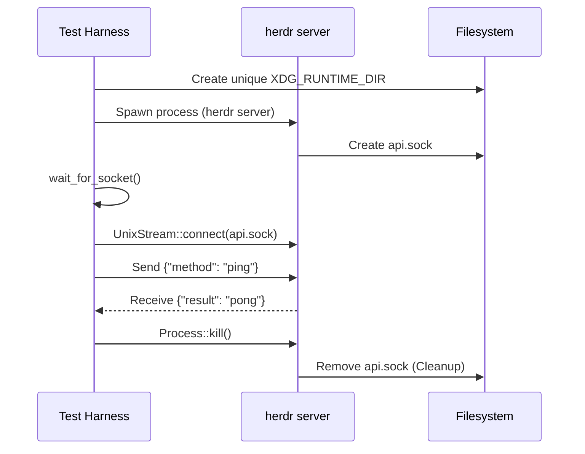
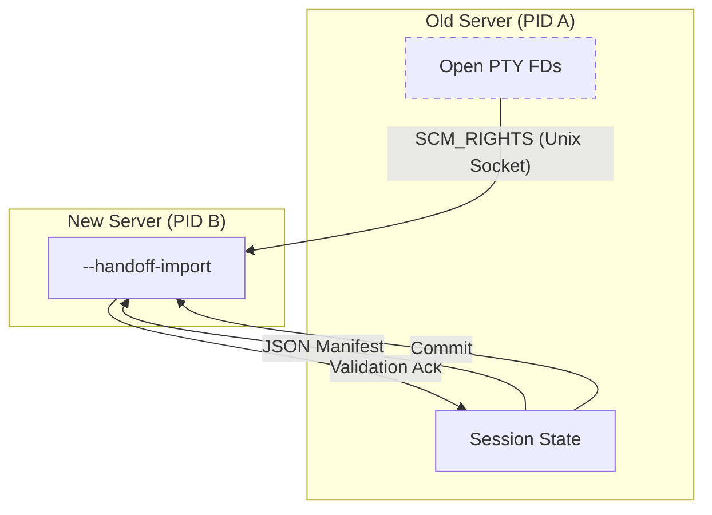
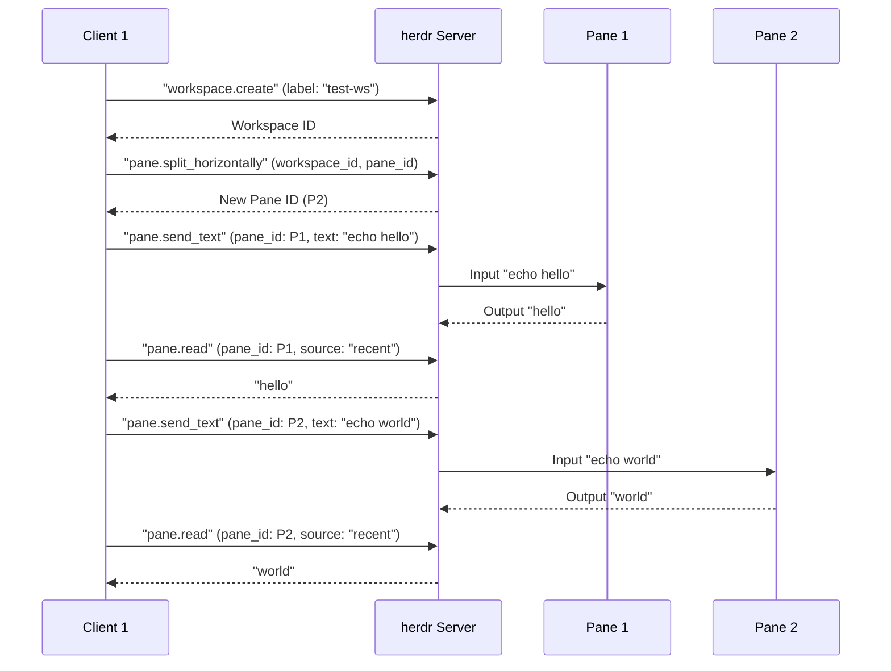

# Client and Server Tests

Relevant source files

The following files were used as context for generating this wiki page:

- [src/app/api/agents.rs](https://github.com/herdrdev/herdr/blob/HEAD/src/app/api/agents.rs)
- [src/app/api_helpers.rs](https://github.com/herdrdev/herdr/blob/HEAD/src/app/api_helpers.rs)
- [src/cli/agent.rs](https://github.com/herdrdev/herdr/blob/HEAD/src/cli/agent.rs)
- [src/cli/server_not_running.rs](https://github.com/herdrdev/herdr/blob/HEAD/src/cli/server_not_running.rs)
- [src/cli/status.rs](https://github.com/herdrdev/herdr/blob/HEAD/src/cli/status.rs)
- [src/pane/terminal/windows_recent_fallback.rs](https://github.com/herdrdev/herdr/blob/HEAD/src/pane/terminal/windows_recent_fallback.rs)
- [src/server/handoff.rs](https://github.com/herdrdev/herdr/blob/HEAD/src/server/handoff.rs)
- [tests/cli/agents.rs](https://github.com/herdrdev/herdr/blob/HEAD/tests/cli/agents.rs)
- [tests/client_mode.rs](https://github.com/herdrdev/herdr/blob/HEAD/tests/client_mode.rs)
- [tests/cross_area.rs](https://github.com/herdrdev/herdr/blob/HEAD/tests/cross_area.rs)
- [tests/detach_reattach.rs](https://github.com/herdrdev/herdr/blob/HEAD/tests/detach_reattach.rs)
- [tests/fixtures/session/current-herdr-dev-session.json](https://github.com/herdrdev/herdr/blob/HEAD/tests/fixtures/session/current-herdr-dev-session.json)
- [tests/fixtures/session/current-herdr-session.json](https://github.com/herdrdev/herdr/blob/HEAD/tests/fixtures/session/current-herdr-session.json)
- [tests/fixtures/session/legacy-pre-tabs-v2.json](https://github.com/herdrdev/herdr/blob/HEAD/tests/fixtures/session/legacy-pre-tabs-v2.json)
- [tests/live_handoff.rs](https://github.com/herdrdev/herdr/blob/HEAD/tests/live_handoff.rs)
- [tests/multi_client.rs](https://github.com/herdrdev/herdr/blob/HEAD/tests/multi_client.rs)
- [tests/server_headless.rs](https://github.com/herdrdev/herdr/blob/HEAD/tests/server_headless.rs)
- [tests/support/mod.rs](https://github.com/herdrdev/herdr/blob/HEAD/tests/support/mod.rs)

This section details the integration testing infrastructure used to verify the `herdr` client/server protocol, multi-client synchronization, session persistence, and zero-downtime live handoffs. These tests exercise the full binary by spawning real server and client processes, often within virtual PTYs, to simulate realistic terminal environments.

## Shared Test Support Module

The `support` module ([tests/support/mod.rs](https://github.com/herdrdev/herdr/blob/HEAD/tests/support/mod.rs)) provides the fundamental primitives for interacting with the `herdr` binary in a test environment. It manages process lifecycles, socket communication, and manual protocol handshaking.

### Process and Directory Management
To ensure test isolation and prevent resource leaks, the support module implements a global registry for PIDs and runtime directories.

*   **PID Registry**: Tracks spawned `herdr` processes to ensure they are killed even if a test panics [tests/support/mod.rs:20-41](https://github.com/herdrdev/herdr/blob/HEAD/tests/support/mod.rs#L20-L41).
*   **Runtime Isolation**: Each test generates a `unique_test_dir` [tests/client_mode.rs:22-31](https://github.com/herdrdev/herdr/blob/HEAD/tests/client_mode.rs#L22-L31) and registers it. A `CleanupGuard` (via `ensure_cleanup_hooks`) handles recursive deletion of these directories and termination of associated servers [tests/support/mod.rs:43-87](https://github.com/herdrdev/herdr/blob/HEAD/tests/support/mod.rs#L43-L87).

### Protocol Utilities
Since integration tests often act as a "dummy client," the support module implements the low-level `bincode` v2 framing and varint encoding required by the `herdr` protocol [tests/support/mod.rs:111-221](https://github.com/herdrdev/herdr/blob/HEAD/tests/support/mod.rs#L111-L221).

*   `client_handshake`: Performs the initial `Hello` -> `Welcome` exchange, verifying protocol versions [tests/support/mod.rs:223-270](https://github.com/herdrdev/herdr/blob/HEAD/tests/support/mod.rs#L223-L270).
*   `frame_message`: Prepends a 4-byte little-endian length to payloads [tests/support/mod.rs:135-140](https://github.com/herdrdev/herdr/blob/HEAD/tests/support/mod.rs#L135-L140).
*   `read_server_message`: Reads and decodes framed messages from the Unix socket [tests/support/mod.rs:334-358](https://github.com/herdrdev/herdr/blob/HEAD/tests/support/mod.rs#L334-L358).

Sources: [tests/support/mod.rs:1-358](https://github.com/herdrdev/herdr/blob/HEAD/tests/support/mod.rs#L1-L358), [tests/client_mode.rs:22-31](https://github.com/herdrdev/herdr/blob/HEAD/tests/client_mode.rs#L22-L31)

## Headless Server Tests

The headless server tests verify that `herdr server` can operate without a local TUI, correctly managing its Unix Domain Socket (UDS) and responding to JSON-RPC requests.

### Server Lifecycle Flow
The diagram below illustrates how the test harness validates a headless server instance.

**Key Verification Points:**
*   **Socket Creation**: Ensures the server correctly respects `HERDR_SOCKET_PATH` or defaults to the runtime directory [tests/server_headless.rs:127-128](https://github.com/herdrdev/herdr/blob/HEAD/tests/server_headless.rs#L127-L128).
*   **API Responsiveness**: Validates the JSON-RPC interface using `ping_socket` [tests/server_headless.rs:142-152](https://github.com/herdrdev/herdr/blob/HEAD/tests/server_headless.rs#L142-L152).
*   **Binary Compatibility**: Uses `CURRENT_PROTOCOL` to ensure the test harness matches the server's expected version [tests/server_headless.rs:17-18](https://github.com/herdrdev/herdr/blob/HEAD/tests/server_headless.rs#L17-L18).

Sources: [tests/server_headless.rs:1-204](https://github.com/herdrdev/herdr/blob/HEAD/tests/server_headless.rs#L1-L204), [tests/support/mod.rs:89-98](https://github.com/herdrdev/herdr/blob/HEAD/tests/support/mod.rs#L89-L98)

## Multi-Client and Detach/Reattach Tests

These tests verify the core value proposition of `herdr`: persistent sessions that survive client disconnection and support multiple simultaneous observers.

### Multi-Client Synchronization
The `multi_client.rs` suite ensures that actions taken by one client are reflected across all others.
*   **Attach/Detach**: Spawns multiple clients and verifies the server's log for "Client attached" and "Client detached" events [tests/multi_client.rs:187-222](https://github.com/herdrdev/herdr/blob/HEAD/tests/multi_client.rs#L187-L222).
*   **State Consistency**: Verifies that creating a workspace in Client A results in that workspace appearing in Client B's `workspace.list` [tests/multi_client.rs:238-260](https://github.com/herdrdev/herdr/blob/HEAD/tests/multi_client.rs#L238-L260).

### Detach and Reattach Workflow
The `detach_reattach.rs` suite focuses on PTY persistence.

1.  **Spawn Server**: Starts a server and attaches a client.
2.  **Trigger Work**: Sends text to a pane (e.g., `echo "persistence-test"`) [tests/detach_reattach.rs:178-186](https://github.com/herdrdev/herdr/blob/HEAD/tests/detach_reattach.rs#L178-L186).
3.  **Detach**: Sends a `ClientMessage::Detach` and waits for the client process to exit [tests/detach_reattach.rs:16-20](https://github.com/herdrdev/herdr/blob/HEAD/tests/detach_reattach.rs#L16-L20).
4.  **Reattach**: Spawns a new client and uses `pane.read` to verify the output from the previous session is still present in the screen buffer [tests/detach_reattach.rs:162-176](https://github.com/herdrdev/herdr/blob/HEAD/tests/detach_reattach.rs#L162-L176).

Sources: [tests/multi_client.rs:1-260](https://github.com/herdrdev/herdr/blob/HEAD/tests/multi_client.rs#L1-L260), [tests/detach_reattach.rs:1-223](https://github.com/herdrdev/herdr/blob/HEAD/tests/detach_reattach.rs#L1-L223)

## Live Handoff Tests

Live handoff is the most complex subsystem, involving the transfer of open file descriptors (PTYs) between two running server processes via `SCM_RIGHTS`.

### Handoff Execution Logic
The `live_handoff.rs` suite simulates a server upgrade or restart where the old process hands off state to a new process.

**Key Functions Tested:**
*   **`spawn_handoff_import`**: Spawns the successor process with the `--handoff-import` flag [src/server/handoff.rs:57-100](https://github.com/herdrdev/herdr/blob/HEAD/src/server/handoff.rs#L57-L100).
*   **`send_fds_and_wait_restored`**: Transfers the PTY file descriptors across the Unix socket [src/server/handoff.rs:171-188](https://github.com/herdrdev/herdr/blob/HEAD/src/server/handoff.rs#L171-L188).
*   **Ownership Transfer**: Verifies the `wait_owned_ack` cycle to ensure the old server does not exit until the new server has successfully re-polled the PTYs [src/server/handoff.rs:207-222](https://github.com/herdrdev/herdr/blob/HEAD/src/server/handoff.rs#L207-L222).

Sources: [tests/live_handoff.rs:1-233](https://github.com/herdrdev/herdr/blob/HEAD/tests/live_handoff.rs#L1-L233), [src/server/handoff.rs:1-222](https://github.com/herdrdev/herdr/blob/HEAD/src/server/handoff.rs#L1-L222)

## Cross-Area Navigation Tests

`cross_area.rs` validates interactions between different subsystems, specifically focusing on how CLI commands affect the internal state of a running server.

### Pane Navigation and State Persistence
These tests ensure that pane-related operations, such as creating new panes or sending input, correctly update the server's state and are reflected in subsequent API calls.

*   **Workspace Persistence**: Creates workspaces via the API and verifies they persist after a server restart by checking the `session.json` rehydration [tests/cross_area.rs:194-223](https://github.com/herdrdev/herdr/blob/HEAD/tests/cross_area.rs#L194-L223).
*   **Path/Environment Propagation**: Ensures that the `PATH` and other environment variables provided to the server are correctly inherited by new panes spawned within that server [tests/cross_area.rs:93-137](https://github.com/herdrdev/herdr/blob/HEAD/tests/cross_area.rs#L93-L137).
*   **Pane Read Operations**: Tests the `pane.read` API method with various `ReadSource` and `ReadFormat` options, including `Recent` and `RecentUnwrapped` [src/app/api_helpers.rs:112-143](https://github.com/herdrdev/herdr/blob/HEAD/src/app/api_helpers.rs#L112-L143). This ensures that the terminal's scrollback buffer and visible content can be accurately retrieved. The `windows_recent_fallback.rs` module provides the underlying logic for caching and retrieving recent terminal output, especially for scenarios where direct scrollback access might be limited [src/pane/terminal/windows_recent_fallback.rs:1-207](https://github.com/herdrdev/herdr/blob/HEAD/src/pane/terminal/windows_recent_fallback.rs#L1-L207).

Sources: [tests/cross_area.rs:1-223](https://github.com/herdrdev/herdr/blob/HEAD/tests/cross_area.rs#L1-L223), [src/app/api_helpers.rs:112-143](https://github.com/herdrdev/herdr/blob/HEAD/src/app/api_helpers.rs#L112-L143), [src/pane/terminal/windows_recent_fallback.rs:1-207](https://github.com/herdrdev/herdr/blob/HEAD/src/pane/terminal/windows_recent_fallback.rs#L1-L207)