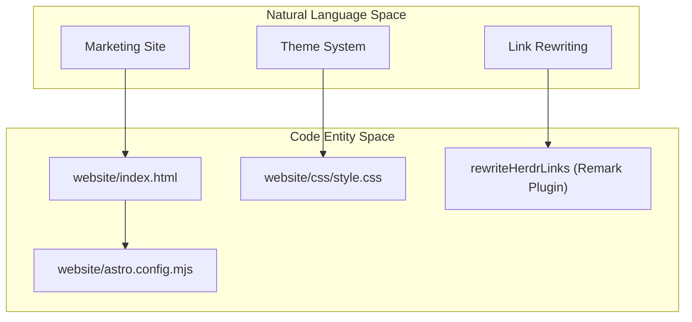
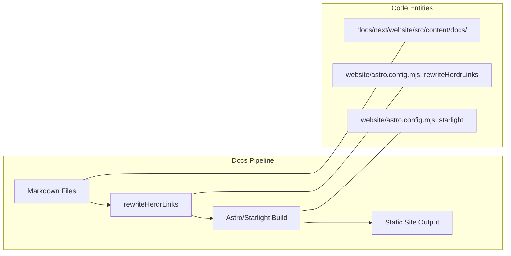

# Website and Documentation

Relevant source files

The following files were used as context for generating this wiki page:

- [.agents/skills/herdr-pre-release-audit/references/pre-release-audit.md](https://github.com/herdrdev/herdr/blob/HEAD/.agents/skills/herdr-pre-release-audit/references/pre-release-audit.md)
- [.github/workflows/website.yml](https://github.com/herdrdev/herdr/blob/HEAD/.github/workflows/website.yml)
- [docs/versions/README.md](https://github.com/herdrdev/herdr/blob/HEAD/docs/versions/README.md)
- [website/README.md](https://github.com/herdrdev/herdr/blob/HEAD/website/README.md)
- [website/astro.config.mjs](https://github.com/herdrdev/herdr/blob/HEAD/website/astro.config.mjs)
- [website/css/style.css](https://github.com/herdrdev/herdr/blob/HEAD/website/css/style.css)
- [website/index.html](https://github.com/herdrdev/herdr/blob/HEAD/website/index.html)
- [website/scripts/check-built-docs.mjs](https://github.com/herdrdev/herdr/blob/HEAD/website/scripts/check-built-docs.mjs)
- [website/scripts/docs-snapshot.mjs](https://github.com/herdrdev/herdr/blob/HEAD/website/scripts/docs-snapshot.mjs)
- [website/scripts/docs-versions.integration.test.ts](https://github.com/herdrdev/herdr/blob/HEAD/website/scripts/docs-versions.integration.test.ts)
- [website/scripts/docs-versions.mjs](https://github.com/herdrdev/herdr/blob/HEAD/website/scripts/docs-versions.mjs)
- [website/src/components/MarketingLayout.astro](https://github.com/herdrdev/herdr/blob/HEAD/website/src/components/MarketingLayout.astro)
- [website/src/pages/compare.astro](https://github.com/herdrdev/herdr/blob/HEAD/website/src/pages/compare.astro)

The `herdr` project maintains a public presence through a marketing website and a comprehensive documentation system, both hosted at [herdr.dev](https://herdr.dev). The infrastructure is built on **Astro** and **Starlight**, providing a terminal-native aesthetic that mirrors the application's TUI.

## Marketing Website

The marketing site serves as the landing page and feature showcase for `herdr`. It is built using **Astro** and custom CSS to simulate a terminal user interface (TUI) environment directly in the browser.

### Key Features
*   **TUI Simulation:** The site uses a custom CSS framework to replicate the look and feel of the `herdr` application, including simulated panes, status dots, and agent state labels [website/index.html:96-119](https://github.com/herdrdev/herdr/blob/HEAD/website/index.html#L96-L119).
*   **Theme Switcher:** A client-side theme switcher allows users to preview `herdr` palettes (e.g., Catppuccin, Tokyo Night, Gruvbox) by updating the `data-palette` attribute on the document root [website/index.html:70-90](https://github.com/herdrdev/herdr/blob/HEAD/website/index.html#L70-L90), [website/css/style.css:55-145](https://github.com/herdrdev/herdr/blob/HEAD/website/css/style.css#L55-L145).
*   **Comparison Matrix:** A dedicated page compares `herdr` against other multiplexers and agent terminals like `tmux`, `Zellij`, and `Warp` [website/src/pages/compare.astro:30-121](https://github.com/herdrdev/herdr/blob/HEAD/website/src/pages/compare.astro#L30-L121).
*   **Live Stats Dashboard:** The site displays real-time data, including GitHub star counts in the navigation bar [website/index.html:107](https://github.com/herdrdev/herdr/blob/HEAD/website/index.html#L107). The `/stats` page, which previously displayed usage metrics, has been redirected to the homepage [website/astro.config.mjs:60](https://github.com/herdrdev/herdr/blob/HEAD/website/astro.config.mjs#L60).

For implementation details on the marketing site, see [Marketing Website](46_13.1-marketing-website.md).

### Website Structure

Sources: [website/index.html:1-121](https://github.com/herdrdev/herdr/blob/HEAD/website/index.html#L1-L121), [website/css/style.css:1-145](https://github.com/herdrdev/herdr/blob/HEAD/website/css/style.css#L1-L145), [website/astro.config.mjs:8-44](https://github.com/herdrdev/herdr/blob/HEAD/website/astro.config.mjs#L8-L44)

---

## Documentation System

The documentation is powered by **Starlight**, an Astro-based documentation framework. It is designed to be versioned, localized, and easily maintainable through Markdown/MDX files.

### Key Features
*   **Starlight Integration:** Provides the core documentation structure, search, and sidebar navigation [website/astro.config.mjs:70-94](https://github.com/herdrdev/herdr/blob/HEAD/website/astro.config.mjs#L70-L94).
*   **Localization:** Supports English (root), Japanese (`ja`), and Simplified Chinese (`zh-cn`) with automatic browser language detection and redirection [website/astro.config.mjs:76-79](https://github.com/herdrdev/herdr/blob/HEAD/website/astro.config.mjs#L76-L79), [website/astro.config.mjs:115-139](https://github.com/herdrdev/herdr/blob/HEAD/website/astro.config.mjs#L115-L139).
*   **Remark Link Rewriting:** A custom plugin, `rewriteHerdrLinks`, automatically maps internal repository Markdown links (like `README.md`) to their corresponding web documentation URLs (like `/docs/`) and routes code references to the GitHub blob view [website/astro.config.mjs:8-44](https://github.com/herdrdev/herdr/blob/HEAD/website/astro.config.mjs#L8-L44).
*   **Version Management:** The system handles multiple versions of documentation, including `preview` and specific release tags, ensuring users can access docs relevant to their installed binary version [website/README.md:16-20](https://github.com/herdrdev/herdr/blob/HEAD/website/README.md#L16-L20). The `docs/versions/manifest.json` file tracks the current stable version and available archived versions [website/scripts/docs-versions.mjs:18-19](https://github.com/herdrdev/herdr/blob/HEAD/website/scripts/docs-versions.mjs#L18-L19).

For details on the documentation build and versioning, see [Documentation Pipeline](47_13.2-documentation-pipeline.md).

### Documentation Architecture
| Component | Role | Code Entity |
| :--- | :--- | :--- |
| **Content Store** | Source MDX files for docs | `website/src/content/docs/` |
| **Config** | Starlight and i18n setup | [website/astro.config.mjs:52-183](https://github.com/herdrdev/herdr/blob/HEAD/website/astro.config.mjs#L52-L183) |
| **Link Plugin** | Repository to URL mapping | [website/astro.config.mjs:8-44](https://github.com/herdrdev/herdr/blob/HEAD/website/astro.config.mjs#L8-L44) |
| **Redirects** | Locale and version routing | [website/astro.config.mjs:54-61](https://github.com/herdrdev/herdr/blob/HEAD/website/astro.config.mjs#L54-L61) |

Sources: [website/astro.config.mjs:1-51](https://github.com/herdrdev/herdr/blob/HEAD/website/astro.config.mjs#L1-L51), [website/README.md:16-20](https://github.com/herdrdev/herdr/blob/HEAD/website/README.md#L16-L20), [website/scripts/docs-versions.mjs:18-19](https://github.com/herdrdev/herdr/blob/HEAD/website/scripts/docs-versions.mjs#L18-L19)