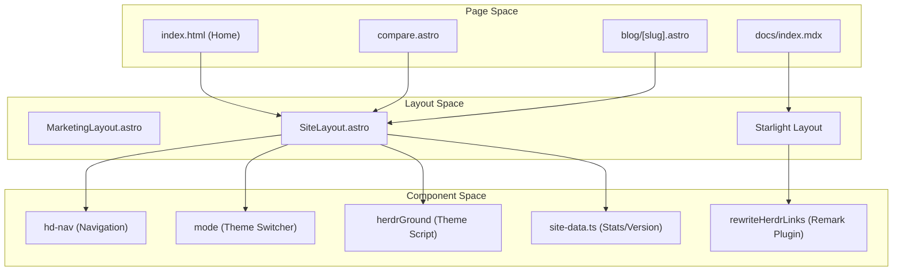
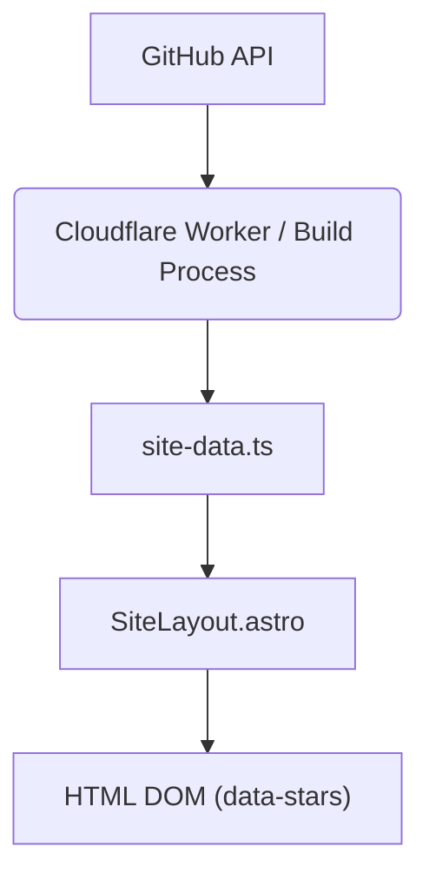

# Marketing Website

Relevant source files

The following files were used as context for generating this wiki page:

- [website/.gitignore](https://github.com/herdrdev/herdr/blob/HEAD/website/.gitignore)
- [website/assets/og-blog-yc-v1.png](https://github.com/herdrdev/herdr/blob/HEAD/website/assets/og-blog-yc-v1.png)
- [website/assets/where-do-agents-run-while-you-sleep.png](https://github.com/herdrdev/herdr/blob/HEAD/website/assets/where-do-agents-run-while-you-sleep.png)
- [website/assets/yc-logo.svg](https://github.com/herdrdev/herdr/blob/HEAD/website/assets/yc-logo.svg)
- [website/astro.config.mjs](https://github.com/herdrdev/herdr/blob/HEAD/website/astro.config.mjs)
- [website/css/site.css](https://github.com/herdrdev/herdr/blob/HEAD/website/css/site.css)
- [website/css/style.css](https://github.com/herdrdev/herdr/blob/HEAD/website/css/style.css)
- [website/index.html](https://github.com/herdrdev/herdr/blob/HEAD/website/index.html)
- [website/package.json](https://github.com/herdrdev/herdr/blob/HEAD/website/package.json)
- [website/src/components/Head.astro](https://github.com/herdrdev/herdr/blob/HEAD/website/src/components/Head.astro)
- [website/src/components/MarketingLayout.astro](https://github.com/herdrdev/herdr/blob/HEAD/website/src/components/MarketingLayout.astro)
- [website/src/components/Search.astro](https://github.com/herdrdev/herdr/blob/HEAD/website/src/components/Search.astro)
- [website/src/components/Sidebar.astro](https://github.com/herdrdev/herdr/blob/HEAD/website/src/components/Sidebar.astro)
- [website/src/components/SiteLayout.astro](https://github.com/herdrdev/herdr/blob/HEAD/website/src/components/SiteLayout.astro)
- [website/src/components/SiteTitle.astro](https://github.com/herdrdev/herdr/blob/HEAD/website/src/components/SiteTitle.astro)
- [website/src/content/blog/herdr-is-joining-y-combinator.md](https://github.com/herdrdev/herdr/blob/HEAD/website/src/content/blog/herdr-is-joining-y-combinator.md)
- [website/src/docs-path.test.ts](https://github.com/herdrdev/herdr/blob/HEAD/website/src/docs-path.test.ts)
- [website/src/docs-path.ts](https://github.com/herdrdev/herdr/blob/HEAD/website/src/docs-path.ts)
- [website/src/pages/compare.astro](https://github.com/herdrdev/herdr/blob/HEAD/website/src/pages/compare.astro)
- [website/src/pages/og/card-yc.html](https://github.com/herdrdev/herdr/blob/HEAD/website/src/pages/og/card-yc.html)
- [website/src/styles/starlight.css](https://github.com/herdrdev/herdr/blob/HEAD/website/src/styles/starlight.css)

The herdr marketing website (`herdr.dev`) is a high-performance static site built with **Astro** and **Starlight**. It serves as the primary acquisition channel, documentation hub, and live status dashboard for the herdr ecosystem [website/astro.config.mjs:52-53](https://github.com/herdrdev/herdr/blob/HEAD/website/astro.config.mjs#L52-L53).

## System Architecture and Data Flow

The website combines static generation for content (blog, docs, landing pages) with client-side hydration for dynamic data like GitHub stars and usage statistics [website/index.html:107-107](https://github.com/herdrdev/herdr/blob/HEAD/website/index.html#L107), [website/src/components/SiteLayout.astro:111-111](https://github.com/herdrdev/herdr/blob/HEAD/website/src/components/SiteLayout.astro#L111).

### Website Component Hierarchy
The following diagram maps the high-level site structure to the Astro components and layouts that define them.

**Site Component Mapping**

**Sources:** [website/src/components/MarketingLayout.astro:1-115](https://github.com/herdrdev/herdr/blob/HEAD/website/src/components/MarketingLayout.astro#L1-L115), [website/src/pages/compare.astro:50-100](https://github.com/herdrdev/herdr/blob/HEAD/website/src/pages/compare.astro#L50-L100), [website/src/content/docs/index.mdx:1-5](https://github.com/herdrdev/herdr/blob/HEAD/website/src/content/docs/index.mdx#L1-L5), [website/index.html:98-120](https://github.com/herdrdev/herdr/blob/HEAD/website/index.html#L98-L120), [website/index.html:70-90](https://github.com/herdrdev/herdr/blob/HEAD/website/index.html#L70-L90), [website/src/components/SiteLayout.astro:23-33](https://github.com/herdrdev/herdr/blob/HEAD/website/src/components/SiteLayout.astro#L23-L33), [website/astro.config.mjs:8-44](https://github.com/herdrdev/herdr/blob/HEAD/website/astro.config.mjs#L8-L44)

## Key Features

### 1. CSS TUI Simulation
The landing page and compare pages utilize a sophisticated CSS-based terminal simulation to demonstrate herdr's interface without requiring a live backend.
*   **Theme Engine:** The site supports multiple terminal palettes (e.g., Catppuccin, Tokyo Night, Nord) defined in `style.css` [website/css/style.css:55-150](https://github.com/herdrdev/herdr/blob/HEAD/website/css/style.css#L55-L150).
*   **Theme Switcher:** A client-side script in `index.html` and `SiteLayout.astro` manages the `data-palette` and `data-mode` attributes on the `<html>` element, persisting user preference in `localStorage` via `window.herdrGround` [website/index.html:70-90](https://github.com/herdrdev/herdr/blob/HEAD/website/index.html#L70-L90), [website/src/components/SiteLayout.astro:71-96](https://github.com/herdrdev/herdr/blob/HEAD/website/src/components/SiteLayout.astro#L71-L96). This ensures theme consistency between the marketing site and the Starlight documentation.

### 2. Live GitHub Stars and Cloudflare R2 Data
The website displays live GitHub star counts and other statistics.
*   **GitHub Stars:** The star count is fetched at build time via `siteStats()` [website/src/components/SiteLayout.astro:31-31](https://github.com/herdrdev/herdr/blob/HEAD/website/src/components/SiteLayout.astro#L31) and displayed in the navigation bar [website/index.html:107-107](https://github.com/herdrdev/herdr/blob/HEAD/website/index.html#L107), [website/src/components/SiteLayout.astro:111-111](https://github.com/herdrdev/herdr/blob/HEAD/website/src/components/SiteLayout.astro#L111).
*   **Cloudflare R2 Data:** While a dedicated `/stats` page is mentioned in the `redirects` [website/astro.config.mjs:58-61](https://github.com/herdrdev/herdr/blob/HEAD/website/astro.config.mjs#L58-L61), the current implementation integrates these statistics directly into the main site, such as the hero strip and navigation count. The `siteStats` function is responsible for retrieving this data.

**Stats Data Flow**

**Sources:** [website/src/components/SiteLayout.astro:31-31](https://github.com/herdrdev/herdr/blob/HEAD/website/src/components/SiteLayout.astro#L31), [website/index.html:107-107](https://github.com/herdrdev/herdr/blob/HEAD/website/index.html#L107), [website/src/components/SiteLayout.astro:111-111](https://github.com/herdrdev/herdr/blob/HEAD/website/src/components/SiteLayout.astro#L111)

### 3. Documentation Pipeline
Documentation is powered by **Starlight**, integrating local Markdown/MDX files with the main site branding.
*   **Multi-language Support:** Configured for English, Japanese, and Simplified Chinese [website/astro.config.mjs:71-75](https://github.com/herdrdev/herdr/blob/HEAD/website/astro.config.mjs#L71-L75).
*   **Automatic Redirects:** A specialized script in the `<head>` of documentation pages detects browser language and redirects first-time visitors to their preferred locale [website/astro.config.mjs:97-121](https://github.com/herdrdev/herdr/blob/HEAD/website/astro.config.mjs#L97-L121).
*   **Custom Components:** Starlight's default components are overridden with custom Astro components like `Banner.astro`, `Head.astro`, `Header.astro`, `Search.astro`, `Sidebar.astro`, and `SiteTitle.astro` to maintain consistent branding and functionality [website/astro.config.mjs:87-94](https://github.com/herdrdev/herdr/blob/HEAD/website/astro.config.mjs#L87-L94). For example, `SiteTitle.astro` customizes the site title display and navigation within the docs [website/src/components/SiteTitle.astro:11-20](https://github.com/herdrdev/herdr/blob/HEAD/website/src/components/SiteTitle.astro#L11-L20).

### 4. `rewriteHerdrLinks` Remark Plugin
To maintain consistency between the GitHub repository's `README.md` files and the hosted documentation, a custom Remark plugin is used during the build process [website/astro.config.mjs:8-44](https://github.com/herdrdev/herdr/blob/HEAD/website/astro.config.mjs#L8-L44).

*   **Functionality:** It intercepts Markdown links and rewrites them based on a mapping [website/astro.config.mjs:22-32](https://github.com/herdrdev/herdr/blob/HEAD/website/astro.config.mjs#L22-L32).
*   **Logic:**
    *   Converts relative file links (e.g., `CONFIGURATION.md`) to internal documentation paths (e.g., `/docs/configuration/`) [website/astro.config.mjs:12-13](https://github.com/herdrdev/herdr/blob/HEAD/website/astro.config.mjs#L12-L13).
    *   Rewrites source code references (starting with `src/`, `scripts/`, etc.) to point directly to the GitHub blob storage [website/astro.config.mjs:35-41](https://github.com/herdrdev/herdr/blob/HEAD/website/astro.config.mjs#L35-L41).

**Sources:** [website/astro.config.mjs:8-44](https://github.com/herdrdev/herdr/blob/HEAD/website/astro.config.mjs#L8-L44)

## Implementation Details

### Theme Palettes
The site mirrors the herdr application's theming system using CSS variables. Each palette defines colors for the UI background (`--bg`) and terminal-specific elements like prompts (`--term-prompt`) and commands (`--term-cmd`) [website/css/style.css:55-65](https://github.com/herdrdev/herdr/blob/HEAD/website/css/style.css#L55-L65). The `data-palette` attribute on the `<html>` element controls which set of CSS variables is active [website/index.html:2](https://github.com/herdrdev/herdr/blob/HEAD/website/index.html#L2).

| Palette | Variable Example | Value (Dark) |
| :--- | :--- | :--- |
| Tokyo Night | `--bg` | `#1a1b26` [website/css/style.css:111-111](https://github.com/herdrdev/herdr/blob/HEAD/website/css/style.css#L111) |
| Catppuccin | `--accent` | `#89b4fa` [website/css/style.css:80-80](https://github.com/herdrdev/herdr/blob/HEAD/website/css/style.css#L80) |
| Dracula | `--green` | `#50fa7b` [website/css/style.css:136-136](https://github.com/herdrdev/herdr/blob/HEAD/website/css/style.css#L136) |
| Nord | `--red` | `#bf616a` [website/css/style.css:144-144](https://github.com/herdrdev/herdr/blob/HEAD/website/css/style.css#L144) |

**Sources:** [website/css/style.css:77-87](https://github.com/herdrdev/herdr/blob/HEAD/website/css/style.css#L77-L87), [website/css/style.css:110-120](https://github.com/herdrdev/herdr/blob/HEAD/website/css/style.css#L110-L120), [website/css/style.css:143-150](https://github.com/herdrdev/herdr/blob/HEAD/website/css/style.css#L143-L150)

### Compare Matrix
The `/compare` page provides a technical breakdown of herdr vs. alternatives like `tmux`, `Zellij`, and `Warp` [website/src/pages/compare.astro:8-10](https://github.com/herdrdev/herdr/blob/HEAD/website/src/pages/compare.astro#L8-L10). It highlights herdr's unique positioning as an "agent multiplexer" that combines PTY persistence with agent-aware state tracking [website/src/pages/compare.astro:115-124](https://github.com/herdrdev/herdr/blob/HEAD/website/src/pages/compare.astro#L115-L124). The comparison is presented in a table format, detailing capabilities across different tools [website/src/pages/compare.astro:37-121](https://github.com/herdrdev/herdr/blob/HEAD/website/src/pages/compare.astro#L37-L121).

**Sources:** [website/src/pages/compare.astro:101-124](https://github.com/herdrdev/herdr/blob/HEAD/website/src/pages/compare.astro#L101-L124)