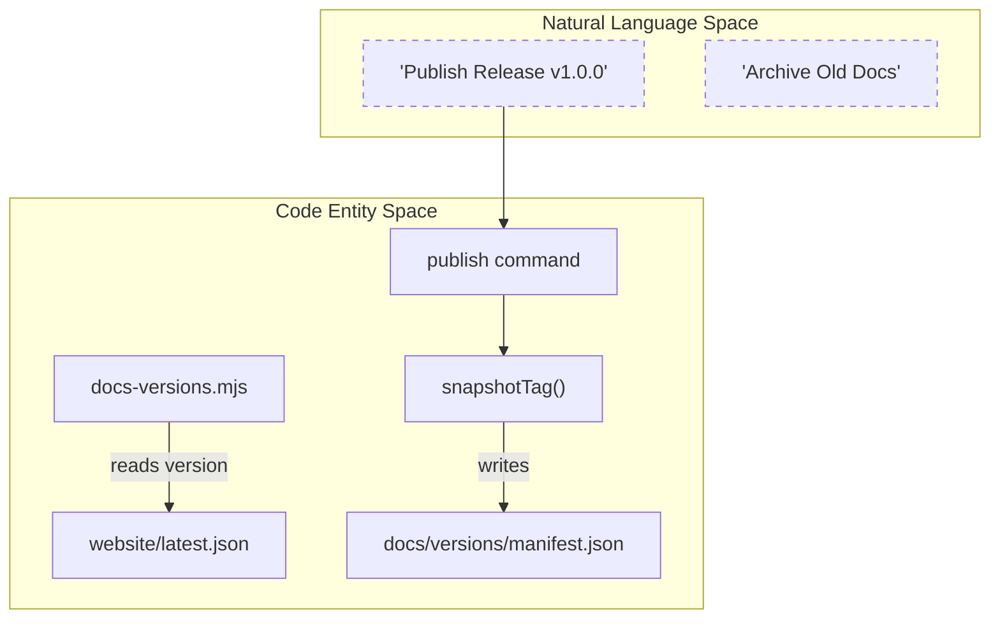
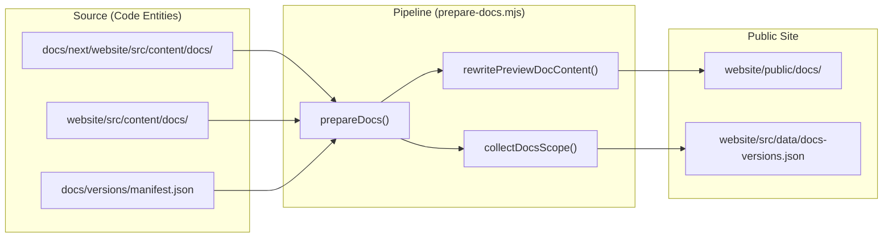

# Documentation Pipeline

Relevant source files

The following files were used as context for generating this wiki page:

- [.agents/skills/herdr-pre-release-audit/references/pre-release-audit.md](https://github.com/herdrdev/herdr/blob/HEAD/.agents/skills/herdr-pre-release-audit/references/pre-release-audit.md)
- [.github/workflows/build-artifacts-manual.yml](https://github.com/herdrdev/herdr/blob/HEAD/.github/workflows/build-artifacts-manual.yml)
- [.github/workflows/label-next-release-issues.yml](https://github.com/herdrdev/herdr/blob/HEAD/.github/workflows/label-next-release-issues.yml)
- [.github/workflows/preview.yml](https://github.com/herdrdev/herdr/blob/HEAD/.github/workflows/preview.yml)
- [.github/workflows/release.yml](https://github.com/herdrdev/herdr/blob/HEAD/.github/workflows/release.yml)
- [.github/workflows/website.yml](https://github.com/herdrdev/herdr/blob/HEAD/.github/workflows/website.yml)
- [docs/versions/README.md](https://github.com/herdrdev/herdr/blob/HEAD/docs/versions/README.md)
- [scripts/preview.py](https://github.com/herdrdev/herdr/blob/HEAD/scripts/preview.py)
- [scripts/test_preview.py](https://github.com/herdrdev/herdr/blob/HEAD/scripts/test_preview.py)
- [website/README.md](https://github.com/herdrdev/herdr/blob/HEAD/website/README.md)
- [website/scripts/check-built-docs.mjs](https://github.com/herdrdev/herdr/blob/HEAD/website/scripts/check-built-docs.mjs)
- [website/scripts/docs-snapshot.mjs](https://github.com/herdrdev/herdr/blob/HEAD/website/scripts/docs-snapshot.mjs)
- [website/scripts/docs-versions.integration.test.ts](https://github.com/herdrdev/herdr/blob/HEAD/website/scripts/docs-versions.integration.test.ts)
- [website/scripts/docs-versions.mjs](https://github.com/herdrdev/herdr/blob/HEAD/website/scripts/docs-versions.mjs)
- [website/scripts/prepare-docs.mjs](https://github.com/herdrdev/herdr/blob/HEAD/website/scripts/prepare-docs.mjs)

The documentation pipeline manages the lifecycle of herdr's technical content, ensuring that documentation remains synchronized with software releases. It handles the staging of upcoming changes in a "next" directory, the promotion of these changes to the live site upon release, multi-language localization (English, Japanese, and Simplified Chinese), and the archival of versioned documentation snapshots.

## Documentation Staging and Promotion

Herdr employs a "Next-Staging" pattern where all documentation updates for the upcoming release are authored within the `docs/next/` directory. This allows the main `website/src/content/docs/` directory to remain a reflection of the current stable release.

### Staging Area (`docs/next/`)
New features, API changes, and guides are developed in `docs/next/website/src/content/docs/` [website/scripts/prepare-docs.mjs:10-10](https://github.com/herdrdev/herdr/blob/HEAD/website/scripts/prepare-docs.mjs#L10). This directory mirrors the structure of the production Astro/Starlight site.

### Promotion Mechanism
When a new version is tagged (e.g., `v0.7.5`), the `docs-versions.mjs` script facilitates the promotion of staged content.
1.  **Snapshotting**: The script captures the state of the documentation at the specific git tag and saves it into `docs/versions/<version>/` [website/scripts/docs-versions.mjs:78-80](https://github.com/herdrdev/herdr/blob/HEAD/website/scripts/docs-versions.mjs#L78-L80).
2.  **Manifest Update**: The `docs/versions/manifest.json` is updated to include the new version, ensuring it is sorted newest-first [website/scripts/docs-versions.mjs:56-66](https://github.com/herdrdev/herdr/blob/HEAD/website/scripts/docs-versions.mjs#L56-L66).
3.  **Content Promotion**: The contents of `docs/next/` are moved to the active `website/src/content/docs/` directory during the release process [website/scripts/docs-versions.integration.test.ts:35-41](https://github.com/herdrdev/herdr/blob/HEAD/website/scripts/docs-versions.integration.test.ts#L35-L41).

### Natural Language to Code Entity Mapping: Release Promotion
The following diagram illustrates how human-readable release actions map to specific script executions and file system changes.

**Sources:** [website/scripts/docs-versions.mjs:68-90](https://github.com/herdrdev/herdr/blob/HEAD/website/scripts/docs-versions.mjs#L68-L90), [website/scripts/docs-versions.integration.test.ts:15-53](https://github.com/herdrdev/herdr/blob/HEAD/website/scripts/docs-versions.integration.test.ts#L15-L53)

## The Documentation Preparation Pipeline

The `prepare-docs.mjs` script is the primary engine for transforming raw markdown files into the final structure consumed by the Astro-based website.

### Key Functions
*   **`prepareDocs()`**: Orchestrates the cleaning of old preview/version directories and triggers the copying of new content [website/scripts/prepare-docs.mjs:89-134](https://github.com/herdrdev/herdr/blob/HEAD/website/scripts/prepare-docs.mjs#L89-L134).
*   **`copyPreparedDocs()`**: Recursively walks documentation directories, applying content rewrites to markdown files while copying assets like images directly [website/scripts/prepare-docs.mjs:200-219](https://github.com/herdrdev/herdr/blob/HEAD/website/scripts/prepare-docs.mjs#L200-L219).
*   **`collectDocsScope()`**: Scans the documentation tree to build a map of available pages for each locale (`root`, `ja`, `zh-cn`). This data is used to generate the version switcher and localization UI [website/scripts/prepare-docs.mjs:221-248](https://github.com/herdrdev/herdr/blob/HEAD/website/scripts/prepare-docs.mjs#L221-L248).

### Content Transformation
During the copy process, the pipeline performs several automated rewrites:
*   **Path Correction**: Adjusts internal links to point to the correct `/docs/preview/` or `/docs/v<version>/` subdirectories [website/scripts/prepare-docs.mjs:250-254](https://github.com/herdrdev/herdr/blob/HEAD/website/scripts/prepare-docs.mjs#L250-L254).
*   **Edit Links**: Injects a `setGeneratedEditUrl` to ensure the "Edit this page" button on the website points to the correct source file in the `master` branch or the specific versioned tag [website/scripts/prepare-docs.mjs:255-258](https://github.com/herdrdev/herdr/blob/HEAD/website/scripts/prepare-docs.mjs#L255-L258).

**Sources:** [website/scripts/prepare-docs.mjs:89-219](https://github.com/herdrdev/herdr/blob/HEAD/website/scripts/prepare-docs.mjs#L89-L219), [website/scripts/prepare-docs.mjs:250-258](https://github.com/herdrdev/herdr/blob/HEAD/website/scripts/prepare-docs.mjs#L250-L258)

## Version Archiving and Localization

Herdr maintains a historical record of documentation for every major/minor release, allowing users on older versions to access relevant information.

### Version Snapshots
Snapshots are stored in `docs/versions/`. Each version directory contains a full copy of the documentation as it existed at the time of the release tag [website/scripts/docs-versions.mjs:78-80](https://github.com/herdrdev/herdr/blob/HEAD/website/scripts/docs-versions.mjs#L78-L80). The `docs/versions/manifest.json` acts as the single source of truth for the version switcher [website/scripts/prepare-docs.mjs:87-90](https://github.com/herdrdev/herdr/blob/HEAD/website/scripts/prepare-docs.mjs#L87-L90).

### Localization Strategy
The pipeline supports three primary locales:
*   **English (`root`)**: The default source of truth.
*   **Japanese (`ja`)**: Located in `.../docs/ja/`.
*   **Simplified Chinese (`zh-cn`)**: Located in `.../docs/zh-cn/`.

If a specific page is not translated in a localized directory, the `collectDocsScope` function falls back to the `root` (English) page list to ensure the site structure remains consistent across languages [website/scripts/prepare-docs.mjs:244-246](https://github.com/herdrdev/herdr/blob/HEAD/website/scripts/prepare-docs.mjs#L244-L246).

### Data Flow: Content to Public Site
This diagram shows the flow of documentation data from the repository source to the final public assets.

**Sources:** [website/scripts/prepare-docs.mjs:7-27](https://github.com/herdrdev/herdr/blob/HEAD/website/scripts/prepare-docs.mjs#L7-L27), [website/scripts/prepare-docs.mjs:89-134](https://github.com/herdrdev/herdr/blob/HEAD/website/scripts/prepare-docs.mjs#L89-L134)

## Release Metadata and Changelogs

The documentation pipeline integrates with the release system to generate machine-readable manifests used by the herdr client for self-updates and in-app announcements.

### Manifest Generation
The `changelog.py` script parses the `CHANGELOG.md` to extract release notes and protocol versions.
*   **`build_latest_json()`**: Constructs the `website/latest.json` file, which includes the version string, protocol version, release notes, and download URLs for various platforms [scripts/changelog.py:228-261](https://github.com/herdrdev/herdr/blob/HEAD/scripts/changelog.py#L228-L261).
*   **`infer_protocol_from_notes()`**: Automatically detects protocol version bumps by searching release notes for specific keywords [scripts/changelog.py:165-169](https://github.com/herdrdev/herdr/blob/HEAD/scripts/changelog.py#L165-L169).

### Preview Channel
A separate `preview.json` manifest is maintained for the preview update channel. The `scripts/preview.py` script generates this by aggregating commit subjects since the last stable tag and grouping them into categories like "Added", "Fixed", and "Performance" [scripts/preview.py:134-164](https://github.com/herdrdev/herdr/blob/HEAD/scripts/preview.py#L134-L164).

| File | Purpose |
| :--- | :--- |
| `website/latest.json` | Metadata for the current stable release, including `protocol` and `assets` [website/latest.json:1-10](https://github.com/herdrdev/herdr/blob/HEAD/website/latest.json#L1-L10). |
| `website/preview.json` | Metadata for the latest preview build, including the `build_id` and `commit` SHA [website/preview.json:1-9](https://github.com/herdrdev/herdr/blob/HEAD/website/preview.json#L1-L9). |
| `docs/next/product-announcement.json` | Optional metadata for highlighting specific new features in the TUI upon update. |

**Sources:** [scripts/changelog.py:228-261](https://github.com/herdrdev/herdr/blob/HEAD/scripts/changelog.py#L228-L261), [scripts/preview.py:134-164](https://github.com/herdrdev/herdr/blob/HEAD/scripts/preview.py#L134-L164), [website/latest.json:1-10](https://github.com/herdrdev/herdr/blob/HEAD/website/latest.json#L1-L10), [website/preview.json:1-9](https://github.com/herdrdev/herdr/blob/HEAD/website/preview.json#L1-L9)