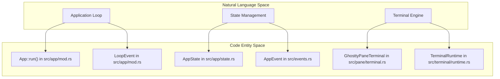
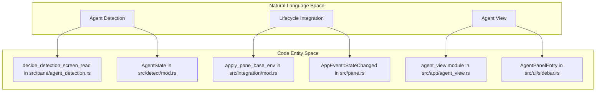

# Glossary

Relevant source files

The following files were used as context for generating this wiki page:

- [CHANGELOG.md](https://github.com/herdrdev/herdr/blob/HEAD/CHANGELOG.md)
- [Cargo.lock](https://github.com/herdrdev/herdr/blob/HEAD/Cargo.lock)
- [Cargo.toml](https://github.com/herdrdev/herdr/blob/HEAD/Cargo.toml)
- [README.md](https://github.com/herdrdev/herdr/blob/HEAD/README.md)
- [docs/next/CHANGELOG.md](https://github.com/herdrdev/herdr/blob/HEAD/docs/next/CHANGELOG.md)
- [docs/next/README.md](https://github.com/herdrdev/herdr/blob/HEAD/docs/next/README.md)
- [docs/next/website/src/content/docs/agents.mdx](https://github.com/herdrdev/herdr/blob/HEAD/docs/next/website/src/content/docs/agents.mdx)
- [docs/next/website/src/content/docs/cli-reference.mdx](https://github.com/herdrdev/herdr/blob/HEAD/docs/next/website/src/content/docs/cli-reference.mdx)
- [docs/next/website/src/content/docs/integrations.mdx](https://github.com/herdrdev/herdr/blob/HEAD/docs/next/website/src/content/docs/integrations.mdx)
- [docs/next/website/src/content/docs/session-state.mdx](https://github.com/herdrdev/herdr/blob/HEAD/docs/next/website/src/content/docs/session-state.mdx)
- [src/agent_resume.rs](https://github.com/herdrdev/herdr/blob/HEAD/src/agent_resume.rs)
- [src/app/actions.rs](https://github.com/herdrdev/herdr/blob/HEAD/src/app/actions.rs)
- [src/app/api.rs](https://github.com/herdrdev/herdr/blob/HEAD/src/app/api.rs)
- [src/app/mod.rs](https://github.com/herdrdev/herdr/blob/HEAD/src/app/mod.rs)
- [src/app/state.rs](https://github.com/herdrdev/herdr/blob/HEAD/src/app/state.rs)
- [src/cli/integration.rs](https://github.com/herdrdev/herdr/blob/HEAD/src/cli/integration.rs)
- [src/config.rs](https://github.com/herdrdev/herdr/blob/HEAD/src/config.rs)
- [src/config/model.rs](https://github.com/herdrdev/herdr/blob/HEAD/src/config/model.rs)
- [src/ghostty/mod.rs](https://github.com/herdrdev/herdr/blob/HEAD/src/ghostty/mod.rs)
- [src/integration/mod.rs](https://github.com/herdrdev/herdr/blob/HEAD/src/integration/mod.rs)
- [src/kitty_graphics.rs](https://github.com/herdrdev/herdr/blob/HEAD/src/kitty_graphics.rs)
- [src/main.rs](https://github.com/herdrdev/herdr/blob/HEAD/src/main.rs)
- [src/pane.rs](https://github.com/herdrdev/herdr/blob/HEAD/src/pane.rs)
- [src/pane/osc.rs](https://github.com/herdrdev/herdr/blob/HEAD/src/pane/osc.rs)
- [src/pane/terminal.rs](https://github.com/herdrdev/herdr/blob/HEAD/src/pane/terminal.rs)
- [src/persist/restore.rs](https://github.com/herdrdev/herdr/blob/HEAD/src/persist/restore.rs)
- [src/server/client_transport.rs](https://github.com/herdrdev/herdr/blob/HEAD/src/server/client_transport.rs)
- [src/server/headless.rs](https://github.com/herdrdev/herdr/blob/HEAD/src/server/headless.rs)
- [src/server/render_stream.rs](https://github.com/herdrdev/herdr/blob/HEAD/src/server/render_stream.rs)
- [src/terminal/runtime.rs](https://github.com/herdrdev/herdr/blob/HEAD/src/terminal/runtime.rs)
- [src/terminal/state.rs](https://github.com/herdrdev/herdr/blob/HEAD/src/terminal/state.rs)
- [src/ui.rs](https://github.com/herdrdev/herdr/blob/HEAD/src/ui.rs)

This glossary defines technical terms, domain concepts, and implementation-specific jargon used within the `herdr` codebase. It serves as a reference for engineers to map natural language descriptions to specific code entities and data structures.

## Core Domain Entities

The following terms describe the primary abstractions used to organize the user interface and persistent state.

| Term | Definition | Primary Code Entity |
| :--- | :--- | :--- |
| **Workspace** | The top-level container for a collection of tabs. Workspaces can be named and are often associated with a specific Git worktree. | `Workspace` [src/workspace.rs:1-10](https://github.com/herdrdev/herdr/blob/HEAD/src/workspace.rs#L1-L10) |
| **Tab** | A logical grouping of panes within a workspace. Only one tab is visible at a time per workspace. | `Tab` [src/layout.rs:1-10](https://github.com/herdrdev/herdr/blob/HEAD/src/layout.rs#L1-L10) |
| **Pane** | An individual terminal instance or plugin view. Panes are arranged within a tab using a BSP (Binary Space Partitioning) tree. | `PaneState` [src/pane/state.rs:1-10](https://github.com/herdrdev/herdr/blob/HEAD/src/pane/state.rs#L1-L10) |
| **Agent** | An AI coding assistant (e.g., Claude, Codex, OpenCode) running inside a pane. `herdr` tracks their lifecycle state (idle, working, blocked). | `Agent` [src/detect/mod.rs:1-20](https://github.com/herdrdev/herdr/blob/HEAD/src/detect/mod.rs#L1-L20) |
| **Session** | The entire state of the application, including all workspaces, tabs, and panes, which can be persisted to disk. | `AppState` [src/app/state.rs:1-100](https://github.com/herdrdev/herdr/blob/HEAD/src/app/state.rs#L1-L100) |

**Sources:** [src/workspace.rs:1-10](https://github.com/herdrdev/herdr/blob/HEAD/src/workspace.rs#L1-L10), [src/layout.rs:1-10](https://github.com/herdrdev/herdr/blob/HEAD/src/layout.rs#L1-L10), [src/pane/state.rs:1-10](https://github.com/herdrdev/herdr/blob/HEAD/src/pane/state.rs#L1-L10), [src/detect/mod.rs:1-20](https://github.com/herdrdev/herdr/blob/HEAD/src/detect/mod.rs#L1-L20), [src/app/state.rs:1-100](https://github.com/herdrdev/herdr/blob/HEAD/src/app/state.rs#L1-L100)

## System Architecture Mapping

The following diagram maps high-level system components to their corresponding modules and structs in the codebase.

### Natural Language to Code Entity Space: Core Orchestration

**Sources:** [src/app/mod.rs:95-164](https://github.com/herdrdev/herdr/blob/HEAD/src/app/mod.rs#L95-L164), [src/app/state.rs:1-50](https://github.com/herdrdev/herdr/blob/HEAD/src/app/state.rs#L1-L50), [src/pane/terminal.rs:190-196](https://github.com/herdrdev/herdr/blob/HEAD/src/pane/terminal.rs#L190-L196), [src/events.rs:1-50](https://github.com/herdrdev/herdr/blob/HEAD/src/events.rs#L1-L50), [src/terminal/runtime.rs:1-10](https://github.com/herdrdev/herdr/blob/HEAD/src/terminal/runtime.rs#L1-L10)

## Technical Terms & Jargon

### Headless Server & Client Protocol
*   **Headless Server**: A mode where `herdr` runs without a physical TUI, listening on a Unix domain socket for client connections. [src/server/headless.rs:1-15](https://github.com/herdrdev/herdr/blob/HEAD/src/server/headless.rs#L1-L15)
*   **BlitEncoder**: The diffing algorithm used to send only changed terminal cells from the server to the client. This is implicitly handled by the `apply_terminal_dirty_patch` function in the headless server. [src/server/headless.rs:198-214](https://github.com/herdrdev/herdr/blob/HEAD/src/server/headless.rs#L198-L214)
*   **SemanticFrame**: A high-level render frame that includes UI metadata, as opposed to raw ANSI escape sequences. This is part of the `protocol` module. [src/protocol.rs:1-50](https://github.com/herdrdev/herdr/blob/HEAD/src/protocol.rs#L1-L50)
*   **Live Handoff**: The process of transferring a running PTY file descriptor from one server instance to another using `SCM_RIGHTS`. The `wait_for_live_handoff_response_write` function is part of this process. [src/server/headless.rs:80-96](https://github.com/herdrdev/herdr/blob/HEAD/src/server/headless.rs#L80-L96)

**Sources:** [src/server/headless.rs:1-15](https://github.com/herdrdev/herdr/blob/HEAD/src/server/headless.rs#L1-L15), [src/server/headless.rs:198-214](https://github.com/herdrdev/herdr/blob/HEAD/src/server/headless.rs#L198-L214), [src/protocol.rs:1-50](https://github.com/herdrdev/herdr/blob/HEAD/src/protocol.rs#L1-L50), [src/server/headless.rs:80-96](https://github.com/herdrdev/herdr/blob/HEAD/src/server/headless.rs#L80-L96)

### Terminal & Graphics
*   **Ghostty VT**: The underlying terminal emulation engine, integrated via FFI from the Zig-based Ghostty project. The `GhosttyPaneTerminal` struct wraps this core. [src/pane/terminal.rs:161-165](https://github.com/herdrdev/herdr/blob/HEAD/src/pane/terminal.rs#L161-L165)
*   **Kitty Graphics Protocol**: A protocol for rendering images in the terminal. `herdr` intercepts these to manage virtual placements. The `pane_graphics` module handles this. [src/app/pane_graphics.rs:1-10](https://github.com/herdrdev/herdr/blob/HEAD/src/app/pane_graphics.rs#L1-L10), [src/kitty_graphics.rs:1-50](https://github.com/herdrdev/herdr/blob/HEAD/src/kitty_graphics.rs#L1-L50)
*   **OSC (Operating System Command)**: Escape sequences used for metadata like window titles (OSC 0/2) and working directory (OSC 7). Handled by the `osc` module within `pane`. [src/pane/osc.rs:1-100](https://github.com/herdrdev/herdr/blob/HEAD/src/pane/osc.rs#L1-L100)
*   **PTY (Pseudo-Terminal)**: The kernel abstraction for a terminal device, managed via the `portable-pty` crate. The `PtyIoActor` handles I/O for PTYs. [src/pane.rs:24-30](https://github.com/herdrdev/herdr/blob/HEAD/src/pane.rs#L24-L30)

**Sources:** [src/pane/terminal.rs:161-165](https://github.com/herdrdev/herdr/blob/HEAD/src/pane/terminal.rs#L161-L165), [src/app/pane_graphics.rs:1-10](https://github.com/herdrdev/herdr/blob/HEAD/src/app/pane_graphics.rs#L1-L10), [src/kitty_graphics.rs:1-50](https://github.com/herdrdev/herdr/blob/HEAD/src/kitty_graphics.rs#L1-L50), [src/pane/osc.rs:1-100](https://github.com/herdrdev/herdr/blob/HEAD/src/pane/osc.rs#L1-L100), [src/pane.rs:24-30](https://github.com/herdrdev/herdr/blob/HEAD/src/pane.rs#L24-L30)

### Agent Integration
*   **Screen Heuristics**: Patterns used to detect agent activity by scanning terminal output when official hooks are missing. Functions like `decide_detection_screen_read` are key. [src/pane/agent_detection.rs:36-42](https://github.com/herdrdev/herdr/blob/HEAD/src/pane/agent_detection.rs#L36-L42)
*   **Manifest**: A TOML file defining detection rules for specific agents. The plugin marketplace discovers these manifests. [docs/next/CHANGELOG.md:10-10](https://github.com/herdrdev/herdr/blob/HEAD/docs/next/CHANGELOG.md#L10)
*   **Agent Skill**: A set of scripts or configurations installed into an agent's environment to allow it to communicate with `herdr`. The `herdr --skill` command prints this. [docs/next/CHANGELOG.md:31-31](https://github.com/herdrdev/herdr/blob/HEAD/docs/next/CHANGELOG.md#L31)

**Sources:** [src/pane/agent_detection.rs:36-42](https://github.com/herdrdev/herdr/blob/HEAD/src/pane/agent_detection.rs#L36-L42), [docs/next/CHANGELOG.md:10-10](https://github.com/herdrdev/herdr/blob/HEAD/docs/next/CHANGELOG.md#L10), [docs/next/CHANGELOG.md:31-31](https://github.com/herdrdev/herdr/blob/HEAD/docs/next/CHANGELOG.md#L31)

### Natural Language to Code Entity Space: Agent Lifecycle

**Sources:** [src/pane/agent_detection.rs:36-42](https://github.com/herdrdev/herdr/blob/HEAD/src/pane/agent_detection.rs#L36-L42), [src/detect/mod.rs:1-50](https://github.com/herdrdev/herdr/blob/HEAD/src/detect/mod.rs#L1-L50), [src/integration/mod.rs:1-20](https://github.com/herdrdev/herdr/blob/HEAD/src/integration/mod.rs#L1-L20), [src/pane.rs:170-201](https://github.com/herdrdev/herdr/blob/HEAD/src/pane.rs#L170-L201), [src/app/agent_view.rs:1-10](https://github.com/herdrdev/herdr/blob/HEAD/src/app/agent_view.rs#L1-L10), [src/ui/sidebar.rs:86-87](https://github.com/herdrdev/herdr/blob/HEAD/src/ui/sidebar.rs#L86-L87)

## Abbreviations Reference

| Abbreviation | Full Term | Context |
| :--- | :--- | :--- |
| **BSP** | Binary Space Partitioning | Layout engine strategy for tiling panes. |
| **CWD** | Current Working Directory | Tracked per pane to support `new_cwd = "follow"`. [src/config/model.rs:147-150](https://github.com/herdrdev/herdr/blob/HEAD/src/config/model.rs#L147-L150) |
| **FFI** | Foreign Function Interface | Used to communicate with the `libghostty` Zig library. |
| **IPC** | Inter-Process Communication | The JSON-RPC and binary protocol over Unix sockets. |
| **TUI** | Text User Interface | The `ratatui`-based visual interface. |
| **VT** | Virtual Terminal | Emulation logic for handling ANSI/xterm sequences. |

**Sources:** [src/layout.rs:1-50](https://github.com/herdrdev/herdr/blob/HEAD/src/layout.rs#L1-L50), [src/pane/terminal.rs:150-160](https://github.com/herdrdev/herdr/blob/HEAD/src/pane/terminal.rs#L150-L160), [src/server/headless.rs:1-15](https://github.com/herdrdev/herdr/blob/HEAD/src/server/headless.rs#L1-L15), [src/ui.rs:1-20](https://github.com/herdrdev/herdr/blob/HEAD/src/ui.rs#L1-L20), [src/config/model.rs:147-150](https://github.com/herdrdev/herdr/blob/HEAD/src/config/model.rs#L147-L150)