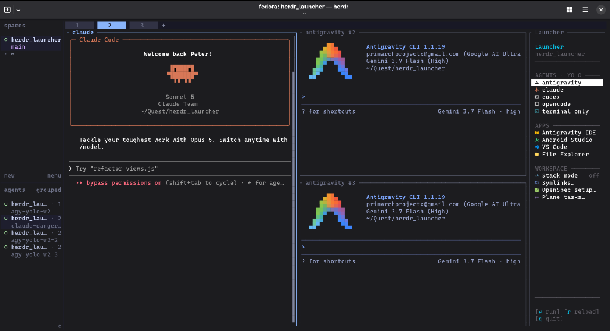

# herdr-launcher

**English** | [Tiếng Việt](README.vi.md)

A lightweight productivity sidebar and fast agent launcher for [Herdr](https://github.com/herdrdev/herdr).

Launch AI coding agents in permission-skipping ("YOLO") mode with one keystroke, and manage workspace tools (Symlinks, OpenSpec, Plane) and desktop apps directly from a right-docked sidebar.

Zero npm dependencies — written in standard CommonJS run directly by Node.js. Verified on Linux, macOS, and Windows 11.

---

## Features



---

## Installation & Setup

### 1. Clone the Repository
```bash
git clone https://github.com/impeterwayne/herdr_launcher.git
cd herdr_launcher
```

### 2. Link the Plugin
```bash
# Linux / macOS
herdr plugin link ./plugins/herdr-launcher

# Windows (PowerShell)
herdr plugin link .\plugins\herdr-launcher
```

### 3. Configure Keybindings
Copy `config.example.toml` into your Herdr configuration directory:
```bash
# Linux / macOS
mkdir -p ~/.config/herdr && cp plugins/herdr-launcher/config.example.toml ~/.config/herdr/config.toml

# Windows (PowerShell)
Copy-Item plugins\herdr-launcher\config.example.toml "$env:APPDATA\herdr\config.toml"
```

### 4. Reload Herdr
```bash
herdr server reload-config
```

### 5. Font & Display Setup (Optional)
The sidebar uses Nerd Font v3+ glyphs for status marks and icons. Install the recommended monospace fonts:
```bash
node scripts/install-fonts.js
# Or specify font: node scripts/install-fonts.js cascadia | jetbrains | fira | meslo
```

<details>
<summary><b>How to apply the installed font in your terminal / IDE (All Platforms)</b></summary>

Use one of the installed font names:
- `"CaskaydiaCove Nerd Font Mono"`
- `"JetBrainsMono Nerd Font Mono"`
- `"FiraCode Nerd Font Mono"`
- `"MesloLGS Nerd Font Mono"`

#### Antigravity IDE / VS Code (*All Platforms*)
Add to `settings.json` (<kbd>Ctrl</kbd>/<kbd>Cmd</kbd> + <kbd>Shift</kbd> + <kbd>P</kbd> → *Preferences: Open User Settings (JSON)*):
```json
{
  "terminal.integrated.fontFamily": "'CaskaydiaCove Nerd Font Mono', monospace"
}
```

#### Windows (Windows Terminal)
1. Open Windows Terminal → press <kbd>Ctrl</kbd> + <kbd>,</kbd> (Settings).
2. Go to **Profiles** → **Defaults** → **Appearance**.
3. Set **Font face** to `CaskaydiaCove Nerd Font Mono` → **Save**.

#### Linux (GNOME / Default Terminal)
1. Open Terminal → **Preferences** (menu **☰**).
2. Under your profile → **Text** tab → check **Custom font**.
3. Select `CaskaydiaCove Nerd Font Mono Regular`.

#### macOS (Terminal.app / iTerm2)
- **Terminal.app**: <kbd>Cmd</kbd> + <kbd>,</kbd> → **Profiles** → **Font** → **Change** → select `CaskaydiaCove Nerd Font Mono`.
- **iTerm2**: <kbd>Cmd</kbd> + <kbd>,</kbd> → **Profiles** → **Text** → set **Font** to `CaskaydiaCove Nerd Font Mono`.

#### Config Files (CLI Terminals)
- **Kitty** (`~/.config/kitty/kitty.conf`):
  ```conf
  font_family CaskaydiaCove Nerd Font Mono
  ```
- **Alacritty** (`~/.config/alacritty/alacritty.toml`):
  ```toml
  [font.normal]
  family = "CaskaydiaCove Nerd Font Mono"
  ```
- **WezTerm** (`~/.wezterm.lua`):
  ```lua
  config.font = wezterm.font("CaskaydiaCove Nerd Font Mono")
  ```

</details>

> **ASCII Fallback**: If you prefer not to install custom fonts, pass `--ascii-icons` or configure `{"style": "ascii"}` in `<config-dir>/icons.json` to render clean two-letter badges (`[AG]`, `[VS]`, `[SM]`, `[PL]`).

### 6. Verify Installation
```bash
node scripts/self-test.js
```

---

## Keybindings

`prefix` defaults to `ctrl+b`. All individual launchers use `prefix+alt` combinations to prevent accidental triggers during normal typing.

| Key | Action |
| :--- | :--- |
| `prefix+alt+space` | Toggle docked sidebar (right edge) |
| `prefix+alt+m` | Toggle Stack Mode (maximize pane + keep sidebar) |
| `prefix+alt+a` | Antigravity CLI (`--dangerously-skip-permissions`) |
| `prefix+alt+c` | Claude Code (`--dangerously-skip-permissions`) |
| `prefix+alt+shift+c` | Codex (`--dangerously-bypass-approvals-and-sandbox`) |
| `prefix+alt+o` | OpenCode (`--auto`) |
| `prefix+alt+t` | Native Terminal pane |
| `prefix+alt+y` | Symlinks workspace tool |
| `prefix+alt+s` | OpenSpec setup tool |
| `prefix+alt+p` | Plane tasks tool |
| `prefix+alt+v` | Open VS Code in active directory |
| `prefix+alt+e` | Reveal active directory in File Explorer |

---

## Sidebar Controls & Navigation

The launcher docks as a 20-column split on the right edge. Selecting any workspace tool opens a focused modal popup.

| Input | Action |
| :--- | :--- |
| `↑` / `↓` or `j` / `k` | Move selection up / down |
| `Enter` | Launch selected item / open tool popup |
| `Esc` / `[esc close]` | Close tool popup or return from prompt |
| `q` / `[q quit]` | Close pane / popup |
| `r` / `[r reload]` | Refresh the active view |
| `Click` | Focus row or activate footer action chip |
| `Double-Click` | Execute selected item immediately |
| `Scroll Wheel` | Scroll view independently of selection |

---

## Coding Agents (YOLO Launchers)

Each press launches a new agent instance configured to bypass permission prompts. Sessions are uniquely numbered (`codex-wa-1`, `codex-wa-2`) and register directly with Herdr's agent management system (`working`/`blocked`/`done` status and session resume).

| Launcher | CLI Kind | Flags | Integration Command |
| :--- | :--- | :--- | :--- |
| **Antigravity** | `agy` | `--dangerously-skip-permissions` | `herdr integration install antigravity-cli` |
| **Claude** | `claude` | `--dangerously-skip-permissions` | `herdr integration install claude` |
| **Codex** | `codex` | `--dangerously-bypass-approvals-and-sandbox` | `herdr integration install codex` |
| **OpenCode** | `opencode` | `--auto` | `herdr integration install opencode` |
| **Terminal** | `terminal` | (Interactive shell) | Built-in native PTY |

*Pass `--reuse` via CLI to focus an existing agent instance instead of spawning a new one.*

---

## Workspace Tools

### Symlinks (`prefix+alt+y`)
Scans sibling git worktrees and suggests links for heavy shared directories (`node_modules`, `build`, `dist`, `.gradle`, `vendor`, `target`, `.venv`).
- Uses native junctions on Windows (requires no admin privileges or Developer Mode) and standard symlinks on Unix.
- Action chips: `[⏎ link]` `[b browse]` `[e explore]` `[d delete]` `[r reload]` `[esc close]`.
- Custom link targets can be defined in `<config-dir>/symlinks.json`.

### OpenSpec (`prefix+alt+s`)
Deploys and maintains the bundled OpenSpec toolkit components and ensures `.git/info/exclude` ignores generated artifacts.
- Bundled toolkit located at `toolkits/OpenSpec`.
- Override toolkit root via `HERDR_LAUNCHER_OPENSPEC_ROOT` or `<config-dir>/openspec.json`.

### Plane Tasks & Evidence Sync (`prefix+alt+p`)
View Plane issues and selectively sync tasks and evidence media into offline markdown documentation (`plane/TASK_LIST.md`).
- **Interactive API Key Setup (`k`)**: Securely prompts and stores your API key in `plane.json`.
- **Interactive Project Switcher (`p`)**: Browse and map Plane projects to your workspace.
- **Selective Crawling (`s`)**: Choose task scope (`Backlog + Todo`, `Active Tasks`, `All Tasks`, etc.). Crawls screenshots and videos into `plane/evidence/<taskId>/` and updates `.git/info/exclude` automatically.

---

## Desktop App Openers

Opens desktop applications detached at the active pane's directory and brings existing windows to the front:
- **Antigravity IDE**: `prefix+alt+a` (or via menu)
- **Android Studio**: via menu
- **VS Code**: `prefix+alt+v`
- **File Explorer / Finder**: `prefix+alt+e`

*Override executable paths in `<config-dir>/apps.json` if installed in non-standard locations.*

---

## Stack Mode (`prefix+alt+m`)

Toggles the active work or agent pane to fill ~90% of the tab width while keeping the 20-column launcher sidebar docked on the right. Pressing `prefix+alt+m` again restores the balanced layout.

---

## CLI & Standalone Commands

All helper scripts support `--dry-run` to output machine-readable JSON without altering session state:

```bash
# Toggle or dock the sidebar
node bin/toggle-launcher.js [--cols 20] [--open|--close] [--dry-run]

# Launch workspace tools
node bin/tool-launch.js <symlinks|openspec|plane> [--dry-run]

# Launch coding agents
node bin/agent-launch.js <agy-yolo|claude-danger|codex-yolo|opencode-auto|terminal> [--reuse] [--dry-run]

# Open desktop applications
node bin/app-open.js <antigravity|android-studio|vscode|explorer> [path] [--dry-run]

# Toggle stack mode
node bin/stack-mode.js [--toggle|--on|--off] [--dry-run]

# Manage automatic tab docking
node bin/watch-tabs.js [--start|--stop|--status|--once] [--dry-run]

# Run startup adoption pass
node bin/startup.js [--dry-run]
```

---

## Configuration Reference

Configuration files live in the Herdr plugin config directory (`~/.config/herdr/plugins/config/herdr-launcher/` or `%APPDATA%\herdr\plugins\config\herdr-launcher\`):

- **`plane.json`**: Plane API credentials and workspace mappings:
  ```json
  {
    "baseUrl": "https://plane.example.com",
    "workspaceSlug": "product",
    "apiKey": "plane_api_...",
    "projectPlaneIds": {
      "/path/to/workspace": "project-uuid"
    }
  }
  ```
- **`apps.json`**: Custom executable paths:
  ```json
  {
    "android-studio": "C:\\Program Files\\Android\\Android Studio\\bin\\studio64.exe",
    "vscode": "/usr/bin/code"
  }
  ```
- **`symlinks.json`**: Persistent symlink targets:
  ```json
  {
    "targets": [
      { "name": "assets", "targetPath": "/shared/assets" }
    ]
  }
  ```
- **`icons.json`**: Display style:
  ```json
  {
    "style": "ascii"
  }
  ```

---

## Testing & Quality Assurance

Run the comprehensive self-test suite (150+ assertions covering syntax, manifest validation, dry-run commands, mouse tracking, and tools):

```bash
node scripts/self-test.js
```
